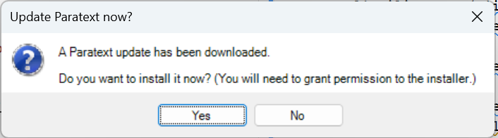

**Introduction**  
In this module, you will install Paratext 9. Paratext is the world’s leading software application for the development and checking of new Bible translation texts, or revisions to existing texts. Developed jointly by UBS and SIL International, it enables consistent and accurate translation, based on original texts, and modelled on versions in major languages. Due in part to its cutting edge collaboration features, Paratext greatly assists in producing higher quality translations in much less time than previous tools and methods have allowed.

**Before you start**  
You do not need to uninstall older versions of Paratext, but you do need to uninstall any Paratext 9 Beta version before installing the release version. 

:::tip
Before uninstalling the BETA version, you should save any window layouts that you want to use in Paratext 9.3. 
:::

**Why is this Important**  
Paratext 7, Paratext 8 and Paratext 9 can all be installed at the same time but you need to understand the limitation of using them together.

- Several versions may be installed
- Some use different data directories.
  - My Paratext Projects (Paratext 7)
  - My Paratext 8 Projects (Paratext 9 and 8)
  - My Paratext 9 Projects (Paratext 9)
- Paratext 8 and 9 use the same data servers.
- Paratext 7 used a different server (which is now shutdown). 

**What are you going to do?**  
You will install Paratext 9 (without uninstalling Paratext 7 or 8). You will also install updates from the Help menu.

## 1.1 Install Paratext 9

:::info
Download available at <https://paratext.org/download> 
- Standard installation (online)   
- OR Offline installation + Latest Update
:::

1. Double-click on the installer file.
2. Click, “I agree to the license terms”,
3. Click **Install**.
    - *This step might take a few minutes if the installer needs to install the .NET 4.8 Framework on your computer*.
    - If a dialog appears and asks for your permission, click **Yes** or provide the credentials as required.
    - *A welcome message is displayed.*
4. Click **Next**
    - *The destination folder step appears*.
5. Accept the defaults for the folder.
:::info
 Paratext 9 and 8 data share the same directory but Paratext 7 needed a separate data directory.
:::
1. Click **Next**, then **Install**
2. Click **Finish** and then **Close**.

:::tip
The first time you launch Paratext 9 you will need to enter your Paratext 9 registration code. If you do not have a code yet, you can register from that dialog.
:::

##### 

## 1.2 Register a user (first time run Paratext)

:::tip
Paratext 8 and 9 can use the same registration, but all Paratext 7 users need a new registration for Paratext 9.
:::

1. Run Paratext (for the first time)
1. Choose the **interface language.**
   - *A dialogue box is displayed asking for your registration code*.

Switch to your browser  
1. Go to [https://registry.paratext.org](https://registry.paratext.org/)
      - *The Sign-in page is displayed.*
2. Log-in with a gmail work account
    - *The Register New user form is displayed*.
4. Choose from the three registration possibilities.
5. Fill in the details for username and previous registration (if appropriate)
6. Fill-in the rest of the form (if necessary, see 3.3 below for more details)
7. Click **Register** 
8. Copy the new code  

Return to Paratext  

1. Paratext will paste the code
2. Fill in any other details
3. Click **OK**

## 1.3 Updating your installed version of Paratext 9

:::tip
If you Internet connection allows, we recommend you use Automatic Updates. If not, then you can download the updates and install them manually.
:::

### Automatic Updates
1. From the **Paratext menu**, under **Help**, expand the menu, choose **Automatically update Paratext**
2. When an update has been downloaded Paratext will inform you.  
      
3. Choose **Yes**
   - Several dialogs will be displayed asking for authorisation.

### Manual Updates
1. From the **Paratext menu**, under **Help**, expand the menu, choose **Check for updates**
   - Paratext will check for updates and download the MSP file.
2. Choose **Yes**
   - Several dialogs will be displayed asking for authorisation.
