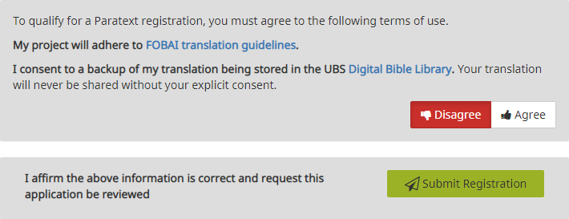

**Introduction**  
Starting with **Paratext 8** it is a requirement that projects share their basic metadata information with the translation community. It is strongly encouraged that they share progress information [some organizations and/or donors may require this].

Projects may be registered by the administrator (or a consultant serving as an administrator)

**Before you start**  
Paratext 9 has been installed on your computer, and you have created a project. If not, to create a project see, [4. CP](4.CP.md) to create a project.

**Why is this Important?**  
Other organizations/users are notified and may object to BoG. Basic project metadata information is available to all in Paratext community.

If your project is not registered, you will not have access to

- Interlinearizer
- Internet Send/Receive
- statistical glossing tools (guess translation)
- Print Draft

## 2.1 Register Project

1. If necessary, open the project
1. **≡ Tab** if necessary **Expand** the menu,
1. Under **Project**,  select **Project Properties** 
      - *The Project Properties dialog Is displayed*.
1. Click **Register Online** button
      - *The Register Project form (shown below) should appear*.

## 2.2 Fill in the web form see explanations below.

:::tip
- The Register Project Form is very long. It has been broken up into several sections (blue background) with comments to help you fill in the form (table in the blue background) and actions to perform (white background).
- Fields with an asterisk * [red star] are required.
:::

:::info Form and explanation

:::

:::info Explanation
| Name                  | Description |
|-----------------------|-------------|
| **Short name** | This is filled in for you from the project. You cannot change the project short name. |  
| **Long project name:** | You can change the long project name if desired. |  
| **Description:** | Add more information here if you wish to. There are also fields for more information about the project in the second part of the form.  |  
| **Language:** | The language name has to match an entry in the Ethnologue database. See more details below.|
:::

**Language**

1. Click the “**Advanced**” box to fill in more information if you need to distinguish the language of your project from the language with that Ethnologue code.  

- *The advanced form looks like this, where choices you select under Script, Region or Variant add extra letters and numbers to the identifier*.

:::info Form and explanation

:::

:::info Explanation
|  |  |
|--|--|
|**Scope** | refers to which books you intend to translate, for example, the whole Bible, New Testament, Whole Bible plus Deuterocanon, Portions, etc.|
|**Translation Type:** | -  choose **First** if this is the first translation in this language,|
||-  choose **Revision** if it is a revision of a previous translation, you have to specify that you have permission from the rights holders of the translation you are revising  |
||-  choose **New** if it is a new translation but a previous translation does exist for the language.|  
||-  choose **Study/Help materials** for translations including study materials, such as a Study Bible.|
:::

:::info
|  |  |
|--|--|
| **Countries / Regions** | select the country or countries where this translation is **intended to be used.** |
|| 1.  You can type a few letters of the name then pick the desired country.|
||2.  You can specify more than one country if the language spreads across borders.|
| **Managing Organisations** | would be the organization you expect will have the copyright for a print edition. This can be changed if it needs to be later on. Choose **the likely rights holder** for this translation  from the list. |
:::

:::tip
If the eventual rights holder is an organization yet to be formed or recognized, choose something from the list and edit the registration later.
:::

:::info Registration form part 2
**More information**
The second section of the registration form contains several places you can add supplementary information about your project. None of these fields are required.

:::

:::info Registration form part 3
**Visibility**

1. **Standard** is the default choice. Information about the project is not available to the public, but only to registered Paratext users within the same organization.
2. **Test or Training** is good for testing projects or projects you only create to use in a training program or workshop.
3. **Confidential** is for situations where entering information about your project online is a security concern. Information is restricted to members of the project and to those who manage the registration data for the organization.

**Consent**

The last requirement for registration is to indicate that you will comply with the **Forum of Bible Agencies International translation guidelines** (a link is provided) and that you **agree** to keep a backup copy of your project in the Digital Bible library. The Digital Bible library will not share your project with anyone without your express permission.

:::info
 The Digital Bible Library is a tool for making translations available online or for mobile users, but your project will not be available to anyone until you agree to make it available.
:::

## 2.3 Submit Registration
When finished filling out the registration information,

1. Click **Submit Registration**.
    - *If the information is complete, the site should tell you that the registration was accepted. (You may need to scroll to the top of the page to see this)*.  
    

:::note
**How to Update or change registration**  
If later you wish to update or change your project registration, in Paratext you can
1. Go to **≡  Tab**, under project, **Project Settings**, **Project Properties**
2. Click the **Manage registration** link at the bottom of the **General tab**.
     - OR
1. Go in your web browser to **registry.paratext.org**,
1. Find your project and click “**Edit**”.
:::

2. Go back to Paratext.
    - *It should detect that the project is now registered, and inform you that it was successful*.

