## DRAFT for proof-reading

The following tasks require an Administrator role. Links to the participant's manual are included if relevant.

## 1 **IS - Install**

**Introduction**  
In this module, you will install Paratext 9. Paratext is the world’s leading software application for the development and checking of new Bible translation texts, or revisions to existing texts. Developed jointly by UBS and SIL International, it enables consistent and accurate translation, based on original texts, and modelled on versions in major languages. Due in part to its cutting edge collaboration features, Paratext greatly assists in producing higher quality translations in much less time than previous tools and methods have allowed.

**Before you Start**  
You need to uninstall any Paratext 9 Beta version before installing.

**Why is this Important**  
Paratext 7, Paratext 8 and Paratext 9 can all be installed at the same time but you need to understand the limitation of using them together.

1. Several versions may be installed
1. Some use different data directories.
1. My Paratext Projects (Paratext 7)
1. My Paratext 8 Projects (Paratext 9 and 8)
1. My Paratext 9 Projects (Paratext 9)
1. Paratext 7 used a different server (which is now shutdown). Paratext 8 and 9 use the same data servers.

**What are you going to do?**  
You will install Paratext 9 (without uninstalling Paratext 7 or 8). You will also install an update from an MSP file.

----

### 1 Install Paratext 9

:::tip
Note: you do not need to uninstall an earlier version of Paratext. But you may need to uninstall an earlier BETA version of Paratext 9.
:::
:::info
Download available at <https://paratext.org/download> Paratext_9.3.103.1_InstallerOnline.exe OR  
Paratext_9.1.104.1_InstallerOffline.exe
:::

1. Double-click on the installer file.
1. Click, “I agree to the license terms”,
1. Click **Install**.
    - *This step might take a few minutes if the installer needs to install the .NET 4.8 Framework on your computer*.
    - *If a dialog appears and asks for your permission, click **Yes** or provide the credentials as required*.
    - *A welcome message is displayed.*
1. Click **Next**
    - *The destination folder step appears*.
1. Accept the defaults for the folder.
:::info
 Note: Paratext 9 and 8 data share the same directory but Paratext 7 needs a separate data directory.
:::
1. Click **Next**, then **Install**
1. Click **Finish** and then **Close**.
:::tip
💡 The first time you launch Paratext 9 you will need to enter your Paratext 9 registration code. Information on how to obtain this code is on the Registration page.
:::

----

### 1.3 Register a user (first time run Paratext)

:::tip
Paratext 8 and 9 can use the same registration, but all Paratext 7 users need a new registration for Paratext 9.
:::

1. Run Paratext (for the first time)
1. Choose the **interface language.**
   - *A dialogue box is displayed asking for your registration code*.

In your browser  
1. Go to [https://registry.paratext.org](https://registry.paratext.org/)
      - *The Sign-in page is displayed.*
2. Log-in with a gmail work account
3. Click on the Register link
4. Type in the user name
5. Type in (or copy) the user’s Paratext 7 registration code
6. Copy the new code  

Return to Paratext  

1. Paratext will paste the code
2. Click **OK**

### 1.4 Manually updating your existing version of Paratext

:::info
 The update files have a .msp extension instead of PUD or SPUD as in the past.
:::

1. Make sure Paratext is closed.
1. Double-click on the **msp** file to install the update.

----

## 2. **MD - Migrate Data**

**Introduction**  
Migration is the process of moving a project (including all settings files) from **Paratext 7** to Paratext 8 (and then opened in Paratext 9). Paratext 8 projects can be read in Paratext 9 without migration. since Paratext 9 does not have a migration feature, any remaining Paratext 7 projects will need to be migrated to Paratext 8 first.  

**Before you Start**  
The Paratext 7 project must be in the "My Paratext Projects" folder.  You also need to have installed **Paratext 8.**

**Why is this Important?**  
The Paratext 7 server was closed down several years ago, so no Paratext 7 project is being backed-up on the server. Also in order to get the full functionality of Paratext 9 your data needs to be migrated. Since Paratext 7 and Paratext 9 use different send/receive servers all members or the project team must be using Paratext 8 or 9.

Users can have all versions of Paratext 7, 8 and 9 installed on their computers at the same time, but just run one at a time. No project can be shared simultaneously with users in Paratext 7 and users in a different version of Paratext.

Once you have migrated the project, everyone on the team needs to receive the migrated project, and only do work in Paratext 8 or 9 from then on.

You need to have a good Internet connection to migrate the project, but after that, if you usually work without an Internet connection, you can keep working that way in Paratext 9 once the project is migrated.

**What are you going to do?**

You will

- ensure you have the master copy of the Paratext 7 project
- open the project in Paratext  8
- register the project
- migrating the data

:::tip
💡 There are alternative notes on [https://paratext.org/paratext-help-and-support/migration/](https://paratext.org/paratext-help-and-support/migration/)
:::

### 2.2.1 Prepare a project for migration

:::info
 All your users have to upgrade at the same time.
:::

1. In Paratext 8, go to File  Open Project/Resource.
      - *Make sure the box at lower left “Show Paratext 7 projects” is checked.*
    
  
2. Select your project.
   - **v7** means Paratext 8 sees it in the Paratext 7 projects folder.
    - **Unregistered** means it isn’t registered for Paratext 8.
3. Click **OK**.
   - *Paratext will open the migration dialogue box*.  
        

### Step 1. Register project

There are two main steps to migration, each covered in detail below: 
- **Project Registration** and 
- **Data Migration**

:::tip
The Register Project Form is very long. It has been broken up into several sections (blue background) with comments to help you fill in the form (table in the blue background) and actions to perform (white background).
:::

1. Click **Register Online** button
      - *The Register Project form (shown below) should appear*.
2. Fill in the web form see explanations below.
:::tip
💡 Note: Fields with an asterisk * [red star] are required.
:::

:::info Form and explanation

| Name  | Description  |
|---|---|
 |**Short name** | This is filled-in for you from the project. You cannot change the project short name.
| **Long project name:** | You can change the long project name if desired.
| **Description:** | add more information here if you wish to. There are also fields for more information about the project in the second part of the form.
| **Language:** | The language name has to match an entry in the Ethnologue database. See more detals below.|
:::

**Language**

1. Click the “**Advanced**” box to fill in more information if you need to distinguish the language of your project from the language with that Ethnologue code.  

- *The advanced form looks like this, where choices you select under Script, Region or Variant add extra letters and numbers to the identifier*.
:::info Form and explanation

 |  |  |
 |--|--|
 |**Scope** | refers to which books you intend to translate, for example, the whole Bible, New Testament, Whole Bible plus Deuterocanon, Portions, etc.|
|**Translation Type:** | -  choose **First** if this is the first translation in this language,|
||-  choose **Revision** if it is a revision of a previous translation, you have to specify that you have permission from the rights holders of the translation you are revising  |
||-  choose **New** if it is a new translation but a previous translation does exist for the language.|  
||-  choose **Study/Help materials** for translations including study materials, such as a Study Bible.|
| **Country** | select the country or countries where this translation is **intended to be used.** |
|| 1.  You can type a few letters of the name then pick the desired country.|
||2.  You can specify more than one country if the language spreads across borders|
| **Rights holder** | would be the organization you expect will have the copyright for a print edition. This can be changed if it needs to be later on. Choose from the list **the likely rights holder** for this translation. |
:::

:::tip
💡 If the eventual rights holder is an organization yet to be formed or recognized, choose something from the list and edit the registration later.
:::

:::info Registration form part 2
**More information**
The second section of the registration form contains several places you can add supplementary information about your project. None of these fields are required.

:::

:::info Registration form part 3
**Visibility**

1. **Standard** is the default choice. Information about the project is not available to the public, but only to registered Paratext users within the same organization.

2. **Test or Training** is good for testing projects or projects you only create to use in a training program or workshop.
3. **Confidential** is for situations where entering information about your project online is a security concern. Information is restricted to members of the project and to those who manage the registration data for the organization.

**Consent**

The last requirement for registration is to indicate that you will comply with the **Forum of Bible Agencies International translation guidelines** (a link is provided) and that you **agree** to keep a backup copy of your project in the Digital Bible library. The Digital Bible library will not share your project with anyone without your express permission.

:::
:::info
 The Digital Bible Library is a tool for making translations available online or for mobile users, but your project will not be available to anyone until you agree to make it available.
:::

When finished filling out the registration information,

1. Click **Submit Registration**.
    - *If the information is complete, the site should tell you that the registration was accepted. (You may need to scroll to the top of the page to see this)*.
    

    :::note
    **Update or change registration**

    If later you wish to update or change your project registration, in Paratext you can

     1. Go to **≡  Tab**, under project, **Project Settings**, **Project Properties**
     2. Click the **Manage registration** link at the bottom of the **General tab**.
     - OR
     3. Go in your web browser to **registry.paratext.org**,
     4. Find your project and click “**Edit**”.:::  

2. Go back to Paratext.
    - *It should detect that the project is now registered, and inform you that is was sucessful*.
        

### Step 2 **Migrating a registered project**

1. The migration step has several boxes you have to check off to verify that you understand what is involved.
1. Put a **check** in these boxes if they are true  
    - are all the boxes ticked?
      - yes, click **Migrate Now** to **affirm the above information is correct and request this application be reviewed**
        - When you click **Migrate now**, *Paratext will copy the project from your Paratext 7 into your Paratext 8 folder and will also do a send/receive to the Internet*.
      - no, then click **Migrate Later**
        - finish preparations then come back and click **Migrate Now**.

### Send/receive warning?

:::caution
💡 Paratext 8 is able to check if the Paratext 7 project on your computer has new changes since the last send/receive. If it detects this, it gives you a warning.  

:::

If you get the warning

1. Click **OK**
    - *this stops the migration process*,
1. Mark a point in the Project History in **Paratext 7**
    - **Project  Mark a point in the Project History,**
    type a comment, **OK**
1. Then **Restart the migration** in Paratext **8**.
    - Open the project in Paratext 8
    - Check the boxes
    - Click Migrate now.
        - *A message should be displayed to say the migration should be successful*.
1. Now your colleagues can go to **Paratext 9** and do a **Send/Receive** to receive the migrated project.

### 2.3 Additional Project settings

1. **Language identifier**: After you click “Migrate now”, Paratext 9 may tell you that need to specify a language identifier for your project.

  - You can verify what the language name and language identifier are for your project by going to
    - ≡ Tab, under Project  Project Properties  Language settings.
    - *The language identifier is either in brackets after the language name, or listed separately below the  name*.

1. **Books** The project properties and settings has a **Books** tab, you specify here the books that you plan to track their progress in your project.

- You can choose book by book, or specify **Old Testament**, **New Testament**, **Deuterocanon** by using the buttons. You can change this list of books later on in the project if your plans for the project change.
:::info
 **Note**: Once you have migrated your project, you also need to migrate the back translation and any other daughter projects (one after the other).
:::
:::danger
Remember, **do not edit** the project in Paratext 7. That would be wasted effort as no one else will see their changes.
:::

To help your team members remember this, you could have them **remove the project from their Paratext 7** once they have it in Paratext 9. Or maybe they can uninstall Paratext 7 from their computer if they don't need it for other projects.

----

## 3. **REG - Registration**

**Introduction**  
Starting with **Paratext 8** it is a requirement that projects share their basic metadata information with the translation community. It is strongly encouraged that they share progress information [some organizations and/or donors may require this].

**Before you Start**  
Paratext 9 has been installed on your computer and you have the Paratext 7 registration codes for your team members.

**Why is this Important?**  
In Paratext 9 both users and projects should to be registered. Access to specific text resources, e.g. TEV, is determined by what organization you are a part of.

Projects may be registered by the administrator (or a consultant serving as an administrator)

Other organizations/users are notified and may object to BoG. Basic project metadata information is available to all in Paratext community.

If your project is not registered you will not have access to

- Interlinearizer
- Internet Send/Receive
- statistical glossing tools (guess translation)
- Print Draft

**What are you going to do?**

- You will register a P9 user
- You will register a new P9 project
- You will see what information is displayed in the ParaTExt Registry for a registered project.

----

### 3. Register (with a Google account)

1. Go to [https://registry.paratext.org](https://registry.paratext.org/) in your web browser.
    - *The “Sign in” screen is displayed*.
1. Enter your email account.
    - *The site will check if your account exists, and if it is on a Google server, you will have the choice of authenticating with Google*.
1. Choose to authenticate with Google
    - *A new screen is displayed asking for your password*.
1. Enter your **Google account password**.
1. Click **yes** to authorize the Paratext site to use your profile information.
1. You are then ready to start filling in your Paratext registration.

    If you do not have a Google address, see section [3.4]

### **3.3 Filling in the registration**

1. Click the appropriate circle to choose your **registration type** (new registration, previous Paratext 7 registration, or previous Paratext 9 registration).
1. If you are a Paratext 7 user, fill-in your Paratext 7 code
1. Choose your **organization** from the list, or if you are not a member you can leave this blank.
:::info
 Anyone can register to use Paratext, but people who are not members of a translation organization and who are not members of a registered project will not be able to use all the features of Paratext and will have access to only a few resources.
:::

1. Select your **country**.
1. Enter if relevant your **field entity and your supervisor**
1. Explain **why** you want to use Paratext.
1. Check the box at the bottom if you want to get émail announcements about Paratext updates and news.
1. When finished, click “**Register**”
1. The server will give you a code. It will also send this to your émail.
:::info
 Keep that email, or the code that is displayed here, because if you lose it, there is no way to look it up again. (This is a security feature, user codes are not stored on the server so they cannot be stolen if someone hacks onto the server). However new codes can be generated see section [3.55] below.
:::

### **3.4 Register for Paratext with a non-google account**

1. If your email account is not on a Google server, or if it is but you choose to not use Google to authenticate, the registry server will ask you to enter a password.
1. Enter the password you want to set up
1. Enter it again as a confirmation
    - *The server will send an email to your account with a link to verify*.
1. Open your email, go to the link, and proceed to register for Paratext (see [3.3].

### **3.5 Change (generate) a new Paratext code**

There are many reasons why you may need to change your Paratext code, one common reason is if your computer is stolen or crashes.

**3.5.1 Change your own code**

1. Go to the registration website, [https://registry.paratext.org](https://registry.paratext.org/) .
1. Log in (if you are not logged in)
1. Click on your user name at the top left.

A menu is displayed.
  
 

1. Click on **Settings**.
1. Below Paratext, click **Registration**.
    - *The registration Details screen is displayed*.
1. Click on the **Generate button** to generate a new code.
1. *The code will be sent to your email address.*
1. Start Paratext
    - *If it connects to the Internet it will detect that the old code is no longer valid, and it will ask you to update your registration info.*
1. Go to your email, and copy the new code.
1. Go back to Paratext
    - *It may already have pasted in your new code.*
1. If it has not, paste in the new code into the registration form, and click **OK**.
    - *You should be reregistered.*
    - *You will need to do this on any other computer that your Paratext code is installed on as well.*
1. If Paratext is not connecting to the Internet to detect that you need to give a new code, go to
1. **≡ Tab**, under  **Help**  **Registration Information** and paste the code there.

**3.5.2 Change a user's code (who you registered)**

1. Go to the registration website, [https://registry.paratext.org](https://registry.paratext.org/)
1. Log in (if you are not logged in)
1. Click on **User**
1. Click on the user's name in the list
1. Click on the down arrow beside **View**
1. Choose **Generate code**

- A message is displayed.

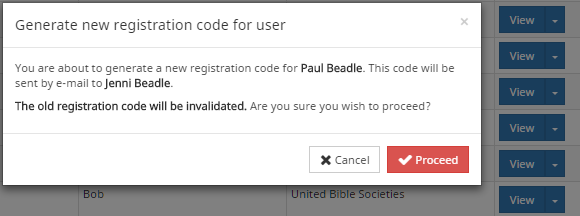

1. Click **Proceed**
1. Check your email for the code.

**3.6 Register a new user (who does not have an email address)**
:::info
 Any administrator of a registered project can create new user registrations if they need to add people to their project. These users do not need to have an email address.
:::

1. Go to [https://registry.paratext.org](https://registry.paratext.org/)
1. Log in if you are not already logged in.
1. Click on **Users**
1. Click the **“+ Register new user”** button.
    - *The new user registration form is displayed.*

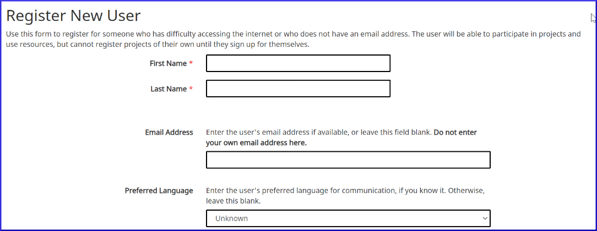

1. Fill in their name, and the rest of their information.
:::caution
🚫 A user added by someone else cannot be made an administrator of a project, nor a consultant. If you would like to make someone a consultant or administrator they must register themselves for Paratext, then you can add their name to the project.
:::

1. When competed, click “**Create**”
    - *The server should respond by e-mailing you the user code for the new user.*

:::tip
The code can not be recovered again if you lose it. But you can generate a new code see [3.5]
:::

**3.7 Translation project by an unrecognised individual/organisation**

1. If a translator is not part of a recognised organisation, s/he can apply to the BoG ([boardofgovernors@paratext.org](mailto:boardofgovernors@paratext.org)) to be members of "Independent Translators" pseudo-organization

:::caution
It is unclear how many text resource owners will grant access to this group.
:::

----

## 4. **CP - Creating a new project**

**4.1 Introduction**

In this module, you will create and register a new project.

**Before you can start**

You need to have already installed Paratext and registered a user.

**Why is this Important**

A new aspect in Paratext 9 is that projects need to be registered as well as users. This may feel like an extra complication, but it does offer benefits to users.

As we saw in the user registration section, the project administrator can create registrations for users they want to be part of their project.

**What are you going to do?**

We will create and register a new project.

### 4.2 Create a new project

1. **File**  **New Project**
    - *The New project dialog is displayed.*

    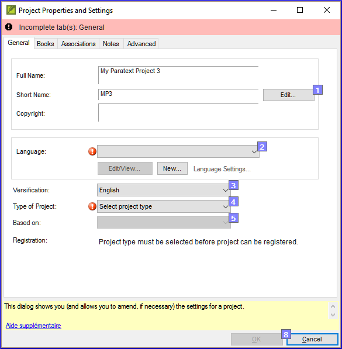

### 4.3 Name for the project

1. Click the **Edit** button
    - **The “edit name” dialog is displayed**

    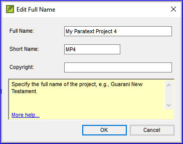

1. In the name section, under Full name, type a name which includes the name of the language.
1. Under short name enter the **ISO** code for the language.

:::tip
 The ISO code is the preferred short name for the DBL.
:::

:::info
Once you create a project name, **the short name cannot be changed,** because this is the name Paratext will give to the folder containing the project files, and also the name given to the project on the Internet server. (**If you  need to change the name, you can convert the project to a new project with a different short name.** But it can take many hours to convert a project.)
:::

### 4.4 Specify language

1. If you have another Paratext project in the same language, you can just pick the language from the list in Paratext **[2]**. If not, you will need to create a new language.
2. Click on **New**
    - *The Choose language identifier box is displayed .*

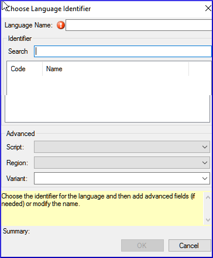

1. Click in the **Search** box
1. Start typing the name of your language
    - *Paratext will display matching names.*
1. Click on your language in the list.
    - *Paratext will add the language name.*
1. Fill in the advanced fields if necessary.
1. Click **OK**.

:::info
 You can also specify additional information if needed in the “advanced” section of the language settings dialog.
:::

### 4.5 Type of project

1. Click the drop-down list beside “**Type of Project**”
1. Choose the appropriate type for your project.
    - *If it is a back translation, or a daughter or transliteration project, you will need to define the source or base text.*

### 4.6 Register the new project

1. Make sure you have given the project a name and chosen the project type.
1. Click **Register online** to go to the registration page
1. Fill in the information (see above)
1. Click **Register** to submit and return to Paratext.
    - *Paratext should "automagically" detect that the project is now registered,*
1. Click **OK** to create the new project.

The types of projects that do not need to be registered separately:

1. Projects that inherit their inscription from the parent project.

- Back translations
- Transliterations
- Auxiliary
- Consultant notes.

### 4.7 Editing your registration

As you work in your project, you can change your registration information later on.

1. From Paratext, make sure you are connected to the Internet,
1. **≡ Tab**, under  **Project**  **Project Settings**  **Properties**
1. Click the “**Manage registration**” link.
    - *This will bring up the project registration info and you can edit it. Any project administrator can edit the registration info.*

----

## 5. **IR - Installing Resources**

**Introduction**  
The basics of installing resources is explained in the video 0.3a. In this module you will learn how to share the downloaded files on other computers.

**Before you can start**  
You must have already installed Paratext 9 and registered a user.

**Why is this important?**  
In Paratext 9, the resources are downloaded from the DBL (Digital Bible Library). Each user can download them directly, but if your Internet connection is limited, you can share the downloaded files with other users.

**What will you do?**

1. Download resources from the Internet.
2. Install resources from a downloaded file.

### 5.2 Install resources – Internet (DBL)

1. Click the **≡ Paratext**, then under Paratext, choose **Download/Install resources**
    - *A dialogue box is displayed*
2. Make sure Internet has been chosen.
3. Filter the list by typing in the **filter box** (type name or language or + for enhanced)
4. Click the check boxes to the left of the desired resources.
5. Click **Download/Install**
    - *The files are download to C:\My Paratext 8 Projects\_Resources*
6. Copy those files from _Resources to a USB or other device.

### 5.3 Install resources – files

1. Click the **≡ Paratext** menu, then under Paratext, choose **Download/Install resources**
    - *A dialogue box is displayed*
1. Click **Folder**
1. Click **Browse**.
1. Go to the folder which contains the downloaded resource files.
1. Select the desired resources by checking the box.
1. Click **Download/Install**

----

## 6. **PP1 - Setup Project Plan**

**Introduction**

“Progress tracking” based on a Project Plan and Assignments and Progress is an improved feature in **Paratext** 9.1 that impacts the day-to-day work of translation teams.

**Before you Start**

Before you can add the plan the project must have been created/or migrated.

**Why is this Important**

There are many tasks to be done in a translation project. It is important to have a system to ensure that all of these are done. It is also good to have an easy way to generate reports for supervisors and funders (see PP2: Project Plan Report).

Setting up a project plan from scratch is daunting. Various Bible translation organizations (UBS/ABU, SIL and The Seed Company) include "basic" plans that can be applied to projects. Teams need only customize these plans within the limits set by their organizations.

Typically, organizations want conformity at the “Stage” level in order to facilitate meaningful tracking of the progress of project across the entire organization. However, every plan will need to be customized at the task level.

If a task is important to you and your team and you want to track its progress, then it can be included in the project plan (even if it doesn't require Paratext to do the task).

**What are you going to do?**

You will use a combination of two features: the settings of the **Project Plan** and the **Assignments and Progress** (sometimes referred to as “progress tracking”) to manage the plan by assigning team members to tasks, and tracking their progress in completing those tasks.

- Add the organizational base plan to the project (remove an old plan if necessary)
- Customize the plan for the team by adding/deleting and moving tasks
- Assign the tasks to the various team members.
- Update the base plan whenever there is a new version.

**6.1 Add the organisational base plan**
:::info
 If you have an existing plan, you need to remove that plan before you can add another plan. (See below for instructions.)
:::

1. **≡ Tab**, under Project  **Project Settings** choose **Project plan**
2. Click **Manage plans**
3. Click below **Show Base Plan**
4. Choose your organisational base plan
5. Click the **Copy Plan** arrow.
6. Click **OK**.
    - *The plan and its tasks are added to the project.*

**6.2.1 Remove current plan (before adding another)**
:::tip
💡 If the project has an old plan, you need to delete each of the current stages before adding a new base plan.
:::

1. **≡ Tab** , under **Project Project plan settings**
2. Click **Manage plans**
3. Click on the last stage
4. Click the **Remover Stage** button
5. Click Yes (twice) once to confirm you want to modify the plan, and again to confirm you want to delete the tasks in the stage.
6. Repeat for remaining stages
7. Add the new plan (see above)

**6.3 Configure the plan**

**6.3.1 Configure — Books to include**

1. [**≡ Tab** under **Project** choose  **Project settings**  **Project properties**
2. Click the **Books** tab
3. Choose the books that you want to track progress.
4. Click **OK**

**6.3.2 Configure — Assigning checks to a stage**

1. **≡ Tab** menu, under **Project**, choose **Project properties** then **Project Plan**
1. Click on the **Checks** tab
1. Click on the Checks tab
    - *Two columns are displayed: Required stage and Optional stage.*
1. For the desired check, drop down the list and set the **required stage** [12]
1. Choose the new stage or *none*
1. Then set the Notify only (optional) to an earlier stage if any.
1. Continue for each check
1. Click **OK**

**6.3.3 Configure — Reordering tasks / Move tasks to another stage**

:::tip
💡 It is possible to reorder tasks and even move tasks to another stage. However, not all organisations permit this.
:::

1. From the **≡ Project** menu, under **Project**, choose **Project Properties**, then **Project Plan**
1. Click the **Stages/Tasks** tab.
1. Select the task you want to move.
1. Click the up arrow or the down arrow to move the task to a different point with respect to the other tasks, or to move it to a different stage.
    - *You may get a messages asking to confirm.*
1. Click **OK**.

**6.3.4 Configure — Add tasks**

1. Click on the task which is above the new task.
1. Click on the **Add task**
1. Type the name for the task and a description.
1. Click **OK**

**6.3.5 Configure — Delete tasks**

1. Click on the **Stage**/Tasks tab
1. Click on the task to delete

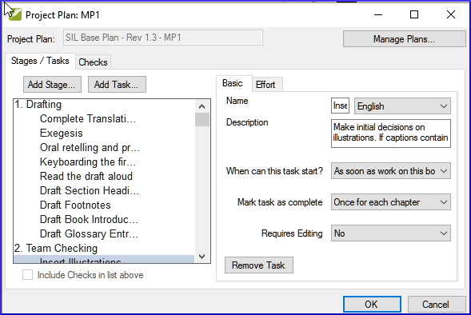

1. Click the **Remove Task** button
1. Click **OK**.

**6.3.6 Rename or edit tasks**

1. Click on the task (in the list on the left)
1. Click on the name box (in the pane on the right)
1. Type a new name for the task
1. If necessary, edit the description.

### 6.3.7 Copy a task from one plan to your project

:::note
Follow the steps below to copy a task from the base project plan of one project to the project plan for your project.
:::

1. Open your project [**≡ Paratext** under **Paratext** select **Open**].
2. **≡ Tab**, under **Project** select **Project Settings**  **Project plan**
3. Click **Manage plans**
4. From the **"Show Base Plan"** drop-down, select the project plan that contains the desired task.
5. On the **Current Plan** side of the dialog, click the row that has the task which should precede the new task.
    - *If you want the new task to be the first task in the stage, select the stage name instead.*
6. On the **Base Plan** side of the dialog, hover over the task you want to add and click the solid blue arrow that appears.
    - *The task is copied to your project plan and cannot be copied again into this project.*
7. **Optional**: To move the task, click the up arrow or the down arrow that appears when you hover over a task on the Current Plan side of the dialog.
8. Click **OK** to close the "Manage Plans" dialog.
9. Click **OK** to close the "Project Plan" dialog.
    - *The copied task has the same name and progress rate as it had in the project plan for project ORIG.*

        *The short name of the project is added to the plan name.*

**6.4 Check the settings for a task**

1. There are three settings for each task
    - how do you to mark the task as complete (once for each chapter, book or project)
    - when can the task begin (anytime, or wait for another task ...)
    - do you need editing permission (if so, which project)
1. **≡ Tab** menu, under **Project** select **Project Settings**  **Project plan**
1. Click the task
    - *The settings are shown at the bottom right*

    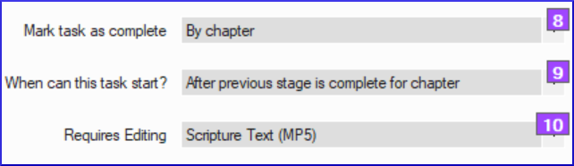

1. Make any changes as needed.
1. Repeat for any other task.
1. Click **OK**.

**6.5 Priority Groups**

Priority groups are a way to let Paratext know the order in which books or chapters should be worked on.

**6.5.1 Using preselected set**

1. Click the **≡ Project** under Project,
1. Choose **Project settings** and go to **Define priorities**
1. Click Select Priority Definition Select a set (e.g. SIL Easy to Difficult set)
    - *a pre-selected set of books is presented.*
1. Click **OK**

**6.5.2 Setting up priorities**

1. Click the **≡ Project** menu, choose **Project settings** and go to **Define priorities**
1. Select the desired books, then click Right arrow button
2. Hover the mouse over the title or the book name in right column
3. Click the three dots, choose **Edit**
4. Rearrange the books as needed by clicking on a book name and moving it up or down using the arrows buttons.
5. Rename the group (e.g. Gospels).
6. To set specific chapters,
7. Select a book name link
8. Choose which chapters
9. Click **OK**
    - *If you add a book which already has chapters defined it will only add the remaining chapters*.
10. Change order of priorities using the up arrow.

**6.5.3 Using the priorities**

Once priorities have been created, they can be used anywhere you would normally choose books. For instance,

1. **Find** dialog (Ctrl+F)
    1. Click on **choose**
    2. Select the **Priority** tab.
2. **Assignments and Progress** (blue button), book selection can be set to a priority.
3. (Project menu ) **Export PDF**, click Choose button, then Priority tab.
4. Any window with a filter (e.g. Wordlist, Biblical terms ...)

You can also define or redefine your priorities if you need to.

**6.6 Assign tasks to team members**

Tasks can either be assigned individually or in bulk.

**6.6.1 Assign tasks individually**

1. **≡ Tab**, under **Project**, choose **Assignments and Progress**
2. For the task to assign, click to dropdown the menu and choose the team member to do the task
3. Repeat as necessary
4. Click **OK**.

**6.6.2 Bulk assign tasks**

1. Click the **Blue** Assignments and Progress button
1. Choose **Tasks Table**
1. Use the verses filter to select books
1. Below the task, click **Assign tasks**
    - Incomplete chapters can be reassigned but not completed chapters.
    - *A warning message will appear with options to overwrite all assignments or only those chapters that have not yet been assigned.*

**6.6.3 Assign Stage or book**

1. Click the **Assign stage** button (at the top of each stage).
1. Change assignments for certain tasks as needed.

:::tip
💡 Once you have completed the bulk assignment process you can fine-tune the assignments in the All Tasks view
:::

**6.7 Updating the progress (for a migrated project)**
:::tip
💡 For projects that have already completed a number of stages at the time of switching to Paratext 9 the **Tasks table** view and/or the **Stage table** view of Assignments and Progress can be helpful in marking multiple books, stages or tasks, as complete.
:::

1. Click on your project.
2. Click the **Blue** Assignments and Progress button
3. Choose **Stages Table**
4. Click the **≡ Tab** and choose **Bulk Progress Mode**.

 Checks are temporarily turned off.
 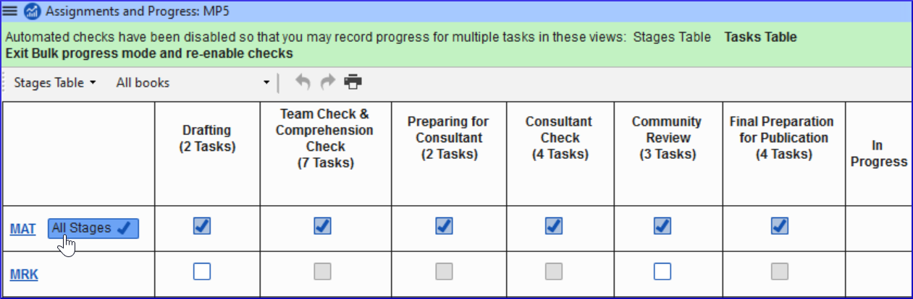

1. Click **All stages** button
    - *All of the stages are approved.*

    :::tip

    💡 When you finish doing all the approvals, go back and uncheck bulk progress mode.

    :::

**6.8 Saving a modified plan as a new base plan**

Changes you made to your plan will be sent to the members of your project when you send/receive. If you want to share the revised plan with other teams you can save it as a new base plan.

1. Open **your** project.
2. **≡ Tab**, under **Project** select **Project Settings**  **Project plan**
3. Hold shift key and click **Manage plans**
    - *The manage plans dialog appears with a save as base plan button at bottom right.*

    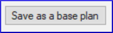

4. Click on the **Save as a base plan** button
    - *A dialog box is displayed*

    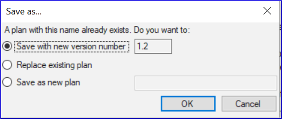

    *The file will be saved to \My Paratext 8 Projects\_StandardPlans.*

5. Choose as appropriate, then click **OK**
6. Share the file from \My Paratext 8 Projects\_StandardPlans with the other teams.

**6.9 Updating a project with a new version of the base plan**

Occasionally the base plan upon which that project plan has been built will be modified. There are two ways to update the base plan.

**6.9.1 Method 1**

1. **≡ Tab**, under **project**
2. Choose **Project Settings** then **Project plan**.
    - *A warning is displayed that there is a new version of the plan and I can migrate.*
3. Click the link **Migrate to a new version of the project plan**.
4. Choose either:
    - Keep the tasks that are not in the new version
    - Remove all the tasks that are not in the new version
    - Keep tasks that had progress.
5. Click **OK**
    - *Paratext warns that you must do a send/receive,*
6. Click **OK** to clear the message
    - *The plan has been updated.*
7. A green message bar at the top gives you three options:
    - Close the message
    - View progress in the previous plan,
    - Undo the base Plan update.
8. *Note the version number has been updated.*
9. Click **OK**.

**6.9.2 Method 2**

1. Click on assignments and progress.
    - *If the base plan has been updated, then a message will appear showing that you can update*.
1. Click on **Update to new version of project plan**.
1. Choose to keep or remove the tasks.
    - *When you update it will do a send receive.*
1. Choose one of the three options in the green message bar at the top:
    - Close the message
    - View progress in the previous plan,
    - Undo the base Plan update.

----

## 7. **Setting up a project for success**

Things to consider:

**It is a dynamic process**

1. When a project is brand new there aren’t a lot of settings that can be fixed in concrete.
1. As the project matures some of the inventories begin to make sense.

**Who is working on the project?**

1. Setup the Users, Roles and Permissions
1. Would it be helpful to have a “Simplified Menu”?

**Do you need to customize the settings?**

1. custom.sty
1. change settings of the stylesheet
1. names of markers (in other languages)
1. colour to help identify features?
1. custom.vrs
1. identify verses that are different from default versification

**What orthography will be used?**

1. Put the orthography in the language settings.
1. (Keep in mind that what you put in the language settings could be going to the “Speech and Language Data Repository”

**How will the characters be keyed?**

1. Keyman/MSKLC
1. AutoCorrect.txt

**What Quotation system will be used?**

1. Set up the quotation rules (Dynamic)
1. Think about your rules
1. Test what you have
1. Adjust the rules
1. Make corrections to the rules / or text as necessary

**When you have some text data:**

1. Begin setting up the inventories
1. Let’s start at the very beginning (Characters)
1. Look for options in the inventories!
1. Is the item valid all the time? Or just in certain situations?

**Scripture Reference Settings**

1. What book names are you using?
1. What is the format for a reference?
1. Where will you put the origin of notes?

----

## 8. **CV - Convert project**

**Introduction**

If you have ever needed to rename your project, reduce the size of your project, change user names, change the encoding or struggled with composed/decomposed diacritics, then the convert project tool will help you solve these problems.

**Before you Start**

You must be the administrator of the project to do these conversions.

**Why is this Important**

Although, it is possible to make some changes to existing projects through the project and setting dialogs, several major changes require that a new project is created. Using the convert project dialog allows the new project to keep the project history.

**What are you going to do?**

We will work through the six changes that can be made to your project.

1. Changing the short name of the project
1. Removing deleted files from the project history
1. Clean up Paratext Live history
1. Convert encoding to 65001 – Unicode (UTF8)
1. Normalising – composed or decomposed
1. Replacing old User names

### 8.2 The convert project dialog

1. From the  **≡ Project**, under **Project**, choose **Advanced**, then **Convert Project**

**8.2.1 Changing the short name of the project**

1. Confirm that the old name of the project is correct. (If not, close the dialogue and click in the correct project window, and access the dialog again.)
1. Enter the new short name for the project in **[1]**.

**8.2.2 Removing deleted files from the project history**

1. **[2]** Select this if you have deleted files (such as large illustration files) that you no longer want to be part of project history and no longer want in the project repository.

**8.2.3 Clean up Paratext Live history**

1. **[3]** Select this if you have edited the project with Paratext Live and want to replace names in the project history.

**8.2.4 Convert encoding to 65001 – Unicode (UTF8)**

1. **[4]** Select this to convert a standard project encoding to Unicode.

**8.2.5 Normalising – composed or decomposed**

1. **[5]** Select Composed (NFC) or one of the options in the drop-down list if the data in your project was created using a mix of composed and decomposed characters. (See the Guide for more details).

**8.2.6 Replacing old User names**

1. **[6]** Select the name of the user you want to replace from the drop-down list.
1. **[7]** Enter the name of a registered Paratext user in this box.
1. **[8]** Click **Add**,
    - *a summary of the replacement appears, with a "Remove" button.*

    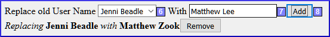

1. (Click Remove if you either made a mistake in typing the name in the "With" field OR decide not to make the replacement.)

### 8.3 Convert the project

1. **[9]** Click **OK** to convert the project.

:::tip
💡 See the note in the guide regarding shared projects.
:::

----

## 9. **CR - Cross-references**

**Introduction**

Most languages do not have access to concordances or other Bible study materials in their own languages. Adding cross references to your New Testament can greatly help your reader understand the text by helping your reader find passages on similar themes. There are several list availalbe (with thousands of cross-references). Some lists can be exported from a model text and then inserted at once.

**Before you Start**

Before you can insert cross references from a model text your administrator must have created all the books (and chapters and verses) in your project. They can be empty but they must be present.

**Why is this Important**

Reading the New Testament is not like reading a novel. Having access to cross references allows your reader to find similar passages. Nevertheless, adding cross references one by one is too tedious. The **Insert cross reference** feature allows you to insert all of the cross references at once and also converts the book names and punctuation to match your **Scripture reference settings**. Extracting cross-references from a model text allows you to easily insert the same cross-references.

**What are you going to do?**

We are going to do three things:

1. export the cross reference from a model text;
1. make sure all the settings for book names and scripture references have been entered for your project;
1. finally insert the cross references.

If you don't have a model text with the desired cross-reference, you can create your own list and import it.

### 9.2 Extract the references from the model text

1. Open the model text.
2. **≡ Project** under **Advanced**, choose **Extract cross references**
3. Type a file name
4. Click **OK**.
:::tip
💡 Note: Some Resource texts may not allow you to extract cross references.
:::

### 9.3 Check your scripture reference settings

1. **≡ Tab** under **Project**, select **Project Properties**  **Scripture Reference Settings**.
2. Verify that the following have been correctly defined for your project (edit them if necessary).
    - The punctuation on the **Reference Format** tab.
    - The book abbreviations on the **Book Names** tab.
3. Click **OK**.

### 9.4 Check your Language Settings

1. **≡ Tab** under **Project**, select **Project Properties**  **Language Settings** …
2. Click the **Other Characters** tab.
3. In the **Verse segment characters** box, enter at least six different characters separated by spaces.
4. Click **OK**.

### 9.5 Insert Cross references

1. **≡ Tab** under **Project** menu, point to **Advanced**, and then select **Insert Cross References**.
1. Click **Browse**...
1. Find the .xrf file of extracted cross references.
1. Select the file, and click **Open**.
1. If desired, select one or more of the options:
    - (see the guide for more info)
1. Click **OK**
:::info
 If the Copyright box displays a copyright notice or required statement of acknowledgments, copy the text, and then paste it wherever you keep this kind of information for the project.
:::
