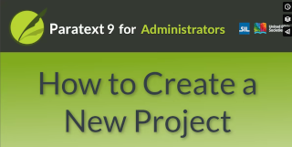

:::note Video
  
(https://vimeo.com/793640292)
:::

In this video we will learn how to create a new project in Paratext. 
## Create a new project
1.	Open the main **Paratext menu**. 
2.	**Expand** the menu. 
3.	Under Paratext, click **New project**. 
    - *The Project Properties dialog box opens*. 

### Fill in the fields
**1. Type of project**  
- Choose the project type, e.g. Standard project
- *If you chose any other than standard translation or Consultant notes, the based on field lights up and you must specify which project the new one is based on.*

**2.	Based on**
- Choose Based on project if applicable.

**3.	Language**
- Dropdown the Language list.
A list of available projects is displayed.
- Choose a language OR click New
- Start typing the name or code of the language then click on the language in the list
- Click OK.

**4.	Project names.**
- Click the Edit button. 
- In the Edit Full Name dialog box, enter a full name for the project. 
- In the short name field, add a short abbreviation. 
:::tip
It is highly recommended that you use the language ID code at the beginning of the short name. 
It is complicated to change the short name later, so make sure it is suitable now. 
:::
- Click OK. 
The two project names are displayed in the project properties dialog. 

**5.	Versification**
- If needed, change the versification.
:::tip 
Use the same versification as the translation you will be basing yours on, or that of the most commonly used translation in your area.
::: 
Once the required fields have been filled in, the Register Online button becomes active if you are required to register the project. 
Some project types inherit registration so in those cases the button is not shown. 
You can register this project now by clicking Register Online. 
Alternatively you can finish creating the project first and register it later. 
:::tip
How to register a project is explained in a separate video.
::: 

**6.	Books**
A pink bar may be displayed saying the Books tab is incomplete. 
- If so, click the Books tab. 
- Select the books you are definitely planning to publish e.g. the gospels. 
If you are not sure, select the most likely books, and add more in Project Properties later. 
- Click OK. 

**7. UFSM 3 or 2?**
- Paratext asks you to choose between using USFM 3 or USFM 2. 
- Click the appropriate button. 
Paratext creates and opens the project. 
:::tip 
- We recommend USFM 3, which is the latest version of the USFM standard.
- Only select USFM 2 if someone on your team is still using Paratext 8. 
:::

