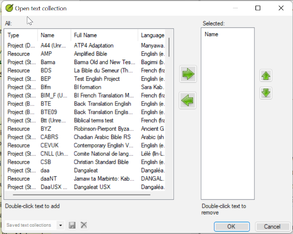
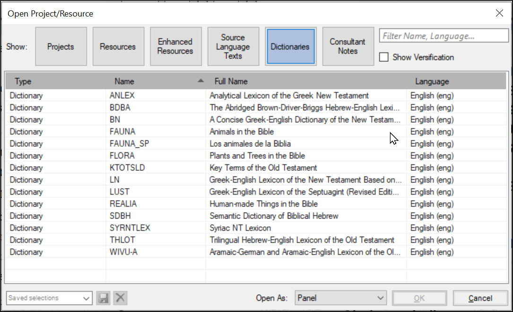

**Introduction**  
As you work with your text in Paratext 9 you will want to see a variety of resources. In this module, you will learn how to open resources and organise your desktop.

**Where we are**  
We are getting ready to type text into an existing project. Before you can do this, someone must have already installed the program, created a project for your data and installed resources for you.

**Why this is important**  
The translator who organises his/her desktop well has all the resources necessary for his/her work.

**What are you going to do?**  
You will start the Paratext 9 program and open a previously saved layout (text combination). If needed you will open other resources, change the arrangement of the windows and resave the text layout.

:::info Videos 
There are a number of videos available to help you with the different types of resources and arranging the windows. Some suggestions are given below. Click on the link to see the video summary.  
[0.2.1c](../../Video-summaries/01-Introduction/0.2.Navigation/0.2.1c.md) Finding Menu Items  
[0.2.1d](../../Video-summaries/01-Introduction/0.2.Navigation/0.2.1d.md) How To Arrange Windows  
[0.2.2a](../../Video-summaries/01-Introduction/0.2.Navigation/0.2.2a.md) How To Open And Modify A Text Collection

[0.2.3a](../../Video-summaries/01-Introduction/0.2.Navigation/0.2.3a.md) How To Control Which Windows Scroll Together  
[0.2.3c](../../Video-summaries/01-Introduction/0.2.Navigation/0.2.3c.md) How To Swap A Text In A Window  
[0.2.3d](../../Video-summaries/01-Introduction/0.2.Navigation/0.2.3d.md) Further Tips On Arranging Windows
:::

**Changes in Paratext 9**  
The menus changed in Paratext 9.0. To see the menu, you now need to click on the menu icon ≡. There are now two types of menus. The main Paratext menu is on the title bar () and each window (or tab) has its own menu (). When you click on one of these menu icons all the menus are displayed and you just need to click on the command.

:::tip
In this manual, when it says **≡ Paratext**, under **Menu** \> **Command** (e.g. **≡ Paratext**, under **Paratext** \> **Open**). It means click on the Paratext menu icon ≡, then under the menu (e.g. Paratext) choose the command (e.g. Open). 

And when it says **≡ Tab**, under **Menu** \> **Command** it means click on the tab menu icon, then under the menu (e.g. Tools) click on the command (e.g. Wordlist). It also says **menu** project**
:::

### 2.1 Load the program
-  Double-click on Paratext 9 icon on the **desktop**  
     
    -  **OR**  
-  (From the **Start** menu, choose Paratext 9)

### 2.2 Open a saved layout
-  Click the **≡ Paratext** menu, then under the **Window** menu
-  Choose a saved layout (text combination).  
    -  *Your screen should look something like the picture below (if not, see below).*  
    
### 2.3 Create a new text layout
If you haven’t already saved a layout, then we recommend you do the following:

**Open and arrange the windows**
-  Open 5 windows as follows:
-  1= Text collection
     -  **≡ Paratext** menu, under (**Paratext** \> **Open**, select several resources, choose to open as Text collection. See [2.5](/Training-Manual/02-Stage-1/2.OD.md#25))
-  2 =your project
     -  **≡ Paratext** menu, under (**Paratext** \> **Open**, Projects)
-  5 = Renderings
     -  **≡ Tab** menu, under (Tools \> **Biblical Terms renderings**)
-  3 = Source text
     -  **≡ Paratext** menu, under (**Paratext** \> **Open \> Source language text**)
-  4 = Enhanced resource
     -  **≡ Paratext** menu, under (**Paratext** \> **Open \> Enhanced recources**)
-  Arrange the windows as desired. See Paratext video [0.2.1b](../../Video-summaries/01-Introduction/0.2.Navigation/0.2.1b.md), [0.2.1c](../../Video-summaries/01-Introduction/0.2.Navigation/0.2.1c.md), and [0.2.1d](../../Video-summaries/01-Introduction/0.2.Navigation/0.2.1d.md).
:::note Upgrade
In Paratext 9.3 (and above) you can use the main Paratext menu to arrange windows by **rows** and **columns**.
:::
:::tip
Remember to save your layout!
:::
**Save the layout**  
Once the windows are arranged as desired:
-  **≡ Paratext**, under **Layout** \> **Save current layout**
-  Type a name  
    [or to replace an existing combination, choose the existing name]  
-  Click **OK**

### 2.4 Delete a text layout
If you want to delete a saved layour,

-  **≡ Paratext** menu, under **Layout** \> **Delete layout**
-  Choose the name of the saved layout.
-  Click **Delete**

### 2.5 Open resources in a Text collection{#25}
With Paratext, it is possible to have several projects/resources open at the same time. However, rather than having too many windows, it is better to have several texts in one window.

:::info Upgrade
In Paratext 9.3 the Text Collection can also be opened directly from the **≡ Paratext** menu
:::
**New method - Open directly from Paratext menu**
-  **≡ Paratext** menu, under **Paratext** \> **Open text collection**

   
-  Select several resources using the Ctrl key as you click on the resource.
-  Click on the **Right arrow button**.  
    -  *The resources are listed in the Selected column*.
-  Repeat as necessary.
-  Use the up and down arrows to reorder them as needed.

Save the collection 
-  Click in the text box in the bottom left corner.
-  Type a name for the saved collection and click the save icon
-  Click **OK**.
   -  *The text collection opens*.

**Previous method - Open dialog**
-  **≡ Paratext** menu, under **Paratext** \> **Open**
    
-  Click on the Resources button (at the top).
-  Select several resources using the Ctrl key as you click on the resource.
-  Repeat as necessary.
-  Click on the **Open as** dropdown list.
-  Choose **Text collection panel**
-  Click **OK**

 
-----

:::tip
It is suggested that resources be displayed in the order of more literal to less literal (to focus on the texts that are most faithful to the source texts). For English resources: ESV, RSV, NIV, NLT.For French resources, the following order is suggested: TOB, NVSR78Col, NBS, BDS, FC97, PDV11. 
:::

-  To change the order of texts in the collection
-  **≡ Tab**, **Modify text collection**  
    
-  Use the arrow buttons to change the order as necessary  
    
-  Make any other changes
-  Click **OK**

:::tip
You can change the text in the second pane by clicking on the blue link of the abbreviation for the text. You can also use the view menu to change the view (preview, unformatted or standard).
:::

### 2.6 Open an Enhanced Resource
-  **≡ Paratext** menu, under **Paratext** \> **Open**  
    
-  Click on **Enhanced Resources**

:::tip
Enhanced resources also contain a dictionary, images, maps etc. When you open an Enhanced Resource, a guide opens as well.
:::

### 2.7 Open a dictionary
:::tip
If you do not use an enhanced resource, you can open a source language dictionary with glosses in other languages.
:::

-  **≡ Paratext** menu, under **Paratext** \> **Open**  
    
-  Click **Dictionaries**
-  Choose “A Concise Greek-English Dictionary of the New Testament” OR “Trilingual Hebrew-English Lexicon of the Old Testament”
-  Click **OK**
-  **View** \> choose a language (e.g. **French**)

:::tip
It is useful to add dictionary windows to the autohide, (right-click on the tab name, choose move to autohide).
:::

Other dictionaries (in English but with photos)

-  "Plants and Trees in the Bible"
-  "Animals in the Bible"

### 2.8 Working with the Source language text
You can open the source language text with glosses in an alternative language than English, e.g. French.

-  **≡ Paratext**, under **Paratext** \> **Open**  
    
-  Click **Source Language Texts**
-  Choose HEB/GRK
-  Click **OK**
-  **≡ Tab** under **View** \> **Additional glosses**
-  Choose the project which has the glosses
-  Click **OK**
