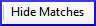

**Introduction**  
In this module, you will search for a word or phrase in a project and compare it with the translation of that word or phrase in another project.

**Why this is important?**  
In Paratext 9 (and above), you can see where a word or phrase is found in one project and compare it with the equivalent word or phrase in one or more other projects. For example, you can see where "roi" is found in a French project and compare it with "rey" in a Spanish project.

You will  
-   use the checklist “Word or Phrase” from both the text and also from the Biblical Terms Tool.
-   change the settings and comparative texts
-   type the word or phrase to compare for each project

### 11.1 Compare a word of phrase – from the text

-   Click in the project that you want to compare
-   From the **≡ Tab**, under **Tools**, point to **Checklists**, and select **Word or Phrase**.  
    *The Parameters dialogue is displayed*.

    

-   Enter the word or phrase that you want to see into the textbox for each project of the dialogue
-   Click **OK**  
    *A window is displayed*.  
    

-   Click **Comparative Texts**...
-   Choose the texts that you want to compare and click **OK**.  
    *The « Settings » dialogue is displayed.*

    

-   Type the word of phrase that you want to compare in the textbox for each of the projects, then click **OK**.  
    *A window is displayed with a button "***Hide matches***" on the toolbar.*

    

-   Click on the "**Hide matches**" button to show only those references where there are differences.  
    *The list shows the verses which contain matches in only one of the projects. The word or phrase is highlighted in light blue*.

### 11.2 Compare using a Word of Phrase from the Biblical Terms tool

-   In the Biblical Terms tool
-   Choose a term which has a rendering
-   Click on the tool icon

      
    *The Setting dialogue is displayed with the rending filled-in.*

-   
-   Type the word or expression for the other projects
-   Click **OK**
:::tip
If you want to compare more than one word or phrase, type **Enter** after each word or phrase.
:::