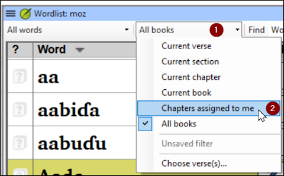

**Introduction**  
In this module, you will check that the proper names have been transliterated consistently. There are two ways to do this. One way is to have Paratext guess the proper names based on statistical analysis of a model text. The other way is to tell Paratext the changes for specific characters.

**Where we are**  
You have (or are working on) the rules for transliterating the names.

**Why this is important**  
You want to be consistent so that is clear who is being referred to in the text.

**What you are going to do**  
You will:

-   filter the Major Biblical terms list on Names.
-   EITHER use the **Guess renderings** tool to guess the appropriate rendering of the names.
-   OR use the **Adapt Names** tool to enter your transliteration rules for each letter.
-   edit and approve the individual names.
-   add the approved names as proposed names in the Biblical terms list.
-   work through the Biblical Terms list to ensure that all the verses are consistent.

### 7.1 Run the Biblical Terms tool
-   Click in your project
-   **≡ Tab**, under **Tools** \> **Biblical Terms ...**

#### Open list of terms
-   **≡ Tab**, under **Biblical terms** \> **Select Biblical terms list**
-   Double-click the "**Major Biblical Terms**" list

#### Choose your reference text as a comparative text
-   Click the **Comparative Texts** button on the toolbar.

    

-   Choose your reference text, then click **** → (right arrow).
-   Click **OK**.

#### Change various settings
-   Click the second filter button

    

-   Choose **Chapters Assigned to Me**
:::tip
Note: The terms column is in Greek (or Hebrew) by default. You can see the terms in a roman script by using the **≡ Tab**, under **View** menu \> **Transliterate terms**.
:::

#### Filter for names
-   Click the first filter button
-   Choose **New Filter** 
-   In the dialog box, under **Categories…**
-   Select « **Names** »
-   Click **OK**

### 7.2 Guess Renderings for proper nouns
-   **≡ Tab**, under **Tools** \> **Guess renderings**
-   Click **OK**  
    *Paratext will add renderings to any terms which do not have a rendering (with an orange background)*

    You will need to approve these renderings (see [7.4](#7.4-Confirm))

### 7.3 Adapt names
Adapting names should be done in the early stages of a translation project, before you have approved renderings of proper names. Otherwise you can use the guess renderings (see above).

-   **≡ Tab**, under **Tools** \> **Adapt Names**
-   Choose the language of your reference text (e.g. English or français)  
    *The Name Adaptation dialogue is displayed*

    

**Enter the changes for the individual letters (or letter clusters)**  
-   In the left pane, fill in the “Adapted Character” column for the individual letters or letter clusters.

**Then revise and approve the Adapted Name**  
-   Work through the **Adapted name** column in the right pane.
-   For each name, if the adapted name is incorrect, click on the name in the **Adapted Name** column,
-   Edit the name and click **OK**
-   Once the name is correct, click in the "**Approved**" column.
-   Click **OK**.

:::info
Paratext 9 will propose a name (in red) in the rendering column of the biblical terms tool.
:::

### 7.4 Ensure your text is consistent{#7.4-Confirm}
You need to work through the list and confirm that all the verses use the name consistently.

-   Click the name in the top pane.
-   Click on a verse in the lower pane which doesn’t have the proposed form of the name.
-   Click on the Edit link
-   Correct as necessary, then click **Close**
-   Repeat for each name.

### 7.5 Add an alternative rendering
-   Click the name in the top pane.
-   Select the word(s) in your text
-   Click on **Add rendering** button or **Ctrl**+**A**

### 7.6 Dealing with verses that do not have the name translated
:::tip
There are times when a verse is correctly translated even though you have not used the name. For example, a pronoun is used instead of the name. In this case you need to tell Paratext 9 that it is correct (that is, deny that the rendering is missing).
:::

-   Click the red cross at the left of the verse reference 

    *The cross turn into green tick (check) with a red cross* .

-   If you clicked on the red cross by mistake, click again on the icon 

:::tip
Note: Paratext 9 does not find names in the introductions, headings, footnotes, captions or glossary. (You could use the Word List to find possible mistakes.)
:::

### 7.7 Recall
-   To transliterate proper names, you \__\_**\_ the \_**\_____________\_ list on names.
-   Then use the \______\_ menu and \___________\_ command.
-   After entering the \_**\_ changes then \_**\___\_ the adapted names.
-   Paratext 9 then enters a \_________\_ rendering for all the names.
-   You then work through the list \_______\_**\_ and/or adding renderings and making sure that all verses are \_**\____________.
-   You can add a rendering by selecting the text and pressing **Ctrl**+__.
-   If a pronoun is used you can \_____\_ the rending by clicking on the .

    Answers: filter, Major Biblical Terms, names, Tools, Adapt Names, character, approve, proposed, correcting, consistent, A, deny
