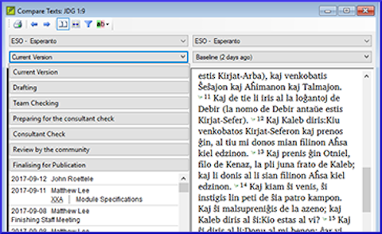

**Introduction**  
In this module, you will learn how to save your text at various points and review them later.

**Where are we?**  
You have worked on your text and you have arrived at an important stage of your project.

**Why is this important?**  
As you work on your translation, you will be continually making changes. It is good to have a copy of your text as it was at a particular point, for example as it was before you went to a consultant check. 

**What will you do?**  
You will mark a point in the history of the project. Later you can compare the text at different points.

### 18.1 Mark Point in History
-   Click in your project window to make it active (in Paratext).
-  **≡ Tab** under **Project** \> **Mark a point in project history**
-   Type a comment to describe the point.
-   Click **OK**
:::tip
It is good to start the comment with some symbols, like **\#\#**, to easily identify the points you have added in the long list of automatic points that Paratext creates.
:::
### 18.2 Compare Two Versions
-  **≡ Tab** under **Project** \> **Compare Versions**
-   Click on the version dropdown list Current version
-   Choose the desired point in the history  
    
    - *The screen shows the differences*.

:::tip
Any text that has been deleted is crossed out. Any text that has been added is underlined.
:::
