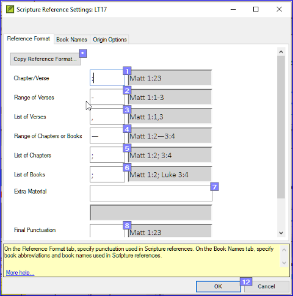

**Introduction**  
In this module you will learn how to run the remaining basic checks (references, quoted text, numbers, punctuation in pairs and quotations). As in the first two basic checks modules, it is easier to run the checks from the project plan. However, if you want to check more than one book then you need to run the checks from the checking menu.

**Where we are**  
You have typed your translation into Paratext. Make sure you have done the checks described in modules [BC1](../02-Stage-1/5.BC1.md) and [BC2](../03-Stage-2/12.BC2.md) before continuing. And that either your administrator has done the setup for the checks or is available to do the setup with you.

**Why this is important**  
Paratext has eleven basic checks. You have already seen the first six checks. This last set of checks helps you find errors related to material referred from other books. You want to be sure the references are accurate so that the reader can find those passages.

**What you are going to do**  
As before, most of the checks require some setup to be done by your administrator. In this module you will:

-   Confirm that the setup has been done
-   Run the basic check
-   Correct any errors.

### 19.1 Unmatched pairs of Punctuation
:::tip
This check looks at punctuation that occurs in pairs (opening and closing) and lists errors where it is not matched by the other half of the pair. This may be deliberate but is more likely to be an error, e.g. ( ), [ ], etc."
:::

**Setup – inventory**  
-   **≡ Tab**, under **Tools** \> **Checking Inventories** \> **Unmatched pairs of punctuation**:  
    *If the list is empty, then there are no errors.*
-   If necessary, click **Options...** to add other pairs.
-   Click **OK**.

**Run the check**  
-   **≡ Tab**, under **Tools** \> **Run Basic Checks**
-   Check “**Unmatched pairs of punctuation**”
-   Click **OK**  
    *A list of errors is displayed.*
-   Make any corrections as needed.

### 19.2 References
:::tip
Before you can run the references check, your Administrator must define various settings.
:::
-   **≡ Tab**, under **Project** \> **Scripture reference settings**

    

-   For each setting, type the punctuation in the box  
    *The sample will be updated on the right.*
-   Click the **Book names** tab

    

-   Fill-in the three columns [1] with abbreviation, short name and long name.
-   Choose **Abbreviations** [2] and [3] for both cross-references and references
-   Click **OK**
-   **≡ Tab**, under **Tools** \> **Run Basic Checks**
-   Click « **References »**
-   Click **OK**
-   Correct any errors.

:::tip
Paratext will inform you if there are any inconsistencies between these book name settings and the \\toc lines and will allow you to check conflicts.
:::
### 19.3 Numbers check
:::tip
Before you can run the references check, your Administrator must define various number settings.
:::
-   **≡ Tab,** under **Project settings** \> **Number settings**
-   Fill in the dialog box.

    

-   Click **OK**
-   **≡ Tab**, under **Tools** \> **Run basic checks**
-   Click « **Numbers**
-   Click **OK**

### 19.4 Quotation rules
The quotations check is used to ensure you have been consistent in marking the direct speech correctly.
:::tip
Before you can run the quotation check, your Administrator must define the rules for your quotations.
:::
-   **≡ Tab**, under **Project settings** \> **Quotation rules**
-   Fill-in the quotation marks used for each level [1] [2] [3]
-   **Check Flag all quotes near other errors [8]**
-   Click **OK**.

### 19.5 Quotation check
-   **≡ Tab**, under **Tools** \> **Run basic checks**
-   **Quotations**
-   Click **OK**.  
    *A list of errors is displayed. It shows possible errors but includes four correct quotations before and after the possible error.*
-   Double-click the first item which doesn’t start with ...
-   Correct as necessary.
-   Click **Rerun** button to confirm you have corrected the error.

### 19.6 Quoted text
:::tip
The Quoted text check looks at text in footnotes or cross-references which has been marked with \\qt \\qt\* markers. It checks that the quoted text matches the text in the verse.
:::
-   **≡ Tab**, under **Tools** \> **Run basic checks**
-   **Quoted text**
-   Click **OK**.  
    *A list of errors is displayed.*
-   Make corrections as needed.

:::tip
Note: The text has to be exactly the same as in the text. That is, even additional punctuation cannot be in the \\qt … \\\\qt\* markers.
:::

