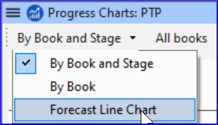

**Introduction**  
In this module you will create a progress report.

**Where we are**  
As you have been working on your translation, you have been updating your project plan with your progress on completed chapters and books. Now you will prepare a project a report.

**Why this is important**  
Your administrators and funders need accurate reports of your progress.

**What are you going to do?**  
-   Check that your project plan is up-to-date.
-   Produce several reports.

### 21.1 Check your plan

-   Open your project
-   Click on the Project plan icon
-   Update your progress as necessary.

### 21.2 Produce team progress chart

-   From the **Tab** menu, under **Project** choose **Progress chart**
-   Click on the dropdown list in the top left.

    

-   Choose as appropriate (e.g. Forecast Line Chart).  
    *A window appears with the graphic*

-   Click the print icon  
    *A window opens*

-   Click the **Print** icon  
    *The print dialog is displayed.*

-   Choose your printer (or PDF printer)
-   Click **OK**.
