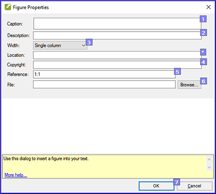

**Introduction**  
This module looks at the variety of tasks needed to finalize the text for publication.

**What you will do**  
-   Add **illustrations** and captions
-   Identify names for the maps
-   Draft Introduction to the NT/Bible
-   Check parallel passages
-   Verify all checks are complete
-   Proper Names final check
-   Numbers, money, weights and measures check
-   Formatting checks.

### 24.1 Choose illustrations and write captions
-   Go to the dropbox (https://www.dropbox.com/sh/cs0qspb52iwa2rj/AACr9xi7s2LVoheonn0OnjPla?dl=0)
-   Choose images (max 32 page), take note of the filenames.
-   Write captions for the images
-   Check the captions with the consultant

### 24.2 Add illustrations and captions**
-   Go to the verse where you want the illustration.
-   **Insert** \> **Figure**

    

-   Type in the **caption** for the image (in your language). [1]
-   Type in a description of the image (in the language of the typesetter) [2]
-   Choose the width (either single column or page) [3]
-   If applicable, type in a verse range as an acceptable location [\*] (optional)
-   Type in the copyright information [4]
-   Paratext will fill-in the reference (of the current verse). [5]
-   Click **Browse...** then find figure/illustration file. [6]
-   Click **OK**.

### 24.3 Map names
:::info
Teacher's Note: The Combined NT Maps Biblical Terms list is not a standard list in Paratext 9. It is available here: 
:::
<https://raw.githubusercontent.com/erros84/PTManuals/master/Resources/CombinedNTMapBiblicalTerms.xml> and, once downloaded, the file should be copied into "My Paratext 9 Projects"  

-   Click in your project.
-   **≡ Tab**, under **Tools** \> **Biblical Terms**
-   **≡ Tab**, under **Bibllical Terms** \> **Select Biblical Terms List**
-   Choose NT MapBiblicalTerms
-   Filter on a specific map number (e.g. [01])
-   Add renderings for all terms
-   **≡ Tab**, under **Biblical terms** \> **Export as HTML**
-   Type a name for the file
-   Click **Save**.

### 24.4 Draft Introduction to the NT/Bible
-   Change to the book INT
-   Make sure there is an \\h line
-   Type your introduction using the following markers:

    \\mt1  
    \\is  
    \\ip
    
-   Type in the overall introduction to the Bible/NT in the book **INT**

### 24.5 Check parallel passages
-   See module [PP Compare Parallel passages](23.PP.md)

### 24.6 Verify all checks are complete
**Current book**

-   Open the project plan.
-   Confirm that there are no issues on any of the checks.

**Several books**

-   Redo the inventories.
-   **≡ Tab** under **Tools** \> **Run basic checks.**
-   Make sure all checks are ticked.
-   Make sure all books to be published are chosen.
-   Click **OK**.
-   Correct any errors.

**Word list checks**

From the word list, do the following checks:

-   **≡ Tab**, under **Tools** \> **Spell check** \> **All checks**
-   **≡ Tab**, under **Tools** \> **Find Similar Words**
-   **≡ Tab**, under **Tools** \> **Find Incorrectly Joined or Split Words**

### 24.7 Proper Names final check
-   **≡ Tab**, under **Tools** \> **Biblical Terms**
-   **≡ Tab**, under **Biblical terms** \> **Select Biblical Terms list** and choose the **Major Biblical Terms** list
-   Filter on names with missing renderings
-   Check that all names have an rendering (add if necessary).

### 24.8 Numbers, money, weights and measures
-   Click in your project.
-   **≡ Tab**, under **Tools** \> **Biblical Terms**
-   **≡ Tab**, under **Biblical terms** \> **Select Biblical Terms list**
-   Choose the appropriate list.
-   Add renderings as usual.

### 24.9 Formatting checks
-   Redo the module FC: Formatting checks.
-   **≡ Tab**, under **Tools** \> **Checklists** \> **Long/short verses**
-   **≡ Tab**, under **Tools** \> **Checklists** \> **Word or phrase**
-   **≡ Tab**, under **Tools** \> **Checklists** \> **Section headings**
-   **≡ Tab**, under **Tools** \> **Checklists** \> **Book titles**
-   **≡ Tab**, under **Tools** \> **Checklists** \> **References**

**≡ Tab**, under **Tools** \> **Checklists \> Footnotes**
