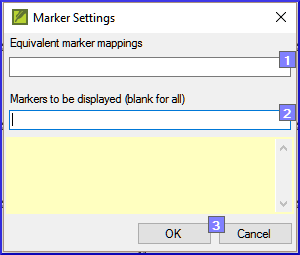

**Introduction**

In this module, you will find and correct formatting and layout errors.

**Where we are**

You have typed your draft into a project in Paratext. You will use the checklists to find and correct errors related to the formatting and layout errors.

**Why this is important**

A New Testament contains more than just chapters and verses. There are also titles, section headings, and several types of paragraphs. These checks allow you to be sure that the layout of your text is correct, and your titles etc. are consistent.

**What are you going to do?**

You will use the checklists to

-   compare your titles and section headings
-   check your paragraph breaks
-   compare the paragraph markers in your text with those of your reference text
-   add markers for special text formatting.

### 13.1 Using the checklists – generic

There are a number of checklists which differ slightly but they have the following in common:

**How to display the checklist**

-   **≡ Tab**, under \> **Tools** \> **Checklists** \> choose the desired list
-   Add a comparative text (if desired) by clicking on the Texts button. **Comparative text** button
-   Select the verses/books (as necessary) using the **Select range**

**Making corrections**

-   Click the Edit link to correct any errors
-   Click on the reference link to see more context

**Close the list**

-   When you have finished with the list, close it by clicking the X at the top right corner of the window.

### 13.2 Using checklist – Section headings

-   **≡ Tab**, under \> **Tools** \> **Checklists** \> **Markers**

Check that

-   the headings are consistent with your reference text (length, grammar, style))
-   all headings start with a capital
-   there is not punctuation at the end
-   they are not too long

### 13.3 Paragraph breaks

-   **≡ Tab**, under \> **Tools** \< **Checklists** \> **Markers**
-   Choose your reference text as the **comparative text**
-   Click **Settings**

    

-   Type the paragraph makers to be displayed

    (e.g. p m)

-   Click **OK**
-   Make any corrections by clicking on the blue Edit link.

OR

-   Click on the blue verse reference link.
-   Make any corrections in Paratext.
-   Return to the checklist by clicking on the icon on the taskbar.

### 13.4 Layout and indents

-   **≡ Tab**, under **Tools** \> **Checklists** \> **Markers**
-   Choose your reference text as a comparative text.
-   Click **Settings**

    

-   Type in the markers to check.
-   Click **OK**.
-   Look for passages that have been formatted with different markers such as q1 and q2
-   Make any necessary changes (see below).

### 13.5 Add USFMs to format special text

-   See the list of passages with special formatting Appendix A.
-   Add the USFM as necessary (see module KD or help if necessary).
