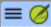

**Introducción**  
A medida que trabaje con su texto en Paratext 9 querrá ver una variedad de recursos. En este módulo aprenderá a abrir recursos y a organizar su escritorio.

**Antes de empezar**  
Se dispone a escribir texto en un proyecto existente. Antes de poder hacerlo, alguien debe haber instalado ya el programa, creado un proyecto para sus datos e instalado recursos para usted.

**Por qué es importante**  
El traductor que organiza bien su escritorio dispone de todos los recursos necesarios para su trabajo.

**¿Qué va a hacer?**  
Iniciará el programa Paratext 9 y abrirá un diseño (combinación de texto) previamente guardado. Si es necesario, abrirá otros recursos, cambiará la disposición de las ventanas y volverá a guardar la disposición del texto.

:::info Videos

There are a number of videos available to help you with the different types of resources and arranging the windows. Más abajo se ofrecen algunas sugerencias. Haga clic en el enlace para ver el vídeo resumen.  
[0.2.1c](../../Video-summaries/01-Introduction/0.2.Navigation/0.2.1c.md) Cómo encontrar los elementos del menú  
[0.2.1d](../../Video-summaries/01-Introduction/0.2.Navigation/0.2.1d.md) Cómo organizar las ventanas  
[0.2.2a](../../Video-summaries/01-Introduction/0.2.Navigation/0.2.2a.md) Cómo abrir y modificar una colección de textos  
[0.2.3a](../../Video-summaries/01-Introduction/0.2.Navigation/0.2.3a.md) Cómo controlar las ventanas que se desplazan juntas  
[0.2.3c](../../Video-summaries/01-Introduction/0.2.Navigation/0.2.3c.md) Cómo intercambiar un texto en una ventana  
[0.2.3d](../../Video-summaries/01-Introduction/0.2.Navigation/0.2.3d.md) Más consejos para organizar las ventanas  
:::

**Cambios en Paratext 9**  
Los menús han cambiado en Paratext 9.0. Para ver el menú, ahora tiene que hacer clic en el icono de menú ≡. Ahora hay dos tipos de menús. El menú principal de Paratext se encuentra en la barra de título () y cada ventana (o pestaña) tiene su propio menú (). Al hacer clic en uno de estos iconos de menú, aparecen todos las herramientas y solo tiene que hacer clic sobre la que necesite.

:::tip

In this manual, when it says **≡ Paratext**, under **Menu** \> **Command** (e.g. **≡ Paratext**, under **Paratext** \> **Open**). Significa hacer clic en el icono de menú Paratext ≡ y, a continuación, en el menú (por ejemplo, Paratext), elegir el comando (por ejemplo, Abrir).

Y cuando dice **≡ Pestaña**, bajo **Menú** \> **Comando** significa que haga clic en el icono del menú de la pestaña, luego bajo el menú (por ejemplo, Herramientas) haga clic en el comando (por ejemplo, Lista de palabras). At other times it may just say **≡ project menu**.
:::

## 2.1 Cargar el programa

1. Haga doble clic en el icono Paratext 9 del escritorio ****  
   
   - **O**
2. (En el menú **Inicio**, seleccione Paratext 9)

## 2.2 Abrir un diseño guardado

1. Haga clic en el menú de **≡ Paratext** y, a continuación, observe la columna **Diseño**
2. Elija un diseño guardado (combinación de texto).
   - *Su pantalla debería parecerse a la imagen de abajo (si no, mire más abajo).* 

## 2.3 Crear un nuevo diseño de texto

Si aún no ha guardado un diseño, le recomendamos que haga lo siguiente:

**Abrir y ordenar las ventanas**

- Abra 5 ventanas de la siguiente manera:
- 1 = Colección de textos
  - **≡ Paratext** menu, under **Paratext** choose **Open Text Collection**, select several resources, click **Right arrow** button, click **OK**. Ver [2.5](/Training-Manual/02-Stage-1/2.OD.md#25))
- 2 = Your project
  - **≡ Paratext** menu under **Paratext** \> **Open**, ≡ Projects
- 5 = Traducciones de vocablos bíblicos
  - **≡ Menú de proyecto**, bajo **Herramientas \> Traducciones de vocablos bíblicos**
- 3 = Textos en los idiomas originales
  - **≡ Menú de Paratext**, bajo **Paratext** \> **Abrir \> Textos en los idiomas originales**
- 4 = Recursos aumentados
  - **≡ Menú de Paratext**, bajo **Paratext** \> **Abrir \> Recursos aumentados**
- Disponga las ventanas como desee. Véase el vídeo de Paratext [0.2.1b](../../Video-summaries/01-Introduction/0.2.Navigation/0.2.1b.md), [0.2.1c](../../Video-summaries/01-Introduction/0.2.Navigation/0.2.1c.md), y [0.2.1d](../../Video-summaries/01-Introduction/0.2.Navigation/0.2.1d.md).

:::note Upgrade

In Paratext 9.3 (and above) you can use the main Paratext menu to arrange windows by **rows** and **columns**.
:::

:::tip

Remember to save your layout!
:::

#### Guardar el diseño

Una vez que las ventanas están organizadas como se desea:

1. **≡ Paratext**, bajo **Diseño** \> **Guardar el diseño actual**
2. Type a new name
3. OR  to replace an existing layout,
   1. Click the dropdown list to the right 2, Choose the existing name of saved layout
3. Haga clic en **Aceptar**

## 2.4 Eliminar un diseño de texto

Si quiere borrar un diseño guardado,

1. **≡ Menú de Paratext**, bajo **Diseño**> **Eliminar diseño guardado**
2. Click the dropdown  to the right
3. Elija el nombre del diseño guardado.
4. Haga clic en **Eliminar**

## 2.5 Abrir recursos en una colección de textos {#25}

Con Paratext, es posible tener varios proyectos/recursos abiertos al mismo tiempo. Sin embargo, en lugar de tener demasiadas ventanas, es mejor tener varios textos en una sola ventana.

:::info Upgrade

In Paratext 9.3 the Text Collection can also be opened directly from the **≡ Paratext** menu
:::

#### Nuevo método - Abrir directamente desde el menú de Paratext

1. **≡ Menú de Paratext**, bajo **Paratext** \> **Abrir colección de textos**  
   
2. Seleccione varios recursos utilizando la tecla Ctrl mientras hace clic en el recurso.
3. Haga clic en el **botón de flecha derecha**.
   - *Los recursos aparecen en la columna Seleccionado*.
4. Repita la operación si es necesario.
5. Utilice las flechas arriba y abajo para reordenarlos según sea necesario.

Guardar la colección

1. Haga clic en el cuadro de texto de la esquina inferior izquierda.
2. Escriba un nombre para la colección que guardará y haga clic en el icono de guardar
3. Haga clic en **Aceptar**.
   - *La colección de textos se abre*.

#### Método anterior - diálogo de Abrir

1. **≡ Menú de Paratext**, bajo **Paratext** \> **Abrir** 
2. Haga clic en el botón Recursos (en la parte superior).
3. Seleccione varios recursos utilizando la tecla Ctrl mientras hace clic en el recurso.
4. Repita la operación si es necesario.
5. Haga clic en la lista desplegable **Abrir como**.
6. Elija **Panel de colección de textos**
7. Haga clic en **Aceptar**

  :::tip

It is suggested that resources be displayed in the order of more literal to less literal (to focus on the texts that are most faithful to the source texts). Para los recursos en inglés: ESV, RSV, NIV, NLT. Para los recursos españoles, se sugiere el siguiente orden: RVR95EE, NVI-S, DHHE94EE, NTV.
:::

There are several ways to change the order of texts in the collection. One way is to use the menu.

1. **≡ Menú de colección**, **Modificar colección de textos**  
   
2. Utilice los botones de flecha para cambiar el orden según sea necesario  
   
3. Realizar otros cambios
4. Haga clic en **Aceptar**

Another way is to right-click a text.

:::tip

You can also change the order by right-clicking on a text.
:::

Change the text in the second pane by clicking on the blue link of the abbreviation for the text. You can also use the view menu (**≡ Tab** under **View** menu, choose preview, unformatted or standard).
:::

#####

## 2.6 Abrir un recurso aumentado

1. **≡ Menú de Paratext**, bajo **Paratext** \> **Abrir** 
2. Haga clic en **Recursos aumentados**

:::tip

Enhanced resources also contain a dictionary, images, maps etc. Al abrir un recurso aumentado, también se abre una guía.
:::

## 2.7 Abrir un diccionario

:::tip

If you do not use an enhanced resource, you can open a source language dictionary with glosses in other languages.
:::

1. **≡ Menú de Paratext**, bajo **Paratext** \> **Abrir** 
2. Haga clic en **Diccionarios**
3. Elija “A Concise Greek-English Dictionary of the New Testament” O “Trilingual Hebrew-English Lexicon of the Old Testament”
4. Haga clic en **Aceptar**
5. **≡ Menú de colección, Ver** \> elegir un idioma (por ejemplo, **español**)

:::tip

It is useful to add dictionary windows to the autohide, (right-click on the tab name, choose move to autohide).
:::

Otros diccionarios (en inglés pero con fotos)

- "Plants and Trees in the Bible"
- "Animals in the Bible" (en español - Animales de la Biblia)

## 2.8 Trabajar con el texto en los idiomas originales

Puede abrir el texto en el idioma original con glosas en un idioma alternativo al inglés, por ejemplo, el español.

1. **≡ Menú de Paratext**, bajo **Paratext** \> **Abrir** 
2. Haga clic en **Textos en los idiomas originales**
3. Elige HEB/GRK
4. Haga clic en **Aceptar**

If you have downloaded the special gloss resource, you can load them

1. **≡ Tab** under **View** > **Additional glosses**
2. Choose the resource which has the glosses (e.g. GlossFR)
3. Click **OK**
