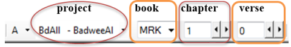

**Introducción**  
Este módulo explica cómo teclear sus borradores de traducción en un proyecto en Paratext 9.

**Antes de empezar**  
Estamos a punto de teclear texto en un proyecto existente. Antes de poder hacerlo, alguien debe haber instalado ya Paratext y creado un proyecto para sus datos.

**Por qué es importante**  
Esta es la primera etapa de la introducción de su traducción en el ordenador. Una vez tecleado el texto, puede realizar diversas verificaciones sobre el contenido y el formato del texto.

## 4.1 Ir a un versículo bíblico
:::tip

Before you can start typing your text, you need to move your cursor to the correct book, chapter and verse. Para ello se utiliza la barra de herramientas.
:::

-  Using the icons on the toolbar, change the project, book, chapter and verse as needed.  
   :::caution Upgrade

In Paratext 9.3 you can copy and paste a scripture reference into the book name on the navigation bar. Por ejemplo, en español: MAT 12.3; Mr 5:4; Gálatas 1:12.
:::

:::tip

If you don't know the verse reference, you could use the **Find** feature to look for a word. Ctrl+F.
:::

## 4.2 Comprobar que el proyecto es editable
1.  Mire la barra de título de su proyecto.  
   
    -  *La barra de título debe tener la palabra (Editable).*
1.  Si el libro no es editable y necesita editarlo, debe hablar con el administrador de su proyecto.
1.  If it is still not editable, try changing the view (see below).

## 4.3 Cambiar la vista
:::tip

Paratext 9 has five views. Todas las vistas, excepto la vista previa, son editables.
:::

1.  **Ctrl** + **E** -o-
1.  **≡ Menú de proyecto** bajo el menú **Ver**, elija la vista (normalmente Estándar).

## 4.4 Tecleando caracteres especiales
:::tip

Some orthographic characters are not found on the keyboard. To type these characters, you may need to press more than one key.
:::

1.  Cambie el sistema de teclado según sea necesario en su ordenador.
1.  If you are using Keyman then choose your keyboard (e.g. Tchad Unicode)
1.  Type the key(s) for the special character (see chart).

:::tip

You can use **≡ Tab** under **View** \> **Highlight Invalid Characters** to quickly see if you have typed any invalid characters. If you see lots of punctuation, then ask your instructor or administrator to configure your character inventory.
:::

## 4.5 Añadir texto en otro marcador - título o introducción
:::tip

Each piece of text needs to have a marker. Los marcadores para los capítulos y versículos ya están en su proyecto. Cuando desee añadir texto, como encabezamientos o introducciones, etc., deberá añadir también el marcador correspondiente, como se indica a continuación:
:::

1. Mueva el cursor hasta el final del párrafo anterior:
2. Pulse **Entrar**
3. Type the marker (e.g. s1 or ip) press **Enter** (or select it from the list).
4. Teclee el texto
5. Add a paragraph marker after the text.   
   (for example: \\ p)

:::caution

You must always have a USFM paragraph marker after a title and before the verse. This is usually \\ p (paragraph), but it can be different (for example \\ q1).
:::

:::tip Character markers

Paratext has both paragraph and character markers. As the name suggests, paragraph markers format the whole paragraph. Character markers let your format part of the paragraph and so need a beginning and ending marker.
:::

1. Select the text you want to apply the character style
2. Type ** \\ **
3. Select the marker from the list (e.g. nd)
4. Pulse **Entrar**
   - Paratext adds the two markers (before and after the text)  
     (for example: \\nd LORD*\nd)

## 4.6 Añadir saltos de párrafo

Dividir el texto en párrafos:

1.  Mueva el cursor hasta el punto en el que desee interrumpir el párrafo.
2.  Pulse **Entrar**
3.  Teclee p y, a continuación, **Entrar**.

## 4.7 Guardar el trabajo
:::tip

It is important to save your work regularly.
:::

-  **≡ Menú de Paratext** bajo **Paratext** \> **Guardar todo** –o- **Ctrl** + **S**

#####

## 4.8 Insertar notas a pie de página
:::tip

You can add footnotes in the text at the place where you want the reference to appear.
:::

1.  Mueva el cursor hasta el lugar donde desee insertar la nota a pie de página.
1.  **≡ Menú de proyecto**, bajo **Insertar** \> **Nota a pie de página**
     -  *Se añade un conjunto de marcadores de nota a pie de página en el recuadro situado debajo del texto*  
       
1.  Teclee el texto después del \\ft

:::tip

If you hover your mouse over the superscript letter the text of the footnote will be displayed in a tip box.
1.  Para cambiar **** la nota a pie de página, **haga clic en** la letra superíndice del texto.
1.  Para **eliminar** la nota a pie de página, puede **borrar** la letra superíndice.
- or right-click the footnote text and choose delete.
:::

## 4.9 Enviar/Recibir
:::tip

It is essential to have a second copy of your translation and to share your work with others in your team. Esto se hace haciendo un Enviar/Recibir como sigue:
:::

### Enviar/Recibir este proyecto en Internet
1. Asegúrese de que su ordenador está conectado a Internet.
1. **≡ Menú de proyecto**, bajo **Proyecto**, \> **Enviar/Recibir este proyecto**
   -  *Paratext realizará inmediatamente un Enviar/Recibir, es decir, sin ofrecer las diferentes opciones.*

#####

### Enviar/Recibir a Internet
1.  Asegúrese de que su ordenador está conectado a Internet.
1.  Si desea enviar/recibir otros proyectos, o cambiar la forma de enviar/recibir
1.  **≡ Menú de Paratext**, bajo **Proyecto**, \> **Enviar/Recibir proyectos**
1.  Elija **Servidor de Internet**
1.  Marque la casilla junto a los proyectos para Enviar/Recibir.
1.  Haga clic en **Enviar/Recibir**.
    -  *El ordenador hará una copia de sus archivos. Aparecerá un medidor de progreso. Sólo aparecerá un cuadro de mensaje si hay algún problema.*

### Enviar/Recibir a una memoria USB para hacer una copia de seguridad de sus datos
Es esencial tener una segunda copia de su traducción. Si no tiene acceso a Internet, puede utilizar una memoria USB. Para hacer una copia de seguridad de sus datos en una memoria USB, realiza un Enviar/Recibir de la siguiente manera:

1.  Inserta la memoria USB en el ordenador.
1.  **≡ Menú de Paratext**, bajo **Paratext** \> **Enviar/Recibir proyectos**  
   
1.  Elija **Unidad USB**.
1.  Marque la casilla junto a los proyectos para Enviar/Recibir.
1.  Haga clic en **Enviar/Recibir**.
     -  *El ordenador hará una copia de sus archivos. Aparecerá un medidor de progreso. Sólo aparecerá un cuadro de mensaje si hay algún problema.*

#####

### Enviar/Recibir de nuevo
:::tip

The next time you want to send/receive you can use the toolbar to send/receive using the same settings as the previous time. Esta opción no le permite elegir otro método ni otros proyectos.
:::

1.  Inserte la memoria USB en el ordenador o conéctese a Internet.
1.  Haga clic en el icono Enviar/Recibir 
    -  *Paratext hará inmediatamente un Enviar/Recibir.*

## 4.10 Mover el cursor con eficacia
Se pierde mucho tiempo desplazando el cursor hasta el lugar donde hay que añadir texto o hacer correcciones. Aquí tienes algunas teclas útiles para mover el cursor rápidamente.

-  Las teclas
    -  teclas de flecha **←** **↑** **→** **↓**
    -  **Inicio**, **Fin**, **PgUp**, y **PgDn**,
    -  **F8** (capítulo), **F9** (libro)
- Try holding **Ctrl** and any of those keys. Some may be quite different to what you expect.
    - Ctrl + Arrow Down = Next Verse (Ctrl + Arrow Up for previous verse)
    - F8 = Next Chapter (Ctrl + F8 for previous chapter)
    - F9 = Next Book (Ctrl + F9 for previous book)
    - Alt + Arrow Left/Right = previous/next reference in history
    - Alt + Arrow Up/Down = previous/next reference in a list
    - Ctrl + B = go to the navigation area of the toolbar.
## 4.11 Repasar:
Si la barra de título no dice Editable (o su nombre), debería intentar cambiar la \__________.

Para añadir un marcador diferente (como el encabezado de una sección) pulse \_______.

Para añadir un marcador de párrafo, teclee \________.

Para insertar una nota a pie de página, utilice el menú \______\_ y elija \______________.

Para hacer Enviar/Recibir, utiliza el menú \_______\_ y luego \________________.

:::info

[Answers: view, enter or \\, enter, Insert, Footnote, File, Send/receive]
:::