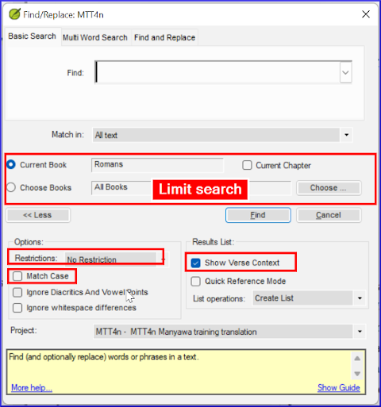

---
title: Find and Replace (5.2)
---

To search for a particular word in a project or resource,

1.  Open the **menu** for the window.
1.  Under **Edit**, click **Find**.  
    -  *The Find/Replace dialog box opens*.
1.  Type the word you want to look for, and click **Find**.  
    -  *Paratext displays the matches in a list window*.
1.  Double-click a reference in the list window  
    -  *The matched text is shown in context*.

### Other ways of opening the find dialog

**Find icon** in the toolbar, or  
**Ctrl-F** the keyboard shortcut.  
**Menu** \> **Edit** \> **Find**.
:::tip
It’s helpful if the window you want to search in is active first.
:::
### The Find dialog box
-  **Find** text box shows your previous search  
-  **Match in** 
   - All text - everywhere
   -  or Verse text  
-  Limit search to **current book** **current chapter** or choose a range of books using **Choose** button  
-  **More** button gives additional options.  
-  **Restrictions**
   -  **No restriction** means matches can be any part of a word or a whole word.
   -  **Whole word only**,
   -  at the **Beginning of the word** or
   -  at the **End of the word**   
- **Match Case**–match whether the characters are uppercase or lowercase.  
- **Show Verse Context** means the list shows the matching word or string, with some adjacent words in the verse as well.  
-  To hide the additional options, click **Less**.  
-  To carry out the search click **Find**.  
    -  *The list is updated to show the results*.
     

### Replace

There are three ways of opening the Replace tab

1.  From the Find/Replace dialog – click the **Replace** tab
1.  **Ctrl-H** the keyboard shortcut.
1.  **Menu** \> **Edit** \> **Replace**.
1.  Open the Find and Replace dialog.
1.  Change the text in the **Find** box if needed.
1.  Type the text you want to replace it with in the **Replace with** box.
1.  Click **Replace** button.  
    -  *Instead of showing you a list of matches, Paratext opens the Replace dialog and shows you one match at a time*.

### Replacing matches

-  **Yes** or **No** approve each change individually.
-  **Yes to all** will approve all the remaining proposed changes, so this needs to be **used with care**.  
    - *Make absolutely sure it is a change you want to make everywhere (e.g. review with Find first)*.
-  If you want to stop the process completely, click **Cancel**.  
   - *Please note, any changes you have already clicked Yes for will not be cancelled*.
   - *Paratext will inform you how many matches were not changed because you did not have the permission to edit them*.
:::note
Find and Replace Yes to all only makes changes in places you have permission to edit.
:::
