# **IP : Installation de Paratext 9**

***Introduction***

Dans ce module, vous installez Paratext 9. Paratext est le principal logiciel mondial pour le développement et la vérification de nouveaux textes de traduction de la Bible ou des révisions aux textes existants. Développé conjointement par ABU et SIL International, il permet une traduction cohérente et précise, basée sur des textes originaux et modélisés sur des versions dans les principales langues. En partie grâce à ses fonctionnalités de collaboration de pointe, Paratext contribue grandement à produire des traductions de meilleure qualité en moins de temps que les outils et les méthodes précédentes ont permis.

***Où en sommes-nous***

Vous avez peut-être déjà installé une version antérieure sur votre ordinateur et vous souhaitez installer à présent Paratext 9.

***Pourquoi cette aptitude est-elle importante ?***

Paratext 7, Paratext 8 et Paratext 9 peuvent être installées en même temps, mais il faut comprendre la limitation de leur utilisation ensemble.

- Plusieurs versions peuvent être installées
- Certains utilisent différents dossiers
- My Paratext Projects Paratext 7)
- My Paratext 8 Projects (Paratext 9 and 8)
- Paratext 7 utilisait un serveur différent (qui est maintenant fermé). Paratext 8 et 9 utilisent les mêmes serveurs de données.

***Qu’est-ce qu'on va faire ?***

Vous allez installer Paratext 9 (sans désinstaller Paratext 7 ou 8). Vous allez également faire une mise à jour à partir d’un fichier MSP.

**1.1 Introduction**

**1.2 Installer Paratext 9**

<aside>
💡 Il n'est pas nécessaire de désinstaller une version antérieure de Paratext. Mais il faut désinstaller une version BETA antérieure de Paratext 9.

</aside>

- Double-cliquez sur le fichier d’installation

  - (disponible à https://paratext.org/download https://paratext.org/files/releases/9.1/
  - 
  - 
  - Paratext_9.1.104.1_InstallerOffline.exe).
  - 
- Cochez « I agree to the licence terms » (j’accepte les termes de la licence)
- Cliquez sur **Install**(Installer).

  - Cette étape peut prendre quelques minutes si le programme d’installation doit installer .NET 4.8 Framework sur votre ordinateur.
  - 
- Si une boîte de dialogue apparaît et demande votre permission, cliquez sur **Oui/Yes** ou fournissez les informations d’identification nécessaires.

  - Un message de bienvenue s’affiche.
  - 
- Cliquez sur **Next** (Suivant)

  - L’étape « Dossier de destination » s’affiche
  - 
- Acceptez les valeurs par défaut du dossier.

  - N.B. Les projets de Paratext 8 et 9 ne peuvent pas partager le même dossier que les projets de Paratext 7.
  - 
- Cliquez sur **Next (suivant)**, puis **Install**
- Cliquez sur **Finish** et puis **Close (Fermer)**.
- La première fois que vous lancez Paratext 9, vous devrez entrer votre code d’inscription de Paratext. Des informations sur la façon d’obtenir ce code figurent sur la page d’inscription (registration).

**1.3 Inscription d’un utilisateur de Paratext 7 (à la première exécution de Paratext)**

  - Tous les utilisateurs ont besoin d’une nouvelle inscription pour Paratext 9.
  - 
- Exécuter Paratext 9 (pour la première fois)
- Choisissez la langue de l’interface

  - Une boîte de dialogue s’affiche pour demander votre code d’enregistrement.
  - 
- Dans votre navigateur web, Accédez à [https://registry.paratext.org](https://registry.paratext.org/)

  - La page “Sign in”(se connecter) s’affiche.
  - 
- Tapez votre adresse émail (du Gmail)
- Cliquez sur le lien **Register**/**Inscription**
- Tapez le nom d’utilisateur
- Saisissez (ou copiez) le code d’inscription Paratext 7 de l’utilisateur
- Copier le nouveau code de Paratext 9
- Retournez à Paratext
- Paratext va coller le code
- Cliquez sur **OK**.

**1.4 Mise à jour manuelle de votre version existante de Paratext**

  - Les fichiers de mise à jour ont une extension .msp au lieu de .pud ou .spud comme dans le passé.
  - 
- Vérifiez que Paratext est fermé.
- Double-cliquez sur le fichier **msp** pour installer la mise à jour.

**2**

# **MD : Migration des données**

**2.1 Introduction**

La migration est le processus de déplacement d’un projet (y compris tous les fichiers de paramètres) de Paratext 7 vers Paratext 9. Paratext 9 ne dispose pas d'une fonction de migration. Mais il est toujours possible de le faire en utilisant Paratext 8. N.B. : Paratext 9 peut lire les projets Paratext 8.

***Avant de commencer***

Vous avez déjà installé Paratext 8 et vous avez un projet Paratext 7 que vous souhaitez utiliser dans Paratext 9.

***Pourquoi est-ce important ?***

Pour que toutes les fonctionnalités de Paratext 9 soient opérationnelles, il faut que votre projet Paratext 7 soit migré. Paratext 7 et Paratext 9 utilisent des serveurs différents pour faire envoyer/recevoir, alors il n'y aura aucun moyen de partager un projet avec les utilisateurs de Paratext 7 et Paratext 8 (ou 9) en même temps. De ce fait, l’ancien serveur sera éliminé à la fin de décembre 2018. Par conséquent, Il est donc important de faire migrer les projets rapidement.

Les utilisateurs peuvent avoir Paratext 7 et Paratext 8 (et 9) installés en même temps, et utiliser l'un ou l'autre, mais aucun projet ne peut être partagé entre eux.

Dès que vous avez fait migrer le projet, tout le monde doit recevoir le projet migré, et ne travaille qu'à partir de Paratext 8 (ou 9).

Pour faire migrer un projet, il faut avoir une bonne connexion Internet. Si vous travaillez habituellement sans une connexion Internet, vous pouvez continuer sans connexion dès que le projet aura été migré.

***Qu’est-ce que tu vas faire ?***

Vous allez

- faire migrer un projet partagé:
- faire migrer un projet non partagé:

**2.2 Faire migrer un projet partagé de Paratext 7**

Si vous administrez un projet existant dans Paratext 7 et que vous souhaitez le faire migrer vers Paratext 8 (ou 9), voici comment vous devez procéder.

**2.2.1 Préparer un projet Paratext 7 pour la migration**

  - Tous vos utilisateurs doivent faire la mise à jour en même temps.
  - 
- Tous les utilisateurs doivent envoyer / recevoir dans **Paratext 7** (et alors, cessez de travailler dans Paratext 7).
- L'administrateur confirme que le texte est en bon état.
- L'administrateur lance **Paratext 8.**
- **Fichier**   - **Ouvrir projet/ressource**
- Cliquez sur la case en bas pour afficher les projets Paratext 7

  - 
  - 
- Choisissez le projet à faire migrer.

  - Il sera probablement marqué comme "v7, non-inscrit."
  - 
  - 
  - Il se peut que le projet soit marqué comme "v7" sans être décrit comme non-inscrit, car un certain nombre de projets Paratext 7 ont été préinscrits sur Paratext 8. Si le vôtre est l'un de ceux-ci, vous devriez continuer la migration, mais vous pouvez sauter l'enregistrement.
  - 
- Cliquez sur **OK** pour lancer la migration du projet.

  - La boîte de dialogue Faire migrer un projet partagé s'affiche.
  - 
  - 
  - 
  - 
  - *Paratext 8 peut vous dire que le projet doit être inscrit (s'il n'est pas préenregistré) et qu'il doit être migré vers Paratext 8.*
  - 

**2.2.2 Inscrire un projet (avant de faire migrer le projet)**

- Cliquez sur le bouton **Register Online** (Inscription en ligne)
- Remplissez le formulaire web. (Les champs marqués d'un astérisque sont obligatoires.)
- Short name (Nom abrégé) : Le nom abrégé du projet ne sera plus modifiable après ce processus.
- Full name (Nom complet) : Vous pouvez modifier le nom complet du projet.
- Paratext 8 nécessite un identifiant de langue pour votre langue. Utilisez la **Search (recherche)** dans le nom de la langue pour trouver le code Ethnologue de votre langue.
- **Scope (L’étendue)** Est-ce que le projet sera une Bible complète ou une Bible complète comprenant les deutérocanoniques, le Nouveau Testament ou tout autre groupe de livres.
- Le **type de traduction** désigne si le projet est la première traduction pour cette langue, une révision d'une traduction existante, une nouvelle traduction ou une traduction comprenant des notes d'étude, comme une bible d'étude.
- **Country** : Indiquez le pays où la langue est parlée. Vous pouvez taper quelques lettres du nom puis choisir le pays désiré. Vous pouvez spécifier plus d’un pays si la langue se propage au-delà des frontières
- **Rights holder** : Le détenteur des droits serait l'organisation dont vous attendez le droit d'auteur pour une édition imprimée. Cela peut également être modifié plus tard.
- Les quatre derniers champs vous permettent d'ajouter d'autres informations si elles sont pertinentes pour décrire votre projet. (Aucune de ces options n'est requise.)
- Vous pouvez indiquer si votre projet est confidentiel ou non. Seuls les utilisateurs enregistrés de Paratext 8 peuvent afficher le nom des projets standard, un projet confidentiel sera masqué même devant les autres utilisateurs de Paratext 8.
- Une autre option consiste à marquer un projet comme un projet de test ou de formation. Vous pouvez utiliser cette option pour les projets de test que vous créez ou pour les projets que vous utilisez pour la pratique dans un cours de formation.
- Confirmez que vous acceptez de suivre les directives FOBAI dans votre projet de traduction et vous acceptez de stocker une copie de sauvegarde de votre projet dans la Bibliothèque Biblique Numérique.

  - La "Digital Bible Library" (Bibliothèque Biblique Numérique) est un outil pour rendre les traductions disponibles en ligne ou pour les utilisateurs mobiles, mais votre projet ne sera disponible à personne jusqu'à ce que vous acceptiez de le rendre disponible.
  - 
- Cliquez sur **Submit Registration** (Soumettre un enregistrement)

  - Un message s’affiche « Projet enregistré avec succès. »
  - 
  - 
  - 
  - 
- Retournez à Paratext

  - Il devrait détecter que le projet est maintenant enregistré et vous en informer.
  - 
  - 
  - 
>

**2.2.3 Migration d'un projet inscrit**

  - Si vous venez d’inscrire votre projet, votre projet est déjà ouvert et vous pouvez continuer avec la migration. Sinon ouvrir le projet à faire migrer.
  - 
- L'étape de migration comporte plusieurs cases que vous devez cocher pour vérifier que vous comprenez ce qui est impliqué.

  - 
  - 
- Je suis le membre de l’équipe qui a été sélectionné pour faire ce processus pour toute l’équipe.
- Notre équipe comprend que le projet PT8 sera la copie officielle du projet
- Tous les membres de l’équipe ont cessé de modifier la copie de PT7 du projet.
- Tous les membres de l'équipe ont effectué un Envoyer/Recevoir final de leurs modifications dans PT7.
- Cet ordinateur a reçu les changements dans PT7.
- Cochez ces cases si elles sont vraies, puis cliquez sur **Migrate Now** (Faire migrer maintenant) pour continuer.

  - Si vous avez besoin de faire autre chose avant d'être prêt à migrer, cliquez sur Migrate later (Faire migrer plus tard), puis terminez vos préparatifs.
  - 
- Lorsque vous cliquez sur **Faire migrer maintenant**, Paratext copiera le projet de votre Paratext 7 dans votre Paratext 8 et effectuera également un envoyer/recevoir à Internet.
- Si vous recevez un avertissement au sujet d'un envoyer/recevoir final dans **Paratext 7**,
- Cliquez sur **OK**,

  - le processus de migration arrete,
  - 
- Marquez un point de repère dans l'historique du projet dans **Paratext 7,**
- puis **redémarrez la migration**dans Paratext **8**.
- Maintenant, vos collègues peuvent aller à **Paratext 9** et faire un **envoyer / recevoir** pour recevoir le projet migré.

  - Si ils ne disposent pas d'une connexion Internet, vous pouvez faire un envoyer / recevoir vers USB ou un dossier réseau, et ils peuvent recevoir le projet dans Paratext 9 de cette façon.
  - 

**2.3 Paramètres supplémentaires du projet**

- **Identificateur de langue :** Après avoir cliqué sur **Faire migrer maintenant**, il se peut que Paratext 8 vous dise qu'il faut spécifier un identificateur de langue pour votre projet.

  - Vous pouvez vérifier le nom de la langue et l'identificateur de langue de votre projet en allant dans ≡ Onglet, sous Projet   - Paramètres du projet   - Paramètres du langue. L'identifiant de la langue se trouve soit entre parenthèses après le nom de la langue ou en dessous du nom.
  - 
- **Livres** : Les paramètres du projet et propriétés du projet comportent un onglet **Livres**, vous spécifiez ici les livres que vous prévoyez d'avoir dans votre projet.

  - 
  - 
  - 
  - Vous pouvez choisir des livres individuels, l'un après l'autre, ou spécifier l'Ancien Testament, le Nouveau Testament ou les livres deutérocanoniques en utilisant les boutons. Vous pouvez modifier cette liste de livres plus tard dans le projet si vos attentes pour le projet changent.
  - 
  - N.B. Après avoir fait migrer votre projet, il faut également faire migrer la retraduction, et tous les projets de traduction-filles l’un après l’autre.
  - 

**2.4 Migrer un projet non partagé**

  - Si un projet n’a pas été partagé en Paratext 7, vous n’avez pas besoin de l’inscrire avant de le faire migrer, mais c’est fortement recommandé.
  - 
- Lancez Paratext 8
- **Fichier   - Ouvrir projet/ressource**
- Cliquez sur **Show Paratext 7 projects (Afficher les projets Paratext 7)**
- Choisissez le projet à faire migrer.
- Cliquez sur **Migrate now** (faire migrer maintenant)
  - Lorsque vous cliquez sur **Migrate Now** le projet sera migré vers le dossier Paratext 8 prêt à être utilisé. Le statut d’enregistrement déterminera les fonctionnalités qui sont disponibles pour le projet.
  - 
  - N.B. Les projets non partagés n’ont pas besoin d’être inscrits, mais il est conseillé.
  - 
  - Rappelez-vous que personne ne devra plus modifier le projet dans Paratext 7. Ce serait un effort gaspillé, car personne d'autre ne verra jamais leurs changements. Pour aider les membres de votre équipe à se souvenir de cela, vous pourriez supprimer le projet de leur Paratext 7 une fois qu'ils l'ont obtenu en Paratext 8. Autrement, ils peuvent désinstaller Paratext 7 de leur ordinateur s'ils n'en ont pas besoin pour d'autres projets.
  - 

**3**

# **INS : Inscription**

**3.1 Introduction**

Désormais, c’est-à-dire à partir de Paratext 8, il est obligatoire que les projets partagent leurs informations de base ou métadonnées avec la communauté de traduction. Il est fortement encouragé à partager les informations sur les progrès réalisés. [Certaines organisations et/ou certains bailleurs de fonds peuvent l’exiger.]

***Où en sommes-nous***

Paratext 8 est déjà installé et vous avez les codes d’inscription Paratext 7 pour les utilisateurs.

***Pourquoi cette aptitude est-elle importante ?***

Dans Paratext 8, l’on doit inscrire aussi bien les utilisateurs que les projets. L’accès à des ressources textuelles spécifiques, telles que la Parole de Vie, est déterminé par l'organisation dont vous faites partie.

Les projets peuvent être inscrits par l'administrateur (ou un conseiller servant d'administrateur).

D’autres organisations / utilisateurs sont avisées de vos actions et pourraient s’opposer à BoG (Board of Governors). Des informations de base sur les métadonnées du projet sont accessibles à tous les membres de la communauté de Paratext.

Si votre projet n’est pas inscrit, vous n’aurez pas accès à

- la générateur d’interlinéaire.
- envoyer / recevoir par Internet.
- outils de glose statistique (proposer des traductions/équivalents).
- imprimer l’ébauche.

***Qu’est-ce que vous allez faire ?***

- Vous allez inscrire un utilisateur Paratext 9
- Vous allez inscrire un nouveau projet Paratext 9
- Vous verrez les informations qu’un projet inscrit affiche dans le Registre Paratext

**3.2 S'inscrire avec un compte Google**

- Accédez à [https://registry.paratext.org](https://registry.paratext.org/)

  - L'écran "Connexion" s'affiche.

- Tapez votre adresse émail

  - (Votre adresse sera vérifiée)
 
- Connectez-vous à l’aide de votre adresse email (Gmail)

  - Un nouvel écran s'affiche pour demander votre mot de passe.
  - 
- Tapez votre mot de passe Google
- Cliquez sur **Yes** (Oui) pour autoriser Paratext à utiliser votre profile.

  - New Paratext 9 User s’affiche et vous pouvez remplir le formulaire.
  - Si vous n’avez pas d’adresse Gmail, voir section [3.4](about:blank#sNonGoogle)

**3.3 Remplir le formulaire**

- Choisissez l’un des trois choix d’utilisateur (nouveau, déjà Paratext 7, déjà Paratext 8)
- Si vous êtes un utilisateur de Paratext 7, fournissez votre code d’enregistrement Paratext 7
- Choisissez votre organisation (ou laissez le champ vide)

  - Toute personne peut s'inscrire pour utiliser Paratext, mais les personnes qui ne sont pas membres d'un organisme de traduction et qui ne sont pas membres d'un projet enregistré ne pourront utiliser toutes les fonctionnalités de Paratext et ne pourront accéder qu'à quelques ressources.
  - 
- Choisissez votre **pays**
- Entrez, si pertinent, votre filiale (entité sur le terrain) et votre superviseur
- Expliquez la raison pourquoi vous voulez utiliser Paratext.
- Cochez (ou pas) la case pour recevoir les annonces.
- Cliquez sur **Register** (S’inscrire)
  - Vous recevrez votre code d’inscription (et également par émail).
  - 
  - 
  - Gardez bien cet email, ou le code qui est affiché ici, parce que si vous le perdez, il n'y a aucun moyen de le chercher encore. (Il s'agit d'une fonctionnalité de sécurité, les codes d’utilisateur ne sont pas stockés sur le serveur pour qu'ils ne puissent pas être volés si quelqu'un attaque le serveur.)
  - 

**3.4 S'inscrire sans un compte Google**

- Si votre compte email ne se trouve pas sur un serveur Google, ou si vous choisissez de ne pas utiliser Google pour l'authentification, le serveur de registre vous demandera d'entrer un mot de passe.
- Entrez le mot de passe que vous souhaitez configurer
- Entrez le mot de passe à nouveau comme confirmation
  - Le serveur enverra un courrier électronique à votre compte avec un lien de vérification.
  - 
- Ouvrez votre courrier électronique, accédez au lien et procédez à l'enregistrement de Paratext (voir [3.3](about:blank#sFillReg)).

**3.5 Changer (générer) un code nouveau**

  - Il existe diverses raisons pour lesquelles vous devrez changer votre code Paratext dans le futur. L'une des raisons les plus courantes est le vol ou la panne de votre ordinateur.
  - 

**3.5.1 Changer votre propre code**

- Accédez au site d'inscription [https://registry.paratext.org](https://registry.paratext.org/) .
- Se connecter (si vous n'êtes pas connecté)
- Cliquez sur le nom d'utilisateur en haut à gauche.

  - Un menu s'affiche.
  - 
  - 
  - 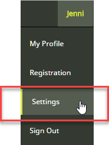
  - 
- Cliquez sur **Settings** (paramètres).

  - 
  - 
- Sous Paratext, cliquez sur ‘**Registration**”.

  - L'écran des détails d'enregistrement s'affiche
  - 
- Cliquez sur le bouton **Generate** pour générer un nouveau code.

  - 
  - 
- *Le code sera envoyé à votre adresse email.*
- Lancer Paratext

  - S'il se connecte à Internet, il détecte que l'ancien code n'est plus valide et il vous demandera de mettre à jour vos informations d'inscription.
  - 
- Allez à votre courrier électronique et copiez le nouveau code.
- Retournez à Paratext

  - Il est possible que Paratext ait déjà trouvé votre nouveau code.
  - 
- Si ce n'est pas le cas, collez le nouveau code dans le formulaire d'inscription et cliquez sur **OK**.

  - Vous êtes réinscrit.
  - 
  - 
  - Vous devrez le faire sur n'importe quel autre ordinateur sur lequel votre code de Paratext est installé.
  - 
- Si Paratext ne signale pas un changement de code, vous pouvez le faire de la façon suivante
- **≡ Onglet**, sous   - **Aide**   - **Informations d'inscription** et collez-y le code.

**3.5.2 Changer un code pour un utilisateur (que vous avez inscrit)**

- Accédez au site d'inscription [https://registry.paratext.org](https://registry.paratext.org/)
- Se connecter (si vous n'êtes pas connecté)
- Cliquez sur User
- Cliquez sur le nom d'utilisateur de la liste
- Cliquez sur la flèche bas (à droite de View)
- Choisissez **Generate code**

  - 
  - 
  - 
  - Un message s'affiche.
  - 
  - 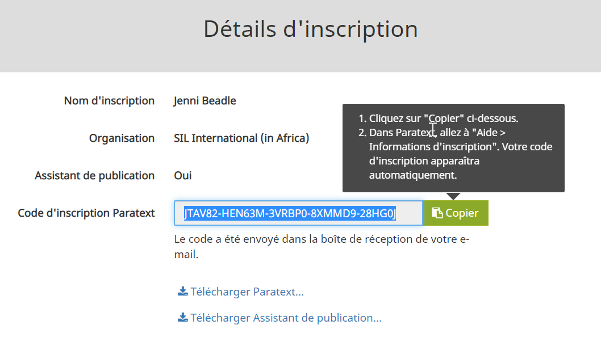
  - 
- Cliquez sur **Proceed**
- Regardez votre email.

**3.6 Inscrire un Utilisateur (sans adresse courriel)**

  - Tout administrateur d'un projet inscrit peut créer de nouveaux inscriptions d'utilisateurs s'ils doivent ajouter des personnes à leur projet. Ces utilisateurs n'ont pas besoin d'avoir une adresse email.
  - 
- Accédez à [https://registry.paratext.org](https://registry.paratext.org/)
- Connectez-vous à l’aide de votre adresse email
- Cliquez sur **Users**

  - 
  - 
- Cliquez sur **+Register New User**

  - Le dialogue New Paratext 9 User s’affiche.
  - 

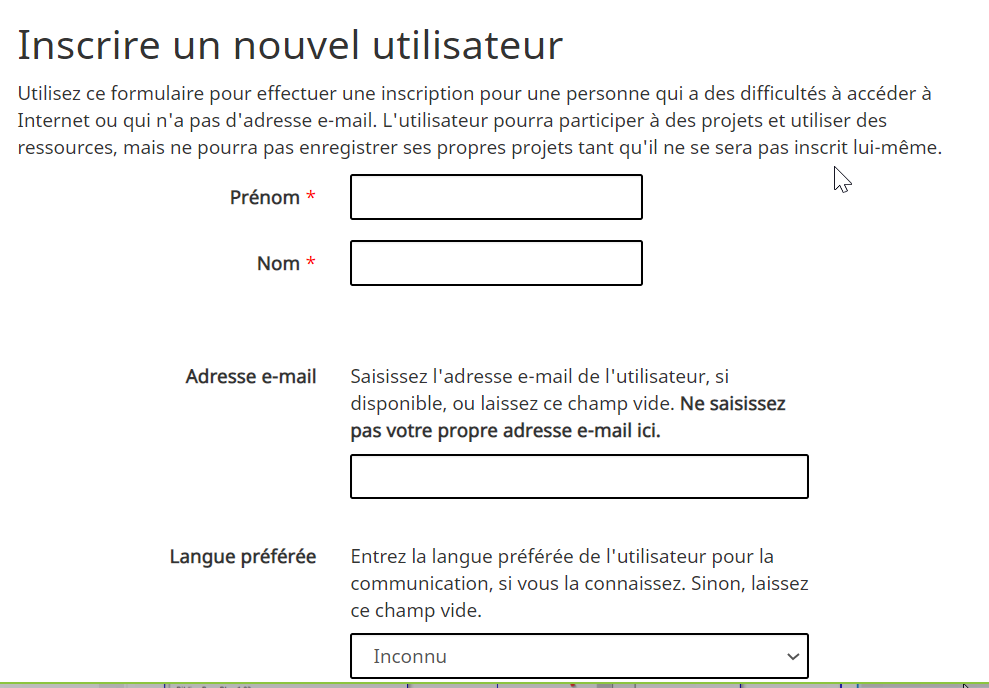

- Remplissez le formulaire avec leur nom, etc.

  - Un utilisateur ajouté par quelqu'un d'autre ne peut pas être un administrateur d'un projet ni un conseiller. Si vous souhaitez faire de quelqu'un un conseiller ou un administrateur, doivent s'inscrire pour Paratext eux-mêmes, puis vous pouvez ajouter leur nom au projet.
  - 
- Cliquez sur **Create** (Créer)

  - Le code d’inscription pour le nouvel utilisateur sera envoyé par courrier électronique à l'administrateur après avoir été approuvé.
  - 
  - 
  - Gardez bien ce code, car il ne peut pas être récupéré si vous le perdez. Pourtant vous pouvez générer un nouveau code, voir [3.5](about:blank#sChangeCode)
  - 

**3.7 Si le projet de traduction ne fait pas partie d’une organisation reconnue**

- Si un traducteur ne fait pas partie d'un organisme reconnu, on pourra faire une demande à BoG ([boardofgovernors@paratext.org](mailto:boardofgovernors@paratext.org)) pour devenir membre de la pseudo-organisation « Independent Translators ».

  - Il se peut que seulement peu de propriétaires de textes ressources accordent l’accès à ce groupe.
  - 

**4**

# **CP : Créer un nouveau projet**

**4.1 Introduction**

Dans ce module, vous allez créer et inscrire un nouveau projet.

***Avant de commencer***

Vous avez déjà installé Paratext 9 et inscrit un utilisateur.

***Pourquoi cette aptitude est-elle importante ?***

Un aspect nouveau dans Paratext 8 et 9 est que les projets et les utilisateurs doivent être inscrits. Cela peut sembler une complication, mais il offre des avantages aux utilisateurs.

Comme nous avons vu dans la section d'inscription des utilisateurs, l'administrateur d'un projet peut créer des inscriptions pour les utilisateurs dont ils souhaitent faire participer à son projet.

***Qu’est-ce qu'on va faire ?***

On va créer et inscrire un nouveau projet.

**4.2 Créer un nouveau projet**

- **≡ Paratext**, sous **Paratext**   - **Nouveau projet**

  - La boîte de dialogue Propriétés et paramètres de projet s'affiche.
  - 
  - 
  - 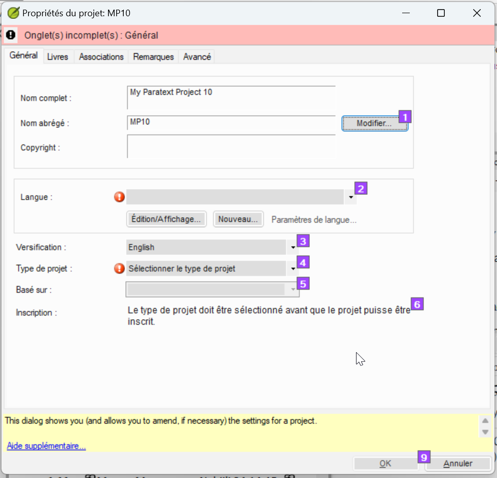
  - 

**4.3 Changer le nom du projet**

- Cliquez sur le bouton **Edit** (Modifier)

  - 
  - 
  - 
  - *La boîte de dialogue **Modifier le nom complet** s'affiche*
  - 
  - 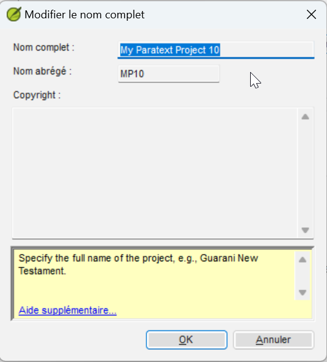
  - 
- Dans la section **Nom complet**, tapez un nom qui inclut le nom de la langue
- Sous **Nom abrégé**, tapez le code **ISO** pour la langue.

  - Une fois que vous créez un nom de projet, le nom abrégé ne peut pas être modifié, car c'est le nom que Paratext donnera au dossier contenant les fichiers de projet, ainsi que le nom donné au projet sur le serveur Internet. (Cependant, vous pouvez convertir le projet vers un nouveau projet avec un nom abrégé diffèrent. Mais la conversion d'un projet peut prendre de nombreuses heures.)
  - 

**4.4 Spécifier la langue**

- Si vous avez un autre projet Paratext dans la même langue, vous pouvez déjà choisir la langue dans la liste dans Paratext **[2]**. Sinon, vous devrez créer une nouvelle langue.
- Cliquez sur **Nouveau**

  - 
  - 
  - 
  - *La boîte de dialogue **Choisir un identificateur de langue Identifier** s’affiche*.
  - 
  - 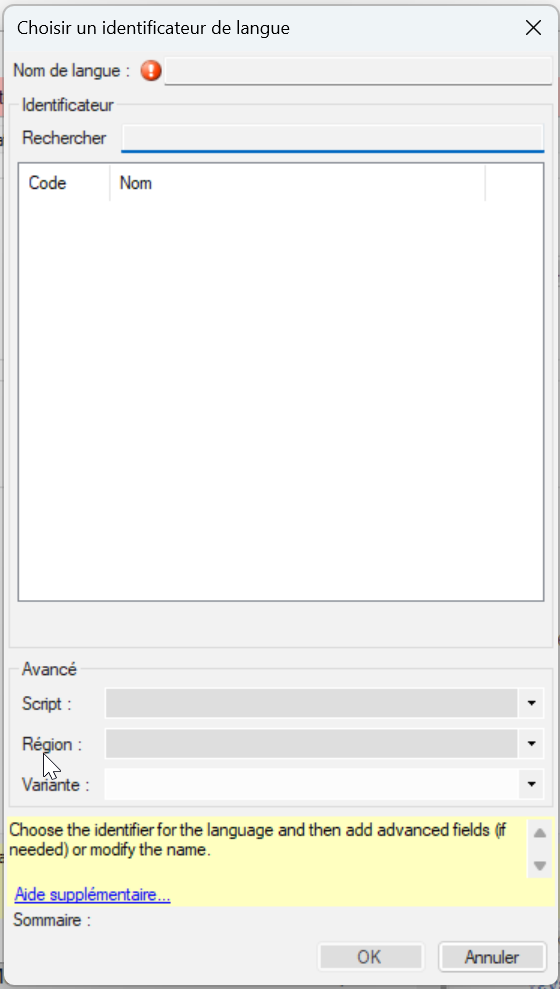
  - 
- Cliquez dans la zone de **Recherche**
- Commencez à saisir le nom de votre langue

  - Paratext affiche les noms correspondants.
  - 
- Cliquez sur votre langue dans la liste.

  - Paratext ajoutera le nom de la langue.
  - 
- Remplissez les champs de la section Avancé, si nécessaire.
- Cliquez sur **OK**.

  - Vous pouvez également spécifier des informations supplémentaires si nécessaire dans la section "avancé" de la boîte de dialogue des paramètres de langue.
  - 

**4.5 Type de projet**

- Cliquez sur la liste déroulante à côté de **Type de projet**

  - 
  - 
- Choisissez le type approprié pour votre projet.

  - S'il s'agit d'un projet dépendant comme une retraduction, d'une traduction fille ou d'un projet de translittération, vous devrez définir la source.
  - 

**4.6 Inscrire le nouveau projet**

- Assurez-vous d'avoir donné un nom au projet et choisi le type de projet.
- Cliquez sur **S'inscrire en ligne** pour accéder à la page d'inscription
- Remplissez les informations (voir ci-dessus)
- Cliquez sur **Register** (Inscrire) pour soumettre et retournez à Paratext.

  - Paratext doit "automagiquement" détecter que le projet est inscrit.
  - 
- Cliquez sur **OK** pour créer le nouveau projet.

Les types de Projets qui n’ont pas besoin d’être inscrits séparément

- Projets qui héritent l’inscription du parent
- Retraduction
- Translittération
- "Auxiliaire"
- Remarques du conseiller

**4.7 Modifier votre inscription**

Lorsque vous travaillez dans votre projet, vous pouvez modifier vos informations d'inscription plus tard.

- Dans Paratext, vérifiez que vous avez une connexion Internet,
- **≡ Onglet**, sous **Projet**   - **Propriétés du projet**   - **Paramètres de projet**
- Cliquez sur le lien **Gérér l'inscription**

  - L'information de votre inscription s'affiche. Un administrateur peut modifier l'information.
  - 

**5**

# **IR : Installation des ressources**

**5.1 Introduction**

Dans ce module, vous allez apprendre comment installer des ressources.

***Avant de commencer***

Vous avez déjà installé Paratext 8 et inscrit l’utilisateur.

***Pourquoi est-il important ?***

Dans Paratext 9, les ressources sont téléchargées depuis le DBL (Digital Bible Library ou bibliothèque biblique numérique). Normalement chaque utilisateur les télécharge directement, mais si vous avez une connexion Internet limitée, il est possible de partager les fichiers téléchargés.

***Que ferez-vous ?***

- Télécharger des ressources.
- Installer des ressources des fichiers déjà téléchargés.

**5.2 Installer ressources – Internet (DBL)**

- Cliquez sur le menu **≡ Paratext**, sous **Paratext** choisissez **Télécharger/Installer des ressources**.

  - Une boîte de dialogue s’affiche.
  - 
  - 
  - 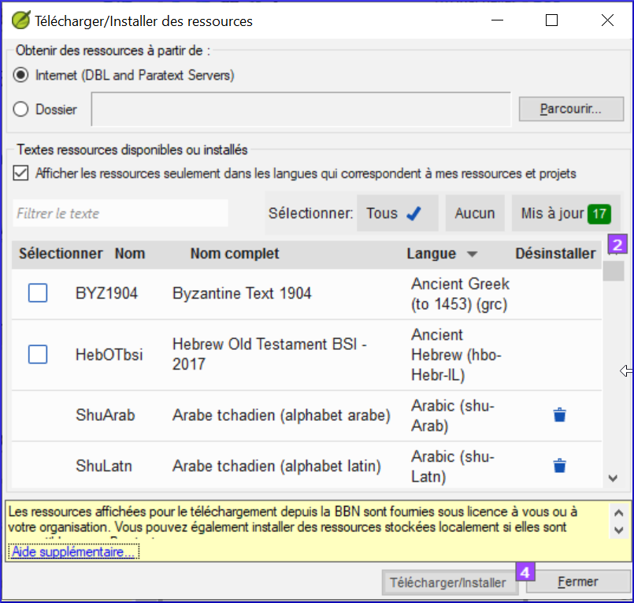
  - 
- Assurez-vous qu’Internet est choisi.
- Filtrez la liste en saisissant dans la boîte de **filtre** (tapez le nom ou la langue ou le signe + pour les enrichis).
- Cochez les cases à côté des ressources voulues.
- Cliquez sur **Télécharger/Installer**

**5.3 Installer ressources – fichiers**

- Du menu **Fichier,** choisissez **Installer des ressources**.

  - Une boîte de dialogue s’affiche.
  - 
- Cliquez sur **Dossier**
- Cliquez sur **Parcourir**.
- Accédez au dossier qui contient les ressources.
- Sélectionnez les ressources voulues
- Cliquez sur **Télécharger/Installer**

**6**

**PP1 : Configuration du plan de projet**

**6.1 Introduction**

Suivre le progrès basé sur un plan du projet est une fonctionnalité améliorée qui aura un impact sur le travail quotidien des équipes de la traduction.

***Où en sommes-nous***

Avant d’ajouter un plan, le projet doit être créé ou migré.

***Pourquoi cette aptitude est-elle importante ?***

Il y a beaucoup de tâches à faire dans un projet de traduction. Il est important d’avoir un système pour s’assurer que tout cela est fait. Il est également bon d’avoir un moyen facile de générer des rapports pour les superviseurs et les bailleurs de fonds (voir PP2 : Rapport sur le plan du projet).

La configuration d’un plan de projet à partir de zéro est intimidante. Diverses organisations de traduction de la Bible (ABU, SIL et The Seed Company) incluront des plans “de base” qui peuvent être appliqués à des projets. Les équipes ne doivent que personnaliser ces plans dans les limites fixées par leurs organisations.

En générale, les organisations veulent la conformité au niveau de l’« étape » afin de faciliter un suivi de l’avancement du projet dans l’ensemble de l’organisation. Cependant, chaque plan devra être personnalisé au niveau des tâches.

Si une tâche est importante pour vous et votre équipe et que vous souhaitez en suivre les progrès, elle peut être incluse dans le plan du projet (même si elle ne nécessite pas l'utilisation de Paratext).

***Qu'est-ce qu'on va faire ?***

On utilise une combinaison de deux fonctionnalités : les paramètres du **plan du projet** et les **Tâches et avancement** pour gérer le plan.

- On ajoute le plan de base de l’organisation au projet.
- On personnalise le plan pour l’équipe.
- On attribue ensuite les tâches aux différents membres de l’équipe.
- On met à jour le plan de base chaque fois qu'il y a une nouvelle version.

**6.2 Ajouter le plan de base de l’organisation**

  - Si vous aviez un plan déjà, il faut supprimer ce plan avant d’ajouter un autre. (Voir la page suivante pour les instructions de supprimer un plan.)
  - 
- **≡ Onglet** menu, sous Projet **Paramètres du projet**   - **Plan du projet**
- Cliquez sur **Gérer les plans**
- Cliquez dessous **Afficher le plan de référence**

  - 
  - 
- Choisir le plan de base de votre organisation
- Cliquez sur la flèche (Copier le plan) (**Copy Plan**).

  - 
  - 
- Cliquez sur **OK**.

  - Le plan et ses tâches sont ajoutés au projet.
  - 

**6.2.1 Supprimer le plan existant (avant d’ajouter un autre)**

  - Si le projet a un ancien plan, vous devez retirer chacune des étapes actuelles avant d’ajouter un nouveau plan de base.
  - 
- **≡ Tab** menu, sous **Projet**   - **Paramètres du projet   - Plan de projet**
- Cliquez sur **Gérer les plans**
- Cliquez sur la dernière étape
- Cliquez sur **Retirer l'étape**.

  - 
  - 
- Cliquez sur Yes (deux fois) pour confirmer vous voulez modifier le plan et encore pour confirmer vous voulez retirer les tâches.
- Répéter pour les étapes restantes
- Ajouter le nouveau plan (voir ci-dessus)

**6.3 Configurer le plan**

**6.3.1 Configurer — Livres à inclure**

- [**≡ Onglet** sous **Paramètres de projet**   - **Propriétés du projet**
- Cliquez sur l’onglet **Livres**
- Choisissez les livres vous voulez suivre.
- Cliquez sur **OK**

**6.3.2 Configurer — ajouter des vérifications à une étape**

- **≡ Paratext** menu, sous **Projet**, choisissez **Paramètres de projet** puis **Plan de projet**
- Cliquez sur l'onglet **Vérifications**

  - 
  - 
- Cliquez sur l'onglet "Vérifications".

  - Deux colonnes sont affichées : Étape obligatoire et Étape facultative.
  - 
- Pour la vérification désirée, cliquez sur la liste déroulante **Requis dans l'étape [12]**

  - 
  - 
- Choisissez l'étape ou *Aucun*
- Ensuite, réglez l'option Notifier seulement (facultatif) à une étape antérieure, le cas échéant.
- Répetez pour chaque vérification
- Cliquez sur **OK**

**6.3.3 Configurer — Réorganiser les tâches**

  - Il est possible de réordonner des tâches et même déplacer des tâches à une autre étape. Toutefois, pas toutes les organisations le permettent.
  - 
- Du menu **Onglet**, sous **Projet**, choisissez **Paramètres du projet**, puis **Plan du projet**
- Cliquez sur l’onglet **Étapes/Tâches**
- Sélectionnez la tâche à déplacer.
- Cliquez sur la flèche vers le haut ou vers le bas pour déplacer la tâche vers un autre point ou pour la déplacer vers une autre étape.

  - Il se peut que vous recevrez un message de confirmation si la tâche change d’étape.
  - 
- Cliquez sur **OK**.

**6.3.4 Ajouter une tâche**

- Cliquez sur la tâche qui sera au-dessus de la nouvelle tâche.
- Cliquez sur le bouton **Ajouter une tâche**
- Tapez un nom pour la tâche puis une description.
- Cliquez sur **OK**.

**6.3.5 Configurer — Supprimer des tâches**

- Cliquez sur l’onglet Étapes/Tâches
- Cliquez sur la tâche à supprimer

  - 
  - 
- Cliquez sur le bouton **Retirer la tâche**
- Cliquez sur **OK**.

**6.3.6 Renommer ou modifier les tâches**

- Cliquez sur la tâche (à gauche)
- Cliquez sur le nom (à droit).
- Tapez un nouveau nom de la tâche.
- Si nécessaire, modifiez la description.

**6.3.7 Copier une tâche d’un plan à votre projet**

  - N.B. Suivez les étapes ci-dessous pour copier une tâche d'un plan de référence vers le plan de votre projet.
  - 
1. Ouvrir votre projet [**≡ Paratext** sous **Projet** choisissez **Ouvrir**].
2. **≡ Onglet** menu, sous **Projet** choisissez **Paramètres du projet**   - **Plan du projet**
3. Cliquez sur **Gérer les plans**
4. Dans la liste déroulante « **Afficher le plan de référence**) », sélectionnez le plan de projet qui contienne la tâche voulue.
5. Dans la partie **Plan actuelle**, cliquez sur la ligne qui précédera la nouvelle tâche.

  - Si vous voulez que la tâche ajoutée soit la première tâche de l’étape, sélectionnez le nom de l’étape.
  - 
1. Sur le côté **Plan de référence** de la boîte de dialogue, passer la souris sur la tâche que vous souhaitez ajouter et cliquez sur la flèche bleue qui apparaît.

  - *La tâche est copiée dans le plan de votre projet et elle ne peut plus être copiée à nouveau dans celui-ci.*
  - 
- **Facultatif** : Pour déplacer la tâche, cliquez sur la flèche vers le haut ou la flèche vers le bas qui s’affiche lorsque vous survolez une tâche du côté Plan actuel de la boîte de dialogue.
- Cliquez sur **OK** pour fermer la boîte de dialogue « Gérer les plans ».
- Cliquez sur **OK** pour fermer la boîte de dialogue « Plan du projet ».

  - La tâche copiée a le même nom et le même taux de progression que dans le plan de projet pour le projet ORIG.
  - 
  - 
  - *Le nom court du projet est ajouté au nom du plan.*
  - 

**6.4 Vérifier les paramètres pour une tâche**

- Il y a trois paramètres pour chaque tâche
- comment marquer la complétion de la tâche (par chapitre, livre)
- quand on peut commencer une tâche (après une autre tâche…)
- accorder le droit de modifier (donner la permission de modifier le texte)
- **≡ Onglet** menu, sous **Projet** choisissez **Paramètres du projet**   - **Plan du projet**
- Cliquez sur la tâche

  - Les paramètres sont affichés en bas à droite
  - 
  - 
  - 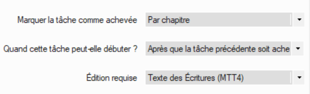
  - 
- Apportez les modifications nécessaires
- Répétez pour toute autre tâche
- Cliquez sur **OK**.

**6.5 Groupes de priorité**

Les groupes de priorité sont un moyen de faire savoir à Paratext l'ordre dans lequel les livres ou les chapitres doivent être travaillés.

**6.5.1 Utilisation d’un ensemble présélectionné**

**6.5.2 Établir des priorités**

- Ouvrez le menu de **projet**, puis choisissez **Paramètres du projet**   - **Définir les priorités**.
- Sélectionnez les livres, puis cliquez sur l’icône de flèche droit
- Cliquez sur les trois points, choisissez **Édition**
- Réorganisez les livres selon vos besoins en cliquant sur un livre et en le déplaçant vers le haut ou vers le bas à l'aide des boutons fléchés.
- Renommez le groupe (p.ex. Évangiles)
- Pour définir des chapitres spécifiques,
- Cliquez sur le lien vers le nom du livre
- Choisissez les chapitres désirés
- Cliquez sur OK
- Si vous ajoutez ensuite un livre dont les chapitres sont déjà définis, il n'ajoutera que les chapitres restants.
- Je pourrais réorganiser les livres en cliquant sur un livre et le déplacer vers le haut ou vers le bas.

**6.5.3 Utiliser les priorités**

Une fois que les priorités ont créés, elles peuvent être utilisées partout où vous choisirez normalement des livres. Par exemple,

Dans cette fenêtre, vous pouvez également définir ou redéfinir vos priorités si nécessaire

**6.6 Affecter des tâches aux membres de l’équipe**

Les tâches peuvent être attribuées individuellement ou en bloc.

**6.6.1 Attribuer les tâches individuellement**

- **≡ Onglet** menu, sous **Projet**, choisissez **Tâches et avancement**
- Cliquez la liste roulante pour la tâche et choisissez qui doit faire la tâche (un membre ou l’équipe)

  - 
  - 
- Répétez si nécessaire pour chaque tâche
- Cliquez sur **OK**.

**6.6.2 Attribuer les tâches en bloc**

- Cliquez sur le **bouton bleu** Tâches et avancement
- Choisissez **Tableau des tâches**
- Utilisez le filtre des versets pour sélectionner les livres
- Sous la tâche, cliquez sur **Attribuer une tâche**

  - Les chapitres incomplets peuvent être réassignés mais pas les chapitres terminés.
  - 
- *Un message d'avertissement apparaîtra avec des options pour écraser toutes les attributions ou seulement les chapitres non attribués*.

**6.6.3 Attribuer une étage ou un livre**

- Cliquez sur le bouton **Attribuer une étape** (en haut de chaque étape).
- Modifiez les affectations de certaines tâches si nécessaires.

  - Une fois que vous avez terminé le processus d'affectation en bloc, vous pouvez affiner les affectations dans la vue Toutes les tâches.
  - 

**6.7 Mettre à jour l'avancement (pour un projet migré)**

  - Pour les projets qui ont déjà complété plusieurs étapes au moment de passer à Paratext 9 la vue de la "tableau des tâches" et/ou la vue de la "tableau des étapes" peuvent être utiles pour marquer plusieurs livres, étapes ou tâches, comme achevé.
  - 
- Cliquez dans votre projet.
- Cliquez sur le **Bouton bleu** Tâches et avancements
- Choisissez **Tableau des étapes**.
- Cliquez sur le menu **≡ Onglet** et choisissez le **Mode modifier l’avancement en bloc**.

  - Les vérifications sont temporairement désactivées.
  - 
  - 
  - 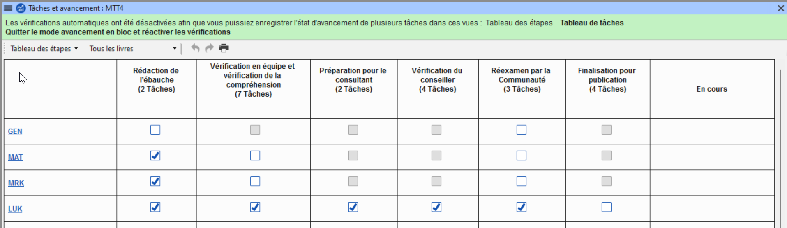
  - 
- Cliquez sur le bouton **Toutes les étapes**

  - Toutes les étapes sont approuvées.
  - 
  - 
  - Lorsque vous avez fini de faire toutes les attributions, vous pouvez revenir en arrière et décocher le Mode modifier l’avancement en bloc.
  - 

**6.8 Enregistrer un plan modifié comme nouveau plan de base**

Les modifications que vous avez apportées à votre plan seront envoyées aux membres de votre projet lors de l'envoyer/recevoir. Si vous souhaitez partager le plan révisé avec d'autres équipes, vous pouvez l'enregistrer comme un nouveau plan de référence.

- Ouvrir **votre** projet.
- **≡ Onglet** menu, sous **Projet** choisissez **Paramètres du projet**   - **Plan du projet**
- Maintenez la touche MAJ (shift) et cliquez sur **Gérer les plans**

  - La boîte de dialogue de gestion des plans s'affiche avec un bouton "enregistrer comme plan de référence" en bas à droite.
  - 
  - 
  - 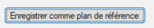
  - 
- Cliquez sur **Enregistrer comme plan de référence**

  - Une boîte de dialogue s'affiche
  - 
  - 
  - 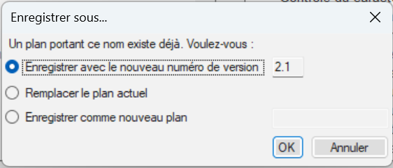
  - 
  - *Le fichier est enregistré sur \My Paratext 8 Projects\_StandardPlans*
  - 
- Choisissez ce qui convient, puis cliquez sur **OK**
- Partagez le fichier de \My Paratext 8 Projects\_StandardPlans avec les autres équipes.

**6.9 Mise à jour d'un projet avec une nouvelle version du plan de base**

Il arrive que le plan de base sur lequel ce plan de projet a été construit soit modifié. Il existe deux façons de mettre à jour le plan de base.

**6.9.1 Méthode 1**

**6.9.2 Méthode 2**

.

**7**

# **Configurer pour réussir**

Les choses à considérer :

***Il s’agit d’un processus dynamique***

- Lorsqu’un projet est tout neuf, il n’y a pas beaucoup de paramètres qui peuvent être fixés.
- À mesure que le projet arrive à maturité, certains des inventaires commencent à avoir un sens.

***Qui travaille sur le projet***

- Configurer les utilisateurs, les rôles et les autorisations
- Serait-il utile d’avoir un « menu simplifié » ?

***Avez-vous besoin de personnaliser les paramètres ?***

- custom.sty
- modifier les paramètres de la feuille de style
- les noms des marqueurs (dans d’autres langues)
- la couleur pour aider à identifier les caractéristiques ?
- custom.vrs
- identifier les versets qui sont différents de la versification par défaut

***Quelle orthographe sera utilisée ?***

- Placez les lettres de l’orthographe dans les paramètres de langue.
- (Rappelez-vous que ce que vous avez mis dans les paramètres de langue pourrait aller dans le « Speech and Language Data Repository ».)

***Comment les caractères seront-ils saisis ?***

- Keyman/MSKLC (Keyman est gratuit !)
- AutoCorrect.txt

***Quel système de citation sera utilisé ?***

- Définir les règles de guillemets [Dynamique]
- Pensez à vos règles
- Testez ce que vous avez choisi
- Ajustez des règles
- Faire des corrections aux règles/au texte si nécessaire

***Lorsque vous avez des données textuelles***

- Commencez avec des inventaires
- Commencez par le début [caractères]
- Recherchez des options dans les inventaires !
- L’élément est-il valable tout le temps ? Ou juste dans certaines situations ?

***Paramètres de référence biblique***

- Quels noms de livres utilisez-vous ?
- Quel est le format d’une référence ?
- Où placer l’origine des notes ? [Première, dernière…]

**8**

# **CV : Convertir un Projet**

**8.1 Introduction**

Si jamais vous avez eu besoin de renommer votre projet, de réduire la taille de votre projet, de modifier les noms d’utilisateur, de modifier l’encodage ou de lutter avec des signes diacritiques composés/décomposés, l’outil **Convertir le projet** vous aidera à résoudre ces problèmes.

***Où en sommes-nous ?***

Vous devez être l’administrateur du projet à faire ces conversions.

***Pourquoi cette aptitude est-elle importante ?***

Il n’est que possible d’apporter quelques modifications au projet dans le **Propriétés et paramètres** du projet. Les changements majeurs nécessitent qu’un nouveau projet soit créé. L’outil **Convertir le projet** permet le nouveau projet de garder l’historique du projet.

***Qu'est-ce qu'on va faire ?***

Nous allons travailler les six changements qui peuvent être apportés à votre projet.

- Changer le nom abrégé du projet
- Retirer les fichiers effacés de l'historique de projet
- Nettoyer historique de Paratext Live
- Convertir l’encodage à 65001 — Unicode [UTF8]
- Normalisation — composé ou décomposée
- Remplacement de vieux noms d’utilisateur

**8.2 La boîte de dialogue de "convertir un projet"**

- **Onglet** sous **Outils**, choisissez **Avancé**, puis **Convertir le projet**

  - 
  - 

**8.2.1 Changer le nom abrégé du projet**

- Confirmez que l’ancien nom du projet est correct. [Sinon, fermez le dialogue et cliquez dans la fenêtre projet correct et accéder à la boîte de dialogue Nouveau.]
- Entrez le nouveau nom abrégé pour le projet dans **[1]**.

**8.2.2 Balayage des fichiers supprimé dans l’historique du projet**

- **[2]** Sélectionnez cette option si vous avez supprimé des fichiers [tels que les grandes illustrations] dont vous ne souhaitez plus faire partie de l’historique du projet.

**8.2.3 Nettoyer l'historique de Paratext Live**

- **[3]** Sélectionnez cette option si vous avez édité le projet avec Paratext Live et que vous souhaitez remplacer les noms dans l’histoire du projet.

**8.2.4 Convertir l’encodage à 65001 — Unicode [UTF8]**

- **[4]** Sélectionnez cette option pour convertir un projet standard d’encodage Unicode.

<aside>
💡 Cela ne fonctionnera pas pour modifier l’encodage si votre projet comporte une « police piratée ». Normalisation – composés ou décomposés.

</aside>

**8.2.5 Normalisation**

- **[5]** Sélectionnez Composé [NFC] ou une des options dans la liste déroulante si les données dans votre projet contiennent un mélange des caractères composés et décomposés.

**8.2.6 Remplacement de vieux noms d’utilisateur**

- **[6]** Sélectionnez le nom de l’utilisateur que vous souhaitez remplacer dans la liste déroulante.
- **[7]** Tapez le nom d’un utilisateur inscrit de Paratext dans cette case.
- **[8]** Cliquez sur **Ajouter**,

  - un résumé du remplacement s’affiche avec un bouton "Retirer".
  - 
  - 
  - 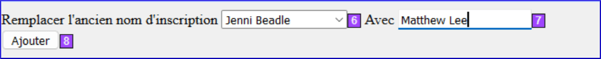
  - 
- [Si vous faites une erreur en tapant le nom dans le champ **Avec** ou que vous décidez de ne pas faire le remplacement, cliquez sur **Retirer**].

**8.3 Convertir un projet**

- **[9]** Cliquez sur **OK** pour convertir le projet.

  - Voir la remarque dans le guide au sujet des projets partagés.
  - 

**9**

# **RE : Renvois**

**9.1 Introduction**

La plupart des langues n'ont pas accès à des concordances et à d'autres documents d'étude de la Bible dans leurs propres langues. Ajouter des renvois à votre Nouveau Testament peut grandement aider votre lecteur à comprendre le texte en l'aidant à trouver des passages sur des thèmes similaires.

***Où en sommes-nous ?***

Avant de pouvoir insérer des renvois d’un texte modèle, votre administrateur doit avoir créé tous les livres (et chapitres et versets) dans votre projet. Ils peuvent être vides, mais ils doivent être présents.

***Pourquoi cette aptitude est-elle importante ?***

Lire le Nouveau Testament n’est pas comme la lecture d’un roman. Avoir accès à des renvois permet à votre lecteur de trouver des passages similaires sur les thèmes. Néanmoins, l’ajout manuel de renvois un à un est trop fastidieux. Le menu **Insérer les renvois** vous permet d’insérer tous les renvois à la fois (les noms de livre et la ponctuation du renvoi seront convertis également pour correspondre à vos **Paramètres de référence bibliques**).

***Qu'est-ce qu'on va faire ?***

Nous allons faire trois choses :

Si vous ne disposez pas d'un texte modèle avec la référence croisée souhaitée, vous pouvez créer votre propre liste et l'importer.

**9.2 Extraire des renvois d'un texte modèle**

- Ouvrir le projet du modèle (p.ex. un autre projet de la filiale).
- **≡ Onglet** sous **Projet**, choisissez **Avancé** puis **Extraire les renvois**
- Saisissez un nom du fichier
- Cliquez sur **OK**.

  - N.B. : Les ressources ne vous permettent pas d'extraire les renvois.
  - 

**9.3 Vérifier les paramètres des références bibliques**

- **≡ Onglet** sous **Projet**, choisissez **Paramètres du projet**   - **Paramètres des références bibliques**.
- Vérifiez que les éléments suivants ont été correctement définis pour votre projet (modifiez-les si nécessaire).
- La ponctuation dans l'onglet **Format de référence**.
- Les abréviations des livres dans l'onglet **Noms du livre**.
- Cliquez sur **OK**.

**9.4 Vérifier les paramètres de langue**

- **≡ Onglet** sous **Projet**, choisissez **Paramètres du projet**   - sélectionnez **Paramètres de langue...**
- Cliquez l'onglet **Autres caractères**.
- Dans le champ **Segments de Versets**, saisissez au moins six caractères uniques séparé par des espaces.
- Cliquer sur **OK**.

**9.5 Insérer des renvois**

- **≡ Onglet** sous **Projet**, choisissez **Avancé**, puis **Insérer les renvois**.
- Cliquez sur **Parcourir...**.
- Naviguez vers le fichier .xrf contenant des renvois extraits.
- Sélectionnez le ficher, puis cliquer sur **Ouvrir**.
- Si vous le désirez, sélectionnez une des cases à cocher.

  - (Voir le guide pour d'autres informations.)
  - 
- Cliquez sur **OK**

  - Si une boite de dialogue s'affiche contenant des droits d'auteurs ou d'autres informations, copiez les infos vers l'endroit appropriez de votre projet.
>