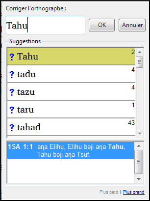
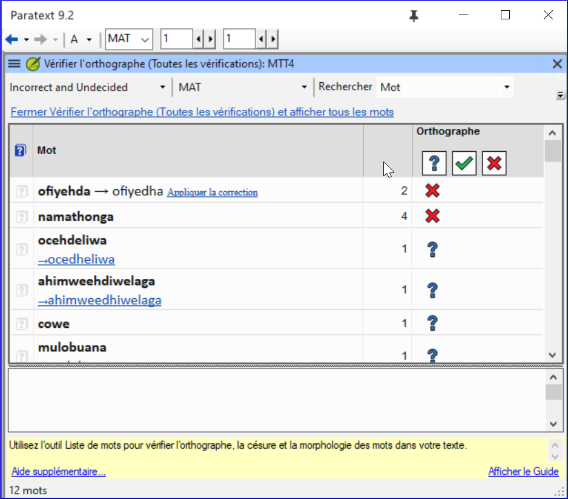
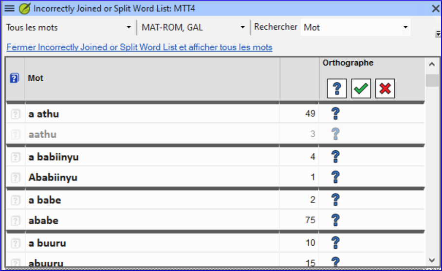

**Introduction**  
Ce module explique comment utiliser une fonctionnalité de Paratext 9 pour la vérification des fautes d’orthographe.

**Où en sommes-nous dans le processus ?**  
Vous avez saisi votre texte dans Paratext 9 et vous l’avez examiné pour déceler les fautes de frappe et les erreurs de composition. Mais il peut encore rester un certain nombre d’erreurs d’orthographe.

**Pourquoi cette fonction est-elle importante ?**  
Vous devez corriger les fautes d’orthographe, afin que votre texte communique le message clairement.

**Qu’est-ce qu’on va faire ?**  
- Configurez la liste de mots pour constituer une base de mots corrects.
- Travaillez dans votre texte avec des lignes ondulées rouges montrant les mots que Paratext ne sait pas être corrects.
- Parcourez votre liste de mots, en corrigeant les erreurs ou en indiquant à Paratext 9 que les mots sont corrects.
- Utilisez une variété de contrôles de la liste de mots.
- Ajoutez une note de discussion sur l'orthographe aux mots qui nécessitent une discussion plus approfondie avant de décider de l'orthographe correcte.

### 8.1 Configurer la liste de mots

:::tip
Avant de vérifier l’orthographe, il est important d’avoir une base de mots corrects. Il y a trois choses à faire :
:::

**Approuver l’orthographe des mots fréquents**

Dans Paratext

-  **≡ Onglet**, sous **Outils** \> **Liste de mots**

Dans la Liste des Mots

-  **≡ Onglet,** sous **Outils** \> **Approuver l’orthographe des mots fréquents**
-   Saisissez un chiffre

:::info
Saisissez un chiffre qui représente le minimum d’occurrences d’un mot pour permettre l’approbation automatique de son orthographe. En d’autres termes, combien de fois le mot doit-il être dans la liste pour qu’on le considère comme bien orthographié ? Le paramètre par défaut est 100, mais on peut choisir plus ou moins que cela.
:::

-   Cliquez sur **OK**
-   Cliquez sur **Oui** (pour confirmer que vous ne pouvez pas annuler)

**Vérifier les mots que Paratext pense être erronés**  
Dans la liste de mots (**≡ Onglet**, sous **Outils** \> **Liste de mots**)

-  **≡ Onglet**, sous **Outils** \> **Vérifier l’orthographe** \> **Toutes les vérifications**  
    -    *La liste de mots s'affiche.*
-   Cliquez sur un mot dans le volet en haut.
-   Si correct — cliquez sur la case verte  en haut de la colonne
-   Si le mot est incorrect, et Paratext a proposé le mot juste, cliquez sur le lien bleu du mot juste
-   Si le mot est incorrect, et Paratext n'a pas proposé le mot juste, cliquez sur la croix rouge  et corrigez le mot.(Voir 9.3)

**Vérifier les mots qui se ressemblent beaucoup dans l'écriture**
Dans la liste de mots

-  **≡ Onglet**, sous **Outils** \> **Rechercher mots semblables**
-   Remplissez la boîte de dialogue avec les paires de lettres qui peuvent être confondues séparé par / (p.e.x s/sh)

:::tip
Selon votre langue, cochez ou décochez « ne pas tenir compte des signes diacritiques lors de la comparaison des mots ».
:::

-   Cliquez sur **OK**  
    -    *Une liste de mots s'affiche.*
-   Vérifiez les mots comme au-dessus.

### 8.2 Vérifier l’orthographe — dans le texte

Dans Paratext

-  **≡ Onglet**, sous **Affichage** \> **Afficher les fautes d'orthographe**

:::tip
Un mètre de progrès s’affiche puis tous les mots inconnus ou incorrects sont soulignés, avec les lignes ondulées rouges.
:::

**Corrections des erreurs**

Paratext 9 soulignera en rouge les mots dans le texte qui ne sont pas marqués corrects dans la liste de mots. (Les mots qui sont incorrects ou incertains.

-   Cliquez à droite sur un mot souligné en rouge ou gris  
    -    *Une boîte de dialogue s'affiche*  
      
-   Saisissez la correction ou bien choisissez un mot de la liste
-   Cliquez sur **OK**.

:::tip
Il est préférable d’utiliser « vérifier l’orthographe » au lieu de corriger les mots un par un dans le texte. C’est mieux parce que Paratext 9 va se rappeler la correction pour l’appliquer aussi dans les autres chapitres.
:::

:::info
Quand il y a plus d’une correction, une boîte de dialogue s’affiche. Choisissez une des options selon le besoin.
-  **Oui** = change ce verset et cherche d’autres.
-  **Non** = ne change pas ce verset, mais cherche d’autres
-  **Oui à tous** est trop dangereux. Ne l’utilisez pas!
-  **Annuler** = arrête ici, ne change rien d’autre
:::

### 8.3 Vérifier l’orthographe du livre actuel

-  **≡ Onglet**, sous **Outils** \> **Vérifier l’orthographe du livre actuel**  
    -    *Une fenêtre s’affiche avec une liste de plusieurs mots suspects du livre actuel.*  
    
-   Faites les corrections comme ci-dessus (9.3)
-   Cliquez sur « Davantage d'éléments disponibles » pour afficher des mots supplémentaires.
-   Continuez si nécessaire.

### 8.4 Vérification d’orthographe dans la liste de mots

#### Utiliser les vérifications

Dans la liste de mots

-  **≡ Onglet**, sous **Outils** \> **Vérifier l’orthographe**
-   Choisissez la vérification désirée (voir dessous)  
      
    -    *Une liste de mots s’affiche.*
-   Faites les corrections comme ci-dessus
-   Cliquez sur « **Davantage d'éléments disponibles** » pour afficher des mots supplémentaires.
-   Continuez si nécessaire.
-   Quand la liste est vide, un message s’affiche.  
    
-   Cliquez sur **Oui**.

**Toutes les vérifications**  
Cela gère tous les contrôles. Ceci est très utile, car il trouvera tous les types d'erreurs et surtout des mots avec plusieurs types d'erreurs.

#### Majuscules manquantes**
-   Une liste de mots s’affiche avec les liens d’autres mots qui n’ont pas toujours de majuscules (c'est-à-dire que les deux formes sont utilisées). Le mot avec la minuscule se trouve au-dessus du mot avec la majuscule, qui a un lien bleu.  
    
-   Cliquez sur le lien bleu pour le mot en majuscule.  
    
-   Cliquez sur le lien bleu qui convient.
-  *Show Incorrect* (pour voir tous les versets)
-  *Toutes les deux formes sont acceptables* (pour accepter les deux formes)
-  *Capitalise All* (corriger tous les mots)

#### Faute de frappe d’un caractère unique
Une liste de mots s’affiche avec les liens d’autres mots qui ressemblent au mot en question, mais qui diffèrent d'une seule lettre.

#### Combinaisons inhabituelles des lettres  
Une liste de mots s’affiche. Ces mots ont une séquence des caractères rares, par exemple plus d’une consonante ou plusieurs voyelles…

#### Erreurs de signes diacritiques  
Une liste de mots s'affiche. Cette fois, les mots se distinguent uniquement par leurs diacritiques.

#### Fautes de frappe courantes  
Une liste de mots s'affiche qui vous montre les mêmes types de problèmes qui ont déjà été corrigés ailleurs. Par exemple : si vous avez corrigé « vres » en « vers» ailleurs, et il trouve « vreset » il va suggérer « verset ».

#### Morphologie inconnue  
Une liste de mots s’affiche dont l’ordinateur ne peut pas deviner la morphologie basée sur d’autres mots.

#### Rechercher des mots mal liés ou mal divisés
Dans la liste de mots

-  **≡ Onglet**, sous **Outils** \> **Rechercher des mots mal liés ou mal divisés**  
    
-   Saisissez une ponctuation qui peut apparaître au milieu d'un mot, si elle existe.
-   Cliquez sur **OK**.  
    -    *Une liste de mots est affichée avec des mots similaires regroupés.*  
    

#### Corriger un mot mal marqué
-   Trouvez le mot dans la liste de mots (en utilisant un filtre si nécessaire)
-   Cliquez sur la ligne pour voir le mot dans son contexte
-   Cliquez sur l’état d’orthographe désiré.

### 8.5 Remarque de discussion orthographique

:::tip
Si vous ne décidez pas définitivement de l'orthographe, vous pouvez ajouter une remarque de discussion orthographique.
:::

-   Double-cliquez sur l’icône de remarque (dans la première colonne)  
    
-   Saisissez la remarque
-   Confiez (affectez) la remarque comme désiré.
-   Cliquez sur **OK**.
