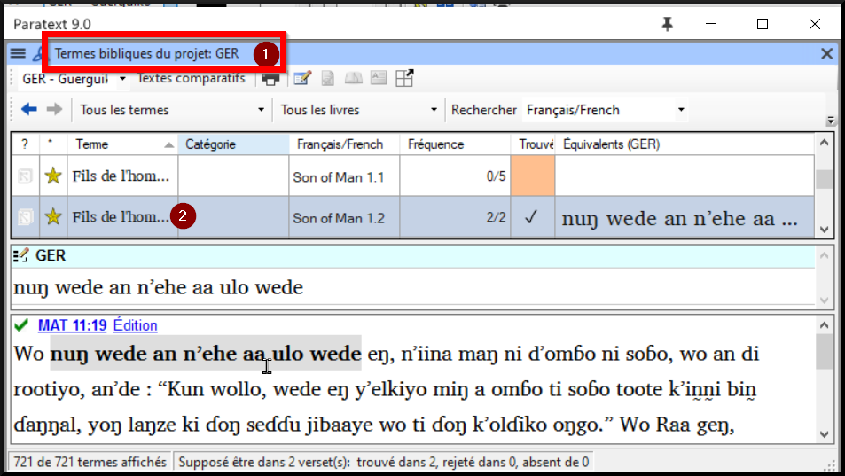
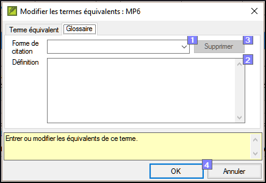

**Introduction**  
Ce module explique comment ajouter des entrées dans le glossaire avec l’outil **Termes bibliques**.

**Où en sommes-nous dans le processus ?**  
Vous avez entré et vérifié votre texte dans Paratext 9. Maintenant, vous voulez ajouter des mots importants dans le glossaire.

**Pourquoi cette aptitude est-elle importante ?**  
Il est bon d’avoir une liste des mots importants ainsi que leur explication pour que les gens puissent mieux comprendre le texte. Il est préférable d’utiliser l’outil **Termes bibliques**, parce qu’il va garder la liste en ordre alphabétique. Si vous ajoutez les mots manuellement, le glossaire est plus difficile à gérer. Un autre avantage, si on crée les entrées du glossaire à partir de l'outil Termes bibliques, c'est qu'on peut aussi voir l'historique.

**Qu’est-ce qu’on va faire ?**  
Vous utiliserez l’outil Termes bibliques et modifierez l’équivalent d'un terme. L’onglet glossaire vous permet d’ajouter la forme de citation et la définition.

:::info
Quatre vidéos de formation sont disponibles sur l'ajout, la liaison et l'édition de glossaires. P9 1A.4a-d.
:::

### 9.1 Ouvrir l'outil termes bibliques

-   Accédez à un verset qui contient le mot/terme que vous voulez dans le glossaire.
-   Cliquez à droite et choisissez « **Afficher les termes bibliques** », puis choisissez « **Verset(s) actuel(s)** »
-   Vérifiez que la liste désirée est ouverte (p.ex. Termes bibliques du votre projet, ou Termes bibliques clés du NT [SIL])

    

-   Pour changer la liste, **≡ Onglet**, sous **Terms Bibliques**, choisissez "**Sélectioner la liste de termes bibliques**".

### 9.2 Ajouter une entrée

-   Double-cliquez sur le mot dans la liste du haut
-   Cliquez sur l’onglet « **Glossaire** »

    

-   Saisissez le mot dans la forme de citation (c.-à.-d. ce que vous voulez dans le glossaire) [1]
-   Saisissez la **Définition [2]**
-   Cliquer sur **OK**  
    *Le mot ainsi que la définition seront ajoutés au livre de glossaire dans l’ordre alphabétique.*

### 9.3 Lier une entrée existante

:::tip
Si le mot est déjà dans le glossaire, on peut créer un lien avec le terme et l'entrée dans le glossaire. Plus tard, dans l'étape 6, vous relierez le terme biblique au texte pour ajouter le \* dans le texte imprimé ou le lien dans l'application électronique.
:::

-   Dans l’outil **Termes bibliques**
-   Vérifiez que la liste désirée est ouverte (p.ex. Termes biblique du votre projet, ou Termes bibliques clés du NT [SIL])
-   Double-cliquez sur le mot dans la liste sur le volet de haut
-   Cliquez sur l’onglet « **Glossaire** »
-   Cliquez sur la flèche à côté de Forme de citation (1)
-   Choisissez l’entrée du glossaire
-   Cliquez sur **OK**

### 9.4 Afficher le glossaire

Dans Paratext

-   Utilisez la barre de navigation pour changer le livre

    

-   Choisissez le livre **GLO**

### 9.5 Modifier une entrée – dans le livre GLO

Dans Paratext

-   Ouvrez le livre **GLO**
-   Éditez-le comme d'habitude.

### 9.6 Modifier une entrée – dans les termes bibliques

-   **≡ Onglet**, sous **Outils**\> **Termes** **bibliques**...
-   Double-cliquez sur le mot dans la liste en haut
-   Cliquez sur l’onglet « **Glossaire** »
-   Modifiez la définition
-   Cliquez sur **OK**.

### 9.7 Ajouter un terme biblique

-   voir la section [10.7](10.BT.md#107Add) (Ajouter un terme - du-texte-de référence)

### 9.8 Bilan

-   Vous pouvez ouvrir l'outil termes bibliques du menu \_______\_ .
-   L'onglet « glossaire » se trouve dans la boîte de dialogue \________. Pour ouvrir cette boîte de dialogue \________-clique sur le terme dans le volet en \_____.
-   Pour voir le glossaire, vous changez au livre \____\_ (après Apocalypse).

    Réponses : clique-droit, Modifier l'équivalents, double, haut, GLO
