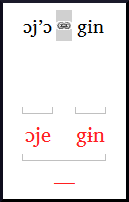

**Introduction**  
Le module précédent a expliqué comment créer une retraduction qui exprime ce que le lecteur comprend quand il lit ou entend le texte. Il existe un autre type de retraduction qui est parfois utilisé et qui est une retraduction mot à mot. Certains consultants peuvent demander ce style de retraduction. Vous pouvez utiliser la fonctionnalité générateur d’interlinéaire de projet.
:::tip Notez
En Paratext 9 vous ne pouvez qu’utiliser le générateur d’interlinéaire avec des projets inscrits.
:::

**Où en sommes-nous dans le  processus ?**  
Vous avez saisi, vérifié et révisé votre traduction dans Paratext afin qu’elle soit prête pour une vérification du conseiller en effectuant une retraduction mot à mot. Avant de commencer, votre administrateur doit créer un projet pour la retraduction mot à mot. [Ceci est distinct de la retraduction libre dans le module précédent.]

**Pourquoi est-il important ?**  
Votre consultant doit avoir une copie de votre traduction dans une langue qu’il peut comprendre. La retraduction effectuée dans le module précédent est très utile, mais il y a des moments où une traduction littérale est plus utile.

**Que ferez-vous ?**  
Premièrement, on configure le générateur d'interlinéaire puis on utilisera la fonction du générateur d’Interlinéaire de projet pour créer automatiquement une glose interlinéaire mot à mot du texte. L’ordinateur est bon, mais les premières propositions de l'ordinateur sont souvent fausses. Heureusement, il apprend au fur et à mesure et devient rapidement très précis. Ensuite, vous corrigez les gloses proposées si nécessaire. Vous voulez que les mots soient traduits correctement bien que l’ordre des mots ne soit pas correct pour cette langue. Lorsque vous êtes satisfait du verset, vous pouvez approuver les gloses et passer au verset suivant avec des gloses non approuvées.

### 17.1 Créer une glose interlinéaire mot à mot

-   Cliquez dans votre projet
-   **≡ Onglet**, sous \> **Outils** \> **Générateur d’Interlinéaire**

    

-   Cliquez pour dérouler la liste [1]
-   Choisissez de créer des gloses à partir d'un texte modèle. Il s'agit généralement de votre texte de référence ou de votre projet de retraduction libre [2].
-   Choisissez votre texte modèle [3].
-   Cliquez sur **OK**

### 17.2 Corriger l’interlinéaire

Vous n’avez pas besoin de confirmer les gloses correctes. Toutes gloses qui ne sont pas corrigées seront confirmées automatiquement quand vous approuvez et exportez.

Pour corriger les gloses incorrectes

-   Cliquez sur la glose  
    *Une liste s'affiche.*

-   Soit cliquez une glose sur la liste

    soit tapez une glose dans la case de texte

-   Cliquez sur **Entrée**

### 17.3 Traduire/gloser une expression

-   Cliquez entre les deux mots

    

-   Cliquez sur l’icône  **Lier mots**
-   Cliquez sur la ligne rouge en bas
-   Saisissez la glose

### 17.4 Ajouter des mots supplémentaires

-   Cliquez entre deux gloses
-   Saisissez le(s) mot(s) supplémentaires

### 17.5 Spécifier la morphologie

-   Cliquez sur un mot dans la ligne de la langue de la traduction
-   Cliquez sur « **Ajouter analyse de mot** »
-   Ajouter **des espaces** entre les morphèmes et « + » aux limites du morphème
-   Cliquez sur **OK**

### 17.6 Exporter/approuver le texte

Quand vous approuvez et exportez le texte, toutes gloses rouges restantes seront approuvées.

-   Cliquer sur **Approuver les gloses**
-   Pour continuer, cliquez **Verset suivant non approuvé**

### 17.7 Aide

:::info
Pour plus d'aide lors de l'utilisation de la fonction Interlinéariser, voir les rubriques suivantes dans l'Aide de Paratext :
:::

-   Introduction pour générateur d'interlinéaire (Introduction to Project Interlinearizer)
-   Comment ouvrir l'outil de générateur d'interlinéaire? (How do I open the Project Interlinearizer?)
-   Comment générer une retraduction mot-à-mot? (How do I generate an interlinear back translation?)
-   Comment créer une retraduction avec l'outi de générateur d'interlinéaire? ((How do I create a back translation project with the Interlinearizer?)
-   Comment créer un projet d'adaptation avec l'outil de générateur d'interlinéaire? (How do I create a text revision/adaptation project with the Interlinearizer?)
-   Qu'est-ce que les couleurs des gloses dans d'interlinéaire veulent dire? (What do the colours of glosses mean in the Interlinearizer?)
