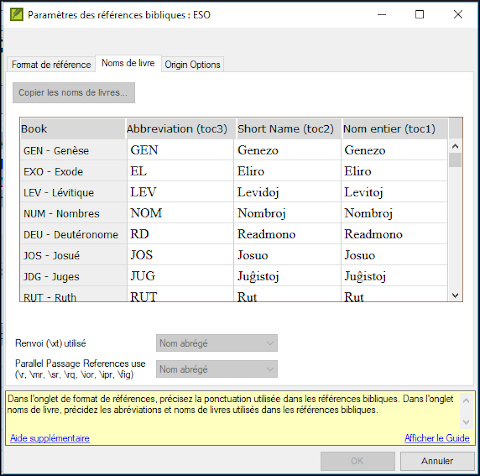
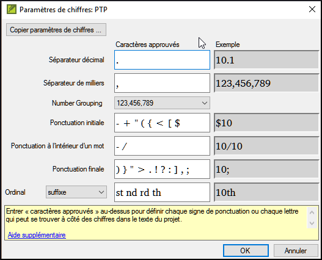

**Introduction**  
Dans ce module vous apprendrez comment diriger les vérifications de base restantes (les références, le texte cité, les numéros, la ponctuation en paires et les citations). Comme dans les deux premiers modules de vérifications de base, il est plus facile de diriger les vérifications du plan de projet. Toutefois, si vous voulez vérifier plus qu'un livre, vous devez effectuer les vérifications du menu vérification.

**Où en sommes-nous dans le processus ?**  
Vous avez saisi votre traduction en Paratext. Assurez-vous que vous avez fait les vérifications décrites dans les modules BC1 et BC2 avant la continuation. Et que votre administrateur a soit fait l'installation pour les vérifications soit est disponible pour faire l'installation avec vous.

**Pourquoi est-il important ?**  
Paratext a onze vérifications de base. Vous avez déjà vu les six premières vérifications. Cette dernière série de contrôles vous aide à trouver les erreurs liées au matériel mentionné d'autres livres. Vous voulez être sûr que les références sont exactes pour que le lecteur puisse trouver ces passages.

**Que ferez-vous ?**  
Comme auparavant, la plupart des vérifications exigent qu'un peu d'installation soit faite par votre administrateur. Dans ce module, vous allez

-   Confirmer que l'installation a été faite
-   Lancer la vérification de base
-   Corriger toutes erreurs.

### 19.1 Erreurs de ponctuation en paires correspondantes

:::tip
Cette vérification regarde la ponctuation qui se produit dans les paires (une ouverture et une fermeture) et énumère des erreurs où un élément du paire n'a pas sa correspondance. Cela peut être délibéré, mais sera plus probablement une erreur, par ex. (), [], etc.
:::

**Inventaire**  
-   **≡ Onglet**, sous **Outils** \> **Inventaires des vérifications** \> **Inventaire d'erreurs de ponctuation en paires correspondantes:**  
    -    *Si la liste est vide, donc il n'y a aucune erreur.*  
-   Si nécessaire, cliquez sur **Options...** pour ajouter d'autres paires.
-   Cliquez sur **OK**

**Faire la vérification**  
-   **≡ Onglet**, sous **Outils** \> **Effectuer les vérifications de base**
-   Cochez “**Erreurs de ponctuation en paires correspondantes**”
-   Cliquez sur **OK**  
    -    *Une liste d'erreurs s'affiche.*  
-   Faites toutes corrections comme nécessaires.

### 19.2 Références

Avant que vous puissiez lancer la vérification de références, votre Administrateur doit définir des paramètres différents.

-   **≡ Onglet**, sous **Paramètres du projet** \> **Paramètres des références bibliques**  
    
-   Pour chaque paramètre, tapez la ponctuation dans la boîte 
    -    *L'échantillon sera actualisé à droite.*  
-   Cliquez sur l'onglet **Noms de livre**  
    
-   Remplisissez les trois colonnes [1] avec l'abréviation, le nom court et le long nom.
-   Choisissez **Abbréviations** [2] et [3] tant pour les renvois que pour les références
-   Cliquez sur **OK**
-   **≡ Onglet**, sous **Outils** \> **Effectuer les vérifications de base**
-   Click « **Références »**
-   Cliquez sur **OK**
-   Corrigez toutes erreurs.

:::tip
Paratext vous informera s'il y a des incohérences entre ces paramètres de titre du livre et les lignes \\toc et vous permettra de résoudre des conflits.
:::

### 19.3 Numéros

:::caution
Avant que vous puissiez lancer la vérification de références, votre Administrateur doit définir des paramètres de chiffres.
:::

-   **≡ Onglet**, sous **Paramètres du projet** \> **Paramètres des chiffres**
-   Remplissez la boîte de dialogue.  
      
-   Cliquez sur **OK**
-   **≡ Onglet**, sous **Outils** \> **Effectuer les vérifications de base**
-   Cochez « **Numéros»**
-   Cliquez sur **OK**

### 19.4 Règles de guillemets

La vérification de citations est utilisée pour garantir que vous avez été cohérent avec les guillemets du discours direct.

:::caution
Avant que vous puissiez lancer la vérification de citation, votre Administrateur doit définir les règles pour vos citations.
:::

-   **≡ Onglet**, sous **Paramètres du projet** \> **Règles de guillemets**
-   Remplisissez les guillemets utilisé pour chaque niveau [1] [2] [3]
-   Cochez "**Surligner les guillemets [8]**"
-   Cliquez sur  **OK**.

### 19.5 Vérification des citations

-   **≡ Onglet**, sous **Outils** \> **Effectuer les vérifications de base**
-   Cochez **Citations**
-   Cliquez sur **OK**.  
    -    *Une liste d'erreurs est affichée. Il montre des erreurs possibles, mais inclut quatre citations correctes auparavant et après l'erreur possible.*
-   Double-cliquez sur le premier élément qui ne commence pas par «…»
-   Corrigez si nécessaire.
-   Cliquez sur le bouton **Relancer** pour confirmer que vous avez corrigé l'erreur.

### 19.6 Texte cité

:::tip
La vérification de texte cité regarde le texte dans les notes en bas de page ou les renvois qui a été marqué avec les marqueurs \\qt … \\qt \*. Il vérifie que le texte cité correspond au texte dans le verset.
:::

-   **≡ Onglet**, sous **Outils** \> **Effectuer les vérifications de base**
-   Cochez **Quoted text (texte cité)**
-   Cliquez sur **OK**.  
    -    *Une liste d'erreurs est affichée.*
-   Corrigez si nécessaire.
:::tip
N.B. : Le texte doit être exactement le même comme dans le texte. C'est-à-dire, on ne peut pas avoir même la ponctuation supplémentaire entre les marqueurs \\qt … \\qt \*.
:::
