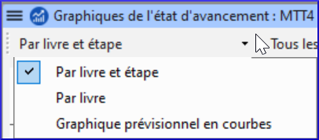

**Introduction**  
Dans ce module vous créerez un rapport sur l'état d'avancement.

**Où en sommes-nous dans le processus ?**  
Comme vous avez travaillé sur votre traduction, vous avez actualisé votre plan de projet avec votre progrès sur les chapitres accomplis et les livres. Maintenant vous préparerez un rapport.

**Pourquoi est-il important ?**  
Vos administrateurs et bailleurs ont besoin des rapports exacts de votre progrès.

**Que ferez-vous ?** 
-   Vous allez vérifier que votre plan de projet est à jour.
-   Vous allez produire plusieurs rapports.

### 21.1 Vérifier votre plan

-   Ouvrez votre projet
-   Cliquez sur l'icône de plan de Projet
-   Actualisez votre progrès comme nécessaire.

### 21.2 Produire les courbes de progression

-   Du menu **Onglet**, sous **Projet** choisissez **Graphiques de l'état d'avancement**
-   Cliquez sur la flèche bas dans la liste à gauche.

    

-   Choisissez comme appropriés (p.ex. Graphique prévisionnel en courbes).

    *Une fenêtre s'affiche avec un graphique)*

-   Cliquez sur l'icône d'imprimante

    *Une fenêtre s'affiche.*

-   Cliquez sur l'icône **Print**

    *Une boîte de dialogue s'affiche*

-   Choisissez votre imprimante (ou PDF creator)
-   Cliquez sur **OK**
