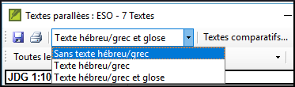
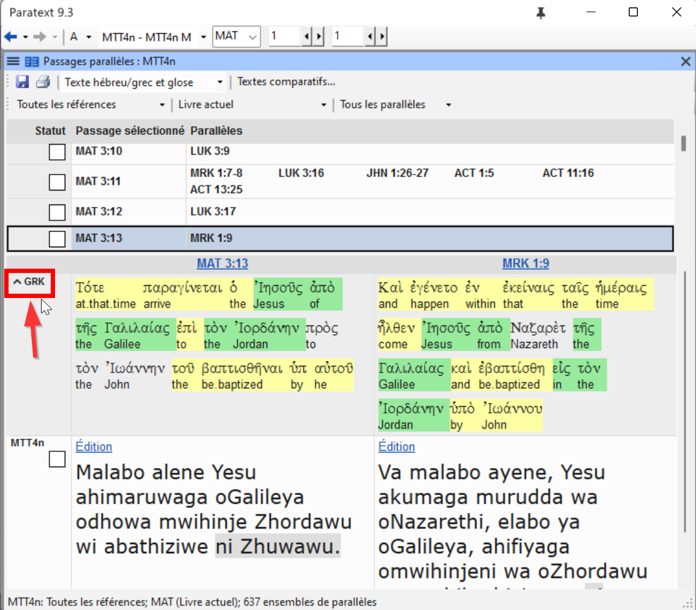
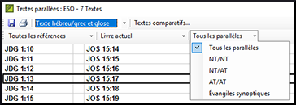
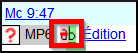
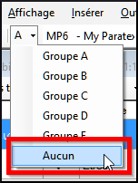

**Introduction**  
Il y a des milles des passages dans un NT où le même événement est décrié ou qui citent un autre verset. On doit comparer ces textes pour vérifier qu’il est cohérent.

**Où en sommes-nous dans le processus ?**  
Normalement, vous aurez déjà traduit et vérifié les textes avec un conseiller avant de comparer les textes.Bien qu'il y ait des temps que vous voudrez comparer les autres versets avant que vous traduisez le deuxième passage.

**​Pourquoi cette aptitude est-elle importante ?**  
Les passages parallèles doivent être cohérents, mais ils ne doivent pas toujours être exactement le même. Paratext peut vous surligner quand la forme du texte est la même, mais c’est le sens (et pas nécessairement la forme) qui est important. Souvent ces comparaisons sont faites après avoir traduit les passages parce qu’on ne veut pas être influencé par ce que peut être une mauvaise traduction. Mais il y a des fois qu’on veut voir un autre passage d’un différent livre en même temps.

**​Qu’est-ce qu’on va faire ?**  
-   vous utilisez l’outil Textes parallèle pour comparer les textes.
-   grâce aux nouvelles cases on peut savoir quels passages sont déjà finis et aussi s’il un passage était changé après vous l’avez vérifié.
-   filtrer pour voir les versets qui étaient changé
-   ouvrez une fenêtre de référence rapide dans Paratext pour voir un autre passage pendant que vous traduisez.
-   vous apprendrez comment ouvrir un troisième passage en même temps que votre passage principal et en plus de la fenêtre de référence rapide.

### 23.1 Ouvrir la fenêtre de Textes parallèles

-   Naviguez au livre/chapitre/verset voulu.
-   **≡ Onglet**, sous **Outils** \> **Textes parallèles**

    *Une fenêtre s'affiche avec une liste de références et des passages.*

### 23.2 Afficher les textes sources

-   Cliquez sur la liste déroulante (options de hébreu/grec)

    

-   Choisissez comme désiré  
    *Les changements d'affichage.*

:::tip
Vous pouvez réduire ou développer le grec / l'hébreu en cliquant sur la petite flèche.  
   
:::

### 23.3 Sélectionner des Textes comparatifs

-   Cliquez sur le bouton **Textes comparatifs**
-   Cliquez sur une ressource (à gauche)
-   Cliquez sur la flèche droite
-   Répétez si nécessaire
-   Cliquez sur **OK**

### 23.4 Filtres

-   Choisissez les filtres comme désiré: [Tous les parallèles, NT/NT, NT/AT, AT/AT, Evangiles synoptiques]

    

### 23.5 Comparer des passages

-   Cliquez dans une ligne dans la partie en haut.  
    *Les textes s’affichent en bas.*

:::info
Le texte est affiché en **gris** (dans un projet) ou en **vert** (dans les textes sources) lorsque le texte est exactement le même que dans l'autre passage.  
Le texte est affiché en jaune (dans les textes sources) lorsqu'il a le même sens (ou la même pensée) même s'il n'est pas exactement le même que dans l'autre passage.
:::

:::tip
Si le texte est en vert en grec votre texte doit être la même.
Normalement, si le texte est diffèrent en grec, votre texte doit être diffèrent, mais pas toujours.
:::

### 23.6 Pour faire des corrections

-   Cliquez sur le lien bleu « Édition »
-   Faites les corrections.
-   Cliquez sur **OK**.

### 23.7 Copier un texte

Si les deux passages doivent d'être le même, vous devriez choisir un (normalement votre traduction dernière) et le copier sur l'autre.

-   Cliquez sur le lien bleu « **Édition** »
-   Sélectionnez le texte
-   Copiez (Ctrl+C)
-   Cliquez sur **OK**.
-   Cliquez sur le lien bleu d’autre texte
-   Sélectionnez le texte
-   Collez (Ctrl+V)
-   Cliquez sur **OK**.

    Faites attention s’il y a plus un verset. On ne veut pas coller le \\v.

### 23.8 Marquer un texte comme vérifié

Lorsque les passages parallèles ont été comparés et que vous êtes convaincu qu'ils ont été traduits de manière appropriée,

-   \- Cliquez sur la case à cocher à côté du texte du projet (ou dans la colonne d'état).

Cette coche signifie que l'ensemble des passages parallèles a été approuvé.

## Trois modes d'approbation

-   \- Ouvrez le **menu** de la fenêtre.
-   \- Sous **Affichage**, vous pouvez choisir entre
-   \- **Approuver les ensembles de passages parallèles** - ce qui est le mode par défaut -.
-   \- **Approuver les passages individuellement** les cases à cocher individuel
-   **- Approuver par ensemble ou individuellement**, ce qui vous permet de passer d'un mode à l'autre.

## Pour passer de l'ensemble à l'individuel

-   \- Ouvrez le **menu** de la fenêtre.
-   \- Sous **Affichage**, choisissez **Approuver par ensemble ou individuellement**.

    Initialement, une case à cocher pour l'ensemble est affichée dans la colonne État.

-   \- Passez la souris sur la case à cocher inférieure de l'ensemble.

    Une icône en forme de crayon s'affiche.

-   \- Cliquez sur le **crayon**

    Les cases à cocher passent à l'autre mode, mais uniquement pour cet ensemble de passages.

### 23.9 Les passages qui ont été modifié

Identifier les passages qui ont été modifiés après avoir marqué comme finis.

-   Dans l’outil de Textes parallèles
-   Changez le filtre de passage au « Changed Text »
-   Cliquez sur l'icône « ab ».

    

    *Une fenêtre de comparaison s’affiche en Paratext.*

-   Modifiez le texte si nécessaire.
-   Retourner à l’outil textes parallèles (avec la barre des tâches)
-   Cliquez sur la case pour le cocher est marqué comme fini.

### 23.10 Comparer les textes pendant la traduction

-   Cliquez dans votre projet.
-   **≡ Onglet**, sous **Outils** \> **Aperçu Rapide**

    *Une fenêtre s'affiche avec le groupe défilement à "Aucun/None"*

-   Changez la référence à un autre passage.

### 23.11 Voir un troisième passage

-   Ouvrez votre projet un deuxième fois [**≡ Paratext**, sous **Paratext** \> **Ouvrir** et double-cliquez sur votre projet/ressource]
-   Puis changer la groupe de défilement de **[A]** au « **Aucun** »/None.

    

-   Changez le référence au autre passage.

    Si l'icône du groupe de défilement n'apparaît pas dans la barre d'outils, vous devez alors choisir des menus complets. **≡ Paratext**, sous **Aide** \> **Menus complets.**
