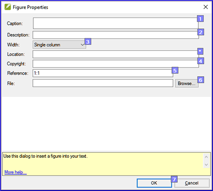

**​Introduction**  
Ce module traite la variété de tâches qu'on doit faire pour finaliser le texte pour la publication.

**Qu’est-ce que vous allez faire ?**  
-   Ajouter des **images** et légendes
-   Trouver les noms des villes pour les cartes
-   Ajouter l’introduction au NT / Bible
-   Vérifier les passages parallèles
-   Vérifier que tous les contrôles sont complets
-   Vérification finale des noms propres
-   Vérifier les chiffres, l’argent, les poids et les mesures
-   Vérification du de la mise en forme.

### 23.1 Choisir les illustrations et légendes

-   Accédez au dropbox ((https://www.dropbox.com/sh/cs0qspb52iwa2rj/AACr9xi7s2LVoheonn0OnjPla?dl=0)
-   Choisissez des images (max 32 pages), noter le noms du fichiers
-   Rédigez des légendes
-   Vérifiez les légendes avec le conseiller

### 23.2 Ajouter des illustrations et légendes

-   Dans votre projet, accédez au verset désiré.
-   Du menu **Insérer**, choisissez **Image**

    

-   Saisissez une **légende** pour être imprimé avec l’image (en votre langue).[1]
-   Saisissez une **description** en français de l’image   
    (ne pas être imprimé) [2].
-   Indiquez si l’image doit remplir la largeur d’une colonne ou d’une page. [3]
-   S'il y a lieu, tapez une plage de vers comme emplacement acceptable. [\*] (facultatif)
-   Entrez les informations de droits d’auteur (copyright) nécessaires sur l’image [4]
-   Paratext va remplir la référence de chapitre et verset qui concerne l’image. [5]
-   Cliquez sur **Parcourir**... pour rechercher le fichier de l’image. [6]
-   Cliquez sur **OK**.

### 23.3 Trouver les noms des villes pour les cartes

:::info
Note à l'enseignant: La liste des noms des villes n'est pas encore disponible dans Paratext 9. Le fichier est disponible ici: <https://raw.githubusercontent.com/erros84/PTManuals/master/Resources/CombinedNTMapBiblicalTerms.xml> et, une fois telechargé, le fichier doit être copier vers "My Paratext 9 Projects".
:::

-   Cliquez dans votre projet.
-   **≡ Onglet**, sous **Outils** \> **Termes bibliques**
-   **≡ Onglet**, sous **Termes bibliques** \> **Sélectionner liste de termes**
-   Double-cliquez sur NTMaps Biblical Terms
-   Filtre sur un nombre de carte spécifique (par ex. [01])
-   Ajouter les équivalents comme normaux.
-   **≡ Onglet**, sous **Termes bibliques** \>\> **Enregistrer au format HTML**
-   Tapez un nom pour le fichier.
-   Cliquez sur **Save/Enregistrer**.

### 23.4 Ajouter l’introduction au NT/Bible

-   Accèdez au livre INT
-   Vérifiez qu'il y a un ligne \\h
-   Entrez votre introduction en utilisant au moins les marqueurs suivant :  
    \\mt1  
    \\is  
    \\ip  
-   Tapez l’introduction du Bible dans le livre **INT**

### 23.5 Vérifier les textes parallèles

-   Voir module [PP Comparer les textes parallèles](PP.md)

### 23.6 Vérifier que tous les contrôles soient complets

**Livre actuel**

-   Ouvre le plan du projet.
-   Vérifiez qu’il n’y a plus de problèmes pour les vérifications.

**Plusieurs livres**

-   Refaites les inventaires.
-   **≡ Onglet**, sous **Outils** \> **Effectuer les vérifications de base**
-   Cochez toutes les vérifications.
-   Séléctionnez tous les livres à publier.
-   Cliquez sur **OK**.
-   Corrigez toutes les erreurs.

**Vérifications du liste de mots**

A partir de la liste de mots, effectuez les vérifications suivantes

-   **≡ Onglet**, sous **Outils** \> **Vérifier l’orthographe** \> **Toutes les vérifications**
-   **≡ Onglet**, sous **Outils** \> **Rechercher les mots semblables**
-   **≡ Onglet**, sous **Outils** \> **Rechercher des mots mal liés ou mal divisés**

### 23.7 Vérification finale des noms propres

-   **≡ Onglet**, sous **Outils** \> **Termes bibliques**
-   **≡ Onglet**, sous **Termes bibliques** \> **Sélectionner la liste des termes bibliques** et choisissez **Termes bibliques principaux**
-   Faites un filtre de noms propres avec les équivalents manquants
-   Vérifier que tous les noms ont un équivalent (ajoutez si nécessaire).

### 23.8 Les chiffres, l’argent, les poids et les mesures

-   Cliquez dans votre projet.
-   **≡ Onglet**, sous **Outils** \> **Termes bibliques**
-   **≡ Onglet**, sous **Termes bibliques** \> **Sélectionner la liste des termes bibliques**
-   Choisissez la liste approprié.
-   Ajouter les équivalents comme normaux.

### 23.9 Vérification du mise en forme

-   Refaites le module VM : Vérification de mise en page d’étape 2.
-   **≡ Onglet**, sous **Outils** \> **Listes de vérifications** \> **Versets longs/Versets courts**
-   **≡ Onglet**, sous **Outils** \> **Listes de vérifications** \> **Mots ou expression**
-   **≡ Onglet**, sous **Outils** \> **Listes de vérifications** \> **En-têtes de section**
-   **≡ Onglet**, sous **Outils** \> **Listes de vérifications** \> **Titres de livres**
-   **≡ Onglet**, sous **Outils** \> **Listes de vérifications** \> **Références**

**≡ Onglet**, sous **Outils** \> **Listes de vérifications** \> **Notes de bas de pages**
