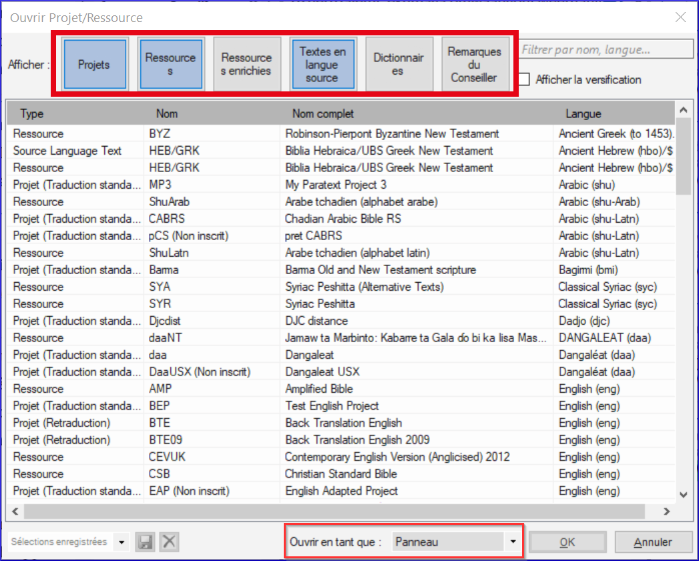
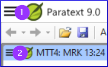
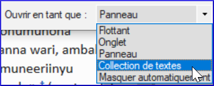
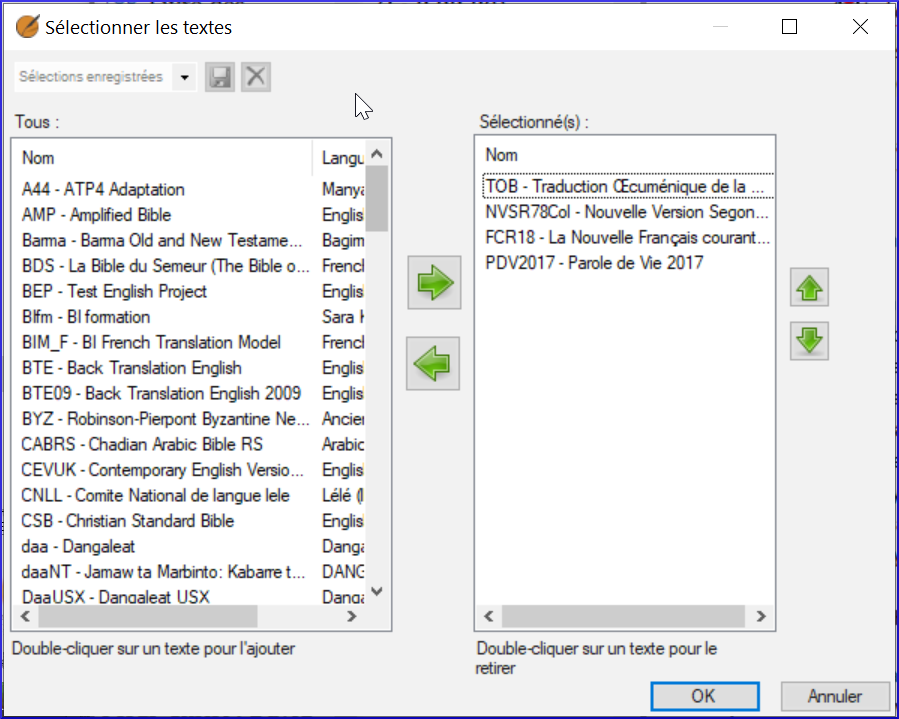
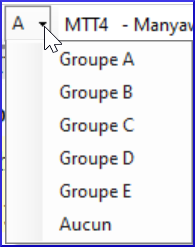
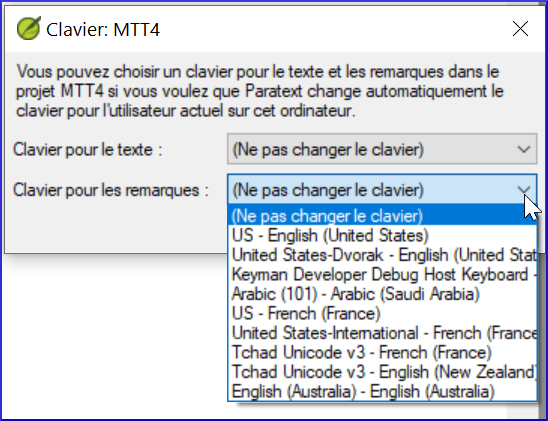
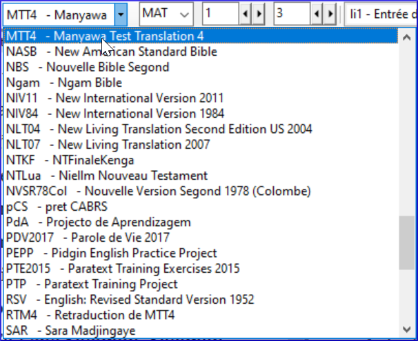
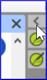

## 0.2.1a Comment changer la langue de l'interface utilisateur

[Regarder le vidéo](https://vimeopro.com/lingtransoft/paratext9fr/video/410254311)

L'interface Paratext est disponible dans de nombreuses langues.

-   Cliquez sur Menu Paratext **≡** \> sous Menu Paratext \> **Paramètres paratext**
-   Dans le menu déroulant, de la liste des **interface langues** \> Choisir une langue \> **OK**

    

## 0.2.1b Les bases des projets et des ressources

[Regarder le vidéo](https://vimeopro.com/lingtransoft/paratext9fr/video/411837591)

Paratext vous permet d'afficher plusieurs projets ou ressources en même temps. Chaque projet ou ressource est affiché dans une fenêtre, avec sa propre barre de titre et son propre menu. Les projets peuvent être modifiables, mais les ressources ne le sont jamais.

## Pour ouvrir un projet ou une ressource

-   Cliquez sur le menu principal de Paratext **≡**, puis cliquez sur **Ouvrir**.

    La boîte de dialogue Ouvrir le projet/ressource s’affiche.

    

## Filtrer ou rechercher les fichiers souhaités

-   La rangée de boutons en haut de la boîte de dialogue vous permet de filtrer les types de fichiers que vous voyez affichés dans la liste ci-dessous.
-   Vous pouvez également afficher tous les types de fichiers et utiliser ensuite la boîte de recherche pour trouver le fichier que vous devez ouvrir.

## Pour ouvrir un fichier :

-   Cliquez sur le nom de fichier dans la liste
-   Choisissez le type de fenêtre (panneau, onglet, fenêtre flottante, etc.)
-   Cliquez sur **OK**.

    Une nouvelle fenêtre s'ouvre, qui affiche le fichier sélectionné.

Lorsque vous démarrez Paratext, il rechargera exactement les mêmes fenêtres qui étaient ouvertes la dernière fois. Il place également votre curseur dans le verset où le curseur était en dernier.

## 0.2.1c Trouver des éléments de menu

[Regarder le vidéo](https://vimeopro.com/lingtransoft/paratext9fr/video/446470153)

N'oubliez pas qu'il existe deux menus - un pour l'ensemble de Paratext (1) et le second pour toute fenêtre ou volet de projet (2)..

-   

Il y a trois autres choses à savoir sur les menus :

1.  Pas seulement des projets et des ressources, mais d'autres fenêtres ont leurs propres menus
2.  Il y a deux ensembles de menus, standards et complets.
-   Un menu standard peut être développé en cliquant sur la flèche en bas.
1.  Vous pouvez rechercher les commandes du menu
-   Cliquez sur la zone de recherche, tapez la commande

    

-   Cliquez sur la commande souhaitée dans la liste des résultats

    

La recherche de menu fonctionne même si vous êtes dans des menus standard et que la commande que vous recherchez est normalement cachée. La même recherche affiche également des rubriques d'aide.

## 0.2.1d Arranger les fenêtres

[Regarder le vidéo](https://vimeopro.com/lingtransoft/paratext9fr/video/412695128)

Une fenêtre dans Paratext peut être configurée pour être affichée sous la forme d’un panneau, d’un onglet, d’une fenêtre déplacée vers masquer automatique ou d’une fenêtre flottante.

**Ouvrir une fenêtre comme un type spécifique:** Dans la boîte de dialogue **Ouvrir un projet/une ressource**, utilisez la liste déroulante Ouvrir en tant que.

**Réorganiser** Cliquez sur la barre de titre et faites glisser les panneaux pour les réarranger, relâchez la souris lorsque la zone bleue se trouve à la position souhaitée. La zone bleue indique l'endroit vers lequel un panneau en cours de glissement se déplacera.

**Redimensionner:** Les fenêtres peuvent être redimensionnées en faisant glisser les bordures.

**Convertir:** Pour convertir une fenêtre en une fenêtre masquer automatiquement ou flottante, cliquez avec le bouton droit de la souris sur la barre de titre et sélectionnez l'option appropriée.

**Masquer automatique:** Cliquez sur le bouton (dans la colonne latéral) pour le voir, Cliquez en dehors de cette fenêtre ou à nouveau sur le bouton pour la cacher. Faites un clic droit sur une barre de titre pour la déplacer vers masquer automatique.

**Fenêtre flottante:** C'est un bon moyen de maximiser une fenêtre ou de l'envoyer sur un deuxième écran

Clic droit sur la barre de titre \> Ouvrir comme fenêtre flottante.

[Pour revenir : Clic droit \> *Ajuster la fenêtre*]

**Enregistrer la mise en page actuelle**

-   Cliquez sur le menu Paratext et sélectionnez « *Enregistrer la disposition de fenêtres actuelle*. ».
-   Donnez à la disposition un nom qui vous aidera à vous souvenir de ce qu’elle contient.
-   Cliquez sur **OK**.

    Le nom de la mise en page est maintenant affiché dans le menu principal de Paratext.

## Afficher une disposition différente

-   Cliquez sur le **menu Paratext**, puis sur le nom de la disposition.

    Paratext ouvre les fenêtres.

## 0.2.2a Comment ouvrir et modifier une collection de textes

[Regarder le vidéo](https://vimeopro.com/lingtransoft/paratext9fr/video/419872321)

Une collection de textes nous permet d'afficher plusieurs ressources dans une seule fenêtre. Contrairement à une fenêtre à onglets, une collection de texte nous montre un verset à la fois de chaque ressource. Une fenêtre de collection de textes a les mêmes options d'affichage que toute autre fenêtre de paratexte.

**Créer une collection de texte**

-   Fermer toutes les ressources déjà ouvertes
-   Cliquez sur le bouton "Ouvrir" de la barre d'outils.
-   Maintenez la touche CTRL enfoncée tout en cliquant pour sélectionner plusieurs fichiers.
-   Dans la liste déroulante Ouvrir en tant que, sélectionnez Collection de texte.

    

-   Cliquez sur **OK**.

    Paratext ouvre les ressources sélectionnées dans une nouvelle fenêtre et affiche le verset actuel.

## Collection de texte - voir plus de contexte [01:58]

-   Cliquez sur l'hyperlien bleu du nom d'une ressource OU
-   Cliquez sur Menu Onglet **≡**, sous **Afficher** \> **Deux volets**

## Collecte de textes - fermer le volet de droit

-   Cliquez sur le petit X dans le volet de droite.
-   OU Cliquez sur le bouton de menu de la barre de titre, sous **Affichage**, cliquez sur **Deux volets**

## Modifier la collection de textes

Vous pouvez modifier la collection de textes en changeant l'ordre des ressources, en supprimant une ressource ou en ajoutant une ressource.

## Modifier l'ordre des ressources [02:42]

-   Cliquez avec le bouton droit sur un seul, puis sélectionnez Déplacer vers le haut ou déplacer vers le bas.

## Supprimez une ressource de la collection de texte.

-   Si nous voulons supprimer cette ressource, **cliquez avec le bouton droit** de la souris et sélectionnez **Fermer**.

## Ajouter des ressources [03:03]

-   Ouvrez le menu **≡**,de ce volet.
-   Cliquez sur Modifier la collection de texte.

    La boîte de dialogue **Sélectionner pes textes** s'ouvre.

    

    La liste de gauche présente tous les projets et ressources disponibles.

    La liste de droite correspond à ce qui est actuellement affiché dans la fenêtre de collecte de texte.

-   Cliquez sur les flèches **gauche** ou **droite** pour ajouter ou supprimer des ressources
-   Cliquez sur la flèche **vers le haut** ou **vers le bas**t pour réorganiser les ressources
-   Cliquez sur **OK** pour effectuer des modifications dans la fenêtre de collection de texte.

## 0.2.3a Comment contrôler quelles fenêtres défiler ensemble

[Regarder le vidéo](https://vimeopro.com/lingtransoft/paratext9fr/video/424066973)

L'utilisation des groupes de défilement vous permettent de rechercher une référence différente sans que toutes les fenêtres ne défilent vers la nouvelle référence. Paratext permet jusqu'à cinq groupes de défilement différents, de A à E. En outre, nous pouvons choisir Aucun (qui ne défilera pas).

Le petit contrôle déroulant qui contient la lettre A est la façon dont nous contrôlons les groupes de défilement.

## Modifier le groupe de défilement

-   Cliquez pour activer la fenêtre
-   Cliquez sur le groupe de défilement de la barre d’outils
-   Choisissez le groupe de défilement souhaité

    

    Les petites lettres sont indiquées à côté des abréviations du projet sur les barres de titre des fenêtres lorsque celles-ci ne font pas toutes partie du groupe A.

    Lorsque vous ouvrez une nouvelle fenêtre, elle se trouve dans le même groupe de défilement que la dernière active.

## 0.2.3b Comment définir le clavier par défaut pour un projet

[Regarder le vidéo](https://vimeopro.com/lingtransoft/paratext9fr/video/425987455)

Paratext peut être configuré pour activer un clavier automatiquement lorsque le curseur est dans un projet qui en a besoin [à condition que Keyman et le clavier soient installés.]

-   Cliquez sur le menu Projet **≡**
-   Déplacez la souris sur paramètres du projet.
-   Dans le sous-menu, sélectionnez **Clavier**.

    La boîte de dialogue du clavier pour ce projet s'ouvre.

    

-   Choisissez le clavier Keyman pour saisir du texte.
-   Choisissez le clavier pour la saisie des notes.
-   Cliquez sur **OK**.

## 0.2.3c Comment échanger un texte dans une fenêtre

[Regarder le vidéo](https://vimeopro.com/lingtransoft/paratext9fr/video/433948282)

Vous pouvez modifier le texte affiché dans une fenêtre. C'est une façon d'ouvrir un texte différent au lieu d'un de vos textes ouverts, en laissant la disposition de vos fenêtres inchangée.

-   Cliquez dans la fenêtre que vous souhaitez modifier.
-   Dans la barre d'outils, cliquez sur la liste des projets.

    

-   Sélectionnez le texte que vous souhaitez afficher.

    La fenêtre affiche désormais la nouvelle version à la place et la disposition des fenêtres reste la même.

    N'oubliez pas que si vous avez enregistré cette disposition des fenêtres lorsque l'autre version était là, elle a été enregistrée dans cette position et sera rouverte si vous utilisez à nouveau la disposition enregistrée. Si la sélection de texte actuelle est celle que vous souhaitez utiliser à l'avenir, sauvegardez à nouveau la mise en page telle qu'elle est actuellement.

    Notez: Pour l’instant, vous ne pouvez ouvrir qu’une autre ressource similaire dans la fenêtre à l’aide de la liste de projets (c.-à-d. Projet, Ressources enrichies, Termes bibliques).

## 0.2.3d Autre astuces sur les dispositions des fenêtres

[Regarder le vidéo](https://vimeopro.com/lingtransoft/paratext9fr/video/419314037)

## Conseil 1 : Comment changer de fenêtre

-   L'échange de deux fenêtres peut impliquer deux ou plusieurs étapes. [Par exemple, faites glisser l'une d'entre elles vers le bord gauche et obtenez une colonne supplémentaire, puis faites glisser l'autre vers le coin inférieur droit (pour revenir au nombre initial de colonnes).
-   Une autre façon d'échanger ces deux textes est d'utiliser la liste des projets.

## Conseil 2 : Comment annuler le déplacement d’une fenêtre

Si vous faites une erreur avec un déplacement,

-   Cliquez sur le menu principal de **≡ Paratext**.
-   Cliquez sur Annuler le déplacement d’onglet.

## Conseil 3 : Comment désancrer les fenêtres flottantes

-   Lorsque la punaise est inclinée, cette fenêtre ne reste plus tout le temps au dessus.

    

-   Si vous voulez qu'il reste toujours au sommet, cliquez sur l'icône de la punaise pour l'épingler.
-   

## Conseil n°4 : Comment élargir la colonne Masquer automatiquement

La colonne Masquer automatiquement peut être rendue un peu plus large si vous le souhaitez.

-   Cliquez sur la flèche en haut de la colonne.

    

## Conseil 5 : Comment annuler la fermeture d’une fenêtre

-   Cliquez sur le menu principal de **≡ Paratext**
-   Choisir Annuler la fermeture de l’onglet

## 0.2.3e Comment consulter d'autres textes liés à la Bible dans Paratext

[Regarder le vidéo](https://vimeopro.com/lingtransoft/paratext9fr/video/443500451)

De nombreux livres non bibliques sont répertoriés après Apocalypse (REV) (également les livres deutérocanoniques)

S'ils ont été créés dans le projet, vous pouvez accéder à ces livres en cliquant sur "Sélectionner un livre" dans la barre d'outils.

-   par exemple GLO, XXA ... XXG

    

## 0.2.4 Navigeur rapide aux versets bibliques

[Regarder le vidéo](https://vimeopro.com/lingtransoft/paratext9fr/video/449749686)

## Aller à une référence biblique spécifique

-   **Ctrl+ B**
-   Tapez l’abréviation de 3 lettres du nom du livres :
-   Tapez **ÉSPACE**, puis tapez le numéro de chapitre
-   Appuyez sur **ÉSPACE** typez le numéro de verset, appuyez sur  **ENTRÉE**

## Aller au début d'un livre

-   **Ctrl+ B**, tapez l'abréviation de 3 lettres du nom du livre appuyez sur **ENTRÉE**

## Aller au début d'un chapitre

-   **Ctrl+ B,** tapez l'abréviation de 3 lettres du nom du livre
-   Tapez **ÉSPACE** tapez le numéro de chapitre appuyez sur **ENTRÉE**

## Aller à un livre par titre

-   **Ctrl+B**
-   Commencez à taper le titre du livre
-   Choisissez dans la liste.
-   Appuyez sur **ENTRÉE**
