**1.1 But**

Les participants traiteront leur traduction à l’aide de Paratext 9, qui est un logiciel créé pour stocker et vérifier les textes de la traduction. Ainsi on suit les six étapes du plan de SIL du processus de traduction.

On suit les six étapes du plan de SIL du processus de traduction. [Les quatre étapes de ABU sont 1, 2, 5 et 6.]

**1.2 Objectifs**

À la fin de ce cours, le participant sera capable de :

-   Lancer le programme Paratext 9 à l’aide de l’icône sur le bureau (ou menu Démarrer).

*Étape 1 : Première ébauche*

**Ouvrir des projets et des ressources pour comprendre le texte avant de traduire**

-   Ouvrir des projets et des ressources supplémentaires, par exemple des Bibles françaises, les textes sources, les dictionnaires, etc.
-   Organiser plusieurs fenêtres sur l’écran.

**Saisir la traduction**

-   Utiliser efficacement la barre d’outils de navigation pour se déplacer vers le livre, le chapitre et le verset biblique désiré.
-   Saisir le texte dans un projet ouvert à l’aide des marqueurs USFM tels que \\c, \\v, etc.
-   Utiliser un clavier (MS-clavier ou Keyman) pour saisir les caractères spéciaux.
-   Ajouter des éléments supplémentaires tels que les titres de section, les introductions, etc.
-   Ajouter des notes de bas de page.
-   Faire une ébauche des entrées de glossaire et les ajouter avec l'outil de termes biblique.
-   Utiliser la fonction Envoyer/recevoir pour sauvegarder le projet sur Internet ou sur une clé USB.

**Vérifications de base**

-   Exécuter les vérifications pour s’assurer que tous les chapitres/versets sont présents.
-   Exécuter la vérification afin de s’assurer que les éléments de texte sont correctement marqués (marqueurs, styles, etc.).

**Progrès du projet**

-   Mettre à jour le progrès de projet

**Étape 2 : Vérifications par l’équipe**

**Noms propres**

-   Translittérer les noms propres.
-   Vérifiez que les noms propres ont été translittérés selon les règles convenues et sont cohérents.

**Termes bibliques**

-   Utiliser l'outil **Termes Bibliques** pour s'assurer que l’utilisation des termes est cohérente.

**Glossaire**

-   Faire une ébauche des entrées de glossaire et les ajouter avec l'outil de termes biblique.

**Vérifications**

-   Utiliser les listes de vérifications pour corriger les problèmes de mises en forme dans les en-têtes, les paragraphes, la mise en page et les retraits.
-   Effectuer les vérifications de bases pour assurer que tous les caractères, ponctuations, mise en majuscule et mots répétés sont valides.

    (Votre administrateur doit configurer les inventaires/paramètres comme nécessaires.)

-   Corriger les fautes d’orthographe en utilisant l’outil **Vérifier l’orthographe** du texte et/ou les vérifications de la liste de mots.

**Utiliser des remarques**

-   Ajouter des remarques pour communiquer avec l’équipe et la conseillère ou le conseiller.
-   Ajouter les remarques du projet, de l’orthographe et des termes bibliques y compris les décisions prises.

**Imprimer des ébauches**

-   Produire des fichiers PDF pour imprimer des textes du projet pour les réviseurs.

**Étape 3 : Préparation pour le conseiller**

-   Faire des retraductions
-   Retraduction 1 (libre)
-   Retraduction 2 (mot à mot)
-   Faire d’autres vérifications

**Étape 4 : Vérification par un conseiller**

-   Utiliser des outils de collaboration appropriés pour que l'équipe puisse interagir avec le conseiller.

**Étape 5 : Tester/réviser avec la communauté**

-   Rapport de progrès à faire
-   Rapport de Termes bibliques à faire

**Étape 6 : Finalisation pour la publication**

-   Ajouter des illustrations et légendes
-   Trouver les noms des villes pour les cartes
-   Ajouter l’introduction au NT / Bible
-   Vérifier les passages parallèles
-   Vérifier que tous les contrôles sont complets
-   Vérification finale des noms propres
-   Les chiffres, l’argent, les poids et les mesures
-   Vérification de la mise en forme

**1.3 Plan du cours**

*Présentations, préparations*

**Se présenter**

Les participants et encadrants doivent se présenter en donnant :

-   leur nom
-   leur langue
-   leur ville
-   quelles sont la première et la dernière version de Paratext que vous avez utilisées.

Pendant que les facilitateurs installent Paratext 9 sur les ordinateurs, les participants liront le matériel d'introduction et cocheront (vérifieront) les objectifs qu'ils maîtrisent bien dans la version la plus récente de Paratext qu'ils ont utilisée.

**Pour chaque module**

-   Faire une activité de révision du module précédent.
-   Présenter l’introduction (lectures, sketch, PowerPoint, etc.)
-   Lire les aptitudes pour ce module. Si une aptitude est assez simple, demander à un participant de venir démontrer l’aptitude.
-   Suivre les résumés pour les autres aptitudes :
-   Démonstration
-   Reprendre ensemble
-   Permettre aux participants de les faire eux-mêmes
-   Demander à un participant de démontrer les aptitudes.
-   Poser des questions.
-   Faire des activités de révision/bilan.

Donner aux participants le temps de réfléchir, de compléter l'exercice de bilan, et de les ajouter à Anki.

**Part II**

**Étape 1 – Première ébauche**

**Introductionex**

Il y a plusieurs étapes dans un projet de traduction. Dans cette première étape, vous utiliserez des ressources pour vous assurer que vous comprenez bien le texte source, ensuite vous saisissez le texte de votre traduction avec d’autres éléments, par la suite vous commencerez les vérifications préliminaires.

Les modules suivants vous aideront avec cette étape :

-   [**OB – Organisation du bureau**](#sOD)
-   [**PP1 – Plan et progrès du projet** ](#sPP1)
-   [**SD – Saisie des données**](#KD)
-   [**VT1 – Vérifications de base**](#BC1)
-   [**PP2 – Avancement de projet**](#sPp2ProjectProgress)

**2**

**OB – Organisation du bureau**

**Introduction**

Vous désirez travailler sur votre texte en Paratext 9 et consulter les ressources diverses. Dans ce module, vous allez apprendre comment ouvrir des ressources et organiser votre bureau.

**Où en sommes-nous ?**

Nous nous préparez à saisir du texte dans un projet existant. Avant de pouvoir faire ceci, Paratext 9 et les ressources diverses doivent avoir été installés et un projet pour vos données doit avoir été créé.

**Pourquoi cette aptitude est-elle importante ?**

Le traducteur qui organise bien son bureau a toutes les ressources nécessaires pour son travail.

**Qu’est-ce qu’on va faire ?**

On va lancer le logiciel Paratext 9, puis ouvrir une disposition des fenêtres qu’est déjà enregistré. Si nécessaire vous pouvez modifier la disposition des fenêtres et réenregistrer la disposition.

Un certain nombre de vidéos sont disponibles pour vous aider à utiliser les différents types de ressources et à disposer les fenêtres. P.e., 0.2.1b-0.2.1d, 0.2.2a

**Des changements dans Paratext 9**

Les menus ont changé dans Paratext 9. Pour voir le menu, il faut maintenant cliquer sur l'icône du menu ≡. Il existe deux types de menus. Le menu principal Paratext se trouve sur la barre de titre  et chaque fenêtre (ou onglet) a son propre menu.  Lorsque vous cliquez sur l'une de ces icônes de menu, tous les menus sont affichés et il vous suffit de cliquer sur la commande.

Dans ce manuel, on écrit "**≡ Paratext**, sous **Menu** \> **Command**" pour signifier qu'il faut cliquer sur l'icône de menu Paratext ≡, puis sous le menu (par ex. Paratext) choisir la commande (par ex. Ouvrir).

Et on écrit "**≡ Onglet**, sous **Menu** \> **Command**" pour signifier qu'il faut cliquer sur l'icône du menu de l'onglet ≡, puis sous le menu (par ex. Outils) cliquer sur la commande (par ex. Liste de mots).

**2.1 Lancer le programme Paratext**

-   Double-cliquez sur l’icône Paratext 9 sur le bureau

    

    OU

-   (Dans le menu **Démarrer**, choisissez Paratext 9)

**2.2 Ouvrir une disposition des fenêtres**

-   Cliquez sur le menu **≡ Paratext**, sous **Fenêtre**
-   Choisissez une disposition des fenêtres qui est déjà enregistrée.

    *Votre écran doit ressembler à l’image ci-dessous (sinon, voir ci-dessous pour comment ouvrir les fenêtres).*

    

**2.3 Créer une nouvelle disposition**

Si vous n’avez pas encore enregistré une disposition de fenêtres, on vous suggère de faire comme ci-dessous:

**Ouvrir et arranger les fenêtres**

-   Ouvrez 5 fenêtres comme suit :
-   5 = votre projet
-   **≡ Paratext**, sous (**Paratext** \> **Ouvrir** puis cliquez sur projets)
-   1 = équivalents
-   **≡ Onglet**, sous **Outils** \> **Équivalents des termes bibliques**)
-   2 = texte source

    **≡ Paratext**, sous (**Paratext** \> **Ouvrir** puis cliquez sur **Textes en langue source**)

-   3 = dictionnaire

    **≡ Paratext**, sous (**Paratext** \> **Ouvrir** puis cliquez sur **Dictionnaires**)

-   4 = ressources en collection de textes

    **≡ Paratext**, sous **Paratext** \> **Ouvrir** puis cliquez sur **Ressources**, puis ouvrir en tant que Colletion de textes) (voir 2.5)

-   Arrangez les fenêtres comme vous le souhaitez. Voir Paratext vidéo 0.2.1b, c et d.

**Enregistrer la disposition des fenêtres**

Après avoir arrangé les fenêtres comme vous le souhaitez

-   **≡ Paratext**, sous **Mise en page** \> **Enregistrer la disposition des fenêtres**
-   Saisissez un nom

    [ou pour réenregistrer, choisissez un nom existant]

-   Cliquez sur **OK**

**2.4 Supprimer une disposition des fenêtres**

Si vous ne voulez plus garder une disposition des fenêtres,

-   **≡ Paratext** menu, sous **Mise en page** \> **Supprimer la disposition des fenêtres**
-   Choisissez le nom de la disposition enregistré.
-   Cliquez sur **Supprimer**

**2.5 Ouvrir Projet/Ressource en collection de textes**

Avec Paratext, il est possible d’avoir plusieurs projets/ressources ouverts au même moment. Mais au lieu d’avoir trop de fenêtres, il vaut mieux ouvrir plusieurs ressources dans une seule fenêtre en collection de textes.

-   **≡ Paratext** menu, sous **Paratext** \> **Ouvrir**

    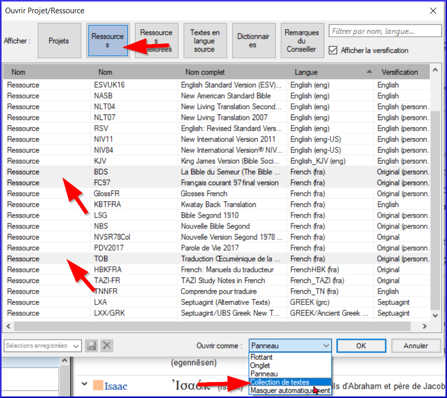

-   Cliquez sur le bouton ressources
-   Ctrl+cliquez sur des ressources désirés
-   Répétez si nécessaire
-   Cliquez sur la liste déroulante "**Ouvrir comme**"
-   Choisissez **Collection de textes**
-   Cliquez sur **OK**

N.B. Il est suggéré que les ressources soient présentées dans l’ordre de la plus littérale à la moins littérale (pour mettre l’accent sur les textes les plus fidèles aux textes sources). Pour les ressources en français, l’ordre suivant est suggéré : TOB, NVSR78Col, NBS, BDS, FC97, PDV11. Parmi les ressources en anglais : ESV, RSV, NIV, NLT.

-   Pour modifier l'ordre des textes d'une collection de textes.
-   **≡ Onglet**, **Modifier la collection de textes**
-   
-   Utilisez les boutons fléchés pour changer l'ordre si nécessaire.
-   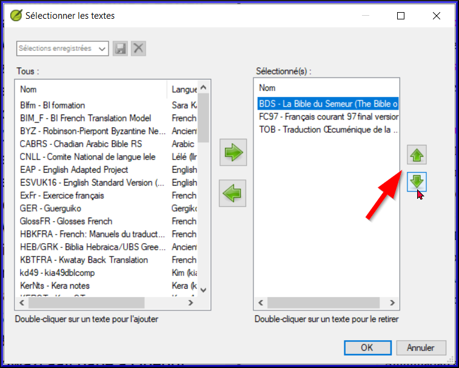
-   Effectuer toute autre modification
-   Cliquez sur **OK**

    Vous pouvez changer le texte qui remplira le volet à droite en cliquant sur le lien bleu de la ressource. En Paratext 9 on peut changer l’affichage à aperçu/non formaté/standard (normal).

**2.6 Ouvrir une ressource enrichie**

-   **≡ Paratext** menu, sous **Paratext** \> **Ouvrir**
-   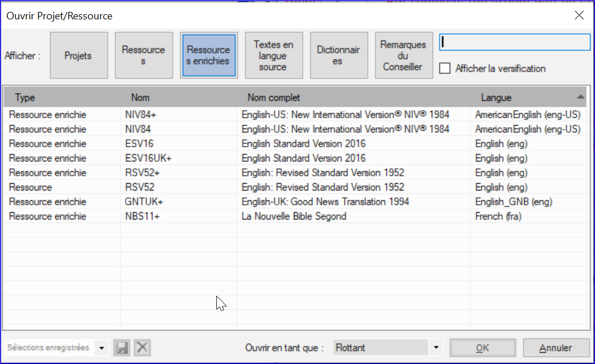
-   Cliquez sur **Ressources enrichies**

    Une ressource enrichie contient un dictionnaire, des images, etc. Lorsque vous ouvrez une ressource enrichie, un guide s'ouvre également.

**2.7 Ouvrir un dictionnaire**

Si vous n'utilisez pas de ressource enrichie, vous pouvez ouvrir un dictionnaire de langue source avec des gloses en français :

-   **≡ Paratext** menu, sous **Paratext** \> **Ouvrir**
-   
-   Cliquez sur **Dictionnaires**
-   Choisissez « A Concise Greek-English Dictionary of the New Testament » OU "Trilingual Hebrew-English Lexicon of the Old Testament"
-   Cliquez sur **OK**
-   **≡ Onglet**, sous **Affichage** \> **français**

D'autre dictionnaires (en anglais, mais avec des photos)

-   "Plants and Trees in the Bible"
-   "Animals in the Bible"

**2.8 Travailler avec le text en langue source**

Vous pouvez ouvrir le text en langue source avec des gloses en français.

-   **≡ Paratext**, sous **Paratext** \> **Ouvrir**

    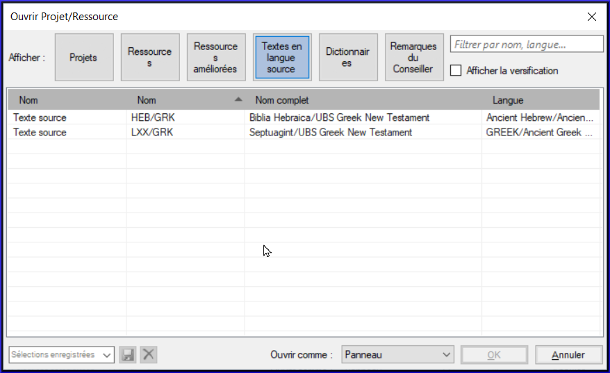

-   Cliquez sur **Textes en langue source**
-   Choisissez le HEB/GRK
-   Cliquez sur **OK**
-   **≡ Onglet**, sous **Affichage** \> **Gloses supplémentaires**
-   Choisissez le projet avec les gloses (GlossFR)
-   Cliquez sur **OK**

**3**

**PP1 – Plan et progrès du projet **

**Introduction**

On utilise le plan du projet pour nous aider à organiser notre travail et pour voir les taches à faire prochainement. Dès qu’on a fini une tâche, on la note comme fini pour qu’il soit dans le rapport des tâches accomplies. [Si vous avez utilisé une version précédente, vous allez voir que c’est bien amélioré en Paratext 9.]

**Où en sommes-nous ?**

Avant que vous puissiez utiliser le plan, quelqu’un doit l'avoir ajouté et le configurer. [C’est normalement votre administrateur du projet ou votre conseiller en technologie linguistique.]

**Pourquoi cette aptitude est-elle importante ?**

Il y a beaucoup de taches à faire dans un projet de traduction. C’est important d’avoir un système pour nous assurer que tous ont été faits. Puisque votre plan a été configuré, vous pouvez utiliser le plan pour voir quelles tâches ont été affectées (confiées) à vous. Lorsque vous avez terminé la tâche, vous pouvez marquer la tâche comme achevée et voir la tâche suivante à faire. Vous pouvez utiliser cette information pour générer les rapports pour les administrateurs et bailleurs de fonds.(Voir [Produisez un rapport sur l'état d'avancement](#sProduceAProgressReport).)

**Qu’est-ce qu’on va faire ?**

Vous marquerez une variété de tâches comme achevées. Les étapes exactes varieront légèrement, selon si la tâche est fixée à une fois par projet, une fois par livre, ou par le chapitre. L'endroit pour marquer le progrès pour tous les types de tâches est la colonne Status (Statut).

**3.1 Afficher les taches à faire**

-   Dans votre projet, cliquez sur le bouton « **Tâches et avancement** » 

    OU

    **≡ Onglet** sous **Projet** \> **Tâches et avancement**

-   De la première liste déroulante, choisissez **Mes tâches** ou **Toutes les tâches**

    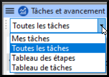

    Vous pouvez voir plus de détails sur n'importe quelle tâche en cliquant sur le nom de la tâche.

**3.2 Identifier la prochaine tâche à faire**

La liste des tâches vous montre les taches inachevées, chacune avec une barre de couleur à côté.

-   Identifiez la prochaine tâche à faire. Il aura une barre verte ou verte barrée.
-   Vérifiez qu’il n'est pas en train d'attendre une autre tâche. Dans ce cas, il y aura une barre rouge.
-   Faites la(es) tâche(s). (Voir les autres modules si nécessaire.)

    Quand les tâches sont finies, voir les instructions ci-dessous pour apprendre comment les marquer comme achevées. Une vérification est achevée quand il indique **"Aucun problème"**.

**3.3 Marquer une tâche comme achevée**

**Marquer une tâche de livre comme achevée**

-   Cochez sur la case à gauche du statut de la tâche.

    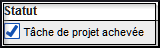

    *Elle devient pleine pour montre qu’elle est achevée.*

**Marquer une tâche de chapitre comme terminée**

-   Cliquez sur **+** pour marquer le prochain chapitre comme terminé

    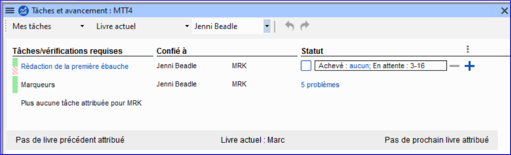

-   Cliquez à droite sur le mot « **Achevé** »

    

    *Une boîte de dialogue s’affiche.*

    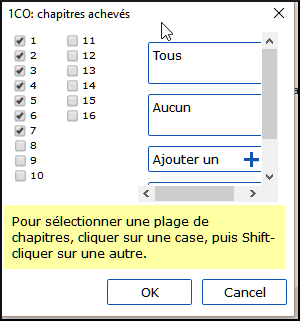

-   Cochez la case à gauche du numéro de chapitre pour le marquer comme achevé.

**3.4 Vérifications**

-   Si la tâche est une vérification, l’état de la vérification indiquera soit le **Paramétrage requis**, soit le nombre de **problèmes** restants.
-   Une vérification est achevée quand il indique **"Aucun problème"**.

**Vérifications – paramétrage requis (Administrateur)**

-   Cliquez sur le lien bleu « Paramétrage requis »

    *Paratext 9 va soit lancer l’inventaire soit afficher les paramètres appropriés.*

-   Complétez le paramétrage comme nécessaire.
-   Fermez la fenêtre quand c'est fini.

    S'il y a plus d'un inventaire pour une vérification (p.ex. mise en majuscule), vous devrez configurer ces inventaires manuellement dans le menu Vérification.

**Vérifications – problèmes**

-   Cliquez sur le lien bleu « … problèmes »

    *Une liste de problèmes s’affiche.*

-   Faites les corrections.
-   Fermez la liste de résultats.
-   **≡ Paratext** sous **Paratext** \> **Enregistrer tout.** (ou **Ctrl**+**s**).
-   Retournez au plan de projet.

    Une vérification est achevée quand il indique **"Aucun problème"**.Si vous n'êtes pas en mesure de terminer une vérification, il est possible de reporter la vérification à l'étape suivante.

**Reporter une vérification**

-   **≡ Onglet**, sous **Projet**, sélectionnez **Tâches et Avancement**
-   Change à **Toutes les tâches**
-   Passez au-dessus d'un contrôle qui a des problèmes
-   Cliquez sur **Reporter** (qui apparaît à droite de la colonne Statut)
-   Choisissez l'étape à laquelle vous souhaitez reporter la vérification.
-   Tapez la raison pour reporter la vérification

    *La vérification s'affiche à cette étape.*

**4**

**SD – Saisie des données**

**Introduction**

Ce module explique comment vous pouvez saisir votre traduction (taper les données) dans un projet existant de Paratext 9.

**Où en sommes-nous ?**

Nous sommes sur le point de saisir du texte dans un projet existant. Avant que vous puissiez faire ceci, quelqu’un doit avoir installé le programme et avoir créé un projet pour vos données.

**Pourquoi cette aptitude est-elle importante ?**

C’est la première étape de la saisie de votre traduction dans l’ordinateur. Une fois que le texte a été saisi, vous pourrez exécuter divers contrôles sur le contenu et le format du texte.

**4.1 Naviguer vers une référence biblique**

Avant de pouvoir commencer à saisir un texte, vous devez déplacer votre curseur au livre, au chapitre et au verset appropriés. Servez-vous de la barre d’outils Référence pour le faire.

-   Utilisez la barre d’outils Référence pour changer le projet, le livre, le chapitre et le verset selon les besoins.

    

    Si vous ne connaissez pas la référence du verset, vous pouvez utiliser la fonction **Rechercher** pour chercher un mot. Ctrl+F.

**4.2 Vérifier que le projet est modifiable**

-   Regardez la barre de titre de votre projet.

    

    La barre de titre doit afficher « Modifiable ».

-   Si le livre n'est pas modifiable et vous deviez l’éditer, il faut parler avec votre administrateur.
-   Si votre projet est toujours non-modifiable, essayez de changer l’affichage (voir ci-dessous) pour trouver un affichage modifiable.

**4.3 Changer l’affichage**

Paratext 9 a cinq affichages. Seul le mode Aperçu n’est pas modifiable.

-   **Ctrl** + **E** —ou—
-   **≡ Onglet** sous **Affichage**, choisissez l’affichage que vous préférez (p.ex. Standard).

**4.4 Taper les caractères spéciaux**

Certains des caractères orthographiques ne se trouvent pas sur le clavier. Pour les taper, vous devez appuyer sur plus d’une touche.

-   Changez le système de clavier si nécessaire.
-   Passez de Keyman (p.ex. à Tchad Unicode)

    (ou changez le clavier virtuel pour passer à une langue appropriée [p.e.x TR/SQ/TZ/AF…])

-   Tapez les touches comme dans les tableaux à Annexe [C](#sChadSpecChar).

    Note : Vous pouvez cliquez sur **≡ Onglet** et sous **Affichage** \> **Surligner les caractères non valides** pour mettre en surbrillance des caractères invalides (= pas acceptés pour écrire cette langue) qui sont dans le texte.

**4.5 Ajouter texte d'une autre catégorie – titre ou introduction**

Chaque élément de texte doit avoir un marqueur. Les marqueurs pour les chapitres et versets sont déjà dans votre projet. Pour ajouter d'autre texte, p.ex. un titre à votre texte ou une introduction, vous devez faire ce qui suit

-   Déplacez votre curseur à la fin du paragraphe qui est au-dessus du titre.
-   Appuyez sur **Entrée** ou Saisissez « \\ »
-   Saisissez le marquer (comme s1 ou ip), puis tapez Entrée (ou le sélectionnez de la liste).
-   Saisissez le texte
-   Ajoutez un marqueur de paragraphe

    (par exemple : \\p)

    Vous devez toujours avoir un marqueur USFM après un titre et avant les versets. C’est habituellement \\p (paragraphe), mais peut être autre chose (par exemple \\q1).

**4.6 Ajouter des marqueurs de paragraphe**

Pour diviser le texte en paragraphes :

-   Déplacez le curseur où vous voulez casser le paragraphe.
-   Appuyez sur **Entrée**.
-   Saisissez **p** puis tapez **Entrée** (ou le sélectionnez de la liste).

**4.7 Enregistrer votre travail**

Il est important d’enregistrer votre travail régulièrement.

-   **≡ Paratext** sous **Paratext**\> **Enregistrer tout**
-   ou **Ctrl** + **S**

**4.8 Insérer une Note de bas de page**

Vous pouvez ajouter les notes de bas de page dans le texte à l’endroit où la référence apparaît dans votre texte.

-   Déplacez le curseur où vous voulez insérer la note de bas de page.
-   **≡ Onglet**, sous **Insérer** \> **Note de bas de page,**
-   Un ensemble de marqueurs de note en bas de page est ajouté dans la boîte au-dessous du texte

    

-   Saisir le texte de la note après \\ft

    Pour voir la note de bas de page, déplacez la souris au-dessus de la petite lettre sans cliquer sur les boutons. [La note de bas de page s’affiche dans une petite boîte.]

    Pour modifier la note de bas de page, cliquez sur la petite lettre et modifiez le texte dans le petit volet en bas.

    Pour supprimer la note en bas de page, vous pouvez supprimer la petite lettre.

**4.9 Envoyer/Recevoir**

Il est essentiel d’avoir une seconde copie de votre traduction et de partager votre travail avec votre équipe. Pour sauvegarder une copie vers Internet, c’est idéal d’envoyer/recevoir comme suit :

**Envoyer/Recevoir ce projet vers Internet**

-   Assurez-vous que votre ordinateur est connecté à l'Internet.
-   **≡ Onglet**, sous **Projet** \> **Envoyer/Recevoir ce projet**...
-   *Paratext fera l'Envoyer/Recevoir tout de suite, c.à.d. sans proposer les différentes options.*

**Envoyer/Recevoir des projets vers Internet**

-   Assurez-vous que votre ordinateur est connecté à l'Internet.
-   **≡ Paratext**, sous **Paratext** \> **Envoyer/Recevoir des projet**...
-   
-   Choisissez **Serveur Internet**
-   Choisissez les projets à Envoyer/Recevoir.
-   Cliquez sur le bouton **Envoyer/Recevoir**.

    *L’ordinateur fera une copie des fichiers. Un indicateur de progrès s’affiche jusqu’à ce que le processus soit fini. Une boîte de message vous dit s’il y a des problèmes.*

**Envoyer/Recevoir à une clé pour sauvegarder**

Il est essentiel d’avoir une seconde copie de votre traduction. Si vous n'avez pas accès à l'Internet, vous pouvez utiliser une clé USB. Pour sauvegarder une copie sur une clé USB, vous pouvez envoyer/recevoir comme suit :

-   Insérez votre clé USB dans un port de l’ordinateur.
-   **≡ Paratext**, sous **Paratext** \> **Envoyer/Recevoir des projets**.

    

-   Choisissez **Clé USB**.
-   Choisissez les projets à Envoyer/Recevoir.
-   Cliquez sur le bouton **Envoyer/Recevoir**.

    *L’ordinateur fera une copie des fichiers. Un indicateur de progrès s’affiche jusqu’à ce que le processus soit fini. Une boîte de message vous dit s’il y a des problèmes.*

**Envoyer/Recevoir encore**

La prochaine fois que vous voulez faire un Envoyer/Recevoir vous pouvez utilisez la barre d'outils pour envoyer/recevoir selon les paramètres précédents. Cette option ne vous laisse pas l'option de sélectionner le moyen ou les projets:

-   Si nécessaire, insérez votre clé USB dans un port de l’ordinateur ou se connectez à l'Internet.
-   Cliquez sur l’icône Envoyer/Recevoir 

    *Paratext fera l'Envoyer/Recevoir tout de suite, c.à.d. sans proposer les différentes options.*

**4.10 Déplacer votre curseur rapidement**

De déplacer le curseur à l'endroit correct où vous voulez taper du texte ou faire des corrections peut prendre beaucoup de temps, si on le déplace une lettre à l'autre! Voilà quelques touches utiles pour vous aider à y arriver rapidement:

-   Les touches flèches, **←** **↑** **→** **↓**

    **début** (Home), **fin** (End), **PgPréc**, et **PgSuiv**,

    **F8** (chapitre), **F9** (livre)

-   ou **Ctrl** + les touches

**4.11 Bilan : Complétez les champs vides :**

Si la barre de titre ne mentionne pas Modifiable (ou votre nom), on peut changer l’__________.

Pour ajouter une autre balise (marqueur), on appuie \_______.

Pour ajouter d'autres balises (marqueurs) de paragraphe, vous appuyez \________.

Pour insérer une Note de bas de page, on utilise ≡ onglet, puis sous le menu \______\_ vous choisissez \___________________.

Pour Envoyer/recevoir, on utilise ≡ onglet puis sous le menu \_______\_ vous choisissez \_______________\_

[Réponse : affichage, entre ou \\, entre, Insérer, Note de bas de page, Projet, Envoyer/Recevoir]

**5**

**VT1 – Vérifications de base**

**Introduction**

Dans ce module, vous allez vérifier les chapitres/versets et les marqueurs de deux manières : en utilisant le Plan de projet, et en utilisant le projet menu (Vérification).

**Où en sommes-nous ?**

Vous avez déjà saisi votre texte dans Paratext 9. Maintenant, vous voulez commencer à faire les vérifications. Dans ce module on commence avec les deux premières vérifications de base. Les autres vérifications seront traitées dans [VB2 – Les vérifications de base](#sBC2)[12](#sBC2) et [19](#sBC3).

**Pourquoi cette aptitude est-elle importante ?**

Ces vérifications vous permettent d’être sûr que votre texte contient tous les chapitres et tous les versets et que les marqueurs sont correctement utilisés. Il est important d’exécuter la vérification « chapitre/verset » tout d’abord parce que tous les autres contrôles en dépendent. Cette vérification est également nécessaire si on veut marquer l'étape de "rédaction de l'ébauche" comme achevée.

**Qu’est-ce qu’on va faire ?**

Vous allez effectuer les deux premières vérifications de base. Le moyen le plus facile est d’utiliser le plan de projet. C’est aussi possible de faire les vérifications à partir du menu projet **(Outils)** pour faire plus qu'un livre à la fois.

**5.1 Vérifications avec plan de projet**

Le plus facile est de faire ces vérifications à partir du plan de projet

-   Affichez plan du projet en cliquant sur l’icône
-   S’il y a des « problèmes », cliquez le lien bleu à droit

    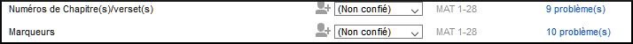

    Une fenêtre s’affiche avec les erreurs.

-   Double-cliquez une ligne dans la liste.
-   Corrigez l’erreur dans votre projet.
-   Double-cliquez la prochaine ligne dans la liste.
-   Continuez jusqu'à ce qu'il n'y a plus d’erreurs.
-   Cliquez sur le bouton « **Relancer** » pour vérifier toutes les erreurs sont corrigées.
-   Fermez la fenêtre de résultats.
-   Retournez au plan de projet, et cliquez sur le lien bleu pour les problèmes de marqueurs.

    Vidéo: voir ‘Vérifications de base (9.0 1.4a).mp4’ pour comment corriger des erreurs fréquents.

**5.2 Faire les vérifications manuellement**

Si vous voulez vérifier plus d’un livre, vous pourriez faire ces vérifications du menu du projet **(Outils)**.

**Vérification des « Chapitres/ Versets »**

-   Cliquez sur votre projet
-   **≡ Onglet**, sous **Outils** \> **Effectuer les vérifications de base**
-   Cocher seulement **Numéros Chapitre(s)/verset(s)**
-   Décochez les autres vérifications
-   Si nécessaire, cliquez sur **Sélectionner…** et choisissez les livres à vérifier.
-   Cliquez sur **OK**

    *Une fenêtre s’affiche avec les problèmes.*

    ‒

-   Double-cliquez une ligne dans la liste.
-   Corrigez l’erreur dans votre projet.
-   Double-cliquez la prochaine ligne dans la liste.
-   Continuez jusqu’à il n’y a plus de problèmes.
-   Cliquez sur le bouton « **Relancer** » pour vérifier que tous les problèmes sont corrigés.
-   Fermez la fenêtre de résultats.

**Vérification des « Marqueurs »**

-   **≡ Onglet**, sous **Outils** \> **Inventaires des vérifications** \> **Inventaire de marqueurs**

    *Cette liste donne une vue d'ensemble des marqueurs. On ne peut que regarder la liste, mais on peut chercher les marqueurs erronés.*

-   Fermez l'inventaire de marqueurs.
-   **≡ Onglet**, sous **Outils** \> **Effectuer les vérifications de base**
-   Cochez seulement **Marqueurs**
-   Cliquez sur **OK**
-   Corrigez les erreurs.

**6**

**PP2 – Avancement de projet**

**Introduction**

Dans ce module, vous apprendrez comment mettre à jour les informations sur le progrès fait en marquant les tâches comme achevées. et créer un rapport sur l'état d'avancement.

**Où en sommes-nous ?**

Vous avez travaillé sur votre traduction et avez fini une tâche. Vous voulez maintenant mettre à jour votre progrès.

Pour que le plan de projet fonctionne bien, vous devez marquer les tâches que vous avez finies. Cela permet à Paratext 9 de rendre la tâche suivante disponible pour les autres membres de l'équipe. Il donne également à Paratext des informations précises sur vos progrès pour les rapports. La création de rapports d'avancement vous aide à préparer un rapport pour vos superviseurs et vos bailleurs de fonds.

Vous ouvrirez la fenêtre des **Tâches et avancement**, et mettrez à jour les informations sur le progrès fait. Vous produirez alors un rapport.

**6.1 S'assurer le progrès du plan est à jour**

-   Ouvrez le plan de projet (utilisant le bouton)
-   Mettez à jour les informations sur le progrès de chaque tâche (voir PP1 pour les instructions sur chaque type de tâche).

**6.2 Modifier une affectation**

Cela peut seulement être fait par quelqu'un qui a des autorisations d'avancement.

-   **≡ Onglet**, sous **Projet**, select **Tâches et avancement....**
-   De la première liste déroulante en haut du dialogue, choisissez **Toutes les tâches**
-   Dans la colonne, "**Confié (Affecté) à**" , utilisez la liste déroulante pour choisir qui aura la responsabilité de la tâche ou de la vérification énumérée dans la colonne  **Tâche/Vérification** au gauche.

**6.3 Produisez un rapport sur l'état d'avancement**

-   **≡ Onglet**, sous **Outils**, choisissez **Rapport sur l'état de Projet..**.
-   Choisissez le(s) projet(s) pour le(s)quel(s) créer un rapport
-   Cliquez sur **OK**.

    *Le rapport contiendra une colonne pour chaque projet que vous avez choisi.*

**6.4 Voir les courbes de progression**

-   **≡ Onglet**, sous **Projet**, choisissez **Graphiques de progression ....**.

    

-   Utilisez la première boîte déroulant pour choisir le type de graphique
-   Choisissez les livres si nécessaires.
-   Cliquez sur l'icône d'imprimante

    *Une fenêtre s'affiche.*

-   Cliquez sur l'icône **Imprimer**
-   Choisissez votre imprimante (ou PDF creator)
-   Cliquez sur **OK**

**Part III**

**Étape 2 : Vérification par l’équipe**

La deuxième étape d’un projet de traduction est la vérification en équipe. Dans cette deuxième étape, vous utiliserez de nombreux outils pour vous assurer que vous avez été cohérent dans votre traduction. Vous allez lire votre texte et travailler sur les noms propres, les termes clés bibliques, la vérification d’orthographe et les contrôles de mise en forme. Vous allez également imprimer un brouillon et utiliser une variété de remarques : remarques de projet, remarques de discussion orthographique et remarques de discussion sur les équivalents pour enregistrer vos questions, des discussions et des décisions.

Les modules suivants vont vous aider dans cette étape :

-   [**NP – Noms propres**](#sPN)
-   [**VO – Vérification de l’orthographe**](#sSP)
-   [**TB – Un processus de 4 étapes pour les termes bibliques cohérents**](#BTTerms)
-   [**VM – Vérification de mise en page**](#sFcFormattingChecks)
-   [**VB2 – Les vérifications de base**](#sBC2)
-   [**IE – Impression d’ébauches**](#sPD)
-   [**UR – L’utilisation des remarques**](#sUNUsingNotes)

**7**

**NP – Noms propres**

**Introduction**

Dans ce module, vous vérifierez que les noms propres sont bien translittérés. Il y a deux façons de procéder. La première consiste à demander à Paratext de proposer les noms propres sur la base d'une analyse statistique d'un texte modèle. L'autre façon est d'indiquer à Paratext les changements pour des caractères spécifiques.

**Où en sommes-nous ?**

Vous avez (ou vous êtes en train de faire) un accord des règles pour la translittération de noms.

**Pourquoi cette aptitude est-elle importante ?**

Vous voulez que le texte soit cohérent, de sorte qu'il soit clair de qui parle le texte.

**Qu’est-ce qu’on va faire ?**

Vous allez :

-   filtrer la liste des termes bibliques principaux des noms propres.
-   SOIT utiliser l'outil **Proposer les équivalents...** pour proposer les noms.
-   SOIT utiliser l'outil **Modifier les noms propres...** pour entrer vos règles de translittération pour chaque lettre.
-   modifier et approuver les noms individuels.
-   ajouter les noms approuvés comme noms proposés dans la liste des termes bibliques.
-   travailler à travers la liste des termes bibliques pour vous assurer que les noms dans tous les versets sont cohérents.

**7.1 Lancer l’outil Termes bibliques**

-   Cliquez dans votre projet
-   **≡ Onglet**, sous **Outils** \> **Termes bibliques...**

    Si la commande n'est pas affichée dans le menu, cliquez sur la flèche vers le bas au bas du menu pour afficher les menus complets.

**Ouvrir la liste de termes**

-   **≡ Onglet**, sous **Termes bibliques** \> **Sélectionner la liste des termes bibliques**
-   Double-cliquez sur la liste **Termes bibliques principaux**

**Choisir le texte de référence comme texte comparative**

-   Cliquez le bouton **Textes comparatifs** sur la barre d’outils.

    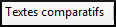

-   Choisissez un texte et puis cliquez sur **→** (le flèche droit).
-   Cliquez sur **OK**.

**Modifier divers paramètres**

-   Cliquez sur le deuxième bouton de filtre (1)

    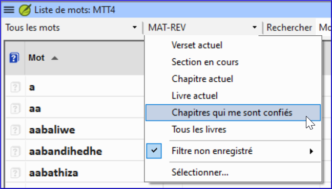

-   Cliquez sur **Chapitres qui me sont confiés (affectés) (2)**

    N.B. : Si vous voulez voir les termes grecs ou hébreux avec l’alphabet romanisé, vous pouvez changer l’affichage en utilisant **≡ Onglet**, sous **Affichage** \> **Translittérer les termes.**.

**Définir un filtre pour les noms propres**

-   Cliquez sur le premier menu déroulant de filtre
-   Choisissez « **Nouveau Filtre** »
-   Dans la boîte de dialogue, sous **Catégories…**
-   Sélectionnez « **Noms propres** »
-   Cliquez sur **OK**

**7.2 Proposer les équivalents des noms propres**

-   **≡ Onglet**, sous **Termes bibliques** \> **Proposer les équivalents**
-   Cliquez sur **OK**

    *Paratext ajoutera des équivalents à tous les termes qui n'ont pas encore d'équivalent (mais avec un fond orange)*

    Vous devrez approuver ces équivalents (voir 7.4)

**7.3 Modifier noms propres**

L'adaptation des noms doit se faire au début d'un projet de traduction, avant que vous n'ayez approuvé les équivalents des noms propres. Sinon, vous pouvez utiliser proposer les équivalents (voir ci-dessus).

-   **Outils** sous **Outils \> Modifier les noms propres**
-   Choisissez la langue de votre bible de référence (p.ex. française ou arabe), cliquez sur **OK**

    *La boîte de dialogue "Modification de noms propres s’affiche.*

    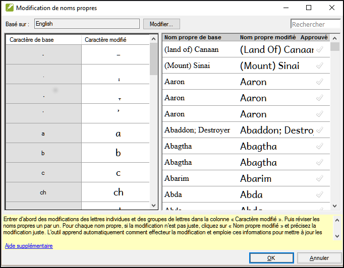

**Entrer les modifications des lettres individuelles (ou des groupes de lettres)**

-   Dans le volet à gauche, entrez d’abord des modifications des lettres individuelles et des groupes de lettres dans la colonne « Caractère modifié ».

**Puis réviser les noms propres (à droite) l'un après l'autre**

-   Travailler à travers la colonne **Nom propre adapteé** au volet droite.
-   Pour chaque nom propre, si la modification n’est pas juste, cliquez sur le nom dans la colonne **Nom propre adapté**.
-   Précisez la forme correcte et cliquez sur **OK**
-   Une fois qu’un nom modifié est juste, cliquez sur la coche dans la colonne **Approuvé** pour empêcher qu’il ne soit changé de nouveau.
-   Cliquez sur **OK**.

    Paratext 9 proposera un mot en rouge pour tous les noms dans la colonne des équivalents dans l'outil termes bibliques.

**7.4 Vérifier que votre texte est cohérent**

Vous devez identifier le(s) mot(s) que vous avez utilisés dans votre texte pour chaque nom propre.

-   Cliquez sur le nom dans la liste en haut.
-   Cliquez dans un verset dans le volet en bas qui n'a pas la forme du nom.
-   Cliquez sur le lien Édition
-   Corrigez si nécessaire, puis cliquez sur **Fermer**.
-   Répétez pour chaque nom propre.

**7.5 Ajouter l’équivalent (c.-à-d. le nom utilisé dans votre texte)**

-   Cliquez sur le nom dans la liste en haut.
-   Sélectionnez le(s) mot(s) dans votre texte (en bas) qui est (sont) l’équivalent de ce nom.
-   Cliquez sur **Ajouter un équivalent** () ou Ctrl+A

**7.6 Traiter des versets qui n’ont pas le nom dans la traduction**

Il arrive qu’un verset soit traduit correctement sans utiliser le nom réel. Par exemple, un pronom peut être utilisé à la place du nom. Dans ces cas, il faut indiquer que le verset est bien traduit même s’il n’y a pas un équivalent de ce mot précis dans ce verset.

-   Cliquez sur la croix rouge  à la fin du verset.

    *La croix rouge X se transforme en*  *(et/ou le verset disparaît de la liste).*

-   Si vous avez cliqué sur la croix rouge par erreur, cliquez de nouveau sur  pour retourner à la croix rouge. 

    Note : Paratext 9 ne vérifie pas les noms dans l’introduction, les en-têtes, les notes de bas de page, les légendes et le glossaire. (Utilisez la liste de mots pour attraper ces noms propres mal écrits.)

**7.7 Bilan**

-   Pour translittérer les noms propres, vous \_____\_ la liste de \__________\_ sur noms propres.
-   Puis vous utilisez le menu \______\_ et choisissez la commande \___________\_ .
-   Après avoir saisi les changements des \______\_ puis \_________\_ les noms adaptés.
-   Paratext 9 ajoute un équivalent \_________\_ pour tous les noms.
-   Vous travaillez alors avec la liste, en faisant des \_______\_ et en vous assurant que tous les versets sont \________.
-   Vous pouvez ajouter un équivalent en sélectionnant la texte et en appuyant **Ctrl**+__.
-   Si un pronom est utilisé, vous pouvez \____\_ que le verset est bien traduit en cliquant sur le .

    Réponses : filtrez, Termes bibliques principaux, noms, Outils, Modifier les noms propres, caractères, approuver, proposé, corrections, cohérents, A, indiquer

**8**

**VO – Vérification de l’orthographe**

**Introduction**

Ce module explique comment utiliser une fonctionnalité de Paratext 9 pour la vérification des fautes d’orthographe.

**Où en sommes-nous ?**

Vous avez saisi votre texte dans Paratext 9 et vous l’avez examiné pour déceler les fautes de frappe et les erreurs de composition. Mais il peut encore rester un certain nombre d’erreurs d’orthographe.

**Pourquoi cette fonction est-elle importante ?**

Vous devez corriger les fautes d’orthographe, afin que votre texte communique le message clairement.

**Qu’est-ce qu’on va faire ?**

**8.1 Configurer la liste de mots**

Avant de vérifier l’orthographe, il est important d’avoir une base de mots corrects. Il y a trois choses à faire :

**Approuver l’orthographe des mots fréquents**

Dans Paratext

-   **≡ Onglet**, sous **Outils** \> **Liste de mots**

Dans la Liste des Mots

-   **≡ Onglet,** sous **Outils** \> **Approuver l’orthographe des mots fréquents**
-   Saisissez un chiffre

    Saisissez un chiffre qui représente le minimum d’occurrences d’un mot pour permettre l’approbation automatique de son orthographe. En d’autres termes, combien de fois le mot doit-il être dans la liste pour qu’on le considère comme bien orthographié ? Le paramètre par défaut est 100, mais on peut choisir plus ou moins que cela.

-   Cliquez sur **OK**
-   Cliquez sur **Oui** (pour confirmer que vous ne pouvez pas annuler)

**Vérifier les mots que Paratext pense être erronés**

Dans la liste de mots (**≡ Onglet**, sous **Outils** \> **Liste de mots**)

-   **≡ Onglet**, sous **Outils** \> **Vérifier l’orthographe** \> **Toutes les vérifications**

    *La liste de mots s'affiche.*

-   Cliquez sur un mot dans le volet en haut.
-   Si correct — cliquez sur la case verte  en haut de la colonne
-   Si le mot est incorrect, et Paratext a proposé le mot juste, cliquez sur le lien bleu du mot juste
-   Si le mot est incorrect, et Paratext n'a pas proposé le mot juste, cliquez sur la croix rouge  et corrigez le mot.(Voir 9.3)

**Vérifier les mots qui se ressemblent beaucoup dans l'écriture**

Dans la liste de mots

-   **≡ Onglet**, sous **Outils** \> **Rechercher mots semblables**
-   Remplissez la boîte de dialogue avec les paires de lettres qui peuvent être confondues séparé par / (p.e.x s/sh)

    Selon votre langue, cochez ou décochez « ne pas tenir compte des signes diacritiques lors de la comparaison des mots ».

-   Cliquez sur **OK**

    *Une liste de mots s'affiche.*

-   Vérifiez les mots comme au-dessus.

**8.2 Vérifier l’orthographe — dans le texte**

Dans Paratext

-   **≡ Onglet**, sous **Affichage** \> **Afficher les fautes d'orthographe**

    Un mètre de progrès s’affiche puis tous les mots inconnus ou incorrects sont soulignés, avec les lignes ondulées rouges.

**Corrections des erreurs**

Paratext 9 soulignera en rouge les mots dans le texte qui ne sont pas marqués corrects dans la liste de mots. (Les mots qui sont incorrects ou incertains.

-   Cliquez à droite sur un mot souligné en rouge ou gris

    *Une boîte de dialogue s'affiche*

    

-   Saisissez la correction ou bien choisissez un mot de la liste
-   Cliquez sur **OK**.

    Il est préférable d’utiliser « vérifier l’orthographe » au lieu de corriger les mots un par un dans le texte. C’est mieux parce que Paratext 9 va se rappeler la correction pour l’appliquer aussi dans les autres chapitres.

    Quand il y a plus d’une correction, une boîte de dialogue s’affiche. Choisissez une des options selon le besoin.

    **Oui** = change ce verset et cherche d’autres.

    **Non** = ne change pas ce verset, mais cherche d’autres

    **Oui à tous** est trop dangereux. Ne l’utilisez pas!

    **Annuler** = arrête ici, ne change rien d’autre

**8.3 Vérifier l’orthographe du livre actuel**

-   **≡ Onglet**, sous **Outils** \> **Vérifier l’orthographe du livre actuel**

    *Une fenêtre s’affiche avec une liste de plusieurs mots suspects du livre actuel.*

    

-   Faites les corrections comme ci-dessus (9.3)
-   Cliquez sur « Davantage d'éléments disponibles » pour afficher des mots supplémentaires.
-   Continuez si nécessaire.

**8.4 Vérification d’orthographe dans la liste de mots**

**Utiliser les vérifications**

Dans la liste de mots

-   **≡ Onglet**, sous **Outils** \> **Vérifier l’orthographe**
-   Choisissez la vérification désirée (voir dessous)

    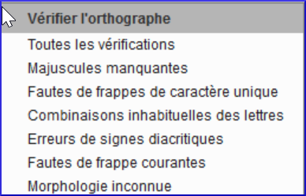

Une liste de mots s’affiche.

-   Faites les corrections comme ci-dessus
-   Cliquez sur « **Davantage d'éléments disponibles** » pour afficher des mots supplémentaires. a
-   Continuez si nécessaire.
-   Quand la liste est vide, un message s’affiche.

    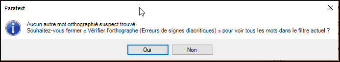

-   Cliquez sur **Oui**.

**Toutes les vérifications**

Cela gère tous les contrôles. Ceci est très utile, car il trouvera tous les types d'erreurs et surtout des mots avec plusieurs types d'erreurs.

**Majuscules manquantes**

-   Une liste de mots s’affiche avec les liens d’autres mots qui n’ont pas toujours de majuscules (c'est-à-dire que les deux formes sont utilisées). Le mot avec la minuscule se trouve au-dessus du mot avec la majuscule, qui a un lien bleu.

    

-   Cliquez sur le lien bleu pour le mot en majuscule.

    

-   Cliquez sur le lien bleu qui convient.
-   *Show Incorrect* (pour voir tous les versets)
-   *Toutes les deux formes sont acceptables* (pour accepter les deux formes)
-   *Capitalise All* (corriger tous les mots)

**Faute de frappe d’un caractère unique**

Une liste de mots s’affiche avec les liens d’autres mots qui ressemblent au mot en question, mais qui diffèrent d'une seule lettre.

**Combinaisons inhabituelles des lettres**

Une liste de mots s’affiche. Ces mots ont une séquence des caractères rares, par exemple plus d’une consonante ou plusieurs voyelles…

**Erreurs de signes diacritiques**

Une liste de mots s'affiche. Cette fois, les mots se distinguent uniquement par leurs diacritiques.

**Fautes de frappe courantes**

Une liste de mots s'affiche qui vous montre les mêmes types de problèmes qui ont déjà été corrigés ailleurs. Par exemple : si vous avez corrigé « vres » en « vers» ailleurs, et il trouve « vreset » il va suggérer « verset ».

**Morphologie inconnue**

Une liste de mots s’affiche dont l’ordinateur ne peut pas deviner la morphologie basée sur d’autres mots.

**Rechercher des mots mal liés ou mal divisés**

Dans la liste de mots

-   **≡ Onglet**, sous **Outils** \> **Rechercher des mots mal liés ou mal divisés**

    

-   Saisissez une ponctuation qui peut apparaître au milieu d'un mot, si elle existe.
-   Cliquez sur **OK**.

    *Une liste de mots est affichée avec des mots similaires regroupés.*

    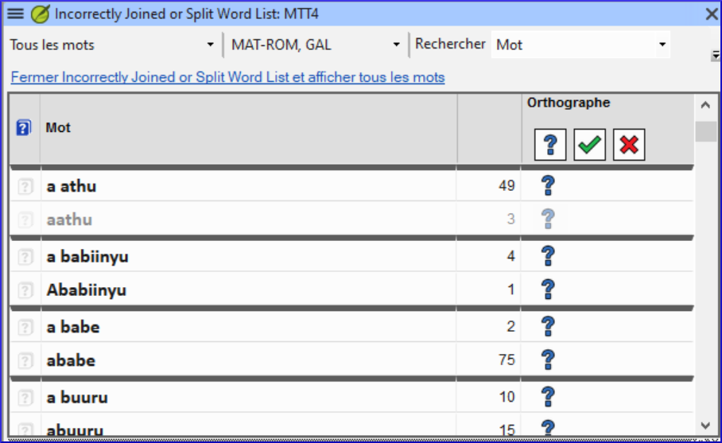

**Corriger un mot mal marqué**

-   Trouvez le mot dans la liste de mots (en utilisant un filtre si nécessaire)
-   Cliquez sur la ligne pour voir le mot dans son contexte
-   Cliquez sur l’état d’orthographe désiré.

**8.5 Remarque de discussion orthographique**

Si vous ne décidez pas définitivement de l'orthographe, vous pouvez ajouter une remarque de discussion orthographique.

-   Double-cliquez sur l’icône de remarque (dans la première colonne)

    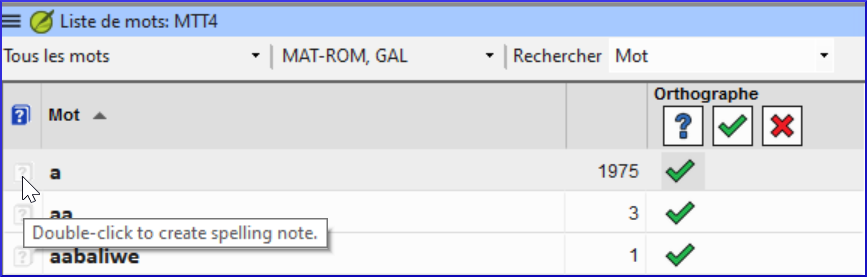

-   Saisissez la remarque
-   Confiez (affectez) la remarque comme désiré.
-   Cliquez sur **OK**.

**9**

**GL – Glossaire**

**Introduction**

Ce module explique comment ajouter des entrées dans le glossaire avec l’outil **Termes bibliques**.

**Où en sommes-nous ?**

Vous avez entré et vérifié votre texte dans Paratext 9. Maintenant, vous voulez ajouter des mots importants dans le glossaire.

**Pourquoi cette aptitude est-elle importante ?**

Il est bon d’avoir une liste des mots importants ainsi que leur explication pour que les gens puissent mieux comprendre le texte. Il est préférable d’utiliser l’outil **Termes bibliques**, parce qu’il va garder la liste en ordre alphabétique. Si vous ajoutez les mots manuellement, le glossaire est plus difficile à gérer. Un autre avantage, si on crée les entrées du glossaire à partir de l'outil Termes bibliques, c'est qu'on peut aussi voir l'historique.

**Qu’est-ce qu’on va faire ?**

Vous utiliserez l’outil Termes bibliques et modifierez l’équivalent d'un terme. L’onglet glossaire vous permet d’ajouter la forme de citation et la définition.

Quatre vidéos de formation sont disponibles sur l'ajout, la liaison et l'édition de glossaires. P9 1A.4a-d.

**9.1 Ouvrir l'outil termes bibliques**

-   Accédez à un verset qui contient le mot/terme que vous voulez dans le glossaire.
-   Cliquez à droite et choisissez « **Afficher les termes bibliques** », puis choisissez « **Verset(s) actuel(s)** »
-   Vérifiez que la liste désirée est ouverte (p.ex. Termes bibliques du votre projet, ou Termes bibliques clés du NT [SIL])
-   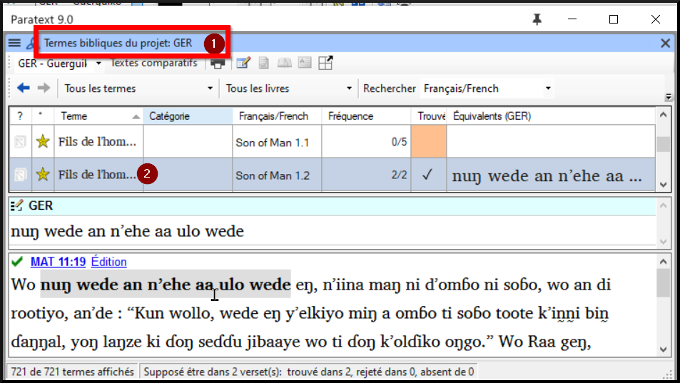
-   Pour changer la liste, **≡ Onglet**, sous **Terms Bibliques**, choisissez "**Sélectioner la liste de termes bibliques**".

**9.2 Ajouter une entrée**

-   Double-cliquez sur le mot dans la liste du haut
-   Cliquez sur l’onglet « **Glossaire** »

    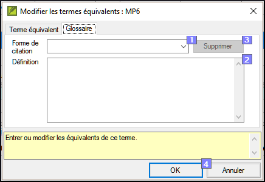

-   Saisissez le mot dans la forme de citation (c.-à.-d. ce que vous voulez dans le glossaire) [1]
-   Saisissez la **Définition [2]**
-   Cliquer sur **OK**

    *Le mot ainsi que la définition seront ajoutés au livre de glossaire dans l’ordre alphabétique.*

**9.3 Lier une entrée existante**

Si le mot est déjà dans le glossaire, on peut créer un lien avec le terme et l'entrée dans le glossaire. Plus tard, dans l'étape 6, vous relierez le terme biblique au texte pour ajouter le \* dans le texte imprimé ou le lien dans l'application électronique.

-   Dans l’outil **Termes bibliques**
-   Vérifiez que la liste désirée est ouverte (p.ex. Termes biblique du votre projet, ou Termes bibliques clés du NT [SIL])
-   Double-cliquez sur le mot dans la liste sur le volet de haut
-   Cliquez sur l’onglet « **Glossaire** »
-   Cliquez sur la flèche à côté de Forme de citation (1)
-   Choisissez l’entrée du glossaire
-   Cliquez sur **OK**

**9.4 Afficher le glossaire**

Dans Paratext

-   Utilisez la barre de navigation pour changer le livre

    

-   Choisissez le livre **GLO**

**9.5 Modifier une entrée – dans le livre GLO**

Dans Paratext

-   Ouvrez le livre **GLO**
-   Éditez-le comme d'habitude.

**9.6 Modifier une entrée – dans les termes bibliques**

-   **≡ Onglet**, sous **Outils**\> **Termes** **bibliques**...
-   Double-cliquez sur le mot dans la liste en haut
-   Cliquez sur l’onglet « **Glossaire** »
-   Modifiez la définition
-   Cliquez sur **OK**.

**9.7 Ajouter un terme biblique**

-   voir la section [10.7](#sAddATerm) [Ajouter un terme – du texte de référence](#sAddATerm)

**9.8 Bilan**

-   Vous pouvez ouvrir l'outil termes bibliques du menu \_______\_ .
-   L'onglet « glossaire » se trouve dans la boîte de dialogue \________. Pour ouvrir cette boîte de dialogue \________-clique sur le terme dans le volet en \_____.
-   Pour voir le glossaire, vous changez au livre \____\_ (après Apocalypse).

    Réponses : clique-droit, Modifier l'équivalents, double, haut, GLO

**10**

**TB – Un processus de 4 étapes pour les termes bibliques cohérents**

**Introduction**

La fenêtre d’**Équivalents de termes bibliques** et l’outil **Termes bibliques** sont liés et sont très utiles pour vérifier que vous avez été cohérent avec les termes, surtout les termes clés. Avec de nombreux termes répartis sur de nombreux livres, cela peut devenir une véritable tâche. Ce module explique un simple processus de 4 étapes pour assurer que les termes bibliques sont cohérents. C'est un processus et doit être considéré comme une partie du processus de traduction et pas comme une vérification.

**Où en sommes-nous ?**

Vous êtes en train de traduire un verset en Paratext 9 et vous voulez voir les équivalents qui sont déjà choisis pour les termes de verset actuel puis vérifier qu’ils sont cohérents avec les autres versets.

**Pourquoi cette aptitude est-elle importante ?**

Pour que votre texte communique le message clairement, vous devez utiliser les termes de manière cohérente. C’est une grande tâche pour les rendre complètement cohérents. Si vous commencez à partir du verset que vous traduisez, et travaillez à partir de là, la tâche est plus facile à gérer. Le but est de s'assurer que vous avez été cohérent dans votre utilisation des termes bibliques et des décisions sont bien documentées sur les raisons pour lesquelles les changements ont été apportés.

**Qu’est-ce qu’on va faire ?**

Cette méthode contient quatre étapes :

1.  **[A]** Trouver tous les mots ou expressions que vous avez utilisés pour ce terme, et entrez les équivalents dans la boîte de dialogue des équivalents.
2.  **[B]** Choisissez l’équivalent(s) qui est le meilleur, et enregistrez pourquoi il est préférable.
3.  **[C]** Expliquez pourquoi vous avez rejeté les autres équivalents.
4.  **[D]** Nettoyez votre traduction en appliquant cet équivalent partout dans votre traduction. (Faire cohérente, Standardiser, Normaliser, Harmoniser).
-   Répétez ce processus avec le prochain terme biblique que vous trouvez dans la fenêtre d’équivalents de termes bibliques.

**10.1 Ouvrir la fenêtre des équivalents de termes bibliques**

-   Cliquez dans votre projet
-   **≡ Onglet** **Outils** \> **Équivalents des termes bibliques**
-   **≡ Onglet** (dans la nouvelle fenêtre) sous **Termes bibliques** \> **Sélectionner la liste de termes**
-   Choisissez la liste désirée
-   Cliquez sur **OK**.

**10.2 A :Trouver tous les équivalents pour ce terme**

**Trouver le terme pour le verset actuel**

-   Y a-t-il une coche dans la colonne trouvée ?
-   S’il y a une coche, le verset utilise le terme et vous pouvez continuer avec le prochain terme.
-   Sinon, vous devez soit corriger votre texte soit ajouter le nouveau terme que vous avez utilisé (voir ci-dessous)

**Ajouter un autre équivalent**

Si l’équivalent que vous avez utilisé doit être ajouté à la liste :

-   Sélectionnez l’équivalent dans votre texte.
-   Copiez (**Ctrl** + **C**)
-   Double-cliquez dans la cellule des équivalents.

    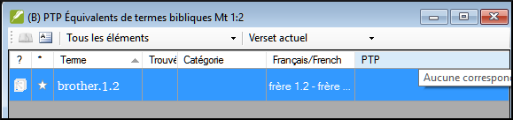

    *Une boîte de dialogue s’affiche.*

    

-   Collez (**Ctrl** + **V**) l’équivalent dans la boîte de dialogue.
-   Cliquez sur **OK**.

**Trouver d’autres versets dans le livre actuel avec le même terme biblique**

-   Double-cliquez sur un mot dans la colonne **Terme**

    *L’outil termes bibliques s’affiche.*

-   À partir du deuxième champ de filtre, choisissez **Livre actuel**

    

-   Ajouter les équivalents de tous les versets (voir ci-dessous).

**Ajouter les équivalents d’autres versets**

-   Sélectionnez l’équivalent dans le verset
-   Ajoutez l’équivalent en utilisant **Ctrl**+**A**
-   Continuez jusqu’à ce que tous les équivalents soient identifiés.

**Traiter des versets qui n’ont pas le terme dans la traduction**

Parfois il arrive qu’un verset soit traduit correctement sans utiliser le nom réel ou le terme. Par exemple, un pronom peut être utilisé à la place du nom. Dans ces cas, il faut indiquer qu’il n’y a pas d’équivalents de ce mot précis dans ce verset.

-   Cliquez sur la croix rouge  à gauche du lien de verset. La Croix-Rouge se transforme en tique verte avec petit x rouge 

    Si vous avez cliqué sur la croix par erreur, cliquez sur  et elle reviendra à 

**10.3 B : Identifier le meilleur équivalent**

-   Double-cliquez sur le terme dans le volet en haut.

    *La boîte de dialogue s’affiche avec tous les équivalents qui ont été ajoutés.*

-   Décidez le meilleur équivalent
-   Sélectionnez-le, coupez-le (**Ctrl**+**x**) et collez-le (**Ctrl**+**v**) à la première ligne de la liste.
-   Ajoutez les \* pour combiner les équivalents similaires.

    

    Vous pouvez utiliser \* de différentes manières : avant le mot pour les préfixes et après le mot pour les suffixes. Vous pouvez aussi mettre un \* au milieu d'un mot. Consultez le guide pour d'autres façons d'utiliser l'astérisque \*.

**10.4 C : Rejeter tous les autres**

-   Sélectionnez et coupez les autres équivalents.

**10.5 D : Documenter la raison pour la modification**

-   Cliquez sur le bouton **Historique**

    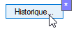

-   Saisissez la raison pourquoi les autres équivalents ont été rejetés, et pourquoi le premier est le meilleur.

    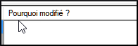

-   Cliquez sur **OK**

**Si vous avez besoin de plus d’un équivalent**

Vous pouvez ajouter plus d’un équivalent si nécessaire. Il est bon d’ajouter une retraduction entre parenthèses après l’équivalent. Par exemple,

slave (esclave)

guy \* work fo (type qui travail pour)

-   Ouvrez la boîte de dialogue pour les équivalents
-   Ajoutez/modifiez les équivalents comme nécessaires.

**Nettoyer d’autres livres (si le temps le permet)**

-   Changez le filtre pour que tous les livres publiés soient affichés.
-   Harmonisez les versets si nécessaire.

**Ajouter les remarques des discussions des équivalents — discussion en cours**

Si vous ne décidez pas définitivement d'un équivalent, vous devez ajouter une remarque des équivalents.

-   Double-cliquez sur l’icône de remarque (dans la deuxième colonne)

    

-   Saisissez la remarque
-   Confiez (affectez) la remarque comme désiré.
-   Cliquez sur **OK**.

**Ajouter la décision dans la remarque**

-   Double-cliquez sur le terme
-   Saisissez l’équivalent décidé dans les « remarques » de la boîte de dialogue.

    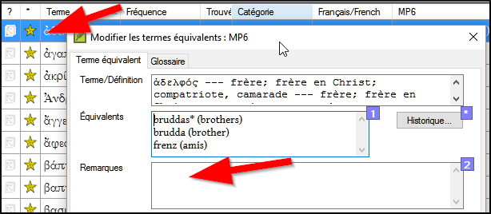

-   Cliquez sur **OK**

**10.6 Ajouter un terme – du texte source**

-   Cliquez dans la fenêtre avec le texte en langue source
-   Cliquez à droit sur un lemme (bleu) en langue source.

    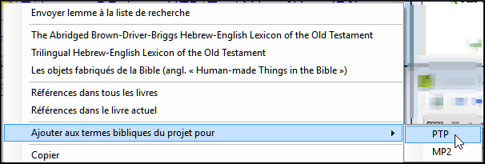

-   Choisissez **Ajouter aux termes bibliques du projet pour**
-   Choisissez votre projet
-   Modifier la glose si nécessaire
-   Cliquez sur l'onglet **Avancé**
-   Modifier la terme si nécessaire
-   Cliquez sur **OK**

    ‒

-   Changez à l’outil de **Termes bibliques**
-   Double-cliquez sur la terme.

**10.7 Ajouter un terme – du texte de référence**

Il y aura quelques termes qui sont importants pour votre langue et culture qui ne sont pas dans la liste. Vous pouvez ajouter ces termes à la liste de votre projet.

Dans Paratext

-   Cliquez dans votre texte de référence, recherchez le terme
-   **≡ Onglet**, sous **Édition** \> **Rechercher** puis saisissez le terme et cliquez sur **OK**.

    *Une liste s’affiche montrant les verses avec ce terme.*

Dans la liste des résultats

-   **≡ Onglet**, sous **Édition** \> **Ajouter aux termes bibliques du projet**, puis choisissez votre projet

    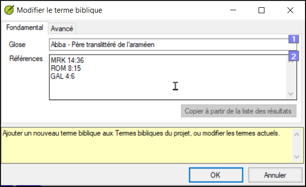

-   Modifiez la glose si nécessaire.
-   Cliquez sur l’onglet **Avancé**
-   Saisissez un nom pour le terme
-   Cliquez sur **OK**

**11**

**MP – Comparer un mot ou une expression**

**Introduction**

Dans ce module, vous allez chercher un mot ou phrase dans un projet et le comparer avec la traduction de ce mot ou phrase dans un autre projet.

**​Pourquoi cette aptitude est-elle importante ?**

Dans Paratext 9 (et versions ultérieures), vous pouvez voir là où un mot ou une expression se trouve dans un projet et comparer comment le mot ou l’expression (ou une traduction du mot ou de l’expression) se produit dans un ou plusieurs autres projets. Par exemple, vous pouvez voir où le mot « roi » se produit dans un projet français et le comparer avec « rey » dans un projet espagnol.

**​Qu’est-ce qu’on va faire ?**

On va

-   utiliser la liste « Mot ou expression » du texte et également l’outil termes bibliques.
-   définir les paramètres et textes comparatifs
-   saisir le mot ou l'expression à comparer

**11.1 Comparer un mot ou expression – du texte**

-   Cliquez dans le projet que vous souhaitez comparer.
-   **≡ Onglet**, sous **Outils** \> pointez sur **Listes de vérifications** et sélectionnez « **Mot ou expression** »

    *La boîte de dialogue « Paramètres » s’affiche*.

    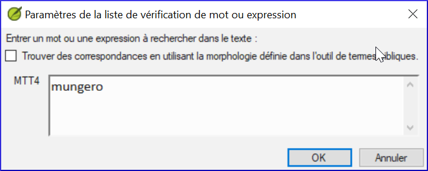

-   Entrez le mot ou l’expression que vous souhaitez voir dans chaque projet dans le dialogue
-   Cliquez sur **OK**

    *Une fenêtre s’affiche.*

    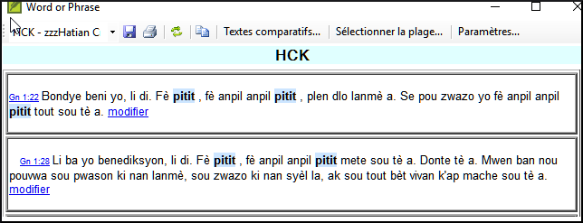

-   Cliquez sur **Textes comparatifs**...
-   Sélectionnez les textes que vous souhaitez comparer et cliquez sur **OK**.

    *La boîte de dialogue « Paramètres » s’affiche.*

    

-   Saisissez le mot ou l’expression que vous souhaitez comparer dans la zone correspondant à chaque projet, puis cliquez sur **OK**.

    *Une fenêtre s’affiche et le bouton* **Masquer des correspondances** *s’affiche sur la barre d’outils.*

    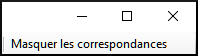

-   Cliquez sur **Masquer les correspondances** pour afficher uniquement les références où le nombre d’occurrences du mot ou de l’expression diffère.

    *La liste montre où chacun de ces éléments se trouve dans chaque verset d'un projet. Les mots où les phrases sont mises en surbrillance en bleu clair.*

**11.2 Comparer l'utilisation d’un mot ou expression – de l’outil termes bibliques**

-   Dans l’outil Termes bibliques,
-   Sélectionnez un terme biblique qui a déjà un équivalent.
-   Cliquez sur l’icône à droite « **Afficher les équivalents du termes actuels dans la liste de vérification de mot ou expression** »

    

    *La boîte de dialogue «* **Paramètres** *» s’affiche avec l’équivalent déjà rempli.*

-   
-   Saisissez le mot ou l’expression pour les autres projets.
-   Cliquez sur **OK**.

    Si vous souhaitez comparer plus d’un mot ou d’une phrase, tapez **Entrée** après chaque mot ou expression.

**12**

**VB2 – Les vérifications de base**

**Introduction**

Dans ce module, vous apprendrez à faire plusieurs autres vérifications de base (les caractères, la ponctuation, les majuscules et les mots répétés). Comme dans le premier module, il est plus facile de lancer ces vérifications à partir du plan de projet. Toutefois, si vous souhaitez vérifier plusieurs livres, vous devez le faire à partir du menu de vérification.

**Où sommes-nous ?**

Vous avez saisi votre traduction dans Paratext. Assurez-vous d’avoir vérifié les numéros de chapitre et de verset, ainsi que les marqueurs, tels que décrits dans le module [5](#BC1), avant de continuer et que votre administrateur a complété la configuration des vérifications ou est là pour les faire avec vous.

**Pourquoi est-ce important ?**

Paratext 9 permet d’effectuer onze vérifications de base. Vous avez déjà vu les deux premières (le chapitre / les versets et les marqueurs). La prochaine série vous aide à localiser les erreurs liées à l’orthographe, la ponctuation, l’utilisation des majuscules et les mots répétés. Bien que ces erreurs n’influent pas nécessairement le contenu du texte, de corriger ces erreurs rend le texte plus facile à lire.

**Ce que nous allons faire :**

La plupart des vérifications exigent qu’une certaine configuration soit faite par votre administrateur. Dans ce module, vous allez :

-   assurer que la configuration a été effectuée (ou avoir l'administrateur les faire)
-   faire les vérifications de base
-   corriger toutes les erreurs.

**12.1 Confirmer la configuration**

N.B. Avant de pouvoir exécuter ces autres vérifications de base, une certaine forme de configuration doit être effectuée. Quelques vérifications ont besoin d'un inventaire, mais pour d'autres il y a des paramètres ou règles. Vous pouvez faire les inventaires, mais votre administrateur doit faire les paramètres.

La configuration peut être un inventaire, des règles ou des paramètres

**12.2 Utiliser les inventaires pour préparer l’exécution des vérifications**

Ces inventaires montrent ce que vous avez dans votre texte, c’est-à-dire qu’ils montrent tous les bons caractères et les erreurs. Vous devez travailler en utilisant les inventaires et enseigner à Paratext 9 lesquels des éléments sont bons (valides) et lesquels sont des erreurs (non valides).

Une fois que vous avez fini les inventaires, vous êtes prêts à faire les vérifications.

-   **≡ Onglet**, sous **Outils** \> **Inventaires des vérifications...** puis choisissez l’inventaire (par exemple l’inventaire de caractères).
-   Cliquez sur un élément dans la liste en haut.

    *Les versets sont affichés dans le volet en bas.*

-   Pour chaque élément, choisissez **Valide** ou **Non valide**.
-   Répétez pour chaque élément.
-   Cliquez sur **OK**.

    N.B.: Au lieu d'utiliser la sourie, vous pouvez utiliser **Ctrl** + **y** pour **Valide** ou **Ctrl** + **n** pour **Non valide**.

**12.3 Caractères**

Cette vérification vous aide à identifier tous les caractères inadmissibles, c.-à-d., des caractères qui ne font pas partir de votre alphabet.

Configuration

-   **≡ Onglet**, sous **Outils** \> **Inventaires des vérifications** \> **Inventaire de caractères**
-   Pour chaque élément, choisissez **Valide** ou **Non valide**.

Vérification

-   **≡ Onglet**, sous **Outils** \> **Effectuer les vérifications de base**
-   Cochez « **Caractères** »
-   Cliquez sur **OK**.

    *Une liste d'erreurs s'affiche.*

-   Faites les corrections nécessaires.

**12.4 Ponctuation**

Identifier et corriger tous les signes de ponctuation inadmissibles ou mal placés. (Utilisez la colonne de caractères Unicode pour identifier clairement la ponctuation.)

Configuration

-   **≡ Onglet**, sous **Outils** \> **Inventaires des vérifications** \> **Inventaire de signes de ponctuation**,
-   Vérifiez chaque signe de ponctuation et son contexte.

    Les contextes peuvent être : **Mot initial**, **Milieu du mot**, **Fin du mot** et **Isolé** (un espace avant et après)

-   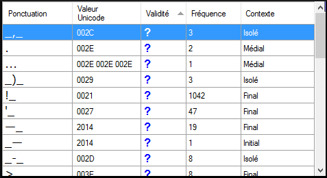
-   Cliquez sur **OK**.

Vérification

-   **≡ Onglet**, sous **Outils** \> **Effectuer les vérifications de base**
-   Cochez « **Ponctuation** »
-   Cliquez sur **OK**.

    *Une liste d'erreurs s'affiche.*

-   Faites les corrections nécessaires.

**12.5 Paires correspondantes**

C’est pour identifier toutes les erreurs de signes de ponctuation qui se produisent dans les paires, par exemple ( ), [ ], etc.

Configuration

-   **≡ Onglet**, sous **Outils** \> **Inventaires des vérifications** \> **Inventaire d’erreurs ponctuation en paires correspondantes** :
-   Si la liste est vide, il n’y a pas d’erreurs.
-   Si nécessaire, cliquez sur **Options...** pour ajouter d’autres paires

Vérification

-   **≡ Onglet**, sous **Outils** \> **Effectuer les vérifications de base**
-   Cochez « **Erreurs de ponctuation en paires correspondantes**  »
-   Cliquez sur **OK**.

    *Une liste d'erreurs s'affiche.*

-   Faites les corrections nécessaires.

**12.6 Mots répétés**

C’est pour identifier les mots qui ont été répétés dans le texte ce qui peut indiquer une erreur, mais pas nécessairement.

Configuration

-   **≡ Onglet**, sous **Outils** \> **Inventaires des vérifications** \> **Inventaire de mots répétés** :
-   Pour chaque élément, choisissez **Valide** ou **Non valide**.

Vérification

-   **≡ Onglet**, sous **Outils** \> **Effectuer les vérifications de base**
-   Cochez « **Mots répétés** »
-   Cliquez sur **OK**.

    *Une liste d'erreurs s'affiche.*

-   Faites les corrections nécessaires.

**12.7 Mise en majuscules**

La vérification de mis en majuscules cherche plusieurs types de problèmes de mise en majuscules. Il y a quatre inventaires concernant des majuscules, mais une seule vérification.Vous devrez peut-être cliquer sur le bouton **Options** pour ajouter des marqueurs ou de la ponctuation.

Configuration

-   **≡ Onglet**, sous **Outils** \> **Inventaires des vérifications** \>
-   **Inventaire des marqueurs non exigeant la ponctuation de fin de phrase**
-   Pour chaque élément, choisissez **Valide** ou **Non valide**.
-   **≡ Onglet**, sous **Outils** \> **Inventaires des vérifications** \> **Inventaire des marqueurs suivis d’une minuscule**
-   Pour chaque élément, choisissez **Valide** ou **Non valide**.
-   **≡ Onglet**, sous **Outils** \> **Inventaires des vérifications** \> **Inventaire de signes de ponctuation suivis d’une minuscule**
-   Pour chaque élément, choisissez **Valide** ou **Non valide**.
-   **≡ Onglet**, sous **Outils** \> **Inventaires des vérifications** \> **Inventaire de mise en majuscules mixtes**
-   Si vous avez des préfixes en minuscules, cliquez sur **Options** et entrez les détails.
-   Pour chaque élément, choisissez **Valide** ou **Non valide**.

Vérification

-   **≡ Onglet**, sous **Outils** \> **Effectuer les vérifications de base**
-   Cochez « **Mise en majuscules** »
-   Cliquez sur **OK**.

    *Une liste d'erreurs s'affiche.*

-   Faites les corrections nécessaires.

**12.8 Faire de petites corrections**

Il est possible d'effectuer des corrections mineures à partir d'un inventaire affiché. Toutefois, s'il y a plusieurs erreurs, il est préférable d'exécuter la vérification pour apporter les corrections.

-   Cliquez sur un verset dans la liste en bas
-   Appuyez sur **Maj** + double-cliquez,
-   Faites la correction,
-   Cliquez sur **OK**.

    Dans certains cas, il est préférable d'utiliser la liste de mots ou **afficher l’orthographe** pour corriger plusieurs erreurs en même temps.

**Révision**

Il y a plusieurs vérifications de bases en Paratext 9. Il y a souvent quelque chose à faire avant d’effectuer la vérification ; soit un inventaire, soit des paramètres, soit des règles à faire. Pour chaque **Vérification de base**, remplissez ce tableau.

| **Vérification**           | **Faire avant** | **… quoi ?**                                                                          |
|----------------------------|-----------------|---------------------------------------------------------------------------------------|
| « Chapitres/versets »      | aucun           |                                                                                       |
| « marqueurs »              | inventaire      | des marqueurs                                                                         |
| « caractères »             | inventaire      | des caractères                                                                        |
| « ponctuation »            | inventaire      | de signes de ponctuation                                                              |
| « paires correspondantes » | inventaire      | d’erreurs ponctuation en paires correspondantes                                       |
| « mots répétés »           | inventaire      | de mots répétés                                                                       |
| « mise en majuscules »     | inventaire      | de marqueurs non exigeant une majuscule,                                              |
|                            | inventaire      | de signes de ponctuation non exigeât une majuscule,                                   |
|                            | inventaire      | de mise en majuscules mixte                                                           |
| « références »             | paramètres      | **≡ Onglet**, sous **Paramètres de projet** \> **Paramètres de références bibliques** |
| « guillemets »             | règle           | **≡ Onglet**, sous **Paramètres de projet** \> **Règles de Guillemets**               |
| « numération »             | paramètres      | **≡ Onglet**, sous **Paramètres de projet** \> **Paramètres de chiffres**             |
| « quoted text »            | aucun           |                                                                                       |

Table 12.1

On peut faire toutes les vérifications à la même fois, mais si c’est la première fois que vous les faites, il serait mieux de les faire l’une après l’autre.

**13**

**VM – Vérification de mise en page**

**Introduction**

Dans ce module, vous apprendrez à trouver et à corriger les erreurs de mise en forme et de mise en page.

**Où en sommes-nous ?**

Vous avez saisi votre ébauche dans un projet dans Paratext. Ce module vous montrera comment utiliser les **listes de vérifications** pour trouver et corriger les erreurs de mise en forme et de mise en page.

**Pourquoi cette aptitude est-elle importante ?**

Un Nouveau Testament contient plus que des chapitres et des versets. Il y a aussi des titres, des titres de section et plusieurs types de paragraphes. Ces vérifications vous permettent de vous assurer que la mise en page de votre texte est correcte et que vos titres, etc. sont cohérents.

**Qu’est-ce qu’on va faire ?**

Vous utiliserez les listes de vérifications pour

-   comparer vos titres et sous-titres ;
-   vérifier vos sautes de paragraphes ;
-   comparer les marqueurs de paragraphe de votre texte avec ceux de votre texte de référence ;
-   ajouter des marqueurs pour la mise en forme des textes spéciaux.

**13.1 Utilisation des listes de vérifications – générique**

Il existe un certain nombre de listes de vérifications qui diffèrent légèrement, mais ils ont un mode d’emploi en commun :

**Comment afficher la liste**

-   **≡ Onglet**, sous **Outils** \> **Listes de vérifications** \> choisissez la liste désirée
-   Ajoutez un texte comparatif (si voulu) en cliquant sur le bouton **Textes comparatifs**
-   Sélectionnez la plage (si nécessaire) en utilisant le bouton **Sélectionner plage**

**Comment faire les modifications**

-   Cliquez sur le lien « modifier » pour corriger des problèmes vus
-   Cliquez sur le lien de référence pour voir plus de contexte

**Fermer la liste**

-   Une fois la liste terminée, fermez-la en cliquant sur le X dans le coin supérieur droit de la fenêtre.

**13.2 Utilisation des listes de vérifications – En-têtes de section**

-   **≡ Onglet**, sous **Outils** \> **Listes de vérifications** \> **En-têtes de section**

Vérifiez que

-   les titres sont cohérents avec votre texte de référence (longueur, grammaire, style)).
-   tous les en-têtes commencent avec une majuscule.
-   il n’y a pas de ponctuation à la fin.
-   ils ne sont pas trop longs.

**13.3 Vérification des paragraphes**

-   **≡ Onglet**, sous **Outils** \> **Listes de vérifications** \> **Marqueurs**
-   Choisissez votre texte de référence comme le **texte comparatif**
-   Cliquer sur **Paramètres**

    

-   Saisissez les marqueurs à afficher (p.ex. p m)
-   Cliquez sur **OK**
-   Cliquez sur le lien « édition » pour corriger des problèmes vus.

OU

-   Cliquez sur le lien bleu
-   Faites les corrections en Paratext
-   Retournez aux listes de vérifications en cliquant sur l'icône sur la barre des tâches.

**13.4 Mise en page et retraits**

-   **≡ Onglet**, sous **Outils** \> **Listes de vérifications** \> **Marqueurs**
-   Choisissez votre texte de référence comme texte comparatif
-   Cliquer sur **Paramètres**

    

-   Tapez les marqueurs à vérifier.
-   Cliquez sur **OK**.
-   Cherchez des passages qui ont été mis au format avec de différents marqueurs tels que q1 et q2
-   Faites les modifications comme ci-dessus.

**13.5 Ajouter USFMs pour la mise en forme spéciale**

-   Regardez la liste de mise en forme spéciale (annexe A)
-   Ajoutez les USFM comme nécessaire.

**14**

**IE – Impression d’ébauches**

**Introduction**

Dans ce module, vous apprendrez comment imprimer une ébauche de votre traduction pour la vérification et la révision.

**Où en sommes-nous ?**

Vous avez travaillé sur votre texte dans Paratext. Maintenant, vous voulez l’imprimer pour le donner aux réviseurs ou pour la vérification. Votre projet doit être inscrit dans le registre de Paratext 9 pour imprimer une ébauche.

**Pourquoi cette aptitude est-elle importante ?**

Il est plus facile de faire réviser et vérifier votre travail sur le papier qu’à l’écran. Avec des copies imprimées, vous pouvez donner le texte à plusieurs personnes.

**Qu’est-ce qu’on va faire ?**

Vous devez d’abord produire ce qu’on appelle une « version PDF » de la traduction que vous voulez imprimer. Si nécessaire, vous pouvez copier la version PDF sur votre clé USB pour la transférer sur un ordinateur connecté à une imprimante.

**14.1 Créer une ébauche en PDF**

Assurez-vous d’avoir fait la vérification des marqueurs avant d’imprimer l’ébauche.

-   **≡ Onglet**, sous **Projet** \> **Exporter une ébauche au format PDF**
-   Vérifiez si votre projet est sélectionné.
-   Choisissez les livres et chapitres ou la priorité que vous souhaitez imprimer
-   Choisissez les paramètres :
-   Taille de page :

    210mm, 297mm (A4) ou

    148mm, 210mm (A5)

-   Colonnes : 1
-   Marges :

    25 mm (pour A4) ou

    12 mm (pour A5)

-   Police du corps du texte : Charis SIL (ou Charis SIL Compact)
-   Taille : 10 (or 11)
-   Interligne :

    2.0 ou simple

-   Cliquez sur l’onglet **Avancé**
-   Choisissez les polices
-   Choisissez ce que vous voulez dans **les en-têtes de page**.
-   Cliquez pour cocher « **Pages en vis-à-vis** »
-   Faites les autres choix selon les besoins.
-   Cliquez sur **OK** et attendez l’ouverture du lecteur PDF.

    *S'il y a des erreurs de marqueur, une boîte de message apparaîtra. Cliquez sur* **Non***, puis corrigez les erreurs et réessayez.*

    À noter : La première fois que vous imprimez un brouillon, il faut un temps considérable pour collecter des informations sur les polices. Mais ce sera beaucoup plus rapide la prochaine fois.

**14.2 Imprimer un PDF**

Dans Adobe

-   (Assurez-vous que le fichier PDF est ouvert.)
-   **Fichier \> Imprimer**.
-   Pour A5
-   Pour imprimer recto verso
-   Cliquez sur le bouton **Propriétés**
-   Cliquez sur **Finition**
-   Choisissez **recto verso** ou **deux côtes**
-   Orientation: **Portrait** (pour nouveau imprimantes) ou **Paysage** (Win7)
-   Cliquez sur **OK**

    Si vous voulez suivre un système de ponctuation qui ajoute un espace avant ou après un signe de ponctuation complexe, demandez à un encadreur de modifier votre PrintDraftChanges.txt

**14.3 Copiez le fichier PDF à une clé USB**

Paratext sauve le fichier de PDF dans le dossier PrintDrafts de votre dossier de projet. Par exemple, C:\\My Paratext 9 Projects\\XXX\\PrintDraft

Il y a beaucoup de façons de copier des fichiers. Une méthode est décrite ci-dessous.

-   Maintenez la touche Windows et tapez **E**

    *La fenêtre d'Explorateur s'affiche.*

-   Accédez à dossier **My Paratext 8 Projects**.
-   Double-cliquez sur votre dossier du projet
-   Double-cliquez sur le dossier **PrintDraft**
-   Cliquez droit sur le fichier PDF
-   Choisissez **Envoyer vers**
-   Choisissez votre clé USB.

**15**

**UR – L’utilisation des remarques**

**Introduction**

Il est possible que pendant de faire la traduction et les vérifications, vous ayez envie de faire des commentaires sur divers problèmes que vous rencontrez ou erreurs que vous ayez trouvées. Il se peut aussi que vous souhaitiez enregistrer vos discussions sur des sujets des termes clés et des questions d’orthographe. Paratext 9 vous permet d’enregistrer de tels commentaires directement dans le texte, dans la liste des termes bibliques ou dans la liste des mots.

**Où en sommes-nous ?**

Vous êtes en train de saisir ou de réviser votre texte, votre liste de mots ou vos mots-clés et vous devez faire des commentaires sur un problème que vous avez observé.

Attention : Les remarques dont on parle ici sont très différentes des notes de bas de page. Ces dernières apparaissent dans la Bible alors que les remarques servent à conserver les questions et les commentaires et ne s’affichent pas dans la Bible.

**​Qu’est-ce qu’on va faire ?**

Vous allez

-   ajoutez plus de types de remarques (administrator only)
-   créer des remarques dans le texte en utilisant différentes icônes ;
-   ouvrez, modifiez et résolvez les remarques ;
-   ouvrir une liste des remarques à partir du texte ;
-   filtrer la liste ;
-   imprimer la liste des remarques ;

**15.1 Les différentes icônes de remarques**

Vous pouvez choisir parmi plusieurs icônes différentes pour vos remarques de projet dans Paratext 9 :

Astuce : Ne prenez pas trop d’icônes !

**Les différentes formes d’icônes**

Chaque icône peut avoir plusieurs formes :

| Icône                                            | Description                                                                   | Signification                                                                                                                                                                                |
|--------------------------------------------------|-------------------------------------------------------------------------------|----------------------------------------------------------------------------------------------------------------------------------------------------------------------------------------------|
|  | L’icône a une bordure et une couleur de base jaune clair.                     | La note a au moins un commentaire non lu.                                                                                                                                                    |
|   | L’icône est rouge, violet, ou bleu clair.                                     | Une note de projet confiée à vous ou à l’équipe entière.                                                                                                                                     |
|   | L’icône est grise.                                                            | Une note de projet confiée à quelqu’un d’autre ou non assigné.                                                                                                                               |
|   | L’icône est grise avec une « coche » verte.                                   | Une note de projet ayant le statut résolu.                                                                                                                                                   |
|   | L’icône est un point d’interrogation blanc sur la couverture d’un livre bleu. | Il y a une note de discussion d’orthographe pour ce mot.(Liste de mots)                                                                                                                      |
|   | L’icône est un point d’interrogation blanc sur la couverture d’un livre gris. | Il n’y a PAS de note de discussion d’orthographe pour ce mot. (Liste de mots)                                                                                                                |
|   | L’icône est un plus bleu clair.                                               | Une note du conseiller.                                                                                                                                                                      |
|   | L’icône est un globe bleu clair.                                              | Une note globale du conseiller.                                                                                                                                                              |
|   | L’icône est un point d’exclamation noir dans un triangle rouge.               | Il y a un conflit de fusion Envoyer/Recevoir parce que deux utilisateurs ont fait de différents changements dans le même verset.                                                             |
|   | L’icône est une flèche blanche sur la couverture d’un livre bleu.             | Il y a une note de discussion des équivalents pour ce terme biblique. Cette icône apparaît uniquement dans l’outil Termes bibliques ou dans la fenêtre des équivalents des termes bibliques. |
|   | L’icône est une flèche blanche sur la couverture d’un livre gris.             | Il n’y a PAS de note de discussion d’équivalent pour ce terme biblique (Termes bibliques)                                                                                                    |

Table 15.1

**Définir des types de remarques**

(Pour cela, on doit être un Administrateur)

-   **≡ Onglet**, sous **Projet** \> **Paramètres du projet**  \> **Propriétés du projet**
-   Cliquez sur l’onglet **Remarque**
-   Cliquez sur le bouton **Ajouter étiquette**

    *Une nouvelle ligne est ajoutée*

-   Cliquez sur **l’icône** de la nouvelle ligne
-   Choisissez **l’icône** désirée
-   Cliquez sur **« Nom »** et saisissez un nom
-   Continuez pour définir toutes les remarques.

**15.2 Utilisation des remarques**

**Insertion d’une remarque**

-   Cliquez dans le texte où vous voulez le note (et si désiré, sélectionnez du texte)
-   **≡ Onglet**, sous **Insérer** \> **Remarque**
-   Choisissez l’étiquette pour la remarque de la liste déroulante

    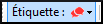

-   Saisissez le texte de la remarque
-   Cliquez sur **OK**.

    *Une icône s’affiche à côté du texte.*

**Ajouter des commentaires dans une remarque existante**

-   Cliquez sur l’icône () dans le texte.

    *La remarque s'ouvre.*

    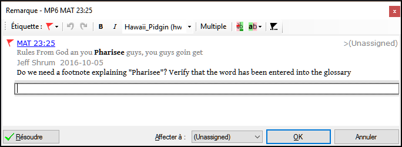

-   Saisissez le commentaire
-   Cliquez sur **OK**

**Confier une remarque à quelqu’un**

-   Cliquez sur l’icône () dans le texte.
-   Saisissez le commentaire
-   Cliquez sur **Confier à (Affecter à)**
-   Choisissez comme désiré
-   Cliquez sur **OK**

**Relie une remarque à plusieurs projets**

-   Ouvrez la remarque
-   Cliquer sur le bouton « **Multiple** »
-   Choisissez les projets
-   Cliquez sur **OK**
-   Cliquez sur **OK**  encore une fois pour fermer la boîte de dialogue.

**Rattacher une remarque**

Parfois, en éditant un verset, le mot à qui la remarque était attachée est supprimé et l’icône est déplacé au début du verset. On peut rattacher la remarque à un autre mot.

-   Ouvrez la remarque

    *Une boîte de dialogue s’affiche.*

    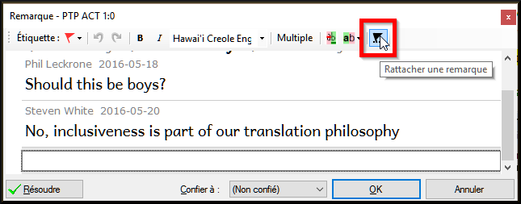

-   Cliquez sur le bouton rattacher 
-   Cliquez sur le(s) mot(s) à attacher
-   Cliquez sur **OK**.

    *La remarque est attachée au mot.*

**Marquer une remarque comme étant résolue**

-   Cliquez sur l’icône () dans le texte.
-   Saisissez un autre commentaire si nécessaire.
-   Cliquez sur le bouton **Résoudre remarque** 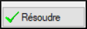
-   Cliquez sur **OK**

**Supprimer des remarques**

-   Cliquez sur l’icône de la remarque
-   Cliquez sur le petit x rouge
-   Cliquez sur **Oui** pour supprimer définitivement le commentaire.
-   S’il y a plus qu’un commentaire, continuez à supprimer pour supprimer la remarque.

**15.3 Ouvrir une liste des remarques**

Lors de la révision des remarques, il est souvent utile de les voir sous forme de liste.

-   **≡ Onglet**, sous **Outils** \> **Liste des remarques**...
-   Sélectionnez votre projet.
-   Cliquez sur **OK**.

    *Les remarques s’affichent dans une fenêtre séparée.*

    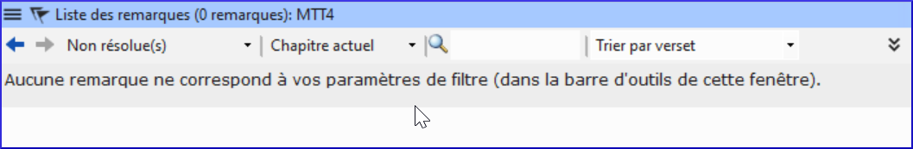

-   Modifiez les filtres si nécessaire/

    Si la fenêtre est vide, modifiez le filtre en utilisant les boutons des filtres. (voir ci-dessous).

**Barre d'outils de la fenêtre des remarques**

Il y a quatre listes déroulantes sur la barre d’outils

-   Filtre de remarques
-   Filtre de versets
-   Recherche
-   Trier par [verset, date, confiée (affectée) à]

**Filtre la liste de remarques**

-   Cliquez sur le premier bouton/liste
-   Choisissez un filtre existant

**15.3.2.1 Définir un nouveau filtre de remarques**

-   Cliquez sur le premier bouton/liste
-   Choisissez **Nouveau filtre**

    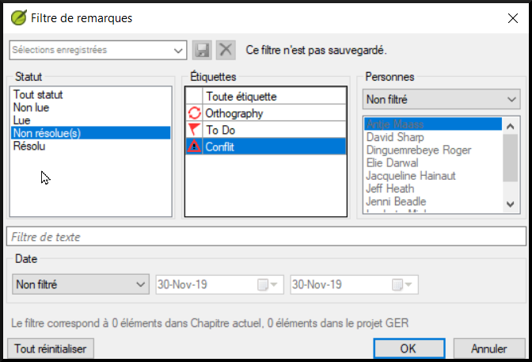

-   Choisissez le statut, l’étiquette, la personne, et la date comme vous le souhaitez.
-   Cliquez sur **OK**

**15.3.2.2 Enregistrer un filtre**

-   Définissez le filtre selon votre besoin.
-   Cliquez sur la case de texte en haut. (1)

    

-   Saisissez un nom pour le filtre
-   Cliquez sur l’icône de la disquette pour enregistrer (2).

**15.4 Ajouter des commentaires dans une remarque d'une fenêtre de remarques**

-   Cliquez sur l’icône () dans le texte.

    *La remarque s'ouvre.*

-   Saisissez un commentaire dans la case de texte en bas.

    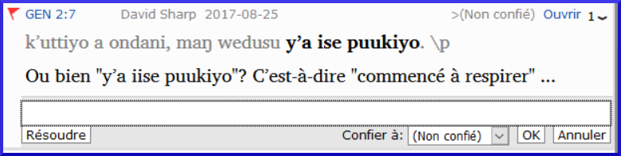

-   Résolvez ou confiez (affectez) la remarque comme désiré.
-   Cliquez sur la flèche pour réduire la remarque.

**15.5 Imprimer un rapport des remarques**

-   Cliquez dans la fenêtre des remarques.
-   Filtrez les remarques comme vous le souhaitez.
-   **≡ Onglet**, sous **Projet** \> **Imprimer**.
-   Choisissez l’imprimante et les options désirées.
-   Cliquez sur **OK**.
-   Fermez la fenêtre.

**Part IV**

**Étape 3 : Préparation pour le conseiller**

Note : Dans le plan ABU, cette étape fait partie de l'étape 2.

Dans cette troisième étape d’un projet de traduction, vous effectuerez des tests de compréhension et des retraductions. Vous continuerez également avec les contrôles de base.

Les modules suivants vous aideront avec ces étapes :

-   [**RT1 – Retraductions 1**](#sBT1)
-   [**RT2 – Retraductions 2 – mot à mot**](#sBT2)
-   [**BC3 – Vérifications de base 3**](#sBC3)
-   [**Rapport du progrès**](#sPPR)

**16**

**RT1 – Retraductions 1**

**Introduction**

En préparant une vérification, le conseiller aura besoin d’une ou plusieurs versions de votre texte dans une langue qu’il comprend. C’est souvent appelé une retraduction. Il y a deux types de retraduction. Ce module explique comment faire une retraduction libre et la tenir à jour. Le prochain module explique comment faire une retraduction mot à mot.

**Où en sommes-nous ?**

Vous avez saisi, vérifié et révisé votre traduction dans Paratext. Votre administrateur doit créer un projet pour la retraduction.

**Pourquoi est-il important ?**

Il est essentiel que votre texte soit vérifié par votre conseiller. Mais puisque votre conseiller ne connaît pas votre langue, il vous faut retraduire votre texte dans une langue que votre conseiller peut comprendre. D’où le terme « retraduction. » Le conseiller utilisera cette traduction pour aider votre équipe à améliorer vos choix exégétiques dans le texte.

Il est préférable que la retraduction soit faite par quelqu’un qui n’était pas impliqué dans votre traduction. Dans ce cas, il rendra ce que le texte dit et pas ce que vous avez voulu que le texte dise. Cela doit également être fait sans regarder les aides ou d'autres Bibles. Avoir les deux versions différentes aide le conseiller à trouver dans le texte tout problème possible.

**Que ferez-vous ?**

-   Ouvrir votre projet et votre projet de retraduction (libre).
-   Arrangez les fenêtres côté à côté,
-   Saisissez le texte de la retraduction
-   Marquez le chapitre comme achevé
-   Vérifiez que votre texte est à jour (ou synchronisé), visualisez les éventuelles différences en passant à la modification suivante le cas échéant.

**16.1 Créer un nouveau projet pour la retraduction**

(Première fois, seulement par l’administrateur)

-   **≡ Paratext**, sous **Paratext** \> **Nouveau Projet**
-   Cliquez sur le bouton **Édition**
-   Saisissez le nom complet et un nom raccourci
-   Cliquez sur **OK**
-   Choisissez la langue pour votre retraduction (p.ex. française)
-   Laissez la versification
-   Comme type de projet, choisissez « **Retraduction** »
-   Choisissez votre projet de la liste **Basé sur**.

    *Si nécessaire, Paratext modifiera la versification pour l'adapter à votre projet.*

-   Cliquez sur l’onglet **Livres**
-   Choisissez les livres désirés
-   Cliquez sur **OK** encore
-   Cliquer sur le lien **Créer un/des livre(s)**.
-   Créez des livres comme voulu.

    Ce projet n’est pas besoin d’être inscrit, parce ce qu’il hérite l'inscription de votre projet.

**16.2 Saisir votre retraduction**

-   Ouvrez votre projet
-   Ouvrez votre retraduction
-   Arrangez les fenêtres côté à côté pour facilement voir les deux fenêtres.
-   Cliquez dans la fenêtre de retraduction (le verset dans votre projet est surligné)
-   Saisissez la retraduction dans chaque verset (après la case à cocher).
-   Continuez à saisir chaque verset.

**16.3 Marquer le chapitre comme Achevé**

Quand vous avez fini le chapitre

-   De la barre d’outils en haut de la fenêtre de retraduction, cliquez sur la coche.

    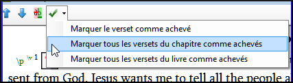

-   Choisissez **Marquer tous les versets du chapitre comme achevés**.

    *Toutes les cases du chapitre seront cochées en vert.*

**16.4 Quand une modification est faite dans votre projet**

Paratext détectera tout changement dans votre texte (au moment où le texte est enregistré) et va changer la case de traduction vers un point d’interrogation rouge  et ajouter des questions à l’état de la retraduction dans le plan de projet.

-   Cliquez dans un verset avec un point d’interrogation rouge.
-   Revoyez et corrigez la retraduction.
-   Cliquez sur le point d’interrogation rouge.

    *Il devient une coche verte.*

**Afficher les différences pour les versets périmés**

-   Cliquez sur l’icône  dans la barre d’outils pour voir les différences.

    *Une fenêtre de comparaison s’affiche.*

    

**Passer aux différences suivantes**

-   Cliquez sur les flèches de haut et de bas pour passer aux différences précédentes ou suivantes.

    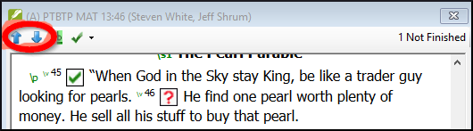

**16.5 Vérifiez votre plan de projet**

-   Cliquez sur l’icône du plan de projet 
-   Développez l'étape 3, les vérifications de la retraduction sont à la fin)

    

    *Le nombre de problèmes est affiché.*

**16.6 Vérification de versets de la retraduction (dans le plan du projet)**

-   Cliquez sur le lien de problèmes (à droite de « Statut de retraduction (xxx) achevée »)

    *Une liste de toutes les erreurs trouvées s’affiche*

-   *Et la fenêtre de retraduction s’affiche avec le curseur dans le premier verset qui a des problèmes.*
-   Corrigez le problème et passez au verset suivant qui a du « texte de verset dépassé » en cliquant sur les flèches de la barre d’outils.

**16.7 Statut de la retraduction dans « le plan du projet »**

-   La retraduction est achevée quand il n'y a plus des problèmes.

**16.8 Tâche d’apprentissage**

Les cases à cocher dans une retraduction peuvent avoir un certain nombre de symboles différents.

Consultez la rubrique Aide sur les symboles et les symboles suivants: « Quels symboles peuvent se produire dans les cases à cocher de statut dans une retraduction ? »

| A |  |   | 1 | numéro de verset incohérent |
|---|-------------------------------------------------|---|---|-----------------------------|
| B |  |   | 2 | pas de texte/verse no.      |
| C |  |   | 3 | inachevé (unfinished)       |
| D |  |   | 4 | Achevé (Finished)           |
| E |  |   | 5 | Dépassé (Out of date)       |

Table 16.1

Réponses: A3, B4, C5, D1, E2

**17**

**RT2 – Retraductions 2 – mot à mot**

**Introduction**

Le module précédent a expliqué comment créer une retraduction qui exprime ce que le lecteur comprend quand il lit ou entend le texte. Il existe un autre type de retraduction qui est parfois utilisé et qui est une retraduction mot à mot. Certains consultants peuvent demander ce style de retraduction. Vous pouvez utiliser la fonctionnalité générateur d’interlinéaire de projet.

N.B. En Paratext 9 vous ne pouvez qu’utiliser le générateur d’interlinéaire avec des projets inscrits.

**Où en sommes-nous ?**

Vous avez saisi, vérifié et révisé votre traduction dans Paratext afin qu’elle soit prête pour une vérification du conseiller en effectuant une retraduction mot à mot. Avant de commencer, votre administrateur doit créer un projet pour la retraduction mot à mot. [Ceci est distinct de la retraduction libre dans le module précédent.]

**Pourquoi est-il important ?**

Votre consultant doit avoir une copie de votre traduction dans une langue qu’il peut comprendre. La retraduction effectuée dans le module précédent est très utile, mais il y a des moments où une traduction littérale est plus utile.

**Que ferez-vous ?**

Premièrement, on configure le générateur d'interlinéaire puis on utilisera la fonction du générateur d’Interlinéaire de projet pour créer automatiquement une glose interlinéaire mot à mot du texte. L’ordinateur est bon, mais les premières propositions de l'ordinateur sont souvent fausses. Heureusement, il apprend au fur et à mesure et devient rapidement très précis. Ensuite, vous corrigez les gloses proposées si nécessaire. Vous voulez que les mots soient traduits correctement bien que l’ordre des mots ne soit pas correct pour cette langue. Lorsque vous êtes satisfait du verset, vous pouvez approuver les gloses et passer au verset suivant avec des gloses non approuvées.

**17.1 Créer une glose interlinéaire mot à mot**

-   Cliquez dans votre projet
-   **≡ Onglet**, sous \> **Outils** \> **Générateur d’Interlinéaire**

    

-   Cliquez pour dérouler la liste [1]
-   Choisissez de créer des gloses à partir d'un texte modèle. Il s'agit généralement de votre texte de référence ou de votre projet de retraduction libre [2].
-   Choisissez votre texte modèle [3].
-   Cliquez sur **OK**

**17.2 Corriger l’interlinéaire**

Vous n’avez pas besoin de confirmer les gloses correctes. Toutes gloses qui ne sont pas corrigées seront confirmées automatiquement quand vous approuvez et exportez.

Pour corriger les gloses incorrectes

-   Cliquez sur la glose

    *Une liste s'affiche.*

-   Soit cliquez une glose sur la liste

    soit tapez une glose dans la case de texte

-   Cliquez sur **Entrée**

**17.3 Traduire/gloser une expression**

-   Cliquez entre les deux mots

    

-   Cliquez sur l’icône  **Lier mots**
-   Cliquez sur la ligne rouge en bas
-   Saisissez la glose

**17.4 Ajouter des mots supplémentaires**

-   Cliquez entre deux gloses
-   Saisissez le(s) mot(s) supplémentaires

**17.5 Spécifier la morphologie**

-   Cliquez sur un mot dans la ligne de la langue de la traduction
-   Cliquez sur « **Ajouter analyse de mot** »
-   Ajouter **des espaces** entre les morphèmes et « + » aux limites du morphème
-   Cliquez sur **OK**

**17.6 Exporter/approuver le texte**

Quand vous approuvez et exportez le texte, toutes gloses rouges restantes seront approuvées.

-   Cliquer sur **Approuver les gloses**
-   Pour continuer, cliquez **Verset suivant non approuvé**

**17.7 Aide**

Pour plus d'aide lors de l'utilisation de la fonction Interlinéariser, voir les rubriques suivantes dans l'Aide de Paratext :

-   Introduction pour générateur d'interlinéaire (Introduction to Project Interlinearizer)
-   Comment ouvrir l'outil de générateur d'interlinéaire? (How do I open the Project Interlinearizer?)
-   Comment générer une retraduction mot-à-mot? (How do I generate an interlinear back translation?)
-   Comment créer une retraduction avec l'outi de générateur d'interlinéaire? ((How do I create a back translation project with the Interlinearizer?)
-   Comment créer un projet d'adaptation avec l'outil de générateur d'interlinéaire? (How do I create a text revision/adaptation project with the Interlinearizer?)
-   Qu'est-ce que les couleurs des gloses dans d'interlinéaire veulent dire? (What do the colours of glosses mean in the Interlinearizer?)

**18**

**CT – Comparer des textes**

**Introduction**

Dans ce module, vous apprendrez comment enregistrer les versions anciennes de votre texte pour les revoir plus tard.

**Où en sommes-nous ?**

Vous avez travaillé sur votre texte dans Paratext et vous êtes arrivé au un point important (point de repère) du projet.

**Pourquoi cette aptitude est-elle importante ?**

Lorsque vous travaillez sur votre traduction, vous faites continuellement des changements. Il est bon d’avoir une copie des anciennes versions de votre texte, par exemple, le texte avant la vérification du conseiller. Vous faites une version quand vous faites « marquer un point de repère dans l’historique du projet ». Vous pouvez comparer les anciennes versions du texte avec le texte actuel.

**Qu’est-ce qu’on va faire ?**

Vous allez marquer un point de repère dans l’historique du projet auquel vous pourrez revenir plus tard afin de comparer votre travail.

**18.1 Sauvegarder à chaque étape majeure de votre projet**

-   Cliquez dans votre fenêtre de projet (dans Paratext )
-   **≡ Onglet**, sous **Projet** \> **Marquer un point de repère dans l’historique du projet.**
-   Saisissez un commentaire pour décrire l'étape du projet.

    N.B. C’est bon de commencer le commentaire avec quelques symboles, comme \#\#\#, pour bien trouver les points dans la liste longue de points automatiques que Paratext crée.

-   Cliquez sur **OK**

**18.2 Voir les différences entre deux points (ou versions)**

-   **≡ Onglet**, sous **Projet** \> **Comparer les versions.**
-   Cliquez sur la liste déroulante **Version actuel (current version)**.
-   Choisissez votre point désiré dans l’historique

    

    *L’écran changera et montrera les différences entre les deux versions.*

    Chaque partie du texte qui a été supprimée est barrée. Chaque partie de texte qui a été ajoutée est soulignée.

**19**

**BC3 – Vérifications de base 3**

**Introduction**

Dans ce module vous apprendrez comment diriger les vérifications de base restantes (les références, le texte cité, les numéros, la ponctuation en paires et les citations). Comme dans les deux premiers modules de vérifications de base, il est plus facile de diriger les vérifications du plan de projet. Toutefois, si vous voulez vérifier plus qu'un livre, vous devez effectuer les vérifications du menu vérification.

**Où en sommes-nous ?**

Vous avez saisi votre traduction en Paratext. Assurez-vous que vous avez fait les vérifications décrites dans les modules BC1 et BC2 avant la continuation. Et que votre administrateur a soit fait l'installation pour les vérifications soit est disponible pour faire l'installation avec vous.

**Pourquoi est-il important ?**

Paratext a onze vérifications de base. Vous avez déjà vu les six premières vérifications. Cette dernière série de contrôles vous aide à trouver les erreurs liées au matériel mentionné d'autres livres. Vous voulez être sûr que les références sont exactes pour que le lecteur puisse trouver ces passages.

**Que ferez-vous ?**

Comme auparavant, la plupart des vérifications exigent qu'un peu d'installation soit faite par votre administrateur. Dans ce module, vous allez

-   Confirmer que l'installation a été faite
-   Lancer la vérification de base
-   Corriger toutes erreurs.

**19.1 Erreurs de ponctuation en paires correspondantes**

Cette vérification regarde la ponctuation qui se produit dans les paires (une ouverture et une fermeture) et énumère des erreurs où un élément du paire n'a pas sa correspondance. Cela peut être délibéré, mais sera plus probablement une erreur, par ex. (), [], etc.

**Inventaire**

-   **≡ Onglet**, sous **Outils** \> **Inventaires des vérifications** \> **Inventaire d'erreurs de ponctuation en paires correspondantes:**

    *Si la liste est vide, donc il n'y a aucune erreur.*

-   Si nécessaire, cliquez sur **Options...** pour ajouter d'autres paires.
-   Cliquez sur **OK**

**Faire la vérification**

-   **≡ Onglet**, sous **Outils** \> **Effectuer les vérifications de base**
-   Cochez “**Erreurs de ponctuation en paires correspondantes**”
-   Cliquez sur **OK**

    *Une liste d'erreurs s'affiche.*

-   Faites toutes corrections comme nécessaires.

**19.2 Références**

Avant que vous puissiez lancer la vérification de références, votre Administrateur doit définir des paramètres différents.

-   **≡ Onglet**, sous **Paramètres du projet** \> **Paramètres des références bibliques**

    

-   Pour chaque paramètre, tapez la ponctuation dans la boîte

    *L'échantillon sera actualisé à droite.*

-   Cliquez sur l'onglet **Noms de livre**

    

-   Remplisissez les trois colonnes [1] avec l'abréviation, le nom court et le long nom.
-   Choisissez **Abbréviations** [2] et [3] tant pour les renvois que pour les références
-   Cliquez sur **OK**
-   **≡ Onglet**, sous **Outils** \> **Effectuer les vérifications de base**
-   Click « **Références »**
-   Cliquez sur **OK**
-   Corrigez toutes erreurs.

    Paratext vous informera s'il y a des incohérences entre ces paramètres de titre du livre et les lignes \\toc et vous permettra de résoudre des conflits.

**19.3 Numéros**

Avant que vous puissiez lancer la vérification de références, votre Administrateur doit définir des paramètres de chiffres.

-   **≡ Onglet**, sous **Paramètres du projet** \> **Paramètres des chiffres**
-   Remplissez la boîte de dialogue.

    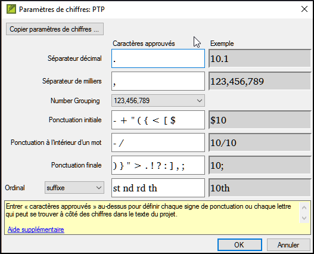

-   Cliquez sur **OK**
-   **≡ Onglet**, sous **Outils** \> **Effectuer les vérifications de base**
-   Cochez « **Numéros»**
-   Cliquez sur **OK**

**19.4 Règles de guillemets**

La vérification de citations est utilisée pour garantir que vous avez été cohérent avec les guillemets du discours direct.

Avant que vous puissiez lancer la vérification de citation, votre Administrateur doit définir les règles pour vos citations.

-   **≡ Onglet**, sous **Paramètres du projet** \> **Règles de guillemets**
-   Remplisissez les guillemets utilisé pour chaque niveau [1] [2] [3]
-   Cochez "**Surligner les guillemets [8]**"
-   Cliquez sur  **OK**.

**19.5 Vérification des citations**

-   **≡ Onglet**, sous **Outils** \> **Effectuer les vérifications de base**
-   Cochez **Citations**
-   Cliquez sur **OK**.

    *Une liste d'erreurs est affichée. Il montre des erreurs possibles, mais inclut quatre citations correctes auparavant et après l'erreur possible.*

-   Double-cliquez sur le premier élément qui ne commence pas par «…»
-   Corrigez si nécessaire.
-   Cliquez sur le bouton **Relancer** pour confirmer que vous avez corrigé l'erreur.

**19.6 Texte cité**

La vérification de texte cité regarde le texte dans les notes en bas de page ou les renvois qui a été marqué avec les marqueurs \\qt … \\qt \*. Il vérifie que le texte cité correspond au texte dans le verset.

-   **≡ Onglet**, sous **Outils** \> **Effectuer les vérifications de base**
-   Cochez **Quoted text (texte cité)**
-   Cliquez sur **OK**.

    *Une liste d'erreurs est affichée.*

-   Corrigez si nécessaire.

    N.B. : Le texte doit être exactement le même comme dans le texte. C'est-à-dire, on ne peut pas avoir même la ponctuation supplémentaire entre les marqueurs \\qt … \\qt \*.

**Part V**

**Étape 4 : Vérification par un conseiller**

**​Introduction**

*Note : Cette étape ne fait pas partie du plan d'ABU.*

La quatrième étape d’un projet de traduction est la vérification par un conseiller. Vous rencontrerez le conseiller et évaluez votre texte, prenez des notes, révisez vos textes et les retraductions si nécessaire. Vous voudrez vous assurer que vous avez mis à jour l’état de votre traduction dans le plan de projet.

Les modules suivants vous aideront avec ces étapes :

-   [20](#collaborationTools)
-   Voir aussi ces modules d'étape un et deux
-   [**RT1 – Retraductions 1**](#sBT1)
-   [**RT2 – Retraductions 2 – mot à mot**](#sBT2)

**20**

**Outils de collaboration**

**Introduction**

Dans ce module, vous utiliserez Paratext Live pour permettre à l'équipe de collaborer, de sorte que chacun puisse voir les modifications apportées au texte sur son propre ordinateur.

**Où en sommes-nous ?**

Nous avons déjà vu comment collaborer avec Envoyer/Recevoir. La vérification par un conseiller est l'une des nombreuses occasions où plusieurs personnes doivent examiner le même texte, voire l'éditer ensemble. Paratext Live permet à chacun de consulter le texte sur son propre ordinateur et de voir les modifications apportées en temps réel.

**Pourquoi est-il important ?**

Il existe plusieurs autres moyens de permettre à tout le monde de regarder le même texte. Mais Paratext Live permet non seulement à tout le monde de voir le texte, mais il permet également à plusieurs personnes de modifier le texte.

**Que ferez-vous ?**

-   Connectez tous les utilisateurs au même réseau.
-   Faire un envoyer/recevoir
-   Démarrer Paratext Live et se joindre la session live
-   Faire les modifications
-   Échanger tous les fichiers
-   Terminer/quitter la session Live
-   Faire un envoyer/recevoir

    Voir le vidéo 4.1 Collaboration Tools. Il n'est actuellement disponible qu'en anglais (avec des sous-titres français) mais il sera traduit en français.

**20.1 Paratext Live**

Avant de pouvoir lancer Paratext Live, tous les utilisateurs doivent effectuer un envoyer/recevoir et tout le monde doit être connecté au même réseau.

**Envoyer/Recevoir**

Avant de lancer Paratext Live, tous les participants doivent envoyer/recevoir le projet. Paratext vous indiquera que vous devez envoyer/recevoir le projet.

**Connecter tous les utilisateurs au même réseau**

Paratext Live peut utiliser

**Démarrer Paratext Live**

-   Ouvrez le menu du projet.
-   Sous **Outils**, cliquez sur **Paratext Live**.
-   Ou utilisez l'icône de la barre d'outils.
-   Cliquez sur **Démarrer/se joindre la session Live**. *Si vous n'avez pas activé l'enregistrement automatique, il sera le activé automatiquement pour la durée de la session.*
-   Paratext vous demande alors si vous êtes l'éditeur principal.
-   Si vous **n'êtes pas** l'éditeur principal, attendez, ne cliquez pas sur Annuler car cela annulerait votre participation à la session en direct.
-   Si vous **êtes** le rédacteur principal, cliquez sur **Start as Primary Editor**.

    *Lorsqu'une session est active, le bouton Paratext Live est vert*.

**Partager les modifications fait à partir d'Outils**

Tout le texte de l'écriture est partagé lorsque vous faites un envoyer/recevoir. Cependant, les modifications apportées à l'aide de divers outils ne sont pas partagées automatiquement. Des exemples de ces modifications non partagées sont l'état de l'orthographe, l'état du passage parallèle, les termes bibliques et leurs équivalents identifiés, et les remarques de discussion.

Les modifications de tous les utilisateurs sont partagées, mais si deux personnes ont modifié différemment le même élément, seule la modification d'une personne sera enregistrée.

**Terminer la session Paratext Live**

-   Cliquez sur le bouton Paratext Live
-   Cliquez sur **Terminer/quitter la session Live**
-   Si vous êtes le rédacteur principal, vous verrez une boîte de message.
-   Cliquez sur **Terminer la session normalement**.
-   Effectuer un envoyer/recevoir.

    **Notez bien** : si l'un des participants a effectué une mise à niveau vers Paratext 9.2, **tous les participants** doivent le faire car les fichiers Paratext Live sont légèrement différents dans la version 9.2.

    **Pour plus d'aide**, recherchez "**live**" dans le champ de recherche de la barre de titre. Il existe de nombreuses rubriques utiles pour vous aider à utiliser Paratext Live.

**Part VI**

**Étape 5 / Étape 3 ABU : Tester/réviser avec la communauté**

**​Introduction**

*N.B.: Cette étape est équivalente à la troisième étape du plan d'ABU.*

La cinquième étape d’un projet de traduction est la révision par la communauté. Dans la révision, vous vérifierez le style naturel, vous produirez un rapport d’avancement d’équipe et vous réviserez les termes clés.

Les modules suivants vous aideront avec cette étape :

-   [**Rapport du progrès**](#sPPR)
-   [**Rapport des termes bibliques**](#sBTR)

**21**

**Rapport du progrès**

**Introduction**

Dans ce module vous créerez un rapport sur l'état d'avancement.

**Où en sommes-nous ?**

Comme vous avez travaillé sur votre traduction, vous avez actualisé votre plan de projet avec votre progrès sur les chapitres accomplis et les livres. Maintenant vous préparerez un rapport.

**Pourquoi est-il important ?**

Vos administrateurs et bailleurs ont besoin des rapports exacts de votre progrès.

**Que ferez-vous ?**

-   Vous allez vérifier que votre plan de projet est à jour.
-   Vous allez produire plusieurs rapports.

**21.1 Vérifier votre plan**

-   Ouvrez votre projet
-   Cliquez sur l'icône de plan de Projet
-   Actualisez votre progrès comme nécessaire.

**21.2 Produire les courbes de progression**

-   Du menu **Onglet**, sous **Projet** choisissez **Graphiques de l'état d'avancement**
-   Cliquez sur la flèche bas dans la liste à gauche.

    

-   Choisissez comme appropriés (p.ex. Graphique prévisionnel en courbes).

    *Une fenêtre s'affiche avec un graphique)*

-   Cliquez sur l'icône d'imprimante

    *Une fenêtre s'affiche.*

-   Cliquez sur l'icône **Print**

    *Une boîte de dialogue s'affiche*

-   Choisissez votre imprimante (ou PDF creator)
-   Cliquez sur **OK**

**22**

**Rapport des termes bibliques**

**Introduction**

Une tâche dans cette étape est de produire un rapport des changements faits dans les termes bibliques.

**Où en sommes-nous ?**

Dans le fait de travailler sur votre traduction vous avez identifié et avez changé un certain nombre de termes bibliques clés.

**Pourquoi est-il important ?**

Bien que vous ne puissiez pas utiliser Paratext pour écrire le rapport, il peut produire une liste des termes dont vous auriez besoin d'inclure dans votre rapport.

**Que ferez-vous ?**

Dans l'outil de termes biblique, vous filtrez les livres que vous voulez inclure dans votre rapport. Vous sauverez alors la liste des termes comme un Fichier HTML séparé. Vous pouvez aussi filtrer la liste sur toutes notes de discussion que vous avez faites.

**22.1 Outil de termes biblique**

-   Cliquez dans votre projet
-   **≡ Onglet**, sous **Outils** \> **Termes bibliques**
-   Si cette option de menu n'est pas affichée, cliquez sur la flèche vers le bas au bas des menus pour afficher les menus complets.
-   Activez le filtre des termes comme désiré.
-   Activez le filtre des versets (des livres que vous voulez inclure).
-   Triez la liste comme désiré.

**22.2 Enregistrer la liste comme fichier HTML**

-   **≡ Onglet**, sous **Termes bibliques** \> **Exporter au format HTML**
-   Tapez un nom pour le fichier
-   Cliquez sur **Save/Enregistrer**
-   Ouvrez le fichier dans **Word/LibreOffice**

**22.3 D'autres façons d'identifier des équivalents**

**Trier par les remarques des équivalents**

-   Cliquez sur ? (l'en-tête de la deuxième colonne) pour tirer par les remarques des équivalents.

    

**Trouver des termes avec du texte dans la description d'équivalents**

-   Cliquez sur la flèche à côté du **Rechercher** sur la barre d'outils.
-   Choisissez **Descriptions des équivalents**
-   Dans la case à droite, tapez le texte à rechercher

    *La liste est filtrée.*

-   Enregistrez la liste à HTML (comme au-dessus).

**A**

**Textes à format spécial**

Les passages suivants ont souvent une mise en forme spéciale (en ajoutant d'autres codes d'USFM)

-   Mat 1.2-16 : La généalogie, qui n'est pas la prose normale. Souvent mis dans un format poétique spécial dont les pères se mettent en rang et le formulaire indique que c'est une liste spéciale (avec les commentaires).
-   Mat 5.3-10 : Les béatitudes. Souvent mis en forme poétique.
-   Mat 6.9-13 : La prière du Seigneur. Souvent mis en forme poétique.
-   Mat 21.9 : La salutation à Jésus. Souvent mis en forme poétique.
-   Mat 27.37 : Le signe sur la croix. Souvent mis en petites majuscules.
-   Mat 27.46 : Le cri de Jésus. Parfois placé entre \\tl et \\tl\*, la balise pour une translittération (parce que c'est dans une autre langue).
-   Mrk 5.41 : La commande à la fille morte. Parfois placé entre \\tl et \\tl\*, la balise pour une translittération (parce que c'est dans une autre langue).
-   Mrk 11.9 : La salutation à Jésus. Souvent mis en forme poétique.
-   Mrk 14.36 : « Abba ». Parfois placé entre \\tl et \\tl\*, la balise pour une translittération (parce que c'est dans une autre langue).
-   Mrk 15,26 : Le signe sur la croix. Souvent mis en petites majuscules.
-   Mrk 15,34 : Le cri de Jésus. Parfois placé entre \\tl et \\tl\*, la balise pour une translittération (parce que c'est dans une autre langue).
-   Mrk 16,9 : Une note indiquant une autre fin de Mark. Quelquefois séparé par une règle horizontale.
-   Luk 1.46-55 : La chanson de Mary (ou Elizabeth ; Magnificat). Souvent mis en forme poétique.
-   Luk 1.68-79 : La chanson de Zechariah. Souvent mis en forme poétique.
-   Luk 2.14 : Le chant du chœur angélique. Souvent mis en forme poétique.
-   Luk 2.29-32 : La louange de Simeon. Souvent mis en forme poétique.
-   Luk 3.23-38 : La généalogie. Souvent mis en forme poétique spéciale semblable à la généalogie dans Matthew.
-   Luke 6.20-22 : Les béatitudes (bénédictions). Souvent mis en forme poétique.
-   Luke 6.24-26 : Les béatitudes (malheurs). Souvent mis en forme poétique.
-   Luke 11.2-4 : la prière du Seigneur. Souvent mis en forme poétique.
-   Luke 19.38 : La salutation à Jésus. Souvent mis en forme poétique.
-   Luke 23.38 : Le signe sur la croix. Souvent mis dans de petites majuscules.
-   Jhn 7.53-8.11 : L'histoire de la femme prise sur le fait. La tête de section se produit d'habitude avant le vers 53. Rarement, séparé par une règle horizontale auparavant et après le texte.
-   Jhn 12.13 : La salutation à Jésus. Souvent mis en forme poétique.
-   Jhn 17.1-27 : La prière de Jésus. Quelquefois, bien que rarement, mit en paragraphes en retraite ajoutée de la marge gauche.
-   Jhn 19.19 : Le signe sur la croix. Souvent mis dans de petites casquettes.
-   Act 15.23-29 : La lettre. Souvent mis dans les paragraphes avec un retrait ajouté de la marge gauche.
-   Act 23.26-30 : La lettre à Claudius Lysias. Souvent mis dans les paragraphes en retrait ajouté de la marge gauche.
-   Rom 8.15 : « Abba ». Parfois placé entre \\tl et \\tl\*, la balise pour une translittération (parce que c'est dans une autre langue).
-   Rom 11.33-36 : La doxologie. Souvent mis en forme poétique.
-   Rom 16.3-16 : Les salutations spéciales. Quelquefois mis dans un format poétique spécial semblable aux généalogies.
-   Gal 4.6 : « Abba ». Parfois placé entre \\tl et \\tl\*, la balise pour une translittération (parce que c'est dans une autre langue).
-   Php 2.6-11 : Les attitudes. Quelquefois mis en forme poétique.
-   1Ti 2.5-6 : Un credo. Quelquefois mis en forme poétique.
-   1Ti 3.16 : Un credo. Souvent mis en forme poétique.
-   2Ti 2.11-13 : Un credo. Souvent mis en forme poétique.
-   1Jn 2.12-14 : je vous écris. Quelquefois mis en forme poétique.
-   Apo 1.4-7 : La salutation et doxologie. Quelquefois mis comme la poésie et la prose.
-   Apo 2-3 : Les sept lettres. Souvent mis dans les paragraphes en retrait ajoutée de la marge gauche.
-   Apo 4.8 : Un chant. Parfois mis en forme poétique centré.
-   Apo 4.11 : Un chant. Souvent mis en forme poétique.
-   Apo 5.9-10, 12, 13 : Chansons. Souvent mis en forme poétique.
-   Apo 7.5-8 : Une liste. Souvent mise en forme poétique spécial.
-   Apo 7.10, 12 : Chants. Souvent mis en forme poétique.
-   Apo 7.15-17 : Une déclaration. Quelquefois mis en forme poétique.
-   Apo 11.15, 17-18 : Chants. Souvent mis en forme poétique.
-   Apo 12.10-12 : Une déclaration. Souvent mis en forme poétique.
-   Apo 15.3-4 : Une chanson. Souvent mis en forme poétique.
-   Apo 16.5-7 : Une déclaration. Souvent mis en forme poétique.
-   Apo 17.5 : Un signe. Souvent centré, en petites majuscules.
-   Apo 18.2-8 : Une déclaration. Souvent mis en forme poétique.
-   Apo 18.10-24 : Une série de malheurs. Souvent mis en forme poétique.
-   Apo 19.1-8 : Une série de déclarations. Souvent mis en forme poétique.
-   Apo 19.16 : Un signe. Souvent le jeu a centré, en petites majuscules.
-   Apo 21.19-20 : liste A. Quelquefois, bien que rarement, mis en forme poétique.

**B**

**Les codes de livres bibliques (trois lettres)**

| Genèse - GEN                 | Exode - EXO        | Lévitique - LEV   |
|------------------------------|--------------------|-------------------|
| Nombres - NUM                | Deutéronome - DEU  | Josué - JOS       |
| Juges - JDG                  | Ruth - RUT         | 1 Samuel - 1SA    |
| 2 Samuel - 2SA               | 1 Rois - 1KI       | 2 Rois - 2KI      |
| 1 Chroniques - 1CH           | 2 Chroniques - 2CH | Esdras - EZR      |
| Néhémie - NEH                | Esther - EST       | Job - JOB         |
| Psaumes - PSA                | Proverbes - PRO    | Ecclésiaste - ECC |
| Cantique des cantiques - SNG | Ésaïe - ISA        | Jérémie - JER     |
| Lamentations - LAM           | Ézékiel - EZK      | Daniel - DAN      |
| Osée (Hosea] - HOS           | Joël - JOL         | Amos - AMO        |
| Abdias - OBA                 | Jonas - JON        | Michée - MIC      |
| Nahoum - NAM                 | Habacuc - HAB      | Sophonie - ZEP    |
| Aggée - HAG                  | Zacharie - ZEC     | Malachie - MAL    |

Table B.1 Ancien Testament

| Matthieu - MAT          | Marc - MRK              | Luc - LUK        |
|-------------------------|-------------------------|------------------|
| Jean - JHN              | Actes - ACT             | Romains - ROM    |
| 1 Corinthiens - 1CO     | 1 Corinthiens - 2CO     | Galates - GAL    |
| Éphésiens - EPH         | Philippiens - PHP       | Colossiens - COL |
| 1 Thessaloniciens - 1TH | 1 Thessaloniciens - 2TH | 1 Timothée - 1TI |
| 2 Timothée - 2TI        | Tite - TIT              | Philémon - PHM   |
| Hébreux - HEB           | Jacques - JAS           | 1 Pierre - 1PE   |
| 2 Pierre - 2PE          | 1 Jean - 1JN            | 2 Jean - 2JN     |
| 3 Jean - 3JN            | Jude - JUD              | Apocalypse - REV |

Table B.2 Nouveau Testament

**C**

**Les caractères de Tchad Unicode**

Certains des caractères utilisés dans les langues tchadiennes ne se trouvent pas sur le clavier. Pour les taper, vous devez appuyer sur plus qu’une touche.

Les tableaux ci-dessous montrent tous les caractères du Tchad. Les séquences de touches sont indiquées pour chaque caractère.

| **Les caractères du Tchad** | **Les tons**             |    |                  |
|-----------------------------|--------------------------|----|------------------|
| **Tapez ... pour avoir**    | **Tapez ... pour avoir** |    |                  |
| ;’ ’                        | ;n ŋ                     | ]  | à ton bas        |
| ;b ɓ                        | ;o ɔ                     | [  | á ton haut       |
| ;c ç                        | ;p œ                     | =  | ā ton moyen      |
| ;d ɗ                        | ;y ƴ                     | \^ | â ton descendant |
| ;e ɛ                        |                          | \| | ǎ ton montant    |
| ;f ə                        |                          | \# | ä umlaut         |
| ;h ɦ                        |                          | \~ | ã tilde          |
| ;k ɨ                        |                          | \_ | a̰ sous-tilde     |
| ;m ɲ                        |                          | \` | a̧ cédille        |

Table C.1

Taper les autres caractères spéciaux de la façon suivante :

| **Tapez** | **pour avoir** |   | **Tapez**            | **Pour avoir** |
|-----------|----------------|---|----------------------|----------------|
| ;]        | ]              |   | ;;                   | ;              |
| ;[        | [              |   | ;{                   | “              |
| ;=        | =              |   | ;}                   | ”              |
| ;\^       | \^             |   | ;(                   | ’              |
| ;\|       | \|             |   | ;)                   | ’              |
| ;\#       | \#             |   | ;\< ou \<\< (Keyman) | «              |
| ;\~       | \~             |   | ;\> ou \>\> (Keyman) | »              |
| ;\_       | \_             |   | ;, ou ;\<            | ‹              |
| ;\`       | \`             |   | ;. ou ;\>            | ›              |

Table C.2

**D**

**USFM Marqueurs fréquents**

Remarque : Tous les styles de type "Paragraphe" nécessitent l'utilisation de la touche "Entrée" lors du choix du marqueur en vue "Standard".

Remarque : Tous les types de style "Note" et "Caractère" nécessitent l'utilisation de la touche " antislash " lors du choix du marqueur en vue " Standard ".

| \\id  | Fichier - Identification                                 | Paragraphe |
|-------|----------------------------------------------------------|------------|
| \\h   | Fichier - En-tête                                        | Paragraphe |
| \\c   | Numéro de chapitre                                       | Paragraphe |
| \\v   | Numéro du verset                                         | Caractère  |
| \\p   | Paragraphe - Normal - Retraite de première ligne         | Paragraphe |
| \\m   | Paragraphe - Marge - Pas d'indentation de première ligne | Paragraphe |
| \\q1  | Poésie - Retrait Niveau 1                                | Paragraphe |
| \\q2  | Poésie - Retrait Niveau 2                                | Paragraphe |
| \\r   | Titre - Références parallèles                            | Paragraphe |
| \\s1  | Titre - Section Niveau 1                                 | Paragraphe |
| \\s2  | Titre - Section Niveau 2                                 | Paragraphe |
| \\mt1 | Titre principal niveau 1                                 | Paragraph  |
| \\mt2 | Titre principal niveau 2                                 | Paragraph  |
| \\mt3 | Titre principal niveau 3                                 | Paragraph  |

**Marqueurs moins fréquents**

| \\pc | Paragraphe - Centré (pour Inscription)                   | Paragraphe |
|------|----------------------------------------------------------|------------|
| \\nb | Paragraphe - Pas de rupture avec le Paragraphe précédent | Paragraphe |
| \\li | Entrée de liste - Niveau 1                               | Paragraphe |

**Introduction marqueurs**

| \\imt1 | Introduction - Titre principal Niveau 1                         | Paragraphe |
|--------|-----------------------------------------------------------------|------------|
| \\iot  | Introduction - Titre du plan d'ensemble                         | Paragraphe |
| \\io1  | Introduction - Plan d'ensemble niveau 1                         | Paragraphe |
| \\io2  | Introduction - Plan d'ensemble niveau 2                         | Paragraphe |
| \\ip   | Introduction - Paragraphe                                       | Paragraphe |
| \\im   | Introduction - Paragraphe - pas d'indentation de première ligne | Paragraphe |
| \\ipq  | Introduction - Paragraphe - Citation tirée du texte             | Paragraphe |

**Marquers Renvoi**

| \\x   | Renvoi                   | Note      |
|-------|--------------------------|-----------|
| \\xo  | Renvoi référence origin  | Caractère |
| \\xt  | Renvoi références cibles | Caractère |
| \\x\* | Renvoi                   | Note      |

**Marquers Figure**

| \\fig   | Auxiliaire – Image/Illustration/Carte       | Note |
|---------|---------------------------------------------|------|
| \\fig\* | Auxiliaire – Fin d'Image/Illustration/Carte | Note |

**Footnote Markers**

| \\f   | Note de bas de page                                           | Note      |
|-------|---------------------------------------------------------------|-----------|
| \\fr  | Note de bas de page - Reference                               | Caractère |
| \\ft  | Note de bas de page - Texte                                   | Caractère |
| \\fk  | Note de bas de page - Mot clé                                 | Caractère |
| \\fq  | Note de bas de page - Citation ou Équivalent alternatif       | Caractère |
| \\fqa | Note de bas de page - Équivalent de la traduction alternative | Caractère |
| \\f\* | Fin de la note de bas de page                                 | Note      |

**Glossary**

| \\k ... k\*   | Mot clé (citation dans le glossaire)                         | Caractère  |
|---------------|--------------------------------------------------------------|------------|
| \\w ... \\w\* | Marquer un mot dans le glossaire (dans le texte)             | Caractère  |
| \\p           | Paragraphe                                                   | Paragraphe |
| \\li1         | Entrée de liste - Niveau 1 (pour la définition du glossaire) | Paragraphe |
| \\li2         | Entrée de liste - Niveau 2 (pour la définition du glossaire) | Paragraphe |
