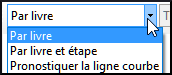

**Introduction**

Dans ce module, vous apprendrez comment mettre à jour les informations sur le progrès fait en marquant les tâches comme achevées. et créer un rapport sur l'état d'avancement.

**Où en sommes-nous ?**

Vous avez travaillé sur votre traduction et avez fini une tâche. Vous voulez maintenant mettre à jour votre progrès.

Pour que le plan de projet fonctionne bien, vous devez marquer les tâches que vous avez finies. Cela permet à Paratext 9 de rendre la tâche suivante disponible pour les autres membres de l'équipe. Il donne également à Paratext des informations précises sur vos progrès pour les rapports. La création de rapports d'avancement vous aide à préparer un rapport pour vos superviseurs et vos bailleurs de fonds.

Vous ouvrirez la fenêtre des **Tâches et avancement**, et mettrez à jour les informations sur le progrès fait. Vous produirez alors un rapport.

**6.1 S'assurer le progrès du plan est à jour**

-   Ouvrez le plan de projet (utilisant le bouton)
-   Mettez à jour les informations sur le progrès de chaque tâche (voir PP1 pour les instructions sur chaque type de tâche).

**6.2 Modifier une affectation**

Cela peut seulement être fait par quelqu'un qui a des autorisations d'avancement.

-   **≡ Onglet**, sous **Projet**, select **Tâches et avancement....**
-   De la première liste déroulante en haut du dialogue, choisissez **Toutes les tâches**
-   Dans la colonne, "**Confié (Affecté) à**" , utilisez la liste déroulante pour choisir qui aura la responsabilité de la tâche ou de la vérification énumérée dans la colonne **Tâche/Vérification** au gauche.

**6.3 Produisez un rapport sur l'état d'avancement**

-   **≡ Onglet**, sous **Outils**, choisissez **Rapport sur l'état de Projet..**.
-   Choisissez le(s) projet(s) pour le(s)quel(s) créer un rapport
-   Cliquez sur **OK**.

    *Le rapport contiendra une colonne pour chaque projet que vous avez choisi.*

**6.4 Voir les courbes de progression**

-   **≡ Onglet**, sous **Projet**, choisissez **Graphiques de progression ....**.

    

-   Utilisez la première boîte déroulant pour choisir le type de graphique
-   Choisissez les livres si nécessaires.
-   Cliquez sur l'icône d'imprimante

    *Une fenêtre s'affiche.*

-   Cliquez sur l'icône **Imprimer**
-   Choisissez votre imprimante (ou PDF creator)
-   Cliquez sur **OK**

**Part III**

**Étape 2 : Vérification par l’équipe**

La deuxième étape d’un projet de traduction est la vérification en équipe. Dans cette deuxième étape, vous utiliserez de nombreux outils pour vous assurer que vous avez été cohérent dans votre traduction. Vous allez lire votre texte et travailler sur les noms propres, les termes clés bibliques, la vérification d’orthographe et les contrôles de mise en forme. Vous allez également imprimer un brouillon et utiliser une variété de remarques : remarques de projet, remarques de discussion orthographique et remarques de discussion sur les équivalents pour enregistrer vos questions, des discussions et des décisions.

Les modules suivants vont vous aider dans cette étape :

-   [**NP – Noms propres**](#sPN)
-   [**VO – Vérification de l’orthographe**](#sSP)
-   [**TB – Un processus de 4 étapes pour les termes bibliques cohérents**](#BTTerms)
-   [**VM – Vérification de mise en page**](#sFcFormattingChecks)
-   [**VB2 – Les vérifications de base**](#sBC2)
-   [**IE – Impression d’ébauches**](#sPD)
-   [**UR – L’utilisation des remarques**](#sUNUsingNotes)
