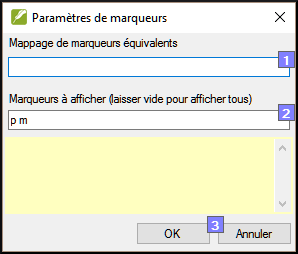
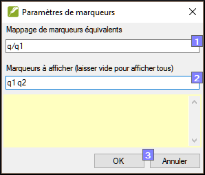

**Introduction**

Dans ce module, vous apprendrez à trouver et à corriger les erreurs de mise en forme et de mise en page.

**Où en sommes-nous ?**

Vous avez saisi votre ébauche dans un projet dans Paratext. Ce module vous montrera comment utiliser les **listes de vérifications** pour trouver et corriger les erreurs de mise en forme et de mise en page.

**Pourquoi cette aptitude est-elle importante ?**

Un Nouveau Testament contient plus que des chapitres et des versets. Il y a aussi des titres, des titres de section et plusieurs types de paragraphes. Ces vérifications vous permettent de vous assurer que la mise en page de votre texte est correcte et que vos titres, etc. sont cohérents.

**Qu’est-ce qu’on va faire ?**

Vous utiliserez les listes de vérifications pour

-   comparer vos titres et sous-titres ;
-   vérifier vos sautes de paragraphes ;
-   comparer les marqueurs de paragraphe de votre texte avec ceux de votre texte de référence ;
-   ajouter des marqueurs pour la mise en forme des textes spéciaux.

**13.1 Utilisation des listes de vérifications – générique**

Il existe un certain nombre de listes de vérifications qui diffèrent légèrement, mais ils ont un mode d’emploi en commun :

**Comment afficher la liste**

-   **≡ Onglet**, sous **Outils** \> **Listes de vérifications** \> choisissez la liste désirée
-   Ajoutez un texte comparatif (si voulu) en cliquant sur le bouton **Textes comparatifs**
-   Sélectionnez la plage (si nécessaire) en utilisant le bouton **Sélectionner plage**

**Comment faire les modifications**

-   Cliquez sur le lien « modifier » pour corriger des problèmes vus
-   Cliquez sur le lien de référence pour voir plus de contexte

**Fermer la liste**

-   Une fois la liste terminée, fermez-la en cliquant sur le X dans le coin supérieur droit de la fenêtre.

**13.2 Utilisation des listes de vérifications – En-têtes de section**

-   **≡ Onglet**, sous **Outils** \> **Listes de vérifications** \> **En-têtes de section**

Vérifiez que

-   les titres sont cohérents avec votre texte de référence (longueur, grammaire, style)).
-   tous les en-têtes commencent avec une majuscule.
-   il n’y a pas de ponctuation à la fin.
-   ils ne sont pas trop longs.

**13.3 Vérification des paragraphes**

-   **≡ Onglet**, sous **Outils** \> **Listes de vérifications** \> **Marqueurs**
-   Choisissez votre texte de référence comme le **texte comparatif**
-   Cliquer sur **Paramètres**

    

-   Saisissez les marqueurs à afficher (p.ex. p m)
-   Cliquez sur **OK**
-   Cliquez sur le lien « édition » pour corriger des problèmes vus.

OU

-   Cliquez sur le lien bleu
-   Faites les corrections en Paratext
-   Retournez aux listes de vérifications en cliquant sur l'icône sur la barre des tâches.

**13.4 Mise en page et retraits**

-   **≡ Onglet**, sous **Outils** \> **Listes de vérifications** \> **Marqueurs**
-   Choisissez votre texte de référence comme texte comparatif
-   Cliquer sur **Paramètres**

    

-   Tapez les marqueurs à vérifier.
-   Cliquez sur **OK**.
-   Cherchez des passages qui ont été mis au format avec de différents marqueurs tels que q1 et q2
-   Faites les modifications comme ci-dessus.

**13.5 Ajouter USFMs pour la mise en forme spéciale**

-   Regardez la liste de mise en forme spéciale (annexe A)
-   Ajoutez les USFM comme nécessaire.
