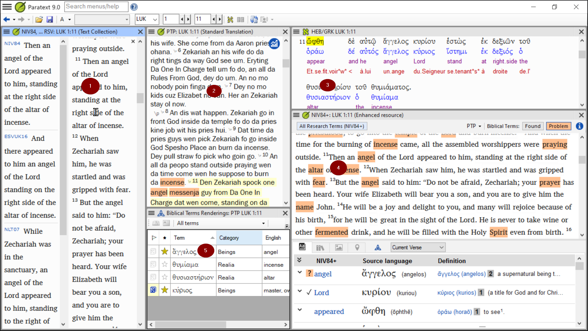
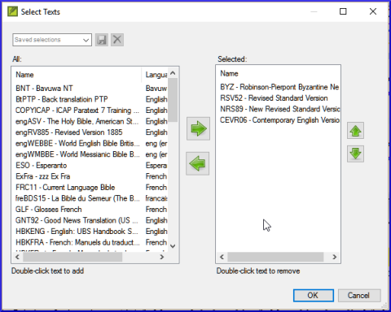

---
title: OD – Organising your desktop 
lang: en_GB
---

**Introduction**  
As you work with your text in Paratext 9 you will want to see a variety of resources. In this module, you will learn how to open resources and organise your desktop.

**Before you start**  
We are getting ready to type text into an existing project. Before you can do this, someone must have already installed the program, created a project for your data and installed resources for you.

**Why this is important**  
The translator who organises his/her desktop well has all the resources necessary for his/her work.

**What are you going to do?**

You will start the Paratext 9 program and open a previously saved layout (text combination). If needed you will open other resources, change the arrangement of the windows and resave the text combination.

:::info Videos 
There are a number of videos available to help you with the different types of resources and arranging the windows. E.g. 0.2.1b-0.2.1d, 0.2.2a
:::
**Changes in Paratext 9**

The menus have changed in Paratext 9. To see the menu, you now need to click on the menu icon ≡. There are now two types of menus. The main Paratext menu is on the title bar () and each window (or tab) has its own menu (). When you click on one of these menu icons all the menus are displayed and you just need to click on the command.

:::tip
In the manual, when it says **≡ Paratext**, under **Menu** \> **Command**. It means click on the Paratext menu icon ≡, then under the menu (e.g. File) choose the command (e.g. Open). And when it says **≡ Tab**, under **Menu** \> **Command** it means click on the tab menu icon, then under the menu (e.g. Tools) click on the command (e.g. Wordlist)
:::

## 2.1 Load the program

1. Double-click on Paratext 9 icon on the **desktop**

    

    OR

1. (From the **Start** menu, choose Paratext 9)

## 2.2 Open a saved layout

1. Click the **≡ Paratext** menu, then under the **Window** menu
1. Choose a saved layout (text combination).  
   - *Your screen should look like the picture below (if not, see below).*  
    

## 2.3 Create a new text layout

If you haven’t already saved a layout, then we recommend you do the following:

**Open and arrange the windows**

Open 5 windows as follows:  
- 5 = your project
   - **≡ Paratext** menu, under (**Paratext** \> **Open**, Projects)
- 1 = Renderings
   - **≡ Tab** menu, under (Tools \> **Biblical Terms renderings**)
- 2 = Source text
   - **≡ Paratext** menu, under (**Paratext** \> **Open \> Source language text**)
- 3 = Dictionary
   - **≡ Paratext** menu, under (**Paratext** \> **Open \> source language dictionary**)
- 4 = Text collection
   - **≡ Paratext** menu, under (**Paratext** \> **Open**, select several resources, choose to open as Text collection. See 2.5)
- Arrange the windows as desired. See Paratext video 0.2.1b, c, and d.

:::tip
Remember to save your layout!
:::

**Save the layout**  
Once the windows are arranged as desired:

1. **≡ Paratext**, under **Layout** \> **Saved current layout**
1. Type a name  
    [or to replace an existing combination, choose the existing name]
1. Click **OK**

## 2.4 Delete a text combination

If you want to delete a saved combination,

1. **≡ Paratext** menu, under **Layout** \> **Delete layout**
1. Choose the name of the saved combination.
1. Click **Delete**

## 2.5 Open resources in a Text collection

:::tip
With Paratext, it is possible to have several project/resources open at the same time. However, rather than having too many windows, it is better to have several texts in one window.
:::

1. **≡ Paratext** menu, under **Paratext** \> **Open**  
      
1. Click on the resource button (at the top).
1. Select several resources using the Ctrl key when you click on the resource.
1. Repeat as necessary.
1. Click on the **Open as** dropdown list.
1. Choose **Text collection**
1. Click **OK**

:::tip
N.B. It is suggested that resources be presented in the order of more literal to less literal (to focus on the texts that are most faithful to the source texts). For French resources, the following order is suggested: TOB, NVSR78Col, NBS, BDS, FC97, PDV11. For English resources: ESV, RSV, NIV, NLT.
:::

To change the order of texts in the collection
1. **≡ Tab**, **Modify text collection**  
      
1. Use the arrow buttons to change the order as necessary  
      
1. Make any other changes
1. Click **OK**

:::tip
You can change the text in the second pane by clicking on the blue link of the abbreviation for the text. You can also change the view (preview, unformatted or standard.
:::

## 2.6 Open an Enhanced Resource

1. **≡ Paratext** menu, under **Paratext** \> **Open**  
      
1. Click on **Enhanced Resources**

:::tip
Enhanced resources also contain a dictionary, images, maps etc. When you open an Enhanced Resource, a guide opens as well.
:::

## 2.7 Open a dictionary

:::tip
If you do not use an enhanced resource, you can open a source language dictionary with glosses in other languages.
:::

1. **≡ Paratext** menu, under **Paratext** \> **Open**  
      
1. Click **Dictionaries**
1. Choose « A Concise Greek-English Dictionary of the New Testament » OR "Trilingual Hebrew-English Lexicon of the Old Testament"
1. Click **OK**
1. **View** \> choose a language (e.g. **French**)

:::tip
Hint: It is useful to add dictionary windows to the autohide, (right-click on the tab name).
:::

Other dictionaries (in English but with photos)

1. "Plants and Trees in the Bible"
1. "Animals in the Bible"

## 2.8 Working with the Source language text

You can open the source language text with glosses in an alternative language than English, e.g. French.

1. **≡ Paratext**, under **Paratext** \> **Open**  
    
1. Click **Source Language Texts**
1. Choose HEB/GRK
1. Click **OK**
1. **≡ Tab** under **View** \> **Additional glosses**
1. Choose the project which has the glosses
1. Click **OK**
