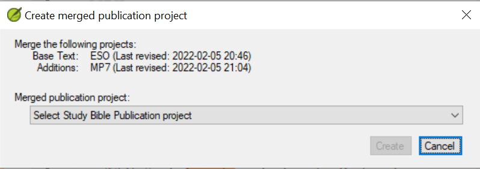

**Introduction**  
With Paratext 9.2 (and above) you can create a study Bible based on your translation by adding introductory paragraphs, sidebars and detailed footnotes and additional cross-references to help your user have a deeper understanding of the Bible text.

**Where are you in the process?**  
Before you can create a study Bible, you will want to translate and consultant check your New Testament (or portions). Then your administrator can create a new project (see below).

**Why is this important?**  
Study Bible information is created in a separate project with links to the translated text. If the translated text changes, the link can be broken. Links can be fixed, but it is less likely to be a problem if the text is stable.

**What will you do?**  
You (or your administrator) will create a **Study Bible Additions project**. As the name suggests, this is where you can add the study materials (without affecting your translation).

This separate project contains a read-only copy of your project and your additional text. When you are ready, you can merge the Study Bible Additions project with your translation project into a third project.

- Create a new project of Study Bible Additions based on your translation
- Register the new project
- Add the additional material (introductions, sidebars, footnotes and cross-references)
- Hide any non-biblical text in the base translation (e.g. headings)
- Merge the projects to create a publication project.

## Create a Study Bible Additions project

- Use the Paratext menu to create a new project
- Set the type of project to Study Bible Additions (Annexe de la Bible d’étude)
- Choose your translation project for the “based on” project.
- You will need to register the new project.  
    *A grey-out read-only copy of your project is displayed, with a toolbar at the top.*

    

## Add the additional material

### Introductory material

- Position your cursor where you would like the additional material
- Click **Add +** on the toolbar
- A blue box with an \\ip is added.
- Type the text.

### Sidebar text

- Position your cursor where you would like additional material
- click **\\esb** on the toolbar
- A sidebar panel is opened with a \\ms marker added
- Type the title after the \\ms marker
- Press Enter
- Choose a marker for the following text.
- Type the text.
- Continue as needed.

### Extended cross-reference

- Position your cursor where you would like the cross-reference caller
- click **\\ex** on the toolbar
- A footnote panel is opened with a \\ex markers added
- Type in the cross-reference.

### Extended footnote

- Position your cursor where you would like the additional footnote
- click **\\ef** on the toolbar
- A footnote panel is opened with the appropriate \\ef markers
- Add footnotes as needed.

## Hide non-scriptural material

You can hide non-scriptural material such as headings from the translation

- Position your cursor where you would like the additional footnote
- Click **Hide** on the toolbar
- The text is displayed in a greyed-out box.

## Merge the projects to create a publication project.

To publish the study Bible, you need to create a publication project.

- Click the Project menu
- Choose “Create merged publication project”

    

- Click the drop-down list “Merged publication project”.
- Create a new project or choose a previous project
- Click **Create**  
    *Paratext merges the translation project and the Bible Study Additions project and displayed the Merged publication project.*

- If necessary change the view to Preview.

### Making changes

You now have three projects.

- Your original translation project,
- The Bible Study Additions project and
- The Merged publication project.

The merged publication project is read-only and cannot be changed.

*Any corrections to the translation* should be made to the original translation project. These corrections will be updated in the Bible Study Additions project when you next recreate the merge publication project.

*Any corrections to the Bible study material* should be made in the Bible Study Additions project.

To update the changes, create the merged publication project again.

### Printing the Study Bible with PTXPrint

Version 2.1.x (and above) of PTXPrint can print the merged publication project.

For detailed instructions see <https://software.sil.org/ptxprint/how-to-study-bible-layout/>
