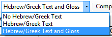

**Introduction**  
There are thousands of passages in the NT where either the same event is being described or where another verse is being quoted from the Old or New Testament. These verses need to be compared to make sure they are consistent.

**Where we are**  
Normally you will have translated and checked the text of both books with a consultant first before comparing the texts. Though there are times that you will want to compare the other verses before you translate the second passage.

**Why this is important**  
The parallel passages need to be consistent but they do not always need to be exactly the same. The Parallel Passages tool displays the various passages and highlights the text which is the same. But it is the meaning (not necessarily the form) that is important.

Normally you would make the comparisons after you have translated the passage because you don’t want to be influenced by what could be a bad earlier translation. But there are times when you will want to be able to see a second passage while you are translating.

**What you are going to do**  
-   use the Parallel Passages tool to compare the verses.
-   use the check boxes to tell Paratext that you have checked the passages
-   filter for any changed verses
-   open a quick reference window in Paratext to see another passage while you are translating.
-   open a third passage in a window.

### 24.1 Open the Parallel passages window

-   Navigate to the desired chapter and verse.
-   **≡ Tab**, under **Tools** \> **Parallel passages**  
    *A window is displayed showing a list and parallel passages.*

### 24.2 Display source texts

-   Click the dropdown arrow beside the source text options

    

-   Choose as appropriate  
    *The display changes.*

### 24.3 Select comparative texts

-   Click the **Comparative texts** button
-   Click a resource (on the left)
-   Click the right arrow
-   Repeat as necessary
-   Click **OK**

### 24.4 Filters

-   Choose the filters as desired: [e.g. All references, Current book, Synoptic gospels]

### 24.5 Compare the passages

-   Click on a line of references in the top pane.  
    *The texts are displayed in the bottom pane.*

:::tip
Text is shown in green when the text is exactly the same as in the other passage.  
Text is shown in yellow when it has the same meaning (thought) even though it is not exactly the same as in the other passage.
:::

:::tip
If the text is green in Greek, then your text should also be the same.  
Normally, if the text is different in the Greek than it should be different in your text, but not always.
:::

### 24.6 To correct the text

-   Click the blue link « Edit »
-   Make the corrections.
-   Click **OK**.

### 24.7 Copying a text

:::tip
If two passage need to be the same, you should choose one (normally your later translation) and copy it over the other.
:::

-   Click the blue link « Edit »
-   Select the text
-   Copy (Ctrl+C)
-   Click **OK**.
-   Click blue link for the other text
-   Select the text
-   Paste (Ctrl+V)
-   Click **OK**.

:::caution
Be careful when there is more than one verse. You don’t want to paste the \\v.
:::

### 24.8 Mark the passage as checked

-   Click the check box beside the reference.

:::tip
In Paratext 9 the check box marks the passages together. If you want to approve the passages individually (as in Paratext 8), you can use the **≡ Tab**, under **View** menu \> **Approve passages individually**.
:::

### 24.9 Passages which have changed

Identify the passages which have been changed since they were marked as finished

-   In the Parallel passage tool
-   Change the passage filter to « Changed Text »
-   Click **ab** icon under the passage reference.

      
    *A comparison window is displayed in Paratext.*

-   Change the text as necessary.
-   Return to the Parallel passages tool (using the task bar icons)
-   Click the check box to mark it as finished.

### 24.10 Compare the text as you translate

-   Click in your project.
-   **≡ Tab**, under **Tools** \> **Quick reference** (Ctrl+q)  
    *A window opens with the scroll group set to none.*  
-   Change the reference to the other passage.

### 24.11 To see a third passage

-   Open you project a second time [**≡ Paratext** \> **Paratext** \> **Open** et double-click your project]
-   Change the scroll group from **[A]** to **None**.

    

-   Change the reference to the other passage.
