**1.1 Goal**

The participants will process their translation with the help of Paratext 9, a program created for entering, storing, and checking the translated texts. They will also print drafts for revision.

The course follows the six stages of translation as given in the SIL Compact base plan. [The four stages of the UBS plan are 1, 2, 5, and 6]

**1.2 Course Objectives**

At the end of the course, the participant will be able to:

**Start Paratext 9**

-   Start the Paratext 9 program using a desktop icon (or Start Menu).

*Stage 1: Drafting*

**Open projects and resources to understand the text before translating**

-   Open projects and additional resources, for example an English Bible, a source text, a source text dictionary, etc.
-   Organise these windows on the screen and save as a text combination.

**Enter the translation**

-   Effectively use the navigation toolbar to move to the desired book, chapter, and verse.
-   Type the text in an open project with the help of USFM markers such as \\c, \\v, etc. in a suitable view.
-   Use a keyboarding system (MS-keyboards or Keyman) to type special characters.
-   Add additional markers for section headings, introductions, etc.
-   Add footnotes.
-   Draft glossary entries and add using the Biblical terms tool.
-   Use the Send/Receive feature to share and backup their project to the Internet or a USB key.

**Basic checks**

-   Run the chapter/verses check to make sure that all the chapters/verses are present.
-   Run the markers check to make sure all the text has the correct markers.

**Project progress**

-   Update the project plan with any completed tasks.

**Stage 2: Team checking**

**Proper names**

-   Transliterate proper names.
-   Check that proper names are consistent.

**Biblical terms consistent**

-   Use the Biblical terms rendering window and tool to ensure you are consistent in the use of terms.

**Glossary**

-   Draft glossary entries and add using the Biblical terms tool.

**Checks**

-   Use Checklists to correct any formatting problems in section breaks and headings, paragraph breaks, layout and indents.
-   Run various checks to make sure all the characters, punctuation, capitalisation and repeated words are valid.

    (Administrators need to setup the inventories/settings as required).

-   Correct any spelling mistakes using the spell checking function and/or checks from the Wordlist.

**Using notes**

-   Add project notes as needed to communicate with other team members and/or consultants.
-   Add project, Spelling and Biblical term notes to discuss various issues and record the decisions made.

**Print draft**

-   Produce and print PDF file for reviewers.

**Stage 3: Prepare for a consultant check**

-   Prepare a back translation
-   Back translation 1 (free)
-   Back translation 2 (word by word)
-   Complete other checks
-   check references, quoted texts, numbering, unmatched pairs of punctuation, quotations
-   spell checking

**Stage 4: Consultant Check**

-   Use appropriate collaboration tools so the team can interact with the consultant.

**Stage 5: Community testing**

-   Prepare a progress report.
-   Prepare a Biblical terms report.

**Stage 6: Finalising for publication**

-   Add illustrations et captions
-   Identify the names for any maps to be included.
-   Add an introduction to the NT / Bible
-   Compare the parallel passages
-   Confirm that all the other checks have been completed.
-   Finalise check of proper names.
-   Check numbers, money, weights and measures
-   Final format checks.

**1.3 Course Plan**

*Introductions, setup*

**Introduce yourself**

The participant and facilitators should introduce themselves giving:

-   their name
-   their language
-   their town
-   what was the first and last (most recent) version of Paratext that you have used.

While the facilitators install Paratext 9 on the computers, the participant should read the introductory material and tick (check) the objectives that they feel confident doing in the most recent version of Paratext they have used.

**For each module**

-   Do a revision activity of the previous module.
-   Present the introduction (read, sketch, PowerPoint, etc.)
-   If a skill is quite simple, ask a participant to come and demonstrate the skill.
-   Follow the summary for the other skills:
-   Demonstration
-   Do it together
-   Let the participants redo it themselves
-   Ask a participant to demonstrate the skill.
-   Ask questions.
-   Do a revision activity.
-   Give the participant time to reflect, fill in the recall exercise, add to Anki.

**Part II**

**Stage 1 – Drafting**

**Introduction**

There are several stages in a translation project. In this first stage you will use many of the resources to ensure that you understand the source text, then you will draft and keyboard the text of the translation along with other materials and also begin the preliminary checks.

The following modules will help you in this stage:

-   [**OD – Organising your desktop**](#sOD)
-   [**PP1 – Project plan and progress** ](#sPP1)
-   [**KD – Keyboarding your draft**](#KD)
-   [**BC1 – Basic checks**](#BC1)
-   [**PP2 – Project progress**](#sPp2ProjectProgress)

**2**

**OD – Organising your desktop**

**Introduction**

As you work with your text in Paratext 9 you will want to see a variety of resources. In this module, you will learn how to open resources and organise your desktop.

**Where we are**

We are getting ready to type text into an existing project. Before you can do this, someone must have already installed the program, created a project for your data and installed resources for you.

**Why this is important**

The translator who organises his/her desktop well has all the resources necessary for his/her work.

**What are you going to do?**

You will start the Paratext 9 program and open a previously saved layout (text combination). If needed you will open other resources, change the arrangement of the windows and resave the text combination.

There are a number of videos available to help you with the different types of resources and arranging the windows. E.g. 0.2.1b-0.2.1d, 0.2.2a

**Changes in Paratext 9**

The menus have changed in Paratext 9. To see the menu, you now need to click on the menu icon ≡. There are now two types of menus. The main Paratext menu is on the title bar () and each window (or tab) has its own menu (). When you click on one of these menu icons all the menus are displayed and you just need to click on the command.

In the manual, when it says **≡ Paratext**, under **Menu** \> **Command**. It means click on the Paratext menu icon ≡, then under the menu (e.g. File) choose the command (e.g. Open). And when it says **≡ Tab**, under **Menu** \> **Command** it means click on the tab menu icon, then under the menu (e.g. Tools) click on the command (e.g. Wordlist)

**2.1 Load the program**

-   Double-click on Paratext 9 icon on the **desktop**

    

    OR

-   (From the **Start** menu, choose Paratext 9)

**2.2 Open a saved layout**

-   Click the **≡ Paratext** menu, then under the **Window** menu
-   Choose a saved layout (text combination).

    *Your screen should look like the picture below (if not, see below).*

    

**2.3 Create a new text layout**

If you haven’t already saved a layout, then we recommend you do the following:

**Open and arrange the windows**

-   Open 5 windows as follows:
-   5 =your project
-   **≡ Paratext** menu, under (**Paratext** \> **Open**, Projects)
-   1 = Renderings
-   **≡ Tab** menu, under (Tools \> **Biblical Terms renderings**)
-   2 = Source text
-   **≡ Paratext** menu, under (**Paratext** \> **Open \> Source language text**)
-   3 = Dictionary
-   **≡ Paratext** menu, under (**Paratext** \> **Open \> source language dictionary**)
-   4= Text collection
-   **≡ Paratext** menu, under (**Paratext** \> **Open**, select several resources, choose to open as Text collection. See 2.5)
-   Arrange the windows as desired. See Paratext video 0.2.1b, c, and d.

**Save the layout**

Once the windows are arranged as desired:

-   **≡ Paratext**, under **Layout** \> **Saved current layout**
-   Type a name

    [or to replace an existing combination, choose the existing name]

-   Click **OK**

**2.4 Delete a text combination**

If you want to delete a saved combination,

-   **≡ Paratext** menu, under **Layout** \> **Delete layout**
-   Choose the name of the saved combination.
-   Click **Delete**

**2.5 Open resources in a Text collection**

With Paratext, it is possible to have several project/resources open at the same time. However, rather than having too many windows, it is better to have several texts in one window.

-   **≡ Paratext** menu, under **Paratext** \> **Open**

    

-   Click on the resource button (at the top).
-   Select several resources using the Ctrl key when you click on the resource.
-   Repeat as necessary.
-   Click on the **Open as** dropdown list.
-   Choose **Text collection**
-   Click **OK**

N.B. It is suggested that resources be presented in the order of more literal to less literal (to focus on the texts that are most faithful to the source texts). For French resources, the following order is suggested: TOB, NVSR78Col, NBS, BDS, FC97, PDV11. For English resources: ESV, RSV, NIV, NLT.

-   To change the order of texts in the collection
-   **≡ Tab**, **Modify text collection**

    

-   Use the arrow buttons to change the order as necessary

    

-   Make any other changes
-   Click **OK**

    You can change the text in the second pane by clicking on the blue link of the abbreviation for the text. You can also change the view (preview, unformatted or standard.

**2.6 Open an Enhanced Resource**

-   **≡ Paratext** menu, under **Paratext** \> **Open**

    

-   Click on **Enhanced Resources**

    Enhanced resources also contain a dictionary, images, maps etc. When you open an Enhanced Resource, a guide opens as well.

**2.7 Open a dictionary**

If you do not use an enhanced resource, you can open a source language dictionary with glosses in other languages.

-   **≡ Paratext** menu, under **Paratext** \> **Open**

    

-   Click **Dictionaries**
-   Choose « A Concise Greek-English Dictionary of the New Testament » OR "Trilingual Hebrew-English Lexicon of the Old Testament"
-   Click **OK**
-   **View** \> choose a language (e.g. **French**)

    Hint: It is useful to add dictionary windows to the autohide, (right-click on the tab name).

Other dictionaries (in English but with photos)

-   "Plants and Trees in the Bible"
-   "Animals in the Bible"

**2.8 Working with the Source language text**

You can open the source language text with glosses in an alternative language than English, e.g. French.

-   **≡ Paratext**, under **Paratext** \> **Open**

    

-   Click **Source Language Texts**
-   Choose HEB/GRK
-   Click **OK**
-   **≡ Tab** under **View** \> **Additional glosses**
-   Choose the project which has the glosses
-   Click **OK**

**3**

**PP1 – Project plan and progress **

**Introduction**

You use the Project Plan to help organise your work and to see which tasks to do next. Once you have finished the task, you should mark it as completed so that you can report on what has been achieved. [If you have used an earlier version, you will see that it has dramatically improved in Paratext 9.]

**Where are we?**

Before you can use the plan, it must have been configured. [This is usually done by your project administrator who will add the appropriate organisational plan and configure it for your team.]

**Why is this important?**

There are so many tasks to be done in a translation project. It is important to have a system to make sure these are all done. Now that your plan has been configured, you can use the plan to see what tasks have been assigned to you to be done next. Then when you finish the task, you can mark the task as completed and see the next task to do. You can use this information to generate reports for supervisors and donors (see PP2: Project plan reporting).

**What are we going to do?**

You will mark a variety of tasks as complete. The exact steps will vary slightly depending on whether the task is set to once per project, once per book, or by chapter. The place to mark progress for all types of tasks is the Status column.

**3.1 View tasks that need to be done**

-   In your project, click "**Assignments and Progress**" button 

    OR

    [**≡ Tab** under **Project** menu, select **Assignments and progress**]

-   From the first dropdown menu, choose either **My tasks** or **All tasks**

    

-   *A list of the various tasks and checks are displayed.*

    You can see more details on any task by clicking on the name of the task.

**3.2 Identify the next task**

The list of tasks shows the uncompleted tasks, each with a colored bar beside it.

-   Identify the next task for you need to do. It will have either a green or slashed green bar.
-   Check that it is not waiting for another task. In this case it will have a red slash bar.
-   Do the task (see other modules if necessary).

    When the task is finished, see the instructions below to mark it as completed. (A check is completed when there are 0 issues.)

**3.3 Mark a task as complete**

**Mark a book task as completed**

-   Click on the checkmark to the left of the status.

    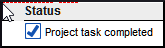

    *It should turn solid to show it is completed.*

**Mark a chapter task as completed**

-   Click **+** to mark the next chapter as complete

    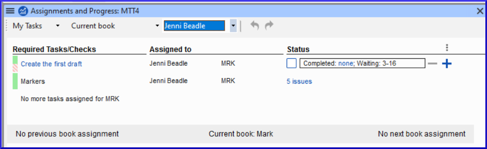

-   To mark other chapters as complete you can click on the word **Completed**
-   

    *A dialog box is displayed with a list of the chapters*.

    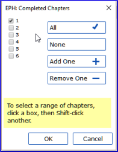

-   Check the chapters that have been completed.

**3.4 Checks**

-   If the task is a check, the status of the check will either say **Setup required** or it will show number of remaining **issues**.
-   A check is complete when there are **No issues**.

**Checks – setup required (Administrator)**

-   Click the blue link "Setup required"

    *Paratext 9 will run the appropriate inventory or open the settings for that check.*

-   Complete the setup as appropriate.
-   Close the window when finished.

    If there is more than one inventory required for a check (e.g. capitalization) you will need to set them up manually from the Checking menu.

**Checks – issues**

-   Click on the blue link “ …. issues”

    *A list of errors is displayed.*

-   Make the necessary corrections.
-   Close the list result.
-   **≡ Paratext** under **Paratext** \> **Save all** (or **Ctrl**+**s**).
-   Return to the Project plan.

    The check is considered complete with there are 0 issues. If you are unable to complete a check, it is possible to postpone the check to the next stage.

**Postpone check**

-   **≡ Tab**, under **Project** menu, select **Assignments and Progress**
-   Change to **All tasks** view
-   Hover over a check that has issues
-   Click **Postpone** (which appears to the right of the Status column),
-   Choose which stage you want to postpone the check
-   Type the reason for postponing the check.

    *the check will move to that stage.*

**4**

**KD – Keyboarding your draft**

**Introduction**

This module explains how to keyboard your draft translations into a project in Paratext 9.

**Where we are**

We are about to keyboard text into an existing project. Before you can do that, someone must have already installed the program and created a project for your data.

**Why this is important**

This is the first stage of entering your translation into the computer. Once the text has been typed, you can run various checks on the content and format of the text.

**4.1 Go to a Biblical verse**

Before you can start typing your text, you need to move your cursor to the right book, chapter and verse. You use the toolbar to do this.

-   Using the icons on the toolbar, change the project, book, chapter and verse as needed.

    

    If you don't know the verse reference, you could use the **Find** feature to look for a word. Ctrl+F.

**4.2 Check that the project is editable**

-   Look at the titlebar of your project.

    

    The titlebar should have the word (Editable).

-   If the book is not editable, and you need to edit it, you should talk with your project administrator.
-   If it is not editable, try changing the view (see below).

**4.3 Changing the view**

Paratext 9 has five views. All but the Preview view are editable.

-   **Ctrl** + **E** -or-
-   **≡ Tab** under **View** menu, choose the view (usually Standard).

**4.4 Typing special characters**

Some orthographic characters are not found on the keyboard. To type these characters, you need to press more than one key.

-   Change your keyboard system as needed on your computer.
-   If you are using Keyman then choose your keyboard (e.g. Tchad Unicode

    (or for MS-Keyboards choose AF or TR/SQ/TZ/AF…)

-   Type the keys as in the table in Appendix <#sChadSpecChar>.

    Note: You can use **≡ Tab** under **View** \> **Highlight Invalid Characters** to quickly see if you have typed any invalid characters.

**4.5 Adding text in another marker – title or introduction**

Each piece of text needs to have a marker. The markers for the chapters and verses are already in your project. When you want to add text such as headings, or introductions etc you need to also add the appropriate marker as follows:

-   Move your cursor to the end of the previous paragraph:
-   Type **Enter** or type « \\ »
-   Type the marker (e.g. s1 or ip) « **Enter** » (or select it from the list).
-   Type the text
-   Add a paragraph marker after the text

    (for example: \\p)

    You must always have a USFM marker after a title and before the verse. This is usually \\p (paragraph), but it can be different (for example \\q1).

**4.6 Add paragraph breaks**

Dividing the text into paragraphs:

-   Move the cursor to where you want to break the paragraph.
-   Press **Enter**
-   Type p, then **Enter**.

**4.7 Saving your work**

It is important to save your work regularly.

-   **≡ Paratext** under **Paratext** \> **Save All**
-   –or- **Ctrl** + **S**

**4.8 Insert Footnotes**

You can add footnotes in the text at the place where you want the reference to appear.

-   Move the cursor to where you want to insert the footnote.
-   **≡ Tab**, under **Insert** \> **Footnote**
-   *A set of footnote markers is added in the box below the text*

    

-   Type the text after the \\ft

    If you hover your mouse over the superscript letter the text of the footnote will be displayed in a tip box.

    To change the footnote, click the superscript letter in the text.

    To delete the footnote, you can delete the superscript letter.

**4.9 Send/receive**

It is essential to have a second copy of your translation and to share your work with others in your team. This is done by doing a send/receive as follows:

**Send/receive this project to the Internet**

-   Make sure your computer is connected to the Internet.
-   **≡ Tab** under **Project**,\> **Send/Receive this project**
-   *Paratext will im../mediately send/Receive i.e. without offering the different options.*

**Send/receive to the Internet**

-   Make sure your computer is connected to the Internet.
-   If you want to send/receive other projects, or change the way to send/receive
-   **≡ Paratext** under **Paratext**,\> **Send/Receive projects**
-   Choose **Internet Server**
-   Check the box next to the projects to Send/Receive.
-   Click **Send/Receive**.

    *The computer will make a copy of your files. A progress meter will be displayed. A message box will only appear if there are any problems.*

**Send/receive to a USB stick to backup your data**

It is essential to have a second copy of your translation. If you don't have access to the Internet, then you can use a USB stick. To backup your data to a USB stick you do a send/receive as follows:

-   Insert your USB key into your computer.
-   **≡ Paratext**, under **Paratext** \> **Send/Receive project(s**)

    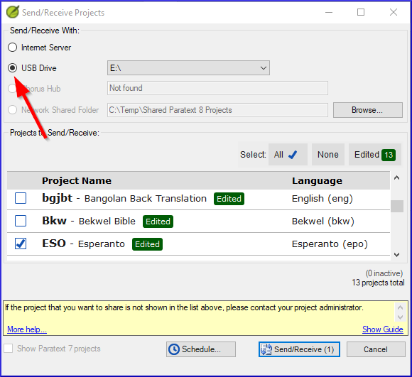

-   Choose **USB drive**.
-   Check the box next to the projects to Send/Receive.
-   Click **Send/Receive**.

    *The computer will make a copy of your files. A progress meter will be displayed. A message box will only appear if there are any problems.*

**Send/Receive Again**

The next time you want to send/receive you can use the toolbar to send/receive using the same settings as the previous time. This option does not allow you to choose a different method or different projects.

-   Insert your USB stick into your computer or connect to the Internet.
-   Click the Send/Receive icon 

    *Paratext will im../mediately send/Receive.*

**4.10 Moving your cursor efficiently**

A lot of time is spent moving your cursor to the place where you need to add text or make corrections. Here are some useful keystrokes to move your cursor quickly.

-   The arrow keys, **←** **↑** **→** **↓**

    **Home**, **End**, **PgUp**, et **PgDn**,

    **F8** (chapter), **F9** (book)

-   or **Ctrl** + any of those keys

**4.11 Recall:**

If the titlebar doesn’t say Editable (or your name), you should try changing the \__________.

To add a different marker (such as section heading) you press \_______.

To add paragraph marker you type \________.

To insert a footnote, you use the \______\_ menu and choose \______________.

To send/receive, you use the \_______\_ menu then \________________.

[Answers: view, enter or \\, enter, Insert, Footnote, File, Send/receive]

**5**

**BC1 – Basic checks**

**Introduction**

In this module, you will check the chapters/verses and the markers using two methods: The Project plan and the project menus (Checking).

**Where we are**

You have typed your text in Paratext 9. Now you want to start checking. In this module we start with the first two basic checks. The remaining checks are covered in [BC2 – Basic Checks](#sBC2) and <#sBC3>

**Why this is important**

These checks allow you to be sure that you have all the chapters and verses and that the other markers are correct. It is important to run the chapter/verse check first because all the other checks depend on it. Doing these checks allows you to complete the Drafting stage.

**What you are going to do**

You are going to run the first two basic checks using two different methods. The easiest way is to run the checks from the project plan. However, you can also do the checks from the project menu **(Tools)** if you need to check more than one book at a time.

**5.1 Running checks from the project plan**

It is easier to run the checks from the project plan.

-   View the project plan by clicking on the icon

    (at the top right of your project window).

-   If there are any "issues" (errors), click the blue link to the right

    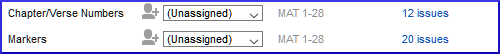

    A windows appears with a list of the errors.

-   Double-click a line in the list.
-   Correct the error in your project.
-   Double-click the next line in the list.
-   Continue for each error.
-   Click "**Rerun**" button to check that all the errors have been corrected.
-   Close the results list window.
-   Return to the project plan, and click on the link to show the issues from the markers check.

    Video: See ‘How to use Checking Tools (9.1 1.4).mp4’ for examples of how to correct some common errors.

**5.2 Running the checks from the menus**

If you want to check more than one book at a time, you can run the checks from the project menu **Tools** menu.

**« Chapter/ Verse »**

-   Click in your project window
-   **≡ Tab**, under **Tools** \> **Run Basic Checks**
-   Check only **Chapter/verse numbers**
-   Uncheck any other checks
-   If necessary, click **Choose…** and choose the book you want to check
-   Click **OK**

    *A windows appears with a list of the errors.*

    ‒

-   Double-click a line in the list.
-   Correct the error in your project.
-   Double-click the next line in the list.
-   Continue for all the errors.
-   Click "**Rerun**" button to check that all the errors have been corrected.
-   Close the results list window.

**Markers check**

-   **≡ Tab**, under **Tools** \> **Checking Inventories** then **Markers Inventory**

    *The list shows an overview of the markers in your text. You cannot change anything but you can look for markers which may be errors.*

-   Close the marker inventory.
-   **≡ Tab**, under **Tools** \> **Run Basic Checks**
-   Check the **Markers**
-   Click **OK**
-   Correct any errors.

**6**

**PP2 – Project progress**

**Introduction**

In this module, you will learn how to update your progress by marking tasks as completed. You will also create a progress report.

**Where we are**

You have been working on your translation and have finished a task. You now want to update your progress.

**Why this is important**

For the project plan to work well, you need to mark the tasks you have finished. This allows Paratext 9 to make the next task available for the other team members. It also gives Paratext accurate information on your progress for the reports. Creating a progress reports helps you prepare a report for your supervisors and funders.

**What you are going to do**

You will open the assignments and progress window and update the progress made. You will then produce a report.

**6.1 Make sure the progress of the plan is up to date**

-   Open the project plan (using the button)
-   Update the progress on all tasks (see PP1 for instructions on each type of task).

**6.2 Change an assignment**

This can only be done if you have progress permissions.

-   From the **≡ Tab**, under **Project** menu, select **Assignments and Progress....**
-   From the first drop-down list at the top left of the dialog, select **All Tasks**.
-   In the "**Assigned to**" column, use the drop-down list to choose who will have responsibility for the task or check (listed in the "**Task/Check**" column at the far left).

**6.3 Produce a progress report**

-   From the **Tools** menu, select **Project Health Report...**.
-   Choose the project(s) to report
-   Click **OK**.

    *The report will contain a column for each project you selected.*

**6.4 View team progress charts**

-   From the **≡ Tab**, under **Project** menu, select **Progress charts....**

    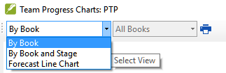

-   Use the first dropdown box to choose the type of chart
-   Choose the books as necessary.
-   Click the print icon

    *A window opens*

-   Click the **Print** icon
-   Choose your printer (or PDF printer)
-   Click **OK**.

**Part III**

**Stage 2: Team Checking**

The second stage of a translation project involves checking by the team. In this second stage you will use many tools to ensure that you have been consistent in your translation. You will read through your text, work on proper names, Biblical key terms, spell checking, and formatting checks. You will also print out a draft and use a variety of notes: project notes, spelling notes, Biblical terms discussion notes to record your questions, discussions and decisions.

The following modules will help you in this stage:

-   [**PN – Proper Names**](#sPN)
-   [**SP – Spell Checking**](#sSP)
-   [**BT – A 4-Step process for consistent Biblical Terms**](#BTTerms)
-   [**FC – Formatting checks**](#sFcFormattingChecks)
-   [**BC2 – Basic Checks**](#sBC2)
-   [**PD – Printing Drafts**](#sPD)
-   [**UN – Using Notes**](#sUNUsingNotes)

**7**

**PN – Proper Names**

**Introduction**

In this module, you will check that the proper names have been transliterated consistently. There are two ways to do this. One way is to have Paratext guess the proper names based on statistical analysis of a model text. The other way is to tell Paratext the changes for specific characters.

**Where we are**

You have (or are working on) the rules for transliterating the names.

**Why this is important**

You want to be consistent so that is clear who is being referred to in the text.

**What you are going to do**

You will:

-   filter the Major Biblical terms list on Names.
-   EITHER use the **Guess renderings** tool to guess the appropriate rendering of the names.
-   OR use the **Adapt Names** tool to enter your transliteration rules for each letter.
-   edit and approve the individual names.
-   add the approved names as proposed names in the Biblical terms list.
-   work through the Biblical Terms list to ensure that all the verses are consistent.

**7.1 Run the Biblical Terms tool**

-   Click in your project
-   **≡ Tab**, under **Tools** \> **Biblical Terms ...**

**Open list of terms**

-   **≡ Tab**, under **Biblical terms** \> **Select Biblical terms list**
-   Double-click the "**Major Biblical Terms**" list

**Choose your reference text as a comparative text**

-   Click the **Comparative Texts** button on the toolbar.

    

-   Choose your reference text, then click **** → (right arrow).
-   Click **OK**.

**Change various settings**

-   Click the second filter button

    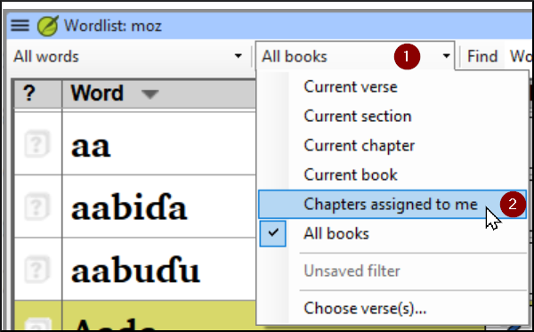

-   Choose **Chapters Assigned to Me**

    Note: The terms column is in Greek (or Hebrew) by default. You can see the terms in a roman script by using the **≡ Tab**, under **View** menu \> **Transliterate terms**.

**Filter for names**

-   Click the first filter button
-   Choose « **New Filter** »
-   In the dialog box, under **Categories…**
-   Select « **Names** »
-   Click **OK**

**7.2 Guess Renderings for proper nouns**

-   **≡ Tab**, under **Tools** \> **Guess renderings**
-   Click **OK**

    *Paratext will add renderings to any terms which do not have a rendering (with an orange background)*

    You will need to approve these renderings (see 7.4)

**7.3 Adapt names**

Adapting names should be done in the early stages of a translation project, before you have approved renderings of proper names. Otherwise you can use the guess renderings (see above).

-   **≡ Tab**, under **Tools** \> **Adapt Names**
-   Choose the language of your reference text (e.g. English or français)

    *The Name Adaptation dialogue is displayed*

    

**Enter the changes for the individual letters (or letter clusters)**

-   In the left pane, fill in the “Adapted Character” column for the individual letters or letter clusters.

**Then revise and approve the Adapted Name**

-   Work through the **Adapted name** column in the right pane.
-   For each name, if the adapted name is incorrect, click on the name in the **Adapted Name** column,
-   Edit the name and click **OK**
-   Once the name is correct, click in the "**Approved**" column.
-   Click **OK**.

    Paratext 9 will propose a name (in red) in the rendering column of the biblical terms tool.

**7.4 Ensure your text is consistent**

You need to work through the list and confirm that all the verses use the name consistently.

-   Click the name in the top pane.
-   Click on a verse in the lower pane which doesn’t have the proposed form of the name.
-   Click on the Edit link
-   Correct as necessary, then click **Close**
-   Repeat for each name.

**7.5 Add an alternative rendering**

-   Click the name in the top pane.
-   Select the word(s) in your text
-   Click on **Add rendering** button or **Ctrl**+**A**

**7.6 Dealing with verses that do not have the name translated**

There are times when a verse is correctly translated even though you have not used the name. For example, a pronoun is used instead of the name. In this case you need to tell Paratext 9 that it is correct (that is, deny that the rendering is missing).

-   Click the red cross at the left of the verse reference 

    *The cross turn into green tick (check) with a red cross* .

-   If you clicked on the red cross by mistake, click again on the icon 

    Note: Paratext 9 does not find names in the introductions, headings, footnotes, captions or glossary. (You could use the Word List to find possible mistakes.)

**7.7 Recall**

-   To transliterate proper names, you \_____\_ the \________________\_ list on names.
-   Then use the \______\_ menu and \___________\_ command.
-   After entering the \______\_ changes then \_________\_ the adapted names.
-   Paratext 9 then enters a \_________\_ rendering for all the names.
-   You then work through the list \__________\_ and/or adding renderings and making sure that all verses are \_______________.
-   You can add a rendering by selecting the text and pressing **Ctrl**+__.
-   If a pronoun is used you can \_____\_ the rending by clicking on the .

    Answers: filter, Major Biblical Terms, names, Tools, Adapt Names, character, approve, proposed, correcting, consistent, A, deny

**8**

**SP – Spell Checking**

**Introduction**

This module explains how to check for spelling mistakes in the text you have typed into your project in Paratext 9.

**Where we are**

You have typed your text in Paratext 9 and have done some checks but there may still be spelling mistakes in the text.

**Why is this important?**

It is important to correct any spelling mistakes so that your text will communicate clearly.

**What you are going to do**

-   Configure the wordlist to build up a base of correct words.
-   Work through your text with red squiggly lines showing words that Paratext does not know are correct.
-   Work through your wordlist, either correcting mistakes or telling Paratext 9 that the words are correct.
-   Use a variety of checks from the word list.
-   Add a spelling discussion note to words that require further discussion before a correct spelling is decided.

**8.1 Configure the word list**

Before you can check the spelling, it is important to have a base of words that are known to be correct. There are three things we can do:

**Approve the spelling of common words**

In Paratext

-   **≡ Tab**, under **Tools** \> **Wordlist**

In the Wordlist

-   **≡ Tab**, under **Tools** \> **Approve spelling of common words**
-   Enter a number

    The number is the number of times the words must appear to automatically mark it as being spelled correctly. The default is 100 but you can choose more (if you have doubts about the text) or less (if you are confident about the accuracy of the typist).

-   Click **OK**
-   Click **Yes** (to confirm that you cannot undo)

**Check the words that Paratext thinks are incorrect**

In the Wordlist (**≡ Tab** under **Tools** \> **Word List**)

-   **≡ Tab**, under **Tools** \> **Spell Check \> All checks**

    *A list of word s is displayed.*

-   Click on a word in the top pane.
-   If the word is correct – click the green checkbox  at the top of the column
-   If the word is incorrect, but Paratext 9 has suggested the correct word, then click the blue link for the correct word.
-   If the word is incorrect, and Paratext 9 hasn’t suggested the correct word, click on the red checkbox  and correct the word. (See 9.3)

**Check similarly spelled words**

In the Wordlist

-   **≡ Tab**, under **Tools** \> **Find Similar Words**
-   Enter letters which sound alike separated by / (e.g. s/sh/z)

    Depending on your language, tick or untick “Ignore all diacritics when comparing words”.

-   Click **OK**

    *A list of words is displayed.*

-   Correct the words (as described above).

**8.2 Spell checking – from the text**

In Paratext

-   **≡ Tab**, under **View** \> **Display spelling**

    A progress meter is displayed initially, then all the words that are either unknown or incorrect have red squiggly lines underneath.

**Making corrections**

Paratext 9 will underline in red the words that have not been approved in the word list. This either means that the word is misspelled or unknown.

-   Right-click a word which is underlined in either red or grey

    *A dialogue is displayed*

    

-   Either type the correction in the box or select the correct word from the list
-   Click **OK**

    When possible, it is better to use the spelling check even when making minor corrections as Paratext 9 will remember the correction and you can apply the correction if it happens again.

    When there is more than one correction, a dialog box is displayed. Choose as appropriate:

    **Yes** = changes this verse and looks for the next

    **No** = skips this verse and looks for the next

    **Yes to all** – is too dangerous, DON’T use it

    **Cancel** = stops further changes

**8.3 Spell checking – current book**

-   **≡ Tab**, under **Tools** \> **Spell Check Current Book**

    *A window appears with a list of some words in the current book.*

    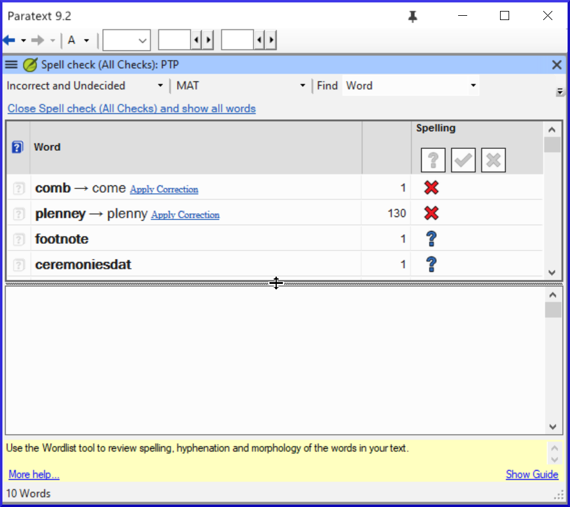

-   Make corrections as explained above (9.3)
-   Click « More items available » to see additional words.
-   Continue as needed.

**8.4 Spell checking – from the wordlist**

**Using the checks**

In the Wordlist

-   **≡ Tab**, under **Tools**\> **Spell check \>**
-   Choose the desired check (see descriptions below)

    

A list of words is displayed.

-   Make the corrections as needed.
-   Click "**More items available**" to see more words.
-   Continue as needed.
-   When the list is finished, a message is displayed

    

-   Click **Yes**.

**All checks**

This runs all of the checks. This is very useful as it will find all types of errors especially words with multiple types of errors.

**Missing Capitals**

-   A list of words is displayed which have capitalised forms but are not always capitalised (that is both forms are used). The list shows the word with a lower case, then the capitalised form below it, which has a blue link to the word

    

-   Click the blue link to the capitalised form

    

-   Click the appropriate blue link.
-   *Show incorrect* (to see the verses)
-   *The two forms are acceptable* (to accept both forms)
-   *Capitalise All* (to correct all the words)

**Single Character Typos**

A list of words is displayed with links to other words which are similar but only have one letter different.

**Unusual Letter Combinations**

A list of words is displayed which have unusual combination of letters (such as consonant or vowel clusters …).

**Diacritic Errors**

A list of words is displayed with links to other words which are the same except for the diacritics.

**Common Typos**

A list of words is displayed which have the same type of problem which have already been corrected in other words. E.g. if you have already corrected "teh" as "the", and it finds "tehm" it will suggest "them".

**Unknown Morphology**

A list of words is displayed which the computer has not been able to guess the morphology based on other words.

**Find incorrectly joined or split words**

In the Wordlist (**≡ Tab**, under **Tools** – Wordlist)

-   **≡ Tab**, under **Tools**\> **Find Incorrectly Joined or Split Words**

    

-   Type in any punctuation which can be in the middle of a word e.g. - '
-   Click **OK**

    *A list of words is displayed with similar words grouped together.*

    

**Correct a word which was incorrectly marked**

-   Find the word in the list (using the filter if necessary)
-   Click on the line to see the word in context
-   Click the correct spelling status.

**8.5 Spelling discussion note**

-   Double-click on the note icon (in the first column)

    

-   Type in the note
-   Assign the note as necessary.
-   Click **OK**.

**9**

**GL – Glossary**

**Introduction**

This module explains how to add entries to the glossary using the **Biblical terms** tool.

**Where we are**

You have drafted and entered your text in Paratext 9. Now you will add some glossary entries to explain some of the terms.

**Why this is important**

It is good to have a list of important words and their explanations so that the readers can understand the text well. Rather than typing directly into the glossary, it is better to use the **Biblical terms** tool as it keeps the Glossary in alphabetical order. The tool also keeps track of the changes to the glossary.

**What you are going to do**

You will use the Biblical terms tool to add a rendering for the term and then use the glossary tab to enter the citation form and the definition.

There are four training videos available on adding, linking and editing glossaries. P9 1A.4a-d.

**9.1 Open the Biblical Terms tool**

-   Move to a verse which contains the term you want to add to the glossary.
-   Right-click and choose "**View Biblical Terms**", then "**Current Verset(s)**"
-   Check that you have the correct list open (e.g. your project list or the NT Key Biblical Terms [SIL])
-   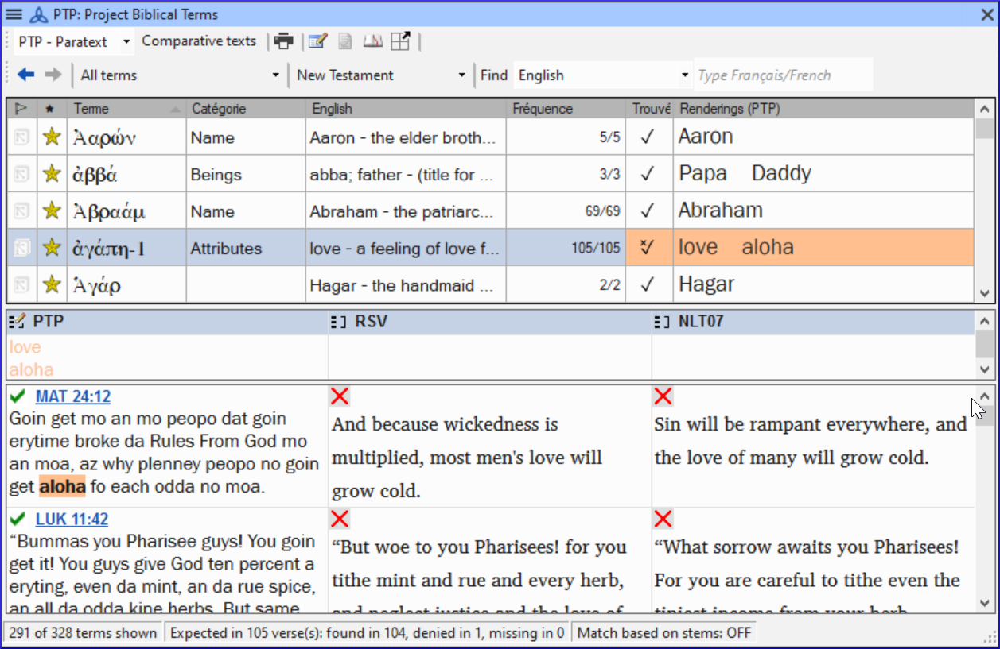
-   To change the list, from the **≡ Tab**, under **Biblical terms** menu choose **Select biblical terms list**

**9.2 Add an entry**

-   Double-click on the term in the list in the top pane
-   Click the "**Glossary**" tab

    

-   Type the citation form of the term (i.e. the way you want it in the glossary) [1]
-   Type the Definition [2]
-   Click **OK**

    *The word(s) and the definition will be added to the glossary in alphabetical order.*

**9.3 Link an existing entry**

If the word is already in the glossary, you can link a biblical term to the existing entry in the glossary. Later in stage 6 you will link the biblical term to the text to add the \* in the printed text or the link in the electronic app.

-   From the **Biblical Terms** tool
-   Check that you have the correct list open (e.g. your project list or the NT Key Biblical Terms [SIL])
-   Double-click on the word in the list in the top pane
-   Click the "**Glossary**" tab
-   Click the down arrow near the citation form [1]
-   Choose the entry from the glossary
-   Click **OK**

**9.4 View the glossary**

In Paratext

-   Use the navigation bar to change the book

    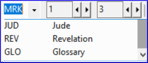

-   Choose the **GLO** book

**9.5 Edit an entry – in the GLO book**

In Paratext

-   Open the **GLO** book
-   Edit the text as normal.

**9.6 Edit an entry – in the Biblical Terms**

-   **≡ Tab**, under **Tools** \> **Biblical terms...**
-   Double-click on the word in the list in the top pane.
-   Click the "**Glossary**" tab
-   Edit the definition
-   Click **OK**.

**9.7 Add a Biblical Term**

-   see the section [10.7](#sAddATerm) [Add a term – from reference text search](#sAddATerm)

**9.8 Recall**

-   You open the Biblical Terms tool from the \_______\_ menu.
-   The « glossary » tab is on the \_______\_ dialogue. To open this dialogue you \________-click on the term in the \____\_ pane.
-   To view the glossary, you change to the \____\_ book (after Revelation).

    Answers: right click, Edit Rendering, double, top, GLO

**10**

**BT – A 4-Step process for consistent Biblical Terms**

**Introduction**

The **Biblical terms rendering** window and the separate **Biblical terms** tool are very useful to make sure you are consistent in the use of terms, especially key terms. With many terms over many books this can become quite a task. This module explains a simple 4-step process to make your Biblical Terms consistent. This is a process should be considered part of the translation process and not a check.

**Where we are**

You are translating a verse in Paratext 9 and you want to see what renderings have already been chosen for the terms in the current verse and then make sure they are consistent with other verses.

**Why this is important**

For your readers to understand your text, you need to be consistent in your use of terms. It is a big task to make them completely consistent. If you start from the verse you are translating and work from there the task is more manageable. The goal is to have consistently rendered Biblical Terms and well documented decisions on why changes were made.

**What you are going to do**

This method boils down to a short list of steps:

1.  **[A]** Find all the ways you have rendered this term, and enter them in the renderings dialog.
2.  **[B]** Choose which rendering is/are best, and record why it is best.
3.  **[C]** Document why you rejected the other renderings.
4.  **[D]** Clean up your translation by making this rendering consistent throughout your translation. (Make Consistent, Standardise, Normalise, Harmonise).
-   Repeat with next Biblical Term you find in the Biblical Terms Renderings window.

**10.1 Open the Biblical terms rending window**

-   Click in your project
-   **≡ Tab**, under **Tools** \> **Biblical terms rendering**
-   **≡ Tab** (of the new window), under **Biblical Terms** \> **Select Biblical terms list**
-   Choose the desired list
-   Click **OK**.

**10.2 A: Find all the ways you have rendered this term**

**Find the terms for the current verse**

-   Is there a tick in the found column?
-   If there is a tick, your verse uses the term and you can continue with the next term.
-   If not, you need to either correct your text or add the new term you have used (see below).

**Add another rendering**

If the term you have used needs to be added to the list:

-   Select the rendering of the term in your text.
-   Copy it (**Ctrl**+**C**)
-   Double-click in the renderings cell.

    

    *The edit renderings dialog is displayed.*

    

-   Paste (**Ctrl**+**V**) the rendering in the dialog box.
-   Click **OK**.

**Find other verses in the current book with the same Biblical term**

-   Double-click on a word in the **Term** column

    *The Biblical Terms Tool opens*

-   From the second filter button choose **current book**

    

-   Add renderings for the term from the verses until the terms in all verses are been identified (see below).

**Add renderings from the other verses**

-   Select the rendering in the verse
-   Add the rendering using **Ctrl**+**A**
-   Continue until all terms for those verses have been identified.

**Dealing with verses that do not use the term**

There are times when a verse is translated without using the actual term. For example, when a pronoun is used. In this case you need to deny that it is an error.

-   Click the red cross  to the left of the verse reference link. The red cross turns into a green tick with a small red x 

    If you click on the cross by mistake, click  and it will return to .

**10.3 B: Identify the best term**

-   Double-click on the term in the top pane.

    *The edit rendering dialog is displayed listing all the renderings that have been added.*

-   Decide on the best rendering
-   Section, then Cut (**Ctrl**+**x**) and paste (**Ctrl**+**v**) it to the top of the dialogue box
-   Add \* as necessary to combine similar renderings

    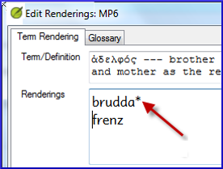

    You can use \* in a number of different ways: before the word for prefixes and after the word for suffixes. You can also put an \* in the middle of a word. See the guide for more ways of using the \*.

**10.4 C: Reject all the others**

-   Select and cut the other renderings.

**10.5 D: Document the reason for the change**

-   Click on the History button

    

-   Type in the reason why the others were rejected and why the first was the best.

    

-   Click **OK**

**If you need more than one rendering**

You can add more than one rendering if appropriate. It is good to add a back translation in brackets after the rendering. For example,

slave (slave)

guy \* work fo (guy that works for)

-   Open the Edit renderings dialog box
-   Edit the renderings as needed.

**Clean up other books (as time permits)**

-   Change the filter so that all the published books are displayed.
-   Clean up verses as necessary.

**Add the Biblical terms notes — ongoing discussion**

-   Double-click on the note icon (in the second column)

    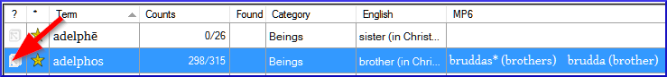

-   Type in the note
-   Assign the note as necessary.
-   Click **OK**.

**Add the decision to the renderings description**

-   Double-click on the term
-   Type the agreed-on rendering in the description field

    

-   Click **OK**

**10.6 Add a term – from the source language text**

You can create a list of verses for a specific Greek/Hebrew word and then use that list to add the word/phrase to your project Biblical terms list.

-   Click in the window with the Source text.
-   Right click on a lemma (blue word) in the source language text window

    

-   Choose **Add to project biblical terms for**
-   Choose your project
-   Edit the gloss if necessary
-   Click on the **Advanced** tab
-   Edit the terms if necessary
-   Click **OK**

    ‒

-   Change to the **Biblical Terms Tool**
-   Double-click on the term.

**10.7 Add a term – from reference text search**

There will be terms which are important for your language and culture that are not in the list. You can add these terms to your project list.

In Paratext

-   From your reference text, do a find (using **≡ Tab**, under **Edit** \> **Find**) and search for the term.

    *A list is displayed showing the verses with that term.*

From the list of results

-   **≡ Tab**, under **Edit**\> **Add to Project Biblical Terms**, then choose your project

    

-   Edit the gloss if necessary
-   Click on the **Advanced** tab
-   Type in a name for the term
-   Click **OK**

**11**

**MP – Compare a word or phrase**

**Introduction**

In this module, you will search for a word or phrase in a project and compare it with the translation of that word or phrase in another project.

**Why this is important?**

In Paratext 9 (and above), you can see where a word or phrase is found in one project and compare it with the equivalent word or phrase in one or more other projects. For example, you can see where "roi" is found in a French project and compare it with "rey" in a Spanish project.

You will

-   use the checklist “Word or Phrase” from both the text and also from the Biblical Terms Tool.
-   change the settings and comparative texts
-   type the word or phrase to compare for each project

**11.1 Compare a word of phrase – from the text**

-   Click in the project that you want to compare
-   From the **≡ Tab**, under **Tools**, point to **Checklists**, and select **Word or Phrase**.

    *The Parameters dialogue is displayed*.

    

-   Enter the word or phrase that you want to see into the textbox for each project of the dialogue
-   Click **OK**

    *A window is displayed*.

    

-   Click **Comparative Texts**...
-   Choose the texts that you want to compare and click **OK**.

    *The « Settings » dialogue is displayed.*

    

-   Type the word of phrase that you want to compare in the textbox for each of the projects, then click **OK**.

    *A window is displayed with a button "***Hide matches***" on the toolbar.*

    

-   Click on the "**Hide matches**" button to show only those references where there are differences.

    *The list shows the verses which contain matches in only one of the projects. The word or phrase is highlighted in light blue*.

**11.2 Compare using a Word of Phrase from the Biblical Terms tool**

-   In the Biblical Terms tool
-   Choose a term which has a rendering
-   Click on the tool icon

    

    *The Setting dialogue is displayed with the rending filled-in.*

-   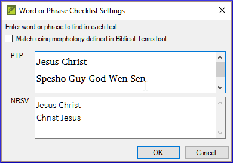
-   Type the word or expression for the other projects
-   Click **OK**

**12**

**BC2 – Basic Checks**

**Introduction**

In this module, you will learn to do several other basic checks (**Characters**, **punctuation**, **capitals**, and **repeated words**. As in the first Basic Checks module ([**BC1 – Basic checks**](#BC1)), it is easiest to run these checks from the project plan. However, if you want to check several books, you will need to use the **Verification** menu.

Where are we?

You have typed your translation in Paratext 9. Be sure that you have checked the chapter/verse numbers and markers, as described in [**BC1 – Basic checks**](#BC1), before continuing and that your administrator has either completed the setup of the checks or is with you to do the setup now.

**Why this is important?**

Paratext 9 has eleven **Basic Checks**. In [**BC1 – Basic checks**](#BC1), you have already seen the first two, chapter/verse numbers and markers. This module will help you to find errors linked to spelling, punctuation, capital letters and repeated words. Even though these errors may not influence the content of the text, correcting them makes the text easier to read.

**What we are going to do:**

Most of the checks require that an inventory has been completed by your administrator. In this module you will

-   Confirm that the setup has been done (or have the administrator do the setup)
-   do the Basic Checks
-   correct any errors.

**12.1 Confirm the setup**

Note: Before you can run these other basic checks some form of setup must be done. Some checks require an inventory others require settings. You can do most of the inventories, but only your Administrator can do the settings.

The required setup may be an inventory, some rules or settings.

**12.2 Using inventories to setup checks**

These inventories show what is currently in your text, that is, both the good and the bad. You need to work through the inventory and tell Paratext 9 which elements are correct (valid) and which are errors (invalid).

Once you have finished the inventory you will be ready to do the check.

-   From the **≡ Tab**, under **Tools** \> **Checking inventories** menu, choose the appropriate inventory (for example Character inventory).
-   Click on an item in the list in the top pane.

    *The verses are shown in the bottom pane.*

-   For each item in the top pane, choose either **Valid** or **Invalid**.
-   Repeat for each item.
-   Click **OK**.

    Note: Instead of using the mouse, you can use **Ctrl** + **y** to mark an entry as **Valid** or **Ctrl** + **n** to mark an entry as **Invalid**.

**12.3 Characters**

This check (and inventory) helps you identify all the incorrect characters, i.e. the characters which are not in your alphabet.

Setup required

-   **≡ Tab**, under **Tools** \> **Checking inventories** \> **Character inventory**
-   For each item, choose **Valid** or **Invalid**.

Check

-   **≡ Tab**, under **Tools**\> **Run Basic Checks**
-   Check "**Characters**"
-   Click **OK**.

    *A list of errors is displayed.*

-   Make any corrections as needed.

**12.4 Punctuation**

Identify all the incorrect or misplaced punctuation marks. (Use the Unicode character column to clearly identify the punctuation.)

Setup required

-   **≡ Tab**, under **Tools** \> **Checking inventories** \> **Punctuation Inventory**
-   Check each punctuation mark in its context.

    The contexts can be: **word initial**, **word ../medial**, **word final** or **isolated** (space before and after).

-   
-   Click **OK**.

Check

-   **≡ Tab**, under **Tools** \> **Run Basic Checks**
-   Check « **Punctuation** »
-   Click **OK**.

    *A list of errors is displayed.*

-   Make any corrections as needed.

**12.5 Matched Pairs**

Setup required

-   **≡ Tab**, under \> **Unmatched pairs of punctuation**:
-   If the list is empty, then there are no errors.
-   If necessary, click **Options...** to add other pairs

Check

-   **≡ Tab**, under **Tools** \> **Run Basic Checks**
-   Check « **Unmatched pairs of punctuation**»
-   Click **OK**.

    *A list of errors is displayed.*

-   Make any corrections as needed.

**12.6 Repeated words**

Setup required

-   **≡ Tab**, under **Tools** \< **Checking inventories** \> **Repeated words inventory:**
-   For each item, choose **Valid** or **Invalid**.

Check

-   **≡ Tab**, under **Tools** \> **Run Basic Checks**
-   Check « **Repeated words**
-   Click **OK**.

    *A list of errors is displayed.*

-   Make any corrections as needed.

**12.7 Capitalization**

Setup required

-   **≡ Tab**, under \> **Tools** \< **Checking inventories** \> **Markers Missing Final Sentence Punctuation**
-   For each item, choose **Valid** or **Invalid**.
-   **≡ Tab**, under \> **Tools** \< **Checking inventories** \>\> **Markers followed by a lower case letter**
-   For each item, choose **Valid** or **Invalid**.
-   **≡ Tab**, under \> **Tools** \< **Checking inventories** \>\> **Punctuation Followed by a Lower Case letter**
-   For each item, choose **Valid** or **Invalid**.
-   **≡ Tab**, under \> **Tools** \< **Checking inventories** \>\> **Mixed Capitalization**
-   If you have lowercase prefixes, click **Options** and enter the details.
-   For each item, choose **Valid** or **Invalid**.

Check

-   **≡ Tab**, under **Tools** \> **Run Basic Checks**
-   Check « **Capitalization** »
-   Click **OK**.

    *A list of errors is displayed.*

-   Make any corrections as needed.

**12.8 Making minor corrections**

It is possible to make minor corrections from within a displayed inventory. However, if there are several errors it is best to run the check to make the corrections.

-   Click on a verse in the lower pane
-   Hold the **Shift** and double-click
-   Make the correction
-   Click **OK**.

    In some cases, it is preferable to use the Wordlist or the spell checker to several errors at once.

**Review**

There are many basic checks in Paratext 9. The table below summarizes the setup needed for each of the checks.

| **Check**                      | **Setup**                                                                                                                                                         |
|--------------------------------|-------------------------------------------------------------------------------------------------------------------------------------------------------------------|
| Chapter/verse numbers          | none                                                                                                                                                              |
| Markers                        | Marker inventory                                                                                                                                                  |
| Characters (Combinations)      | Character inventory                                                                                                                                               |
| Punctuation                    | Punctuation inventory                                                                                                                                             |
| Capitalization                 | 4 inventories Markers Missing Final Sentence Punctuation Markers followed by a lower case letter Punctuation Followed by a Lower Case letter Mixed Capitalization |
| Repeated words                 | Repeated words inventory                                                                                                                                          |
| Unmatched pairs of punctuation | Unmatched pairs of punctuation inventory                                                                                                                          |
| Quotations                     | **≡ Tab**, under **Project Setting** \> **Quotation rules**                                                                                                       |
| Numbers                        | **≡ Tab**, under **Project Setting** \> **Number settings**                                                                                                       |
| References                     | **≡ Tab**, under **Project Setting** \> **Scripture reference settings**                                                                                          |
| Quoted text                    | none                                                                                                                                                              |

Table 12.1

It is possible to run all the checks at the same time, however when running the checks for the first time it is better to run them one at a time to avoid large list of errors.

**13**

**FC – Formatting checks**

**Introduction**

In this module, you will find and correct formatting and layout errors.

**Where we are**

You have typed your draft into a project in Paratext. You will use the checklists to find and correct errors related to the formatting and layout errors.

**Why this is important**

A New Testament contains more than just chapters and verses. There are also titles, section headings, and several types of paragraphs. These checks allow you to be sure that the layout of your text is correct, and your titles etc. are consistent.

**What are you going to do?**

You will use the checklists to

-   compare your titles and section headings
-   check your paragraph breaks
-   compare the paragraph markers in your text with those of your reference text
-   add markers for special text formatting.

**13.1 Using the checklists – generic**

There are a number of checklists which differ slightly but they have the following in common:

**How to display the checklist**

-   **≡ Tab**, under \> **Tools** \> **Checklists** \> choose the desired list
-   Add a comparative text (if desired) by clicking on the Texts button. **Comparative text** button
-   Select the verses/books (as necessary) using the **Select range**

**Making corrections**

-   Click the Edit link to correct any errors
-   Click on the reference link to see more context

**Close the list**

-   When you have finished with the list, close it by clicking the X at the top right corner of the window.

**13.2 Using checklist – Section headings**

-   **≡ Tab**, under \> **Tools** \> **Checklists** \> **Markers**

Check that

-   the headings are consistent with your reference text (length, grammar, style))
-   all headings start with a capital
-   there is not punctuation at the end
-   they are not too long

**13.3 Paragraph breaks**

-   **≡ Tab**, under \> **Tools** \< **Checklists** \> **Markers**
-   Choose your reference text as the **comparative text**
-   Click **Settings**

    

-   Type the paragraph makers to be displayed

    (e.g. p m)

-   Click **OK**
-   Make any corrections by clicking on the blue Edit link.

OR

-   Click on the blue verse reference link.
-   Make any corrections in Paratext.
-   Return to the checklist by clicking on the icon on the taskbar.

**13.4 Layout and indents**

-   **≡ Tab**, under **Tools** \> **Checklists** \> **Markers**
-   Choose your reference text as a comparative text.
-   Click **Settings**

    

-   Type in the markers to check.
-   Click **OK**.
-   Look for passages that have been formatted with different markers such as q1 and q2
-   Make any necessary changes (see below).

**13.5 Add USFMs to format special text**

-   See the list of passages with special formatting Appendix A.
-   Add the USFM as necessary (see module KD or help if necessary).

**14**

**PD – Printing Drafts**

**Introduction**

In this module you will learn how to print a draft of your translation for checking and revising.

**Where we are**

You have entered and checked your translation in Paratext 9 and are now ready to print out a copy. Your project must be registered before you can print.

**Why this is important**

It is much easier to revise and check your work on paper than on the computer. You can also give it to more people if it is on paper.

**What you are going to do**

You will first produce a PDF version of your translation, which you can print or share with others (including non-Paratext users). If necessary, you can copy the PDF file onto your USB stick and take it to a computer with a printer.

**14.1 Create a PDF file**

Make sure you have completed the markers check before printing a draft.

-   **≡ Tab**, under **Project** \> **Export Draft PDF**
-   Check that your project is selected.
-   Choose which book(s) and chapters or priority to print
-   Choose the page settings as follows:
-   Page size:

    210mm, 297mm (A4) or

    148mm, 210mm (A5)

-   Columns: 1
-   Margins:

    25 mm (for A4) or

    12 mm (for A5)

-   Text body font: Charis SIL (or Charis SIL Compact)
-   Size: 10 (or 11)
-   Line spacing:

    1.0 (for single spacing)

-   Click on the **Advanced** tab
-   Choose the fonts
-   Choose what you want in the **Running header** (the text at the top of the page).
-   Check **mirror layout on odd and even pages**
-   Make any other choices as needed.
-   Click **OK** and wait, the file will open in your PDF reader.

    *If there are marker errors, a message box will appear. Click* **No***, then correct the errors and try again.*

    Note: The first time you print a draft it takes a long time collecting information on the fonts. But it will be much quicker the next time.

**14.2 Print a PDF**

In Adobe Reader

-   (Make sure the PDF file is open.)
-   **File** \> **Print.**
-   For A5
-   Choose **Booklet**
-   Orientation: portrait (for newer printers or landscape for Win7)
-   To print double-sided

    If you want to follow a punctuation system (such as French) and have spaces automatically inserted before complex punctuation, then see a consultant to have changes made to your PrintDraftChanges.txt

**14.3 Copy PDF file to a USB stick**

Paratext saves the PDF file in the PrintDrafts folder of your project folder. For example, C:\\My Paratext 9 Projects\\XXX\\PrintDraft

There are many ways to copy files. One method is described below.

-   Hold the Windows Key and type **E**

    *Windows Explorer opens.*

-   Go to your **My Paratext 8 Projects** folder.
-   Double-click on your project folder
-   Double-click the **PrintDraft** folder
-   Right-click on the desired PDF file
-   Choose **Send to**
-   Choose your USB stick.

**15**

**UN – Using Notes**

**Introduction**

As you are translating and checking you may want to make comments on various errors or issues. You may also want to record your discussions on key terms and spelling issues. Paratext 9 allows you to record these comments either in the text, the Biblical terms list or the wordlist.

**Where we are**

You are typing or revising your text, wordlist or keyterms and need to make comments on an issue you have seen.

Attention: Notes and footnotes are very different. Footnotes are printed in the New Testament whereas notes are for questions and comments and are not printed in the New Testament.

**What you are going to do**

You will:

-   add more note types (administrator only)
-   create notes in the text using different icons,
-   open, edit, and resolve notes
-   open a notes list
-   filter the list
-   print a list of the notes

**15.1 Different types of project notes**

You can choose from many different icons for your project notes in Paratext 9:

Tip: Don't have too many icons!

**An icon can have four different colours or shapes**

| Icon                                             | Description                                               | Meaning                                                                                                 |
|--------------------------------------------------|-----------------------------------------------------------|---------------------------------------------------------------------------------------------------------|
|  | Icon has a border and a yellow background color.          | The note has a least one unread comment.                                                                |
|   | Icon is red, purple, or light blue.                       | A project note assigned to you, or to the whole team, or unassigned.                                    |
|   | Icon is gray.                                             | A project note assigned to someone else.                                                                |
|   | Icon is gray with a green tick.                           | A project note with resolved status.                                                                    |
|   | Icon is a white question mark on the cover of a book.     | There is a spelling discussion note for this word. (Wordlist only.)                                     |
|   | Icon is gray with a question mark on the cover of a book. | There is NOT a spelling discussion note for this word. (Wordlist only. )                                |
|   | Icon is a light blue plus.                                | A consultant note.                                                                                      |
|   | Icon is a light blue globe.                               | A global consultant note.                                                                               |
|   | Icon is a black exclamation point within a red triangle.  | There is a Send/Receive merge conflict because two users have made different changes to the same verse. |
|   | Icon is a white arrow on a blue background.               | There is a rendering discussion note for this Biblical Term. (Biblical terms window or tool only)       |
|   | Icon is gray with an arrow on the cover of a book.        | There is NOT a rendering discussion note for this Biblical Term. (Biblical terms window or tool only)   |

Table 15.1

**Setup additional note types**

(One must be an Administrator)

-   **≡ Tab**, under \> **Project** \> **Project settings** \> **Project properties**
-   Click the **Notes** tab
-   Click on the **Add** Tab button

    *A new line is added.*

-   Click the icon on the new tag line
-   Choose the desired icon
-   Type a name for the new note type
-   Continue for any other new notes.

**15.2 Using notes**

**Inserting a project note**

-   Click in the text where you want the note (and select any appropriate text).
-   **≡ Tab**, under **Insert** \> **Note**
-   Choose the desired tag for the note from the list

    

-   Type the text for the note
-   Click **OK**.

    *An icon is displayed beside the text.*

**Add comments to an existing note**

-   Click the icon() in the text

    *The note opens.*

    

-   Type a note
-   Click **OK**

**Assign a note to someone**

-   Click the icon () in the text.
-   Type your comments
-   Click **Assign to**
-   Choose as desired
-   Click **OK**

**Apply notes to multiple projects**

-   Open the note from the text
-   Click the "**Multiple**" button
-   Choose the projects
-   Click **OK**
-   Click **OK** again to close the dialog box.

**Reattach note**

-   Click the note icon in the text to open the note.

    

-   Click the Reattach Note button (on the toolbar) 
-   Select the word(s) to attach it to.
-   Click **OK**.

    *The note is attached to the word(s).*

**Resolve a note**

-   Click on the icon () in the text
-   Type another comment if necessary.
-   Click the **Resolve** button 
-   Click **OK**

**Delete notes**

-   Click the note icon
-   Click the small red x
-   Click **Yes** to permanently delete you comment.
-   If there are more comments, continue to delete the next comment.

**15.3 Open a Notes List**

When reviewing notes, it is often helpful to see them in a list.

-   **≡ Tab**, under **Tools** \> **Notes list**
-   Select your project.
-   Click **OK**.

    *A note window opens.*

    

-   Adjust the filters as needed.

    If the window is blank, then change the filters using the filter buttons on the toolbar (see below).

**Notes window toolbar**

There are four dropdown boxes on the toolbar

-   Notes filter
-   Verse filter
-   Search
-   Sort by [verse, date, assigned to]

**Notes list filter**

-   Click the first button/list
-   Choose an existing filter as appropriate

**15.3.2.1 Define a new filter**

-   Click the first button/list
-   Choose **New filter**

    

-   Choose the status, tag, person and date as desired.
-   Click **OK**

**15.3.2.2 Save a filter**

-   Define the filter as needed.
-   Click in the textbox at the top left (1).

    

-   Type a name for the filter
-   Click the save icon (2).

**15.4 Add comments from a notes window**

-   Click arrow to expand the note ()

    *The note opens,*

-   Type your comments in the textbox.

    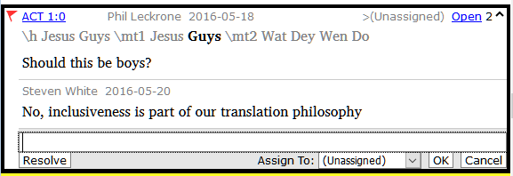

-   Resolve or assign the note as needed.
-   Click the arrow to collapse the note.

**15.5 Print a notes report**

-   Click in a notes window.
-   Filter the list as desired.
-   **≡ Tab**, under **Project** \>\> **Print**
-   Choose the printer and any options.
-   Click **OK**.
-   Close the window.

**Part IV**

**Stage 3: Preparing for the Consultant check**

Note: This stage is part of stage 2 in the UBS plan.

In this third stage of a translation project you will do comprehension testing and back translation. You will also continue with the basic checks and spell checking.

The following modules will help you in this stage:

-   [**BT1 – Draft a Back Translation**](#sBT1)
-   [**BT2 – Interlinearize a project**](#sBT2)
-   [**BC3 – Basic checks 3**](#sBC3)
-   [**PPR: Progress report**](#sPPR)

**16**

**BT1 – Draft a Back Translation**

**Introduction**

In preparing for a consultant check, the consultant will need one or more versions of your text in a language they understand. This is often called a back-translation. There are two types of back translations. This module explains how to do a free back-translation and keep it up to date. The next module explains how to do a word-for-word back-translation using the project interlinearizer.

**Where we are**

You have typed, checked and revised your translation in Paratext and are now preparing for a consultant check. Before you can start your Administrator must have created a separate project for your back translation.

**Why is this important?**

Your text needs to be check by a consultant. But because the consultant does not know your language, you need to translate your text back into a language they can understand. This is where the term “back translation” comes from. The consult will use this translation to help your team improve your exegetical choices in the text.

It is preferable that this is done by someone who hasn’t been involved in your translation. This way she will type what the text says and not what you meant it to say. This should also be done without looking at any helps or other Bibles.

**What will you do?**

-   Open your project and back translation project
-   Arrange your text on the screen.
-   Draft your back translation
-   Mark the status as finished when you complete a chapter.
-   Check that your text is up-to-date (or in sync), view any differences by moving to the next change if appropriate.

**16.1 Create a new project for the back translation**

(First time only, by Administrator)

-   **≡ Paratext** under **Paratext** \> **New Project**
-   Click **Edit**
-   Type a full name for the project and a short name
-   Click **OK**
-   Choose the language for your back translation (e.g. English)
-   Leave the versification
-   For the Type of project choose "**Back Translation**"
-   For **Based on** choose your project

    *If necessary, Paratext will change the versification to match your project.*

-   Click the **Books** tab
-   Choose the desired books
-   Click **OK**
-   Click the **Create Book(s)** link
-   Create books as needed.

**16.2 Draft your back translation**

-   Open your project
-   Open your back translation project
-   Arrange the windows so that you can easily see both windows.
-   Click in the back translation window, (the verse in your project is highlighted).
-   Type your back translation into each verse (after the check box).
-   Continue for each verse in the chapter.

**16.3 Mark the chapter as Finished**

When you have finished the chapter

-   On the toolbar at the top of your back translation window, click on the arrow beside the check mark.

    

-   Choose **Mark All Verses in Chapter as Finished**.

    *All the check boxes for the chapter are marked with green checks.*

**16.4 When a change is made to your project**

Paratext will detect any saved changes to your text and will change the back translation checkbox to a red question mark  and add issues to the back translation status in the project plan.

-   Click in a verse with the red question mark.
-   Review and correct the back translation.
-   Click the red question mark

    *It changes to a green check mark*

**View the differences for outdated verses**

-   Click on the  icon on the toolbar to see the differences.

    *A comparison window is displayed.*

    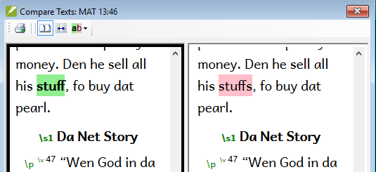

**Move to the next differences**

-   Click on the up and down arrows to move to the previous or next differences.

    

**16.5 Check your project plan**

-   Click the project plan icon 
-   Expand Stage 3, the back translation checks are at the end

    *The number of issues (if any) are displayed*

    

**16.6 Back translation verse check in project plan**

-   Click on the issues link

    *A result list window lists any errors.*

-   *And the back translation window is also displayed with the cursor in the first verse with problems.*
-   Correct the problem and move to the next outdated verse by clicking on the arrows on the toolbar.

**16.7 Back translation status complete in project plan**

-   The back translation status is complete when there are no issues.

**16.8 Learning task**

The checkboxes in a back translation can have a number of different symbols.

Look in the Paratext help “What symbols can occur in status checkboxes in a back translation?” topic and match the following symbols and status:

| A |  |   | 1 | Inconsistent verse number |
|---|-------------------------------------------------|---|---|---------------------------|
| B |  |   | 2 | No text/verse no.         |
| C |  |   | 3 | Not finished              |
| D |  |   | 4 | Finished                  |
| E |  |   | 5 | Out of date               |

Table 16.1

Answers: A3, B4, C5, D1, E2

**17**

**BT2 – Interlinearize a project**

**Introduction**

The previous module explained how to create a back translation that expresses what a reader understands when he reads or hears the text. There is another type of back translation that is sometimes used and that is a word-for-word style back translation. Some consultants may ask for this style of back translation. If you need to make one of these, you can use Paratext’s project Interlinearizer function.

Please note that in Paratext 9 you can only use the Interlinearizer on registered projects.

**Where we are**

You have typed, checked and revised your translation in Paratext and are now preparing for a consultant check by doing a word-for-word back translation. Before you can start your Administrator must have created a separate project for your word-for-word back translation. [This is separate from the readable back translation in the previous module.]

**Why this is important**

Your consultant needs to have a copy of your translation in a language they can understand. The back translation done in the previous module is very useful but there are times when a literal translation is more helpful.

**What you will do**

You will use the project interlinearizer to produce a word for word gloss of the text. Firstly, you will setup the interlinearizer, and then correct any errors. The computer’s initial guesses are often wrong but it learns as it goes and becomes quite accurate quickly. The idea is for the gloss to be correct even though the word order is not correct. When you are happy with the verse you can approve the glosses and move to the next verse with unapproved glosses.

**17.1 Configure the project interlinearizer**

-   Click in your project
-   **≡ Tab**, under **Tools** \> **Open Project interlinearizer**

    

-   Click to dropdown the list [1].
-   Choose to create glosses based on a model text. This is usually your reference text or your free back translation project [2]
-   Choose your model text [3].
-   Click **OK**

**17.2 Correct the interlinearized text**

To correct glosses

-   Click the incorrect gloss

    *A list is displayed.*

-   Either click on the correct gloss in the list

    or type the correct gloss in the textbox

-   Click **Enter**

**17.3 Translate/gloss a phrase**

-   Click between two words

    

-   Click the icon  **Link words**
-   Click the red line
-   Type the gloss

**17.4 Add extra words**

-   Click in the space between two glosses
-   Type the extra word(s)

**17.5 Specify the morphology – break a word into morphemes**

-   Click on the word in the translation line (top line)
-   Click « **Add word parse** »
-   Add **spaces** to separate the morphemes and add « + » prefixes and suffixes (see guide)
-   Click **OK**

**17.6 Approve and Export the text**

When you approve and export the text any remaining red glosses will be approved.

-   Click **Approve glosses**
-   To continue, click **Next Unapproved Verse**

**17.7 Help**

For more help on using the Interlinearizer function see the following topics in the Paratext Help:

-   Introduction to Project Interlinearizer
-   How do I open the Project Interlinearizer?
-   How do I generate an interlinear back translation?
-   How do I create a back translation project with the Interlinearizer?
-   How do I create a text revision/adaptation project with the Interlinearizer?
-   What do the colours of glosses mean in the Interlinearizer?

**18**

**CT – Compare Text**

**Introduction**

In this module, you will learn how to save old versions of your text and review them later.

**Where are we?**

You have worked on your text and you have arrived at an important stage of your project.

**Why is this important?**

As you work on your translation, you are continually making changes. It is good to have a copy of the previous version of your text, for example the text as it was before you went to a consultant check. You can do this by marking a point in the history of your project. After marking a point in the history, you can compare the version at that point with the current version.

**What will you do?**

You will mark a point in the history of the project which you can go back to later and compare your work.

**18.1 Mark Point in History**

-   Click in your project window to make it active (in Paratext).
-   **≡ Tab** under **Project** \> **Mark a point in project history**
-   Type a comment to describe the point.
-   Click **OK**

**18.2 Compare Two Versions**

-   **≡ Tab** under **Project** \> **Compare Versions**
-   Click on the version dropdown list Current version
-   Choose the desired point in the history

    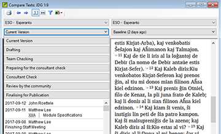

    *The screen will change and show the differences between both versions.*

**19**

**BC3 – Basic checks 3**

**Introduction**

In this module you will learn how to run the remaining basic checks (references, quoted text, numbers, punctuation in pairs and quotations). As in the first two basic checks modules, it is easier to run the checks from the project plan. However, if you want to check more than one book then you need to run the checks from the checking menu.

**Where we are**

You have typed your translation into Paratext. Make sure you have done the checks described in modules BC1 and BC2 before continuing. And that either your administrator has done the setup for the checks or is available to do the setup with you.

**Why this is important**

Paratext has eleven basic checks. You have already seen the first six checks. This last set of checks helps you find errors related to material referred from other books. You want to be sure the references are accurate so that the reader can find those passages.

**What you are going to do**

As before, most of the checks require some setup to be done by your administrator. In this module you will:

-   Confirm that the setup has been done
-   Run the basic check
-   Correct any errors.

**19.1 Unmatched pairs of Punctuation**

This check looks at punctuation that occurs in pairs (opening and closing) and lists errors where it is not matched by the other half of the pair. This may be deliberate but is more likely to be an error, e.g. ( ), [ ], etc.

**Setup – inventory**

-   **≡ Tab**, under **Tools** \> **Checking Inventories** \> **Unmatched pairs of punctuation**:

    *If the list is empty, then there are no errors.*

-   If necessary, click **Options...** to add other pairs.
-   Click **OK**.

**Run the check**

-   **≡ Tab**, under **Tools** \> **Run Basic Checks**
-   Check “**Unmatched pairs of punctuation**”
-   Click **OK**

    *A list of errors is displayed.*

-   Make any corrections as needed.

**19.2 References**

Before you can run the references check, your Administrator must define various settings.

-   **≡ Tab**, under **Project** \> **Scripture reference settings**

    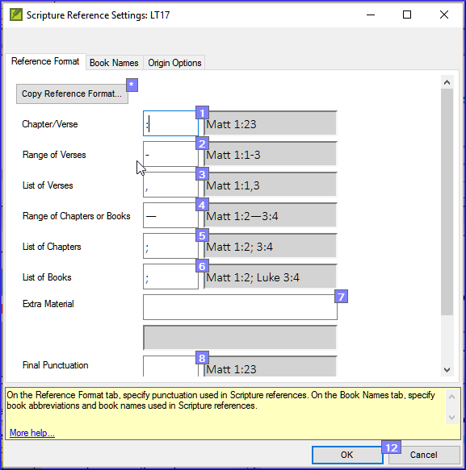

-   For each setting, type the punctuation in the box

    *The sample will be updated on the right.*

-   Click the **Book names** tab

    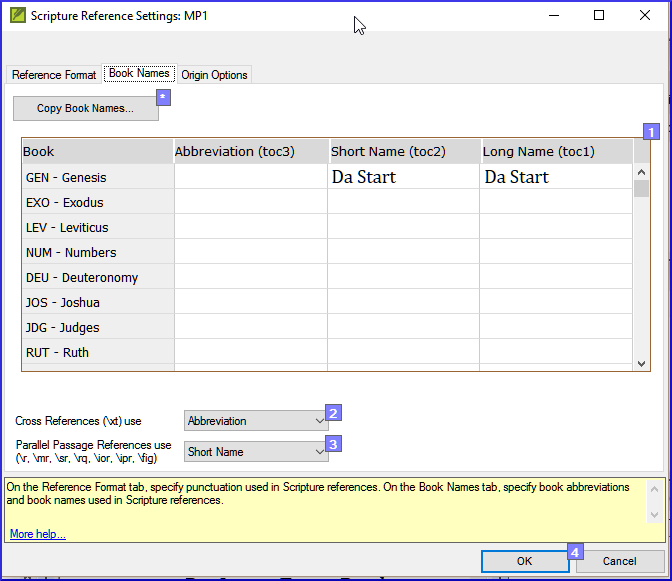

-   Fill-in the three columns [1] with abbreviation, short name and long name.
-   Choose **Abbreviations** [2] and [3] for both cross-references and references
-   Click **OK**
-   **≡ Tab**, under **Tools** \> **Run Basic Checks**
-   Click « **References »**
-   Click **OK**
-   Correct any errors.

    Paratext will inform you if there are any inconsistencies between these book name settings and the \\toc lines and will allow you to check conflicts.

**19.3 Numbers check**

Before you can run the references check, your Administrator must define various number settings.

-   **≡ Tab,** under **Project settings** \> **Number settings**
-   Fill in the dialog box.

    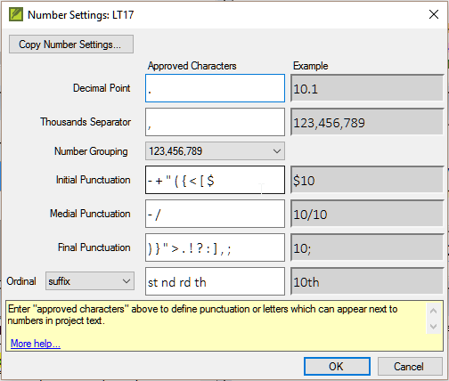

-   Click **OK**
-   **≡ Tab**, under **Tools** \> **Run basic checks**
-   Click « **Numbers»**
-   Click **OK**

**19.4 Quotation rules**

The quotations check is used to ensure you have been consistent in marking the direct speech correctly.

Before you can run the quotation check, your Administrator must define the rules for your quotations.

-   **≡ Tab**, under **Project settings** \> **Quotation rules**
-   Fill-in the quotation marks used for each level [1] [2] [3]
-   **Check Flag all quotes near other errors [8]**
-   Click **OK**.

**19.5 Quotation check**

-   **≡ Tab**, under **Tools** \> **Run basic checks**
-   **Quotations**
-   Click **OK**.

    *A list of errors is displayed. It shows possible errors but includes four correct quotations before and after the possible error.*

-   Double-click the first item which doesn’t start with ...
-   Correct as necessary.
-   Click **Rerun** button to confirm you have corrected the error.

**19.6 Quoted text**

The Quoted text check looks at text in footnotes or cross-references which has been marked with \\qt \\qt\* markers. It checks that the quoted text matches the text in the verse.

-   **≡ Tab**, under **Tools** \> **Run basic checks**
-   **Quoted text**
-   Click **OK**.

    *A list of errors is displayed.*

-   Make corrections as needed.

    Note: The text has to be exactly the same as in the text. That is, even additional punctuation cannot be in the \\qt … \\\\qt\* markers.

**Part V**

**Stage 4: Consultant Visit**

**Introduction**

*Note: This stage is not included in the UBS plan.*

The fourth stage of a translation project is the consultant visit. You will meet with the consultant and evaluate your text, make notes and revise your texts and back translations as needed. You will want to ensure that you have updated the status of your translation in the project plan.

Most of the tasks in this stage have been covered in previous modules.

The following modules will help you in this stage:

-   [20](#collaborationTools)
-   See also Stage one and two.
-   [**BT1 – Draft a Back Translation**](#sBT1)
-   [**BT2 – Interlinearize a project**](#sBT2)

**20**

**Collaboration tools**

**Introduction**

In this module you will use Paratext Live as a way that the team can collaborate together so that everyone can see the changes to the text on their own computers.

**Where we are**

We have already seen how to collaborate with Send/Receive. There are times, for example during a consultant check, when several people need to look at the same text, and perhaps edit it together. Paratext Live allows everyone to look at the text on their own computer and see the changes being made in real time.

**Why this is important**

There are several other ways to let everyone look at the same text. But Paratext Live not only lets everyone see the text, but it also allows more than one person to edit the text.

**What are you going to do?**

-   Connect all users to the same network.
-   Send/receive.
-   Start Paratext Live and join a session
-   Edit the document
-   Exchange all files
-   Exit Paratext Live
-   Send/receive

    See the video 4.1 Collaboration Tools.

**20.1 Paratext Live**

Before you can start Paratext Live, all users must do a send/receive and everyone must be connected to the same network.

**Send/receive**

Before you start Paratext Live all participants should Send/Receive the project. Paratext will tell you that you need to Send/Receive.

**Connect to the same network**

Paratext Live can use

-   Internet
-   a local network
-   offline WiFi router
-   hotspot with mobile data disabled.

**Start Paratext Live**

-   Open the menu for the project.
-   Under **Tools**, click **Paratext Live**.
-   Or use the icon on the toolbar.
-   Click **Start/Join Live session**. *If Autosave in Paratext Settings is not on, the Live session will turn it on for the duration of the session.*
-   Paratext then asks if you are the primary editor:
-   If you are **not** the primary editor, **wait**, don’t press cancel as that will cancel your joining the live session.
-   If you **are** the primary editor, click **Start as Primary Editor**.

    *With a session active, the Paratext Live button is green*

**Sharing changes from Tools**

All scripture text is shared when you do a send/receive. However, changes made with various tools are not shared automatically. Examples of these unshared changes are to spelling status, Parallel passage status, Biblical Terms and their identified renderings, and Notes. To share these changes:

-   Click the Paratext Live button on the toolbar,
-   Click “**Exchange all files**”

    *All of the users in the Paratext Live session then receive updates to these files.*

    Changes from all users are shared, but if two people have changed the exact same item differently, only one person’s change will be saved.

**End the Paratext Live session**

**Note**: If one participant has upgraded to Paratext 9.2, **everyone** participating needs to upgrade as Paratext Live files are slightly different in version 9.2.

**For more help**, search for '**live**' in the search box on the title bar. There are lots of useful helpful topics to help you use Paratext Live

**Part VI**

**Stage 5 / Stage 3 UBS: Review by the community**

**Introduction**

*Note: This is equivalent to the third stage of the UBS plan.*

The fifth stage of a translation project is the review by the community. In the review you will check for naturalness, produce a team progress report and revise the key terms.

The following modules will help you in this stage:

-   [**PPR: Progress report**](#sPPR)
-   [**BTR: Biblical key terms report**](#sBTR)

**21**

**PPR: Progress report**

**Introduction**

In this module you will create a progress report.

**Where we are**

As you have been working on your translation, you have been updating your project plan with your progress on completed chapters and books. Now you will prepare a project a report.

**Why this is important**

Your administrators and funders need accurate reports of your progress.

**What are you going to do?**

-   Check that your project plan is up-to-date.
-   Produce several reports.

**21.1 Check your plan**

-   Open your project
-   Click on the Project plan icon
-   Update your progress as necessary.

**21.2 Produce team progress chart**

-   From the **Tab** menu, under **Project** choose **Progress chart**
-   Click on the dropdown list in the top left.

    

-   Choose as appropriate (e.g. Forecast Line Chart).

    *A window appears with the graphic*

-   Click the print icon

    *A window opens*

-   Click the **Print** icon

    *The print dialog is displayed.*

-   Choose your printer (or PDF printer)
-   Click **OK**.

**22**

**BTR: Biblical key terms report**

**Introduction**

One task in this stage is to produce a report of the changes made in the key biblical terms.

**Where we are**

In working on your translation you have identified and changed a number of key biblical terms.

**Why is this important?**

Although you can’t use Paratext to write the report, it can produce of list of the terms that you have been dealing with and may need to include in your report.

**What are you going to do?**

In the Biblical terms tool you will filter on the book(s) that you want to include in your report. You will then save the list of the terms as a separate HTML file. You can also filter the list on any discussion notes you may have made.

**22.1 Biblical terms tool**

-   Click in your project
-   **≡ Tab**, under **Tools** \> **Biblical Terms**
-   If this menu option is not displayed, click on the down arrow at the bottom of the menus to show the complete menus.
-   Set the terms filter
-   Set the verses filter (for the books you have been working on).
-   Sort the list as desired.

**22.2 Save the list to a file**

-   **≡ Tab**, under **Biblical terms** \> **Export as HTML**
-   Type a name for the file
-   Click **Save**
-   Open the file in **Word/LibreOffice**

**22.3 Other ways to identify renderings**

**Sort on terms notes**

-   Click on the ? (second column heading) to sort on Rendering discussion notes.

    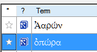

**Find terms with text in the rendering description**

-   Click the arrow beside **Find** on the toolbar
-   Choose **Rendering Description**
-   In the text box to the right, type the text to find

    *The list is filtered.*

-   Save the list to HTML (as above).

**A**

**Special text**

The following passage often have special formatting (by adding other USFM codes).

-   Matt 1.2-16: The genealogy, which is not normal prose. Often set in a special poetic form so the fathers line up and the form indicates this is a special list (with comments).
-   Matt 5.3-10: The beatitudes. Often set in poetic form.
-   Matt 6.9-13: The Lord's prayer. Often set in poetic form.
-   Matt 21.9: The greeting to Jesus. Often set in poetic form.
-   Matt 27.37: The sign on the cross. Often set in small caps.
-   Matt 27.46: The scream of Jesus. Sometimes marked by \\tl and \\tl\*, the marker for transliteration (because it is in another language).
-   Mark 5.41: The command to the dead girl. Sometimes marked by \\tl and \\tl\*, the marker for transliteration (because it is in another language).
-   Mark 11.9: The greeting to Jesus. Often set in poetic form.
-   Mark 14.36: "Abba." Sometimes marked by \\tl and \\tl\*, the marker for transliteration (because it is in another language).
-   Mark 15.26: The sign on the cross. Often set in small caps.
-   Mark 15.34: The scream of Jesus. Sometimes marked by \\tl and \\tl\*, the marker for transliteration (because it is in another language).
-   Mark 16.9: A note indicating another ending of Mark. Sometimes separated by a horizontal rule.
-   Luke 1.46-55: The song of Mary (or Elizabeth; the Magnificat). Often set in poetic form.
-   Luke 1.68-79: The song of Zechariah. Often set in poetic form.
-   Luke 2.14: The chant of the angelic choir. Often set in poetic form.
-   Luke 2.29-32: The praise of Simeon. Often set in poetic form.
-   Luke 3.23-38: The genealogy. Often set in a special poetic form similar to the genealogy in Matthew.
-   Luke 6.20-22: The beatitudes (blessings). Often set in poetic form.
-   Luke 6.24-26: The beatitudes (woes). Often set in poetic form.
-   Luke 11.2-4: The Lord's prayer. Often set in poetic form.
-   Luke 19.38: The greeting to Jesus. Often set in poetic form.
-   Luke 23.38: The sign on the cross. Often set in small caps.
-   John 7.53-8.11: The story of the woman caught in the act. The section head usually occurs prior to verse 53. Sometimes, although rarely, separated by a horizontal rule before and after the text.
-   John 12.13: The greeting to Jesus. Often set in poetic form.
-   John 17.1-27: The prayer of Jesus. Sometimes, although rarely, set in paragraphs with added indentation from the left margin.
-   John 19.19: The sign on the cross. Often set in small caps.
-   Acts 15.23-29: The letter. Often set in paragraphs with added indentation from the left margin.
-   Acts 23.26-30: The letter to Claudius Lysias. Often set in paragraphs with added indentation from the left margin.
-   Rom 8.15: "Abba." Sometimes marked by \\tl and \\tl\*, the marker for transliteration (because it is in another language).
-   Rom 11.33-36: The doxology. Often set in poetic form.
-   Rom 16.3-16: The special greetings. Sometimes set in a special poetic form similar to the genealogies.
-   Gal 4.6: "Abba." Sometimes marked by \\tl and \\tl\*, the marker for transliteration (because it is in another language).
-   Phil 2.6-11: The attitudes. Sometimes set in poetic form.
-   1 Tim 2.5-6: A creed. Sometimes set in poetic form.
-   1 Tim 3.16: A creed. Often set in poetic form.
-   2 Tim 2.11-13: A creed. Often set in poetic form.
-   1 John 2.12-14: I write to you. Sometimes set in poetic form.
-   Rev 1.4-7: The greeting and doxology. Sometimes set as poetry and prose.
-   Rev 2-3: The seven letters. Often set in paragraphs with added indentation from the left margin.
-   Rev 4.8: A chant. Sometimes set in centered poetic form.
-   Rev 4.11: A chant. Often set in poetic form.
-   Rev 5.9-10, 12, 13: Songs. Often set in poetic form.
-   Rev 7.5-8: A list. Often set in a special poetic form.
-   Rev 7.10, 12: Chants. Often set in poetic form.
-   Rev 7.15-17: A declaration. Sometimes set in poetic form.
-   Rev 11.15, 17-18: Chants. Often set in poetic form.
-   Rev 12.10-12: A declaration. Often set in poetic form.
-   Rev 15.3-4: A song. Often set in poetic form.
-   Rev 16.5-7: A declaration. Often set in poetic form.
-   Rev 17.5: A sign. Often set centered, in small caps.
-   Rev 18.2-8: A declaration. Often set in poetic form.
-   Rev 18.10-24: A series of woes. Often set in poetic form.
-   Rev 19.1-8: A series of declarations. Often set in poetic form.
-   Rev 19.16: A sign. Often set centered, in small caps.
-   Rev 21.19-20: A list. Sometimes, although rarely, set in poetic form [2]

[2] Eppler, D., Goller, T., Wendland, E. R., Culy, M. M., Harold Greenlee, J., & Deibler, E. (July 2008). NOT No. 3 (Vol. 7, Mt 1:2–Re 21:19). SIL International.

**B**

**Three letter abbreviations**

| Genesis - GEN       | Exodus - EXO       | Leviticus - LEV    |
|---------------------|--------------------|--------------------|
| Numbers - NUM       | Deuteronomy - DEU  | Joshua - JOS       |
| Judges - JDG        | Ruth - RUT         | 1 Samuel - 1SA     |
| 2 Samuel - 2SA      | 1 Kings - 1KI      | 2 Kings - 2KI      |
| 1 Chronicles - 1CH  | 2 Chronicles - 2CH | Ezra - EZR         |
| Nehemiah - NEH      | Esther - EST       | Job - JOB          |
| Psalms - PSA        | Proverbs - PRO     | Ecclesiastes - ECC |
| Song of Songs - SNG | Isaiah - ISA       | Jeremiah - JER     |
| Lamentations - LAM  | Ezekiel - EZK      | Daniel - DAN       |
| Hosea - HOS         | Joël - JOL         | Amos - AMO         |
| Obadiah - OBA       | Jonah - JON        | Micah - MIC        |
| Nahum - NAM         | Habakkuk - HAB     | Zephaniah - ZEP    |
| Haggai - HAG        | Zechariah - ZEC    | Malachi - MAL      |

Table B.1 Old Testament

| Matthew - MAT         | Mark - MRK            | Luke - LUK       |
|-----------------------|-----------------------|------------------|
| John - JHN            | Acts - ACT            | Romans - ROM     |
| 1 Corinthians - 1CO   | 2 Corinthians - 2CO   | Galatians - GAL  |
| Ephesians - EPH       | Philippians - PHP     | Colossians - COL |
| 1 Thessalonians - 1TH | 2 Thessalonians - 2TH | 1 Timothy - 1TI  |
| 2 Timothy - 2TI       | Titus - TIT           | Philemon - PHM   |
| Hebrews - HEB         | James - JAS           | 1 Peter - 1PE    |
| 2 Peter - 2PE         | 1 John - 1JN          | 2 John - 2JN     |
| 3 John - 3JN          | Jude - JUD            | Revelation - REV |

Table B.2 New Testament

**C**

**Common USFM Markers**

Note: All Styles of type "Paragraph" require using the "Enter" key when choosing the marker in "Standard" view

Note: All Style Type "Note" and "Character" require using the "Backslash" key when choosing the marker in "Standard" view

| \\id  | File - Identification                     | Paragraph |
|-------|-------------------------------------------|-----------|
| \\h   | File - Header                             | Paragraph |
| \\c   | Chapter Number                            | Paragraph |
| \\v   | Verse Number                              | Character |
| \\p   | Paragraph - Normal - First Line Indent    | Paragraph |
| \\m   | Paragraph - Margin - No First Line Indent | Paragraph |
| \\q1  | Poetry - Indent Level 1                   | Paragraph |
| \\q2  | Poetry - Indent Level 2                   | Paragraph |
| \\r   | Heading - Parallel References             | Paragraph |
| \\s1  | Heading - Section Level 1                 | Paragraph |
| \\s2  | Heading - Section Level 2                 | Paragraph |
| \\mt1 | Title - Major Title Level 1               | Paragraph |
| \\mt2 | Title - Major Title Level 2               | Paragraph |
| \\mt3 | Title - Major Title Level 3               | Paragraph |

**Less-common Markers**

| \\pc | Paragraph - Centered (for Inscription)       | Paragraph |
|------|----------------------------------------------|-----------|
| \\nb | Paragraph - No Break with Previous Paragraph | Paragraph |
| \\li | List Entry - Level 1 - Single Level Only     | Paragraph |

**Introduction Markers**

| \\imt1 | Introduction - Major Title Level 1              | Paragraph |
|--------|-------------------------------------------------|-----------|
| \\iot  | Introduction - Outline Title                    | Paragraph |
| \\io1  | Introduction - Outline Level 1                  | Paragraph |
| \\io2  | Introduction - Outline Level 2                  | Paragraph |
| \\ip   | Introduction - Paragraph                        | Paragraph |
| \\im   | Introduction - Paragraph - no first line indent | Paragraph |
| \\ipq  | Introduction - Paragraph - quote from text      | Paragraph |

**Cross Reference Markers**

| \\x   | Cross Reference                     | Note      |
|-------|-------------------------------------|-----------|
| \\xo  | Cross Reference – Origin Reference  | Character |
| \\xt  | Cross Reference - Target References | Character |
| \\x\* | Cross Reference End                 | Note      |

**Figure Markers**

| \\fig   | Auxiliary - Figure/Illustration/Map     | Note |
|---------|-----------------------------------------|------|
| \\fig\* | Auxiliary - Figure/Illustration/Map End | Note |

**Footnote Markers**

| \\f   | Footnote                                    | Note      |
|-------|---------------------------------------------|-----------|
| \\fr  | Footnote - Reference                        | Character |
| \\ft  | Footnote - Text                             | Character |
| \\fk  | Footnote - Keyword                          | Character |
| \\fq  | Footnote - Quotation or Alternate Rendering | Character |
| \\fqa | Footnote - Alternate Translation Rendering  | Character |
| \\f\* | Footnote End                                | Note      |

**Glossary**

| \\k ... k\*   | Keyword (in the glossary)                      | Character |
|---------------|------------------------------------------------|-----------|
| \\w ... \\w\* | Indicates a word in the glossary (in the text) | Character |
| \\p           | Paragraph                                      | Paragraph |
| \\li1         | Glossary list paragraph (1st level indent)     | Paragraph |
| \\li2         | Glossary list paragraph (2nd level indent)     | Paragraph |
