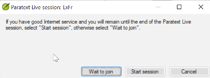

**Introduction**  
In this module you will use Paratext Live as a way that the team can collaborate together so that everyone can see the changes to the text on their own computers.

**Where we are**  
We have already seen how to collaborate with Send/Receive. There are times, for example during a consultant check, when several people need to look at the same text, and perhaps edit it together. Paratext Live allows everyone to look at the text on their own computer and see the changes being made in real time.

**Why this is important**  
There are several other ways to let everyone look at the same text. But Paratext Live not only lets everyone see the text, but it also allows more than one person to edit the text.

**What are you going to do?**  
-   Connect all users to the same network.
-   Send/receive.
-   Start Paratext Live and join a session
-   Edit the document
-   Exchange all files
-   Exit Paratext Live
-   Send/receive

    See the video [4.1 Collaboration Tools](https://vimeo.com/641947293).

### 20.1 Paratext Live
:::tip Note
Before you can start Paratext Live, all users should do a **send/receive** and everyone must be connected to the same network.
:::

**Connect to the same network**  
Paratext Live can use  
-   Internet
-   a local network
-   offline WiFi router
-   hotspot with mobile data disabled.

**Start Paratext Live**  
-   Open the menu for the project.
-   Under **Tools**, click **Paratext Live**.
-   Or use the icon on the toolbar.  
-  Click either "Wait to join" or "Start session" (to be the host) as appropriate. 
   *A dialog box is displayed*

    *If Autosave in Paratext Settings is not on, the Live session will turn it on for the duration of the session.*

-   If you are **not** the primary editor, click **wait**, don’t press cancel as that will cancel your joining the live session.
-   If you **are** the host, click **Start Session**.
    *With a session active, the Paratext Live button is green*

**Sharing changes from Tools**  
All scripture text is shared when you do a send/receive. However, changes made with various tools are not shared automatically. Examples of these unshared changes are to spelling status, Parallel passage status, Biblical Terms and their identified renderings, and Notes. To share these changes:

-   Click the Paratext Live button on the toolbar,
-   Click “**Exchange all files**”  
    *All of the users in the Paratext Live session then receive updates to these files.*
:::caution
Changes from all users are shared, but if two people have changed the exact same item differently, only one person’s change will be saved.
:::
**End the Paratext Live session**  
- Click on the Paratext Live  icon.
- Choose End session.

:::info
**For more help**, search for '**live**' in the search box on the title bar. There are lots of useful helpful topics to help you use Paratext Live
:::
