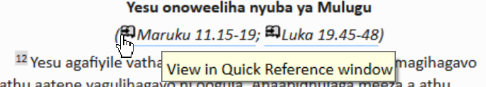

---
title: Quick reference window (0.0.3)
---
### Open a quick reference window:

- Click on a link in \\r line or \\xt

    

    The Quick Reference window comes up showing me that other reference.

    OR

- Click Project ≡, expand the menu, under Tools \> Quick Reference

    Hint: If you add the window to Autohide, or Dock the window, Paratext will use it to open parallel heading links or cross-reference links.

    In Paratext 9.1 any floating window now has controls for changing the reference.

