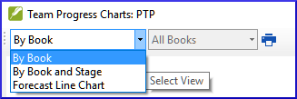

**Introduction**  
In this module, you will learn how to update your progress by marking tasks as completed. You will also create a progress report.

**Where we are in the**  
You have been working on your translation and have finished a task. You now want to update your progress.

**Why this is important**   
For the project plan to work well, you need to mark the tasks you have finished. This allows Paratext 9 to make the next task available for the other team members. It also gives Paratext accurate information on your progress for the reports. Creating a progress reports helps you prepare a report for your supervisors and funders.

**What you are going to do**  
You will open the assignments and progress window and update the progress made. You will then produce a report.

### 6.1 Make sure the progress of the plan is up to date
-  Open the project plan (using the button)
-  Update the progress on all tasks (see PP1 for instructions on each type of task).

### 6.2 Change an assignment
:::caution
This can only be done if you have progress permissions.
:::

-  From the **≡ Tab**, under **Project** menu, select **Assignments and Progress…**
-  From the first drop-down list at the top left of the dialog, select **All Tasks**.
-  In the **Assigned to** column, use the drop-down list to choose who will have responsibility for the task or check (listed in the **Task/Check** column at the far left).

### 6.3 Produce a progress report
-  From the **Tools** menu, select **Project Health Report…**.
-  Choose the project(s) to report
-  Click **OK**.  
    -  *The report will contain a column for each project you selected.*
 
-----

 
-----

### 6.4 View team progress charts
-  From the **≡ Tab**, under **Project** menu, select **Progress charts…**
    
-  Use the first dropdown box to choose the type of chart
-  Choose the books as necessary.
-  Click the print icon  
    -  *A window opens*
-  Click the **Print** icon
-  Choose your printer (or PDF printer)
-  Click **OK**.
