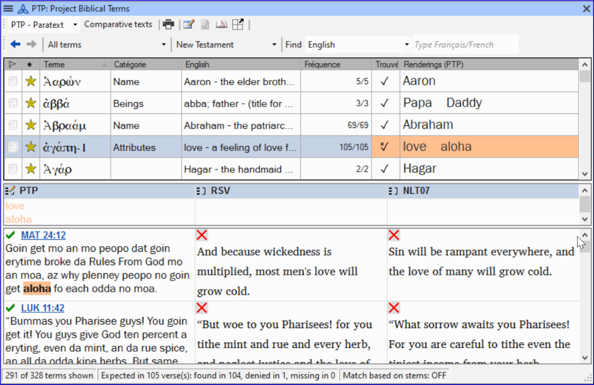

**Introduction**  
This module explains how to add entries to the glossary using the **Biblical terms** tool.

**Where we are**  
You have drafted and entered your text in Paratext 9. Now you will add some glossary entries to explain some of the terms.

**Why this is important**  
It is good to have a list of important words and their explanations so that the readers can understand the text well. Rather than typing directly into the glossary, it is better to use the **Biblical terms** tool as it keeps the Glossary in alphabetical order. The tool also keeps track of the changes to the glossary.

**What you are going to do**  
You will use the Biblical terms tool to add a rendering for the term and then use the glossary tab to enter the citation form and the definition.

There are four training videos available on [adding](../../Video-summaries/5a.Glossary/1A.4a.md), [linking](../../Video-summaries/5a.Glossary/1A.4c.md) and [editing](../../Video-summaries/5a.Glossary/1A.4d.md) and getting [permission to edit](../../Video-summaries/5a.Glossary/1A.4b.md) glossaries. (P9 1A.4a-d).

### 9.1 Open the Biblical Terms tool
-  Move to a verse which contains the term you want to add to the glossary.
-  Right-click and choose **View Biblical Terms**, then **Current Verset(s)**
-  Check that you have the correct list open (e.g. your project list or the NT Key Biblical Terms [SIL])
  
-  To change the list, from the **≡ Tab**, under **Biblical terms** menu choose **Select biblical terms list**

 
----

 
----

### 9.2 Add an entry
-  Double-click on the term in the list in the top pane
-  Click the **Glossary** tab  
    
-  Type the citation form of the term (i.e. the way you want it in the glossary) [1]
-  Type the Definition [2]
-  Click **OK**  
    -  *The word(s) and the definition will be added to the glossary in alphabetical order.*

### 9.3 Link an existing entry
:::tip
If the word is already in the glossary, you can link a biblical term to the existing entry in the glossary. Later in stage 6 you will link the biblical term to the text to add the \* in the printed text or the link in the electronic app.
:::

-  From the **Biblical Terms** tool
-  Check that you have the correct list open (e.g. your project list or the NT Key Biblical Terms [SIL])
-  Double-click on the word in the list in the top pane
-  Click the **Glossary** tab
-  Click the down arrow near the citation form [1]
-  Choose the entry from the glossary
-  Click **OK**

### 9.4 View the glossary
In Paratext

-  Use the navigation bar to change the book  
    
-  Choose the **GLO** book

 
----

 
----

### 9.5 Edit an entry – in the GLO book
In Paratext

-  Open the **GLO** book
-  Edit the text as normal.

### 9.6 Edit an entry – in the Biblical Terms
-  **≡ Tab**, under **Tools** \> **Biblical terms…**
-  Double-click on the word in the list in the top pane.
-  Click the **Glossary** tab
-  Edit the definition
-  Click **OK**.

### 9.7 Add a Biblical Term
-  see the section [10.7](10.BT.md#107Add) (Add a term – from reference text search)

### 9.8 Recall
-  You open the Biblical Terms tool from the \_______\_ menu.
-  The **Glossary** tab is on the \__\__*_*_\_ dialogue. To open this dialogue you \_\_\_-click on the term in the \_\_\_\_ pane.
-  To view the glossary, you change to the \____\_ book (after Revelation).

:::info
[Answers: right click, Edit Rendering, double, top, GLO]
:::