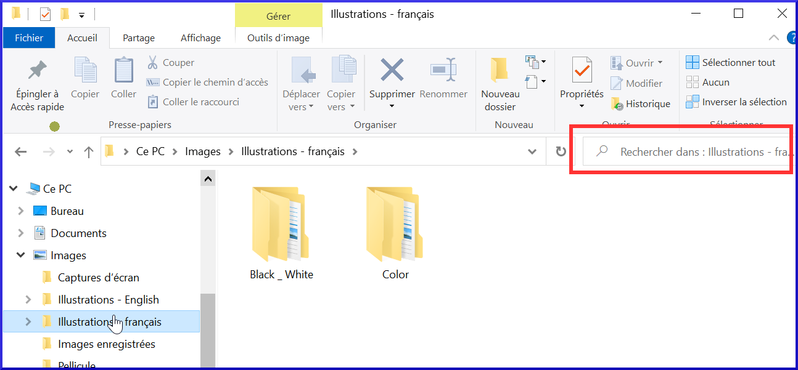

**Introduction**  
This module looks at the variety of tasks needed to finalize the text for publication.

**What you will do**  
-  Add **illustrations** and captions
-  Identify names for the maps
-  Draft Introduction to the NT/Bible
-  Check parallel passages
-  Verify all checks are complete
-  Proper Names final check
-  Numbers, money, weights and measures check
-  Formatting checks.

### 24.1 Choosing illustrations and captions

There are over 2800 images available, so it can be difficult to choose illustrations. Fortunately, it is now possible to search for images by chapter reference and by keywords in French. Note that any illustration you insert into Paratext will increase the size of your project. Only add these small jpg files (or alternatively just the file name). When composing, they will be replaced by larger, high-resolution images.

**Create a folder of images to search**

First time:

- Open the link https://tiny.cc/sampleimages on the Internet
- Right-click on the folder **Illustrations - French**,
- Select **Download**  
    -  *It will download about 121MB*.
- Search and open the downloaded **zip file**.
- Extract the single folder in the archive: **Illustrations - French** and put it in your **Images** folder  
    -  *(Windows starts to index the contents of the images…)*

**Try various searches**

When your images are indexed, you can try different searches.

- Open this new folder in the **File Explorer**.  
    
- Type in the search field:
- **A search word**, like cross, sheep, house, etc.
- A Bible reference**, like MAT27, ACT03, etc. (using at least 2 digits for the chapter).
- Add **black** or **-color** to display only black and white images.

### 24.2 Adding illustrations and captions

- In your project, navigate to the desired verse.
- From the **Insert** menu, choose **Image**  
    
- Enter a **caption** to be printed with the image (in your language)[1].
- Enter a **description** to be printed with the image (in your language) [2].
- Indicate if the image should fill the width of a column or a page. [3]
- If applicable, type in a verse range as an acceptable location. [\*] [Optional]
- Enter the necessary copyright information about the image [4]
- Paratext will fill in the chapter and verse reference that pertains to the image. [5]

**Browse to find the image file**

- Click **Browse**… to search for the image file. [7]  
    -  *A dialog box is displayed*.  
    
- In the dialog, select the **Images - Illustrations - English** folder on the left
- Click in the **Search** field (top right) and type to filter the images (as above)
- Click on the desired image and click on the **Open** button.
- Click on **OK**.

:::tip
To make searching easier, double click on the title bar to **enlarge the window**, **show** the very large icons and **hide the viewing pane**.
:::

### 24.3 Map names
:::info
The Combined NT Maps Biblical Terms list is not a standard list in Paratext 9. It is [**available here**](../../assets/CombinedNTMapBiblicalTerms.xml): and, once downloaded, the file should be copied into "My Paratext 9 Projects"
:::
-  Click in your project.
-  **≡ Tab**, under **Tools** \> **Biblical Terms**
-  **≡ Tab**, under **Bibllical Terms** \> **Select Biblical Terms List**
-  Choose NT MapBiblicalTerms
-  Add renderings for all terms
-  **≡ Tab**, under **Biblical terms** \> **Export as HTML**
-  Type a name for the file
-  Click **Save**.

### 24.4 Draft Introduction to the NT/Bible
-  Change to the book INT
-  Make sure there is an \\h line
-  Type your introduction using the following markers:  
    -  \\mt1  
    -  \\is  
    -  \\ip
    
-  Type in the overall introduction to the Bible/NT in the book **INT**

### 24.5 Check parallel passages
-  See module [PP Compare Parallel passages](23.PP.md)

### 24.6 Verify all checks are complete
**Current book**

-  Open the project plan.
-  Confirm that there are no issues on any of the checks.

**Several books**

-  Redo the inventories.
-  **≡ Tab** under **Tools** \> **Run basic checks.**
-  Make sure all checks are ticked.
-  Make sure all books to be published are chosen.
-  Click **OK**.
-  Correct any errors.

**Word list checks**

From the word list, do the following checks:

-  **≡ Tab**, under **Tools** \> **Spell check** \> **All checks**
-  **≡ Tab**, under **Tools** \> **Find Similar Words**
-  **≡ Tab**, under **Tools** \> **Find Incorrectly Joined or Split Words**

### 24.7 Proper Names final check
-  **≡ Tab**, under **Tools** \> **Biblical Terms**
-  **≡ Tab**, under **Biblical terms** \> **Select Biblical Terms list** and choose the **Major Biblical Terms** list
-  Filter on names with missing renderings
-  Check that all names have an rendering (add if necessary).

### 24.8 Numbers, money, weights and measures
-  Click in your project.
-  **≡ Tab**, under **Tools** \> **Biblical Terms**
-  **≡ Tab**, under **Biblical terms** \> **Select Biblical Terms list**
-  Choose the appropriate list.
-  Add renderings as usual.
 
-----

 
-----

### 24.9 Formatting checks
-  Redo the module FC: Formatting checks.
-  **≡ Tab**, under **Tools** \> **Checklists** \> **Long/short verses**
-  **≡ Tab**, under **Tools** \> **Checklists** \> **Word or phrase**
-  **≡ Tab**, under **Tools** \> **Checklists** \> **Section headings**
-  **≡ Tab**, under **Tools** \> **Checklists** \> **Book titles**
-  **≡ Tab**, under **Tools** \> **Checklists** \> **References**
-  **≡ Tab**, under **Tools** \> **Checklists \> Footnotes**
