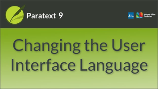

:::note Video
  
https://vimeo.com/368328819
:::

Paratext interface is available in many different languages.

1.  Click Paratext Menu **≡** \> under Paratext menu \> **Paratext Settings** \>
1.  Dropdown the list of **Interface languages** \> *Choose language*
1.  Click **OK**
    

