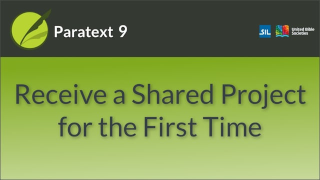
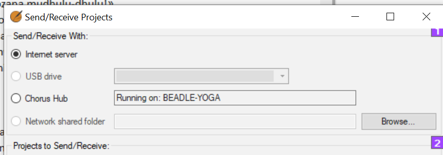

:::note Video
  
https://vimeo.com/428151156
:::

When you hear that the administrator has added you to the project, use the Send/Receive command to get a copy of the project on your computer.  

### Send/receive by Internet

-  Open the main Paratext menu **≡.**
-  Click **Send/receive projects**
-  Choose the appropriate method (**Internet** or **USB** see below)
-  Choose the project (**New** means new to my computer)
-  Click **Send/receive** button  
      -  *Project will open*.

### Send/receive by USB

-  **Insert USB** into computer
-  Open the main Paratext menu.
-  Click **Send/receive projects**
-  Choose **USB drive**
    -  *If it is greyed out, cancel and insert USB*
-  Choose project (**New** means new to my computer)
-  Click **Send/receive** button  
    -  *Project will open*.

### Send/receive by Network folder
-  File > Send/receive projects
-  Choose Network Shared folder
-  Click browse and choose the network folder
-  Choose project (New means new to my computer)
-  Click Send/receive button  
     -  *Project will open*.

