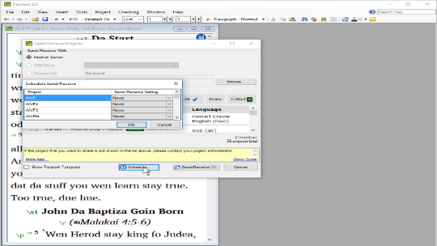

---
title: Working in a shared project (0.4c)
---
In this video, you learnt about using send/receive regularly to keep sharing your work with your colleagues, and to receive their changes.

### Send/receive – icon on taskbar

Use the shortcut icon on taskbar to do the same type of send/receive.

### Send/receive – project menu ≡

1.  Click the project **≡ menu**
1.  Choose Send/Receive this project

### Schedule Send/Receive

1.  Click the main **≡ menu** Paratext
1.  Choose **Send/Receive projects**

    

1.  Click **Schedule**
1.  Select the project
1.  Choose schedule setting (hourly, every four hours, daily, or on startup and shutdown)
1.  Click **OK** to set the schedule
1.  Click **Cancel** to close Send/receive dialog.

