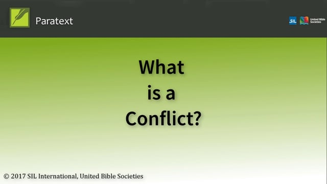

:::note Video
  
https://vimeo.com/229615018
:::

## What is a Conflict
A **conflict** occurs when two or more people **edit the text at the same time**. Paratext gets confused and does not know which one to keep. It chooses one and adds a conflict note.

It is best to have **only one translator edit a text** at a time. Other team members should **add notes** of their suggestions. 

:::tip
See later videos on notes.
:::

