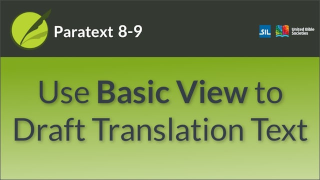

:::note Video
  
https://vimeo.com/387018929
:::

In this video we learnt how to work in **Basic** view.

Basic view shows the USFM markers, but you cannot change the markers or add markers in this view. You can only type and have the cursor in the white areas. To use this view, someone needs to have set up all the markers needed in your translation for you beforehand.

### To switch to Basic view

1.  Open the  **≡ menu** for the project.
1.  Expand the menu if needed.
1.  Under view, click **Basic**.

### To move to the next place to type

-  Use the **arrow key** to move to the next place to type.
-  **Or click on the text box** to move the cursor there.
