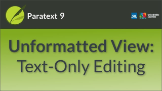

:::note Video
  
https://vimeo.com/387959305
:::

In this video we look at Unformatted View.

### To switch to Unformatted view

1.  Open the **≡ menu** for the project.
1.  Expand the menu if needed.
1.  Under view, click **Unformatted**.  
    -  *Unformatted view shows the entire document as plain text*.

:::note
-  In unformatted view the USFM tags and the Bible text are not visually distinguished by any kind of formatting.
-  There are no tools to help you apply or enter USFM tags, but you can edit them directly by simply typing.
-  This view facilitates manual editing of the tags if needed.
-  This view is not recommended for drafting the translation.
:::