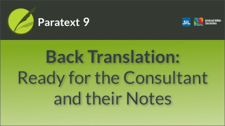

:::note Video
  
https://vimeo.com/518148058
:::

When the **back translation is complete**   
AND **all the boxes are marked as finished**,   
**it is ready** to pass to a translation consultant.

The consultant can insert notes in the back translation project when they have suggestions or questions for the translation team.
