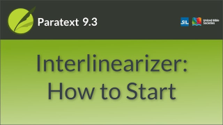
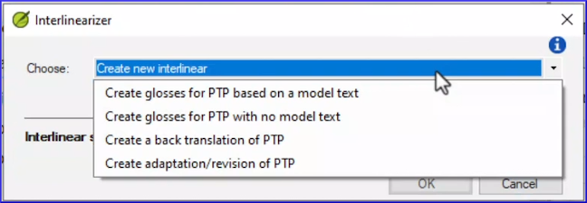
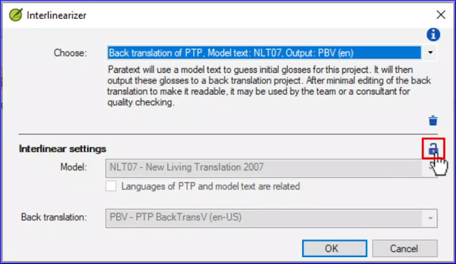

:::note Video
  
https://vimeo.com/772376682
:::

There are several different purposes for using the interlinearizer, some of which have an interlinear text as the end result, others which use the interlinearizer as a first step in producing another project. This could be a back translation, an adaptation or a revision.

### To open the Interlinearizer

1. Click on the ≡ menu for the project.
1. Expand the menu.
1. Under Tools, click **Interlinearizer**.
    - *The Interlinearizer dialog box opens.*

#####

## Choose what you want to use the interlinear for

### Create Glosses for the project based on a model text.

1. Choose which project or resource you want to use as the model text.
1. Paratext uses statistics to guess glosses which are drawn directly and exclusively from the model text.

:::tip
For more semantically accurate guessed glosses, select a previously prepared back translation of the project as the model text.

Either way, you need to correct any inappropriate glosses and provide glosses where they are missing.
:::

3. You can check to box to output the glosses to a separate project.

### Create Glosses for the project with no model text

1. Initially Paratext will not be able to gloss any words.
1. Once you have manually glossed a word, Paratext will suggest your gloss when that word recurs.
1. To get started, you need to specify which language you will be glossing in.
1. You also have the option to save the glosses to a separate project for further editing or to add notes.

### Create a back translation of the project

1. For this option, you must select a model text.
1. Paratext uses statistical analysis to guess which words are equivalent, and aligns them.
1. You are also required to select a back translation project to copy the approved glosses into.
1. This can be an existing project or, if you are an administrator, you can opt to create a new one.
1. If a translation team has used a certain word consistently for a key term, Paratext's statistical analysis will pair up the two words.

### Create adaptation/revision of the project

1. This option is similar to creating glosses with no model text.
1. You must select a project for the interlinear output to be copied to.
1. This can be an existing or a new daughter project.

### Next time you open the Interlinearizer dialog

Paratext gives you a quick way to reopen a previous interlinearization you have worked on.

1. The Choose dropdown now has two sections.
   - *At the top are the 4 original options, then below the line, Paratext will display any interlinear options you have previously selected and used.*
1. Click one to select it.
   - *The settings you selected last time are displayed.*
1. Click **OK** to continue working on this interlinear.

### If you need to change the settings

1. Click the padlock icon to unlock the settings.
   - *The settings controls become active.*

### Delete the interlinear setup

1. Click the trash can icon to delete the interlinear set-up.
1. Click **Delete** to confirm the deletion.

:::note
Previously saved glosses are not deleted by this action, and will be suggested again in future work.
:::