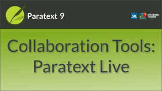
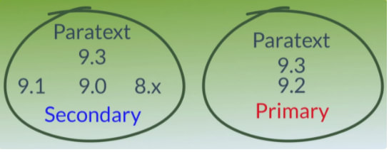

:::note Video
  
https://vimeo.com/779227049
:::

:::info
This video has been revised with the changes in Paratext 9.3. See also the **[Paratext manual for details](https://sillsdev.github.io/paratext-manual/20.Collaboration-tools)**
:::

We have already seen how to collaborate with Send/Receive. There are times when several people need to look at the same text, and perhaps edit it together. Paratext Live allows everyone to look at the text on their own computer and see the changes being made in real time.

Paratext Live can use

-  Internet
-  a local network,
-  offline WiFi router, or
-  hotspot with mobile data disabled.

#####

**Pre-requisites**

- It is no longer required to do a Send/Receive before starting. But if Paratext Live detects too many differences it will tell you that you need to Send/Receive.

**Start Paratext Live**

1.  Open the **menu** for the project.
1.  Under **Tools**, click **Paratext Live**.
1.  Or use the **icon** on the toolbar.
1.  Click **Start/Join Live session**.  
   :::info
   *If you have not turned on Autosave in Paratext Settings, the Live session will inform you it will be turned on automatically for the duration of the session*.
   :::
1.  Paratext then asks if you are the **primary editor**.
1.  If you are not the primary editor, wait for one of the other participants to click Start as Primary Editor.
    -  *Don’t press cancel as that will cancel your joining the live session.
1.  If you are the primary editor, click **Start as Primary Editor**.

:::tip
With a session active, the Paratext Live button is green*.
:::

**Unshared changes from Tools**
Paratext Live only shows (and shares) changes to scripture text but not tools.
:::tip
You may want to switch to **screen sharing** while working on these tools and then switch back to **Paratext Live** when changing the text to make use of the lower requirements for bandwidth
:::

Examples of these unshared changes are to spelling status, Parallel passage status, Biblical Terms and their identified renderings, and Notes.

1.  Click the Paratext Live button on the toolbar, then click “**Exchange all files**”.
    -  *All of the users in the Paratext Live session then receive updates to these files*.

:::caution
Changes from all users are shared, **but if two people have changed the exact same item differently, only one person’s change will be saved**.
:::
**End the Paratext Live session**

1.  Click the Paratext Live button and then click **End/leave Live session**.
    -  *If you are the Primary Editor, you will see this message box*.
-  Click **End Session normally**.
-  Do a send/receive

#####

### Different Paratext versions and servers

:::caution Upgrade

- In Paratext 9.2, if one of the participants upgraded, **all** participants had to upgrade.
- In Paratext 9.3, there are two servers and all participants must use the same server. **Paratext 9.3 allows you to choose which server**. From 9.3 you can work with someone on 9.1 or someone else on 9.2 (**just not at the same time**).

:::
**More help**

-  For more help, search for **live** in the search box on the title bar.
    -  *There are lots of useful helpful topics to help you use Paratext Live*.

